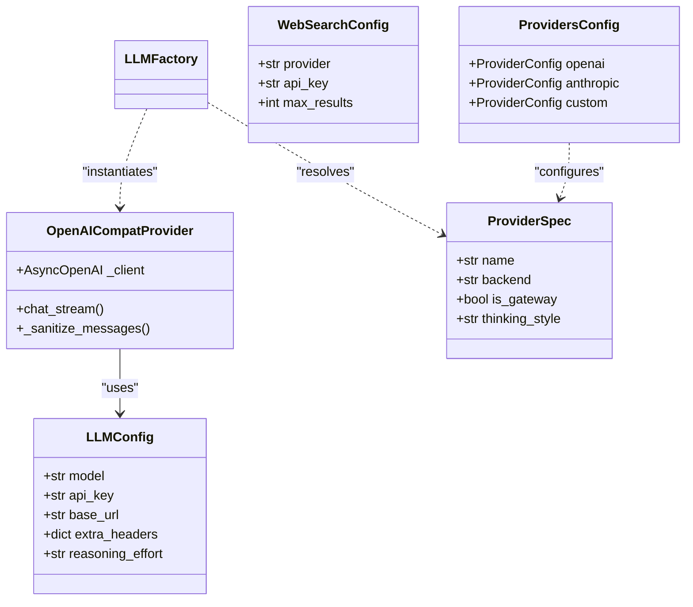

# Core Services

<details>
<summary>Relevant source files</summary>

The following files were used as context for generating this wiki page:

- [README.md](README.md)
- [assets/README/README_AR.md](assets/README/README_AR.md)
- [assets/README/README_CN.md](assets/README/README_CN.md)
- [assets/README/README_ES.md](assets/README/README_ES.md)
- [assets/README/README_FR.md](assets/README/README_FR.md)
- [assets/README/README_HI.md](assets/README/README_HI.md)
- [assets/README/README_JA.md](assets/README/README_JA.md)
- [assets/README/README_PL.md](assets/README/README_PL.md)
- [assets/README/README_PT.md](assets/README/README_PT.md)
- [assets/README/README_RU.md](assets/README/README_RU.md)
- [assets/README/README_TH.md](assets/README/README_TH.md)

</details>


The **Core Services** layer provides the shared infrastructure that powers DeepTutor's intelligent agents and the TutorBot subsystem. This layer abstracts complex external integrations—such as Large Language Models (LLMs), web search engines, and vector embeddings—into unified interfaces used throughout the codebase. It also manages stateful operations including multi-language prompt templating and persistent session memory.

### Service Architecture Overview

The core services are designed as a foundational tier that bridges high-level agent logic with low-level external APIs. This layer ensures that components like the `Smart Solver` or `Deep Research` agents can remain model-agnostic and focus on pedagogical logic rather than API-specific implementation details.

#### Core Service Interaction Map
This diagram illustrates how core services interact to fulfill an agent request, mapping Natural Language Space (Agent Logic) to Code Entity Space.

```mermaid
graph TD
    subgraph "Agent_Logic_Space"
        ["Agent_Capability"] --> ["ChatOrchestrator"]
    end

    subgraph "Core_Services_Space_(Code_Entities)"
        ["ChatOrchestrator"] --> ["PromptManager"]
        ["ChatOrchestrator"] --> ["LLMFactory"]
        ["ChatOrchestrator"] --> ["SessionStore"]
        ["ChatOrchestrator"] --> ["RAGService"]
        ["ChatOrchestrator"] --> ["NotebookManager"]
        
        ["LLMFactory"] --> ["LLMConfig"]
        ["LLMFactory"] --> ["get_runtime_provider"]
        ["get_runtime_provider"] --> ["OpenAICompatProvider"]
        
        ["RAGService"] --> ["get_pipeline"]
        ["SearchService"] -.-> ["resolve_search_runtime_config"]
        ["EmbeddingService"] -.-> ["EmbeddingClient"]
    end

    subgraph "External_Provider_Space"
        ["LLMConfig"] --> "OpenAI/Anthropic/Local"
        ["SearchService"] --> "Tavily/Brave/DuckDuckGo"
        ["EmbeddingService"] --> "Cohere/Jina/Ollama"
    end
```

**Sources:** [deeptutor/services/llm/factory.py:12-25](), [deeptutor/services/llm/config.py:21-23](), [deeptutor/services/llm/provider_factory.py:24-24](), [deeptutor/services/provider_registry.py:1-108]()

---

### 5.1 LLM Service and Provider Factory
The LLM service is the central gateway for all model interactions. It utilizes the `LLMFactory` to resolve configurations and route requests to provider implementations.

Key features include:
*   **Unified Configuration:** `LLMConfig` handles parameters like `model`, `api_key`, `base_url`, and `reasoning_effort` [deeptutor/services/llm/config.py:21-23]().
*   **Provider Factory:** `get_runtime_provider` instantiates the correct implementation (e.g., `OpenAICompatProvider`) based on the resolved `ProviderSpec` [deeptutor/services/llm/provider_factory.py:24-24]().
*   **Registry-Driven Routing:** The `PROVIDERS` registry serves as the single source of truth for provider metadata, including gateways like OpenRouter and local servers like Ollama [deeptutor/services/provider_registry.py:109-214]().
*   **Thinking Mode Support:** Specialized handling for reasoning models via `thinking_style` mapping and `reasoning_content` extraction [deeptutor/services/llm/provider_core/openai_compat_provider.py:24-33]().

For details, see [LLM Service and Provider Factory](#5.1).

**Sources:** [deeptutor/services/llm/factory.py:1-110](), [deeptutor/services/provider_registry.py:1-214](), [deeptutor/services/llm/provider_core/openai_compat_provider.py:106-148]()

---

### 5.2 Search Service
The Search Service provides a consolidated layer for web exploration, essential for agents requiring real-time data.

*   **Provider Selection:** Supports a wide range of providers including Brave, Tavily, Jina, Perplexity, and SearXNG [deeptutor/tutorbot/config/schema.py:124-132]().
*   **Consolidation Layer:** The `AnswerConsolidator` transforms raw SERP results into structured answers using Jinja2 templates or LLM synthesis.
*   **Automatic Fallback:** If a premium provider like Brave is missing an API key, the service can fall back to zero-config providers like `duckduckgo`.

For details, see [Search Service](#5.2).

**Sources:** [deeptutor/tutorbot/config/schema.py:124-141](), [README.md:49-51]()

---

### 5.3 Prompt Management
The `PromptManager` is a singleton service responsible for managing the system and task-specific prompts that guide agent behavior.

*   **Multi-language Support:** Loads localized templates based on the user's language setting to ensure the pedagogical experience is consistent across locales.
*   **Centralized Registry:** Acts as the source of truth for agent instructions, allowing for versioning and easy updates without modifying agent logic.

For details, see [Prompt Management](#5.3).

---

### 5.4 Embedding Service
The Embedding Service handles text vectorization, critical for the Knowledge Base and RAG workflows.

*   **Adapter Pattern:** Normalizes different provider APIs (OpenAI, Ollama, Cohere, Jina) into a unified interface used by the RAG system.
*   **Batch Processing:** Manages batching logic and concurrency constraints specific to embedding providers.

For details, see [Embedding Service](#5.4).

**Sources:** [README.md:78-80]()

---

### 5.5 Session and Memory Management
DeepTutor maintains state through persistent storage, notebook management, and a three-layer memory subsystem.

*   **Notebook Management:** `NotebookManager` persists student artifacts (solve results, research reports) and handles record addition.
*   **Memory Consolidator:** A pipeline that manages the lifecycle of learner profiles and session summaries across different pedagogical "surfaces" [deeptutor/tutorbot/config/schema.py:43-43]().
*   **SQLite-Backed Store:** Uses a persistent store to track session history and entity changes [README.md:66-67]().

For details, see [Session and Memory Management](#5.5).

**Sources:** [deeptutor/tutorbot/config/schema.py:30-47](), [README.md:60-63]()

---

### Code Entity Relationship
The following diagram maps the configuration and client entities to their service roles within the Core layer.



**Sources:** [deeptutor/services/llm/config.py:21-23](), [deeptutor/services/llm/provider_core/openai_compat_provider.py:106-148](), [deeptutor/services/provider_registry.py:19-71](), [deeptutor/tutorbot/config/schema.py:70-107](), [deeptutor/tutorbot/config/schema.py:124-132]()
