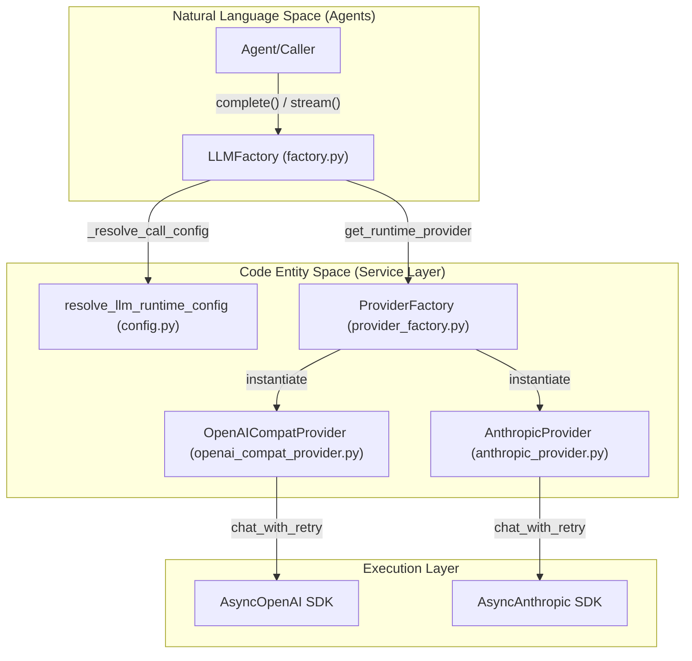
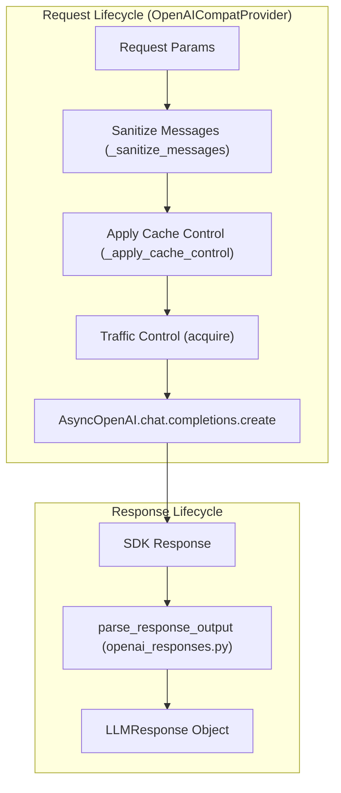

# LLM Service and Provider Factory

Relevant source files

The following files were used as context for generating this wiki page:

- [deeptutor/services/config/launch_settings.py](deeptutor/services/config/launch_settings.py)
- [deeptutor/services/config/loader.py](deeptutor/services/config/loader.py)
- [deeptutor/services/llm/capabilities.py](deeptutor/services/llm/capabilities.py)
- [deeptutor/services/llm/cloud_provider.py](deeptutor/services/llm/cloud_provider.py)
- [deeptutor/services/llm/config.py](deeptutor/services/llm/config.py)
- [deeptutor/services/llm/context_window.py](deeptutor/services/llm/context_window.py)
- [deeptutor/services/llm/executors.py](deeptutor/services/llm/executors.py)
- [deeptutor/services/llm/factory.py](deeptutor/services/llm/factory.py)
- [deeptutor/services/llm/provider_core/openai_compat_provider.py](deeptutor/services/llm/provider_core/openai_compat_provider.py)
- [deeptutor/services/llm/reasoning_params.py](deeptutor/services/llm/reasoning_params.py)
- [deeptutor/services/provider_registry.py](deeptutor/services/provider_registry.py)
- [site/src/content/docs/docs/get-started/providers.md](site/src/content/docs/docs/get-started/providers.md)
- [site/src/content/docs/zh-cn/docs/get-started/providers.md](site/src/content/docs/zh-cn/docs/get-started/providers.md)
- [tests/services/config/test_provider_runtime.py](tests/services/config/test_provider_runtime.py)
- [tests/services/llm/test_capabilities.py](tests/services/llm/test_capabilities.py)
- [tests/services/llm/test_client.py](tests/services/llm/test_client.py)
- [tests/services/llm/test_reasoning_params.py](tests/services/llm/test_reasoning_params.py)
- [web/app/(workspace)/book/components/BookChatPanel.tsx](web/app/(workspace)/book/components/BookChatPanel.tsx)
- [web/components/chat/home/ModelSelector.tsx](web/components/chat/home/ModelSelector.tsx)
- [web/components/common/AssistantResponse.tsx](web/components/common/AssistantResponse.tsx)
- [web/hooks/useSmoothStreamText.ts](web/hooks/useSmoothStreamText.ts)
- [web/tests/skill-slug.test.ts](web/tests/skill-slug.test.ts)

The LLM Service layer acts as the central nervous system for all model interactions within DeepTutor. It abstracts the complexities of multiple model providers (OpenAI, Anthropic, DeepSeek, etc.), handles local vs. cloud routing, manages connection persistence, and provides robust error recovery through a sophisticated provider factory and capability-based dispatching.

## LLM Factory and Provider Registry

The `LLMFactory` (implemented primarily in `factory.py`) is the primary entry point for agents and services requiring model inference. It provides a unified interface that hides whether a request is being served by a cloud provider or a local instance.

### Provider Specification and Discovery
The system uses a `ProviderSpec` registry in `provider_registry.py` to define how different backends should be handled.
*   **Provider Discovery**: The `_resolve_provider_spec` function determines the correct `ProviderSpec` by checking the `binding` name, searching for "gateways" (like OpenRouter) based on API keys/URLs, or matching model name patterns [deeptutor/services/llm/factory.py:77-108]().
*   **Gateway Detection**: Gateways are prioritized. For example, if an API key starts with `sk-or-`, the system automatically identifies it as `openrouter` [deeptutor/services/provider_registry.py:136-147]().
*   **Local LLM Detection**: The factory uses `is_local_llm_server` to check if the `base_url` points to a local loopback address or Docker host bridge, automatically falling back to `ollama` or `vllm` specs [deeptutor/services/llm/factory.py:102-105]().

### LLM Call Flow Diagram
This diagram illustrates the transition from high-level requests to provider-specific execution.

**Sources:** [deeptutor/services/llm/factory.py:153-234](), [deeptutor/services/llm/provider_factory.py:1-24](), [deeptutor/services/provider_registry.py:109-215]()

## Provider Abstraction and Capabilities

DeepTutor uses a capability-based system to handle the heterogeneous features of different LLM providers. This replaces hardcoded checks with a centralized registry.

### Provider Capabilities Registry
The system maintains `PROVIDER_CAPABILITIES` and `MODEL_OVERRIDES` in `capabilities.py` to manage:
*   **JSON Mode**: Checked via `supports_response_format(binding, model)`. Some models, like `deepseek-reasoner` or `gemma`, have this disabled due to specific API limitations [deeptutor/services/llm/capabilities.py:22-159](), [deeptutor/services/llm/capabilities.py:176-186]().
*   **Thinking Style**: The `OpenAICompatProvider` uses `build_openai_compatible_reasoning_kwargs` to inject provider-specific reasoning flags (e.g., `thinking_type` for VolcEngine) into the request body [deeptutor/services/llm/provider_core/openai_compat_provider.py:31-33](), [deeptutor/services/llm/reasoning_params.py:12-20]().
*   **Temperature Constraints**: Reasoning models (O1, GPT-5) are often forced to specific temperatures via `get_effective_temperature()` to ensure stability [deeptutor/services/llm/capabilities.py:194-200]().

### Supported Provider Backends
| Backend | Providers | Vision | Tools | Prompt Caching |
| :--- | :--- | :--- | :--- | :--- |
| `openai_compat` | OpenAI, DeepSeek, OpenRouter, SiliconFlow | True | True | Model Dep. |
| `anthropic` | Claude 3.5/3.7, Custom Anthropic | True | True | True |
| `azure_openai` | Azure-hosted GPT models | True | True | False |

**Sources:** [deeptutor/services/llm/capabilities.py:22-159](), [deeptutor/services/provider_registry.py:109-150]()

## Execution, Telemetry, and Traffic Control

The execution layer handles the lifecycle of an LLM call, including multimodal processing, prompt caching, and circuit breaking.

### Multimodal Support
Before dispatching to a provider, the factory calls `prepare_multimodal_messages`. This utility detects `image_data` or `image_url` and formats them according to the provider's requirements (e.g., converting to base64 for Anthropic or standard `image_url` blocks for OpenAI) [deeptutor/services/llm/factory.py:231-255](), [deeptutor/services/llm/multimodal.py:1-20]().

### Prompt Caching and Circuit Breaking
*   **Prompt Caching**: The `OpenAICompatProvider` automatically applies `cache_control` markers to system messages and the penultimate user message to optimize costs on supported gateways like OpenRouter [deeptutor/services/llm/provider_core/openai_compat_provider.py:171-204]().
*   **Circuit Breaking**: Providers track failure counts for specific model/reasoning combinations via `_responses_failures`. If failures exceed `_RESPONSES_FAILURE_THRESHOLD` (default 2), the provider "trips" for `_RESPONSES_PROBE_INTERVAL_S` (300s) to prevent further wasted requests [deeptutor/services/llm/provider_core/openai_compat_provider.py:55-56](), [deeptutor/services/llm/provider_core/openai_compat_provider.py:146-147]().

### Implementation of OpenAI-Compatible Provider
The `OpenAICompatProvider` serves as the primary workhorse for most APIs.

**Sources:** [deeptutor/services/llm/provider_core/openai_compat_provider.py:106-147](), [deeptutor/services/llm/provider_core/openai_responses.py:24-30]()

## Configuration and Environment

LLM configuration is managed through a hierarchy: Environment Variables -> Database Catalog -> Runtime Resolution.

### Runtime Configuration Resolution
The `LLMConfig` dataclass and `get_llm_config` function manage the active model parameters. The system uses `ContextVar` via `_SCOPED_LLM_CONFIG` to allow per-request or per-agent configuration overrides in async contexts [deeptutor/services/llm/config.py:96-115](), [deeptutor/services/llm/config.py:130-138]().

### Context Window Management
The system reasons about token budgets using `resolve_effective_context_window`. It identifies large-context models (GPT-4o, Gemini, Claude) to set appropriate history-planning windows [deeptutor/services/llm/context_window.py:10-23](), [deeptutor/services/llm/context_window.py:53-67]().

### Environment Variables
*   `OPENAI_API_KEY`: Global fallback key for OpenAI-compatible services.
*   `OPENAI_BASE_URL`: Global fallback endpoint [deeptutor/services/llm/config.py:62-74]().
*   `DISABLE_SSL_VERIFY`: When set, `_get_aiohttp_connector` disables SSL verification for local/self-signed endpoints [deeptutor/services/llm/cloud_provider.py:123-144]().

### Fallback Mechanism for Response Formats
Some local servers (e.g., LM Studio with Gemma) reject `response_format` with HTTP 400. The system implements `_create_with_format_fallback` in `executors.py` to catch `BadRequestError`, disable the feature for that model at runtime via `disable_response_format_at_runtime`, and retry without the offending field [deeptutor/services/llm/executors.py:43-70]().

**Sources:** [deeptutor/services/llm/config.py:96-115](), [deeptutor/services/llm/context_window.py:1-79](), [deeptutor/services/llm/cloud_provider.py:123-144](), [deeptutor/services/llm/executors.py:24-40]()
