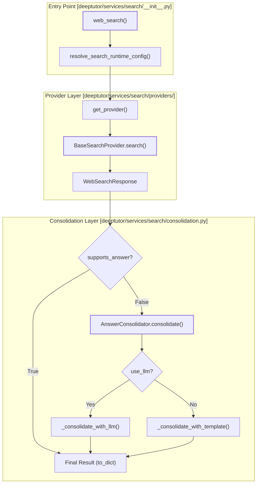

# Search Service

<details>
<summary>Relevant source files</summary>

The following files were used as context for generating this wiki page:

- [deeptutor/services/search/__init__.py](deeptutor/services/search/__init__.py)
- [deeptutor/services/search/consolidation.py](deeptutor/services/search/consolidation.py)
- [deeptutor/services/search/providers/__init__.py](deeptutor/services/search/providers/__init__.py)
- [deeptutor/tools/web_search.py](deeptutor/tools/web_search.py)

</details>


The Search Service provides a unified abstraction layer for web search capabilities within DeepTutor. It manages provider-specific implementations, handles credential resolution, and performs result consolidation to transform raw search engine results into structured answers suitable for agent consumption.

## Architecture Overview

The search infrastructure is designed around a provider-registry pattern. It separates the raw data retrieval (Providers) from the synthesis of that data into human-readable or agent-consumable formats (Consolidation).

### Search Service Data Flow

The following diagram illustrates the path from a search query to a consolidated response, mapping logical steps to code entities.

**Search Execution and Consolidation Flow**

**Sources:** [deeptutor/services/search/__init__.py:73-160](), [deeptutor/services/search/consolidation.py:174-189](), [deeptutor/services/search/providers/__init__.py:42-66]()

## Provider Abstraction

DeepTutor supports a wide array of search providers, categorized by their output capabilities. All providers inherit from the `BaseSearchProvider` abstract base class [deeptutor/services/search/base.py:11-13]().

### Supported Providers
The system distinguishes between "AI Providers" (which generate their own answers) and "SERP Providers" (which return raw search results).

| Provider | Type | Implementation Class | Key Feature |
| :--- | :--- | :--- | :--- |
| **Brave** | SERP | `BraveSearchProvider` | Privacy-focused web index |
| **Tavily** | AI | `TavilySearchProvider` | Optimized for LLM agents |
| **DuckDuckGo** | SERP | `DuckDuckGoSearchProvider` | Zero-config fallback |
| **Jina** | SERP+ | `JinaSearchProvider` | Full markdown content extraction |
| **Perplexity** | AI | `PerplexitySearchProvider` | Native LLM-powered answers |
| **Serper** | SERP | `SerperSearchProvider` | Google Search API wrapper |
| **SearXNG** | SERP | `SearXNGSearchProvider` | Self-hosted meta-search |
| **Exa** | Deprecated | - | Use Brave/Tavily/Jina instead |
| **Baidu** | Deprecated | - | Use Brave/Tavily/Jina instead |

**Sources:** [deeptutor/services/search/providers/__init__.py:12-16](), [deeptutor/services/search/providers/__init__.py:148-153](), [deeptutor/tools/web_search.py:19-26]()

### Provider Registry and Selection
Providers are registered via a decorator `register_provider` [deeptutor/services/search/providers/__init__.py:19-39](). The service uses a fallback mechanism: if a preferred provider (like Brave or Tavily) is missing an API key, it automatically falls back to `duckduckgo` [deeptutor/services/search/__init__.py:115-117](). Deprecated providers like `exa`, `baidu`, and `openrouter` are explicitly blocked in the registry and will raise a `ValueError` if requested [deeptutor/services/search/providers/__init__.py:12-16](), [deeptutor/services/search/providers/__init__.py:58-59]().

## Answer Consolidation

For providers that do not natively generate answers (`supports_answer=False`), the `AnswerConsolidator` class [deeptutor/services/search/consolidation.py:138-144]() is used to synthesize information into a coherent response.

### Consolidation Strategies
1.  **Template-based:** Uses Jinja2 templates to format raw results into Markdown. Provider-specific templates exist for `serper` [deeptutor/services/search/consolidation.py:31-76](), `jina` [deeptutor/services/search/consolidation.py:80-116](), and `serper_scholar` [deeptutor/services/search/consolidation.py:120-134]().
2.  **LLM-based:** If `use_llm=True` is passed to the consolidator, it uses an LLM to read the snippets and write a concise summary via `_consolidate_with_llm` [deeptutor/services/search/consolidation.py:178-181]().

### Data Structures
The service communicates using standardized types defined in `deeptutor/services/search/types.py`:
*   `SearchResult`: Represents a single web entry with title, URL, and snippet [deeptutor/services/search/types.py:29-29]().
*   `Citation`: Represents a reference used in an answer [deeptutor/services/search/types.py:29-29]().
*   `WebSearchResponse`: The unified container for the query, answer, citations, and raw results [deeptutor/services/search/types.py:29-29]().

## Configuration and Initialization

Search settings are managed via the central configuration system and environment variables.

### Environment Variables and Runtime Config
The service resolves configuration using `resolve_search_runtime_config` [deeptutor/services/search/__init__.py:100]():
*   **Provider Selection:** Controlled by `SEARCH_PROVIDER` or the user's profile settings [deeptutor/services/config.py:15-17]().
*   **API Keys:** Resolved for specific providers (Brave, Tavily, Jina, Perplexity, Serper) [deeptutor/services/search/__init__.py:113-124]().
*   **Proxies:** Automatically injected into provider kwargs if defined in the runtime config [deeptutor/services/search/__init__.py:136-137]().

### Code Entity Relationship
This diagram shows how configuration objects and environment stores interact with the search service classes.

**Configuration to Execution Mapping**
```mermaid
classDiagram
    class "resolve_search_runtime_config()" as SearchRuntimeConfig {
        +provider: str
        +api_key: str
        +max_results: int
        +proxy: str
    }
    class "web_search()" as WebSearchFunction {
        +execute(query)
    }
    class AnswerConsolidator {
        +jinja_env: Environment
        +use_llm: bool
        +consolidate(response: WebSearchResponse)
    }
    class BaseSearchProvider {
        <<abstract>>
        +search(query: str)
        +supports_answer: bool
        +requires_api_key: bool
    }

    WebSearchFunction ..> SearchRuntimeConfig : resolves via resolve_search_runtime_config()
    WebSearchFunction --> BaseSearchProvider : factory get_provider()
    WebSearchFunction --> AnswerConsolidator : uses for SERP results if supports_answer=False
```
**Sources:** [deeptutor/services/search/__init__.py:100-140](), [deeptutor/services/search/providers/__init__.py:130-145](), [deeptutor/services/search/consolidation.py:138-165]()

## Implementation Details

### The `web_search` Entry Point
The primary interface for agents is the `web_search` function [deeptutor/services/search/__init__.py:73-81](). It performs the following sequence:
1.  Checks if search is enabled via `_get_web_search_config()` [deeptutor/services/search/__init__.py:88-89]().
2.  Resolves the runtime config (provider, API keys, proxies) via `resolve_search_runtime_config()` [deeptutor/services/search/__init__.py:100]().
3.  Instantiates the provider via `get_provider()` [deeptutor/services/search/__init__.py:139]().
4.  Executes the search via `search_provider.search(query, **provider_kwargs)` [deeptutor/services/search/__init__.py:142]().
5.  Triggers `AnswerConsolidator` if `search_provider.supports_answer` is False [deeptutor/services/search/__init__.py:148-158]().
6.  Optionally saves results to a JSON file using `_save_results()` [deeptutor/services/search/__init__.py:161-163]().

### Provider Registry
The registry is maintained in `deeptutor/services/search/providers/__init__.py`.
*   `_PROVIDERS`: Internal dictionary mapping names to class types [deeptutor/services/search/providers/__init__.py:11]().
*   `get_available_providers()`: Returns a list of providers that have valid credentials by calling `instance.is_available()` [deeptutor/services/search/providers/__init__.py:79-94]().
*   `get_providers_info()`: Provides metadata (display name, description, requirements) for frontend consumption [deeptutor/services/search/providers/__init__.py:97-127]().

### Paper Search Extension
In addition to general web search, the service includes specialized support for academic results. For example, the `serper_scholar` template [deeptutor/services/search/consolidation.py:120-134]() specifically handles metadata like `pdfUrl`, `publicationInfo`, and `citedBy` for scholarly research.

**Sources:** [deeptutor/services/search/__init__.py:73-168](), [deeptutor/services/search/providers/__init__.py:1-165](), [deeptutor/tools/web_search.py:29-45](), [deeptutor/services/search/consolidation.py:1-189]()
