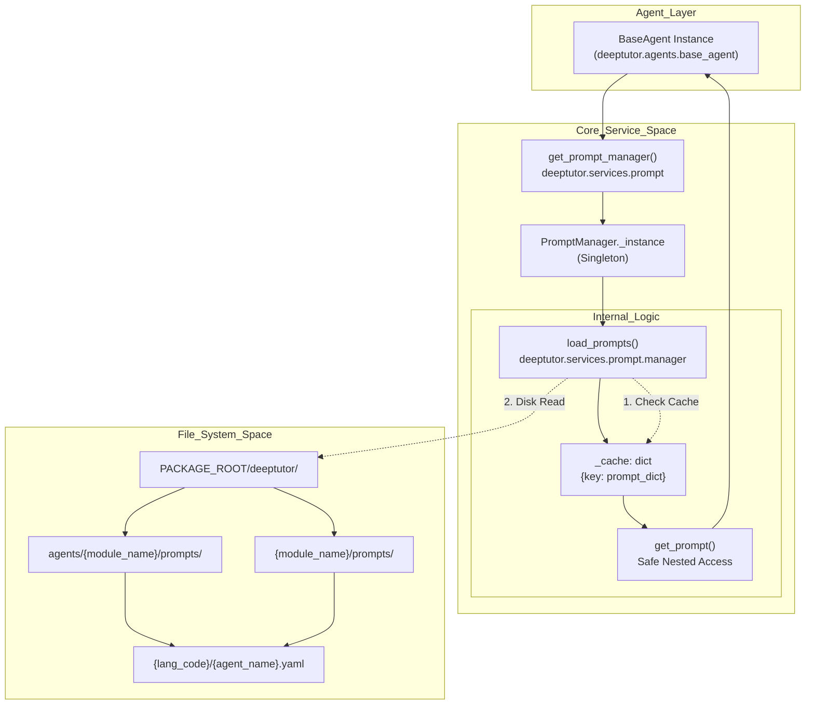
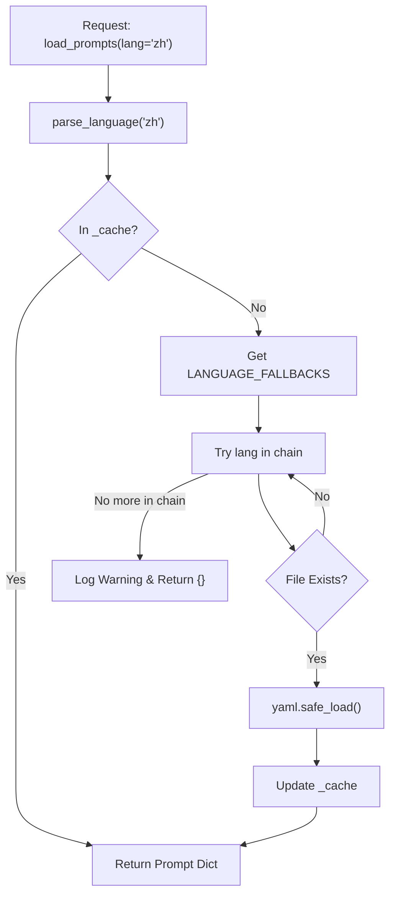
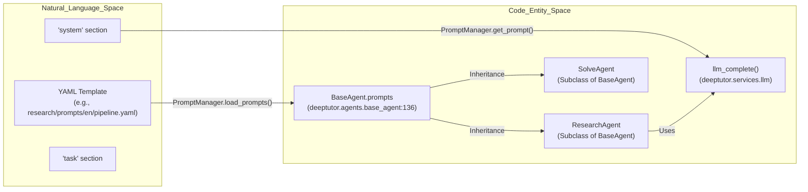

# Prompt Management

<details>
<summary>Relevant source files</summary>

The following files were used as context for generating this wiki page:

- [.pre-commit-config.yaml](.pre-commit-config.yaml)
- [deeptutor/agents/base_agent.py](deeptutor/agents/base_agent.py)
- [deeptutor/services/llm/utils.py](deeptutor/services/llm/utils.py)
- [deeptutor/services/notebook/service.py](deeptutor/services/notebook/service.py)
- [deeptutor/services/prompt/manager.py](deeptutor/services/prompt/manager.py)
- [tests/core/__init__.py](tests/core/__init__.py)
- [tests/core/test_prompt_manager.py](tests/core/test_prompt_manager.py)
- [tests/services/llm/test_utils.py](tests/services/llm/test_utils.py)
- [tests/services/rag/test_pipeline_integration.py](tests/services/rag/test_pipeline_integration.py)
- [tests/services/rag/test_rag_pipelines.py](tests/services/rag/test_rag_pipelines.py)
- [tests/services/rag/testfile.txt](tests/services/rag/testfile.txt)
- [tests/services/test_notebook_service.py](tests/services/test_notebook_service.py)

</details>


## Purpose and Scope

The `PromptManager` is a core service in DeepTutor designed to centralize, cache, and manage the lifecycle of LLM prompts across all intelligent agent modules. By decoupling prompt logic from agent code, the system enables seamless multi-language support (i18n), rapid prompt engineering, and consistent template formatting. It utilizes a singleton pattern to minimize disk I/O and provides a hierarchical resolution strategy with automatic language fallback. [deeptutor/services/prompt/manager.py:16-26](), [tests/core/test_prompt_manager.py:19-23]()

---

## System Architecture

The prompt management system organizes templates within the `deeptutor/` directory structure. While most prompts reside under `deeptutor/agents/`, the system also supports `NON_AGENT_MODULES` such as `book`, `co_writer`, and `capabilities` which have their own top-level directory structures. [deeptutor/services/prompt/manager.py:41-48](), [deeptutor/services/prompt/manager.py:119-129]()

### Prompt Resolution Flow

The following diagram illustrates how an agent requests a prompt and how the `PromptManager` resolves it through the file system and cache.

**PromptManager Singleton and Data Flow**



**Sources:** [deeptutor/services/prompt/manager.py:16-52](), [deeptutor/services/prompt/manager.py:119-129](), [deeptutor/agents/base_agent.py:134-145]()

---

## Implementation Details

The `PromptManager` serves as the single point of truth for all template-related operations, utilized by the `BaseAgent` class which all intelligent modules inherit from. [deeptutor/agents/base_agent.py:32-45]()

### Key Class Members

| Entity | Type | Description |
|:---|:---|:---|
| `PromptManager` | Class | The main manager class implementing singleton logic via `__new__`. [deeptutor/services/prompt/manager.py:16-52]() |
| `_cache` | Dict | In-memory storage for loaded YAML contents using composite keys. [deeptutor/services/prompt/manager.py:20-20]() |
| `LANGUAGE_FALLBACKS` | Dict | Defines the search order for missing translations (e.g., `zh` -> `en`). [deeptutor/services/prompt/manager.py:23-26]() |
| `MODULES` | List | Registry of supported modules including `research`, `solve`, `book`, etc. [deeptutor/services/prompt/manager.py:29-39]() |
| `load_prompts()` | Method | Fetches prompts with caching and language fallback. [deeptutor/services/prompt/manager.py:54-81]() |
| `get_prompt()` | Method | Safely navigates loaded dictionaries with section/field logic. [deeptutor/services/prompt/manager.py:161-192]() |
| `clear_cache()` | Method | Flushes the in-memory cache globally or for a specific module. [deeptutor/services/prompt/manager.py:194-206]() |
| `reload_prompts()`| Method | Force-reloads prompts from disk, bypassing the cache. [deeptutor/services/prompt/manager.py:208-222]() |

### Data Resolution and Fallback
The `load_prompts` method implements a robust search strategy:
1. **Cache Lookup**: Checks if the requested prompt set is already in `_cache` using a key built from module, agent, language, and subdirectory. [deeptutor/services/prompt/manager.py:74-77]()
2. **Subdirectory Support**: Allows loading prompts from specific subfolders (e.g., `solve_loop` for the solve module). [deeptutor/services/prompt/manager.py:144-147]()
3. **Language Fallback**: If a primary language is missing, the system iterates through `LANGUAGE_FALLBACKS`. For `zh`, it will try `zh`, then `cn`, then `en`. [deeptutor/services/prompt/manager.py:101-107]()
4. **Recursive Search**: If the file is not in the expected path, it performs a recursive search within the language directory using `rglob`. [deeptutor/services/prompt/manager.py:155-157]()

**Sources:** [deeptutor/services/prompt/manager.py:54-159]()

---

## Multi-Language Support

DeepTutor supports multiple languages through a structured directory layout. The `PromptManager` handles the mapping between user-requested language codes and the filesystem using `parse_language`. [deeptutor/services/prompt/manager.py:73-73]()

### Language Resolution Logic



**Sources:** [deeptutor/services/prompt/manager.py:73-117](), [deeptutor/services/prompt/manager.py:23-26]()

---

## Integration with Intelligent Modules

Prompts are not just static strings; they are the core configuration for agent behavior. The `BaseAgent` integrates the `PromptManager` to ensure that every agent (from `Smart Solver` to `Deep Research`) has its instructions loaded correctly based on the current system language.

### Natural Language to Code Entity Mapping

The following diagram bridges the "Natural Language Space" (where prompts are defined) to the "Code Entity Space" (where agents execute).



**Sources:** [deeptutor/agents/base_agent.py:32-45](), [deeptutor/agents/base_agent.py:134-145](), [deeptutor/services/prompt/manager.py:54-60]()

---

## Usage Examples

### Loading Prompts in an Agent
Agents fetch their required prompts during initialization via the `BaseAgent` constructor, which calls `get_prompt_manager().load_prompts()`. [deeptutor/agents/base_agent.py:135-145]()

```python
from deeptutor.services.prompt import get_prompt_manager

# Manual usage
pm = get_prompt_manager()
prompts = pm.load_prompts(
    module_name="solve",
    agent_name="solve_agent",
    language="en",
    subdirectory="solve_loop"
)
```
[deeptutor/services/prompt/manager.py:54-69]()

### Safe Access with Nested Keys
The `get_prompt` utility allows for safe navigation of the prompt dictionary with default fallbacks, preventing `KeyError` exceptions. [deeptutor/services/prompt/manager.py:161-167]()

```python
# Access prompts['system']['role'] safely
# If missing, returns "fallback_value"
role_prompt = pm.get_prompt(
    prompts, 
    "system", 
    "role", 
    "fallback_value"
)
```
[deeptutor/services/prompt/manager.py:180-192]()

### Force Reloading
For development or dynamic updates, `reload_prompts` bypasses the internal cache to ensure the latest YAML changes are applied. [deeptutor/services/prompt/manager.py:208-215]()

```python
# Force a fresh read from disk
fresh_prompts = pm.reload_prompts("research", "pipeline", "en")
```
[deeptutor/services/prompt/manager.py:219-222]()

**Sources:** [deeptutor/services/prompt/manager.py:161-222](), [deeptutor/agents/base_agent.py:134-145]()
