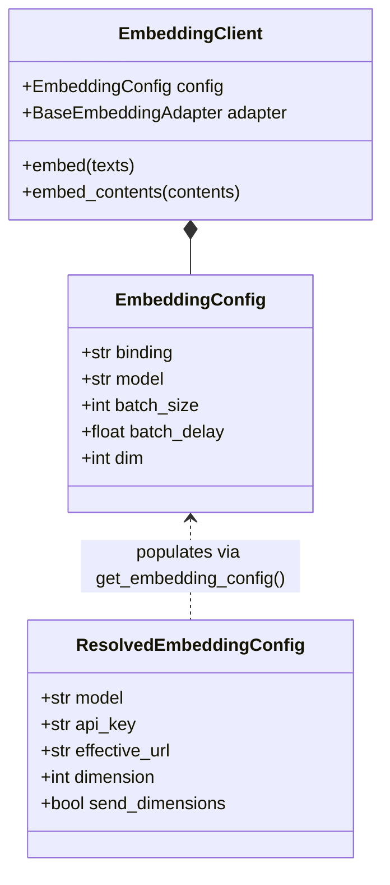

# Embedding Service

<details>
<summary>Relevant source files</summary>

The following files were used as context for generating this wiki page:

- [deeptutor/services/config/model_catalog.py](deeptutor/services/config/model_catalog.py)
- [deeptutor/services/config/provider_runtime.py](deeptutor/services/config/provider_runtime.py)
- [deeptutor/services/embedding/adapters/base.py](deeptutor/services/embedding/adapters/base.py)
- [deeptutor/services/embedding/adapters/cohere.py](deeptutor/services/embedding/adapters/cohere.py)
- [deeptutor/services/embedding/adapters/jina.py](deeptutor/services/embedding/adapters/jina.py)
- [deeptutor/services/embedding/adapters/ollama.py](deeptutor/services/embedding/adapters/ollama.py)
- [deeptutor/services/embedding/adapters/openai_compatible.py](deeptutor/services/embedding/adapters/openai_compatible.py)
- [deeptutor/services/embedding/client.py](deeptutor/services/embedding/client.py)
- [deeptutor/services/embedding/config.py](deeptutor/services/embedding/config.py)
- [deeptutor/services/llm/provider_core/openai_codex_provider.py](deeptutor/services/llm/provider_core/openai_codex_provider.py)
- [tests/services/config/test_embedding_runtime.py](tests/services/config/test_embedding_runtime.py)
- [tests/services/embedding/test_client_runtime.py](tests/services/embedding/test_client_runtime.py)
- [tests/services/embedding/test_disable_ssl_verify.py](tests/services/embedding/test_disable_ssl_verify.py)
- [tests/services/embedding/test_extract_embeddings.py](tests/services/embedding/test_extract_embeddings.py)
- [tests/services/llm/test_codex_disable_ssl_verify.py](tests/services/llm/test_codex_disable_ssl_verify.py)
- [web/app/(utility)/settings/page.tsx](web/app/(utility)/settings/page.tsx)

</details>


The **Embedding Service** provides a unified abstraction layer for generating vector embeddings across various providers. It employs the **Adapter Pattern** to normalize requests and responses from different API schemas (OpenAI-compatible, Cohere, Jina, Ollama) into a standard format used by DeepTutor's RAG and retrieval modules.

## Service Architecture

The service is built around the `EmbeddingClient`, which orchestrates the interaction between high-level application modules and provider-specific adapters.

### Core Components

| Component | Role | File Reference |
|:---|:---|:---|
| `EmbeddingClient` | Unified client managing adapter lifecycle, batching, and validation. | [deeptutor/services/embedding/client.py:34-64]() |
| `BaseEmbeddingAdapter` | Abstract base class defining the `embed` interface and configuration handling. | [deeptutor/services/embedding/adapters/base.py:106-164]() |
| `EmbeddingRequest` | Data class for provider-agnostic parameters including multimodal `contents`. | [deeptutor/services/embedding/adapters/base.py:15-53]() |
| `EmbeddingConfig` | Runtime configuration object holding resolved API keys, URLs, and batch settings. | [deeptutor/services/embedding/config.py:11-27]() |
| `OpenAICompatibleEmbeddingAdapter` | Implementation for OpenAI, Azure, SiliconFlow, and local providers. | [deeptutor/services/embedding/adapters/openai_compatible.py:22-175]() |

### Data Flow Diagram: Natural Language to Code Entity Space

This diagram illustrates how text input flows from the high-level `EmbeddingClient` through the specific adapter implementations to reach external API services.

```mermaid
graph TD
    subgraph "Natural Language Space"
        Input["List[str] (texts)"]
    end

    subgraph "Code Entity Space: Embedding Service"
        Client["EmbeddingClient (deeptutor/services/embedding/client.py)"]
        Config["EmbeddingConfig (deeptutor/services/embedding/config.py)"]
        Req["EmbeddingRequest (deeptutor/services/embedding/adapters/base.py)"]
        
        subgraph "Adapters (deeptutor/services/embedding/adapters/)"
            OAI["OpenAICompatibleEmbeddingAdapter"]
            COH["CohereEmbeddingAdapter"]
            JINA["JinaEmbeddingAdapter"]
            OLL["OllamaEmbeddingAdapter"]
        end
    end

    subgraph "External Provider APIs"
        OAI_API["OpenAI / Azure / vLLM / LM Studio"]
        COH_API["Cohere API (/v2/embed)"]
        JINA_API["Jina AI API (/v1/embeddings)"]
        OLL_API["Ollama Local API (/api/embed)"]
    end

    Input -->|embed()| Client
    Client -.->|uses| Config
    Client -->|constructs| Req
    Client -->|calls embed()| OAI
    Client -->|calls embed()| COH
    Client -->|calls embed()| JINA
    Client -->|calls embed()| OLL

    OAI -->|POST verbatim URL| OAI_API
    COH -->|POST verbatim URL| COH_API
    JINA -->|POST verbatim URL| JINA_API
    OLL -->|POST verbatim URL| OLL_API
```
**Sources:** [deeptutor/services/embedding/client.py:49-60](), [deeptutor/services/embedding/client.py:66-97](), [deeptutor/services/embedding/adapters/openai_compatible.py:143-175](), [deeptutor/services/embedding/adapters/base.py:106-140]()

---

## Provider Adapters

DeepTutor supports multiple embedding backends, resolved via the `_resolve_adapter_class` utility [deeptutor/services/embedding/client.py:18-31]() which looks up backends in the `ADAPTER_BACKENDS` registry [deeptutor/services/embedding/client.py:13-13]().

### 1. OpenAI Compatible Adapter
Used for OpenAI, Azure OpenAI, SiliconFlow, and local servers like LM Studio.
- **Flexible Parsing**: The `_extract_embeddings_from_response` method handles standard OpenAI `data` arrays, Ollama singular `embedding` vectors, and nested `result/output` variants [deeptutor/services/embedding/adapters/openai_compatible.py:39-114]().
- **Tri-state Dimensions**: Implements `_should_send_dimensions` logic. It automatically sends the `dimensions` parameter for OpenAI `text-embedding-3*` and Qwen3 families while omitting it for others to avoid HTTP 400 errors [deeptutor/services/embedding/adapters/openai_compatible.py:120-141]().
- **Multimodal Support**: Passes `contents` (text/image mix) to the `input` field for compatible models like SiliconFlow Qwen3-VL [deeptutor/services/embedding/adapters/openai_compatible.py:155-165]().
- **Error Handling**: Captures structured error payloads from providers, extracting messages and codes into `ValueError` [deeptutor/services/embedding/adapters/openai_compatible.py:54-69]().

### 2. Specialized Adapters
- **Cohere**: Supports both v1 and v2 APIs. For v2, it translates multimodal `contents` into the nested `inputs` form required by Cohere [deeptutor/services/embedding/adapters/cohere.py:68-113](). It also supports `input_type` mapping for tasks like `search_document` [deeptutor/services/embedding/adapters/cohere.py:66-67]().
- **Jina**: Supports late chunking [deeptutor/services/embedding/adapters/jina.py:101-102]() and task-specific hints like `retrieval.passage` or `retrieval.query` [deeptutor/services/embedding/adapters/jina.py:29-35](). It handles multimodal input for v4 models [deeptutor/services/embedding/adapters/jina.py:68-76]().
- **Ollama**: Optimized for local execution. It includes a probe mechanism for `/api/tags` to suggest missing models to the user if a 404 occurs [deeptutor/services/embedding/adapters/ollama.py:30-36](), [deeptutor/services/embedding/adapters/ollama.py:72-83]().

### SSL Verification
All adapters respect the `DISABLE_SSL_VERIFY` environment variable via the `disable_ssl_verify_enabled()` helper [deeptutor/services/llm/openai_http_client.py:14-14](). They use this when constructing `httpx.AsyncClient` [deeptutor/services/embedding/adapters/openai_compatible.py:9](), [deeptutor/services/embedding/adapters/ollama.py:64-65](), [deeptutor/services/embedding/adapters/jina.py:109-110]().

**Sources:** [deeptutor/services/embedding/adapters/openai_compatible.py:22-175](), [deeptutor/services/embedding/adapters/cohere.py:51-158](), [deeptutor/services/embedding/adapters/jina.py:58-132](), [deeptutor/services/embedding/adapters/ollama.py:38-135]()

---

## Configuration and Resolution

The service relies on `resolve_embedding_runtime_config` [deeptutor/services/config/provider_runtime.py:216-228]() to bridge the gap between user-defined settings in the `ModelCatalog` [deeptutor/services/config/model_catalog.py:45-75]() and runtime configuration.

### Configuration Structure Diagram


**Sources:** [deeptutor/services/embedding/config.py:30-62](), [deeptutor/services/embedding/client.py:37-64]()

### URL Transparency
DeepTutor sends embedding requests to the provided endpoint URL exactly. The `EmbeddingClient` performs validation via `embedding_endpoint_validation_error` [deeptutor/services/config/provider_runtime.py:21-26]() to ensure users do not rely on hidden path appending [deeptutor/services/embedding/client.py:41-47](). For instance, OpenAI and Gemini use fully-qualified embedding endpoint URLs as defaults [deeptutor/services/config/provider_runtime.py:71-87]().

**Sources:** [deeptutor/services/embedding/client.py:40-47](), [deeptutor/services/embedding/config.py:30-62](), [deeptutor/services/config/provider_runtime.py:50-54]()

---

## Key Implementation Details

### Batch Processing and Clamping
The `EmbeddingClient.embed` method splits texts into batches [deeptutor/services/embedding/client.py:89-90](). It dynamically clamps the configured `batch_size` against the provider's `max_batch_items` defined in `EmbeddingProviderSpec` [deeptutor/services/config/provider_runtime.py:47-68](). For example, SiliconFlow is capped at 32 and DashScope at 20 [deeptutor/services/embedding/client.py:72-83]().

### Validation and Consistency
After each batch request, the client calls `validate_embedding_batch` [deeptutor/services/embedding/validation.py:15-15]() to ensure:
1. The number of vectors matches the number of input texts [deeptutor/services/embedding/client.py:114-122]().
2. Vector dimensions are consistent across all batches for the same request to prevent corruption in the vector database [deeptutor/services/embedding/client.py:126-133]().
3. No null values exist within the embedding vectors; the adapter handles replacement during extraction [tests/services/embedding/test_extract_embeddings.py:163-176]().

### Multimodal Support
The service supports multimodal embeddings via `embed_contents`. It checks if the adapter supports multimodal inputs using `supports_multimodal_contents()` [deeptutor/services/embedding/client.py:154-164](). Specific models like `embed-v4.0` (Cohere) and `jina-embeddings-v4` are flagged as multimodal in their respective `MODELS_INFO` dictionaries [deeptutor/services/embedding/adapters/cohere.py:18-24](), [deeptutor/services/embedding/adapters/jina.py:22-26]().

**Sources:** [deeptutor/services/embedding/client.py:66-152](), [deeptutor/services/embedding/client.py:154-164](), [deeptutor/services/config/provider_runtime.py:103-157](), [deeptutor/services/embedding/adapters/openai_compatible.py:160-164]()
