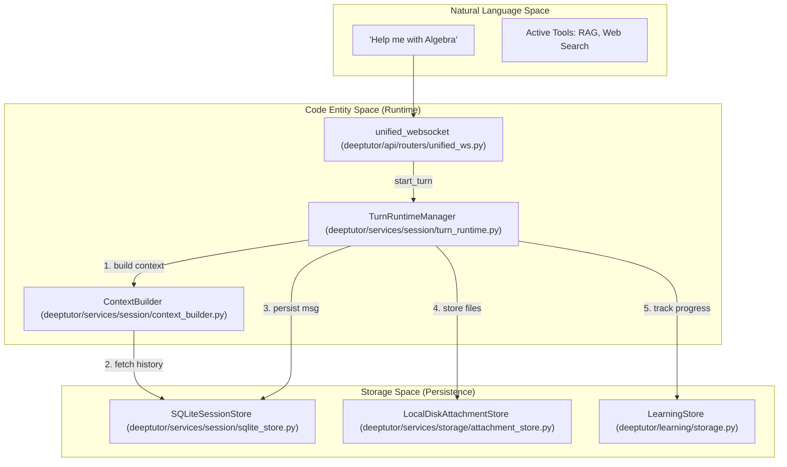
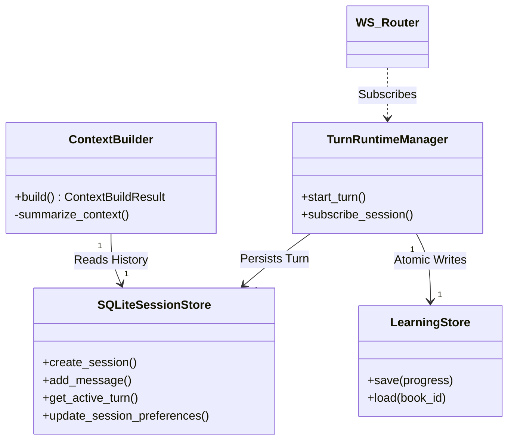

# Session and Memory Management

Relevant source files

The following files were used as context for generating this wiki page:

- [deeptutor/agents/chat/chat_agent.py](deeptutor/agents/chat/chat_agent.py)
- [deeptutor/api/routers/sessions.py](deeptutor/api/routers/sessions.py)
- [deeptutor/api/routers/unified_ws.py](deeptutor/api/routers/unified_ws.py)
- [deeptutor/core/stream.py](deeptutor/core/stream.py)
- [deeptutor/learning/storage.py](deeptutor/learning/storage.py)
- [deeptutor/services/session/context_builder.py](deeptutor/services/session/context_builder.py)
- [deeptutor/services/session/pocketbase_store.py](deeptutor/services/session/pocketbase_store.py)
- [deeptutor/services/session/sqlite_store.py](deeptutor/services/session/sqlite_store.py)
- [deeptutor/services/session/turn_runtime.py](deeptutor/services/session/turn_runtime.py)
- [deeptutor/services/storage/attachment_store.py](deeptutor/services/storage/attachment_store.py)
- [tests/services/session/test_sqlite_store.py](tests/services/session/test_sqlite_store.py)
- [web/app/(workspace)/chat/[[...sessionId]]/page.tsx](web/app/(workspace)/chat/[[...sessionId]]/page.tsx)
- [web/components/chat/home/ChatMessages.tsx](web/components/chat/home/ChatMessages.tsx)
- [web/context/UnifiedChatContext.tsx](web/context/UnifiedChatContext.tsx)

DeepTutor implements a sophisticated session and memory management system designed to handle long-term learner interactions, multi-agent state persistence, and cross-platform memory synchronization. The system transitions from volatile runtime states to persistent SQLite storage and a three-layer memory subsystem for learner profiles.

## Persistence Architecture

The persistence layer is centered around a SQLite-backed session store that tracks every interaction "turn" and a hierarchical file-based memory system.

### SQLite Session Store
DeepTutor utilizes a centralized SQLite database to maintain chat history and session metadata. This ensures that even if the server restarts, the conversation context remains intact.
- **Database Path**: Managed by `PathService`, typically located at `data/user/chat_history.db` [deeptutor/services/session/sqlite_store.py:81-83]().
- **Schema**: Includes tables for `sessions`, `messages`, `turns`, `turn_events`, and `notebook_entries` [deeptutor/services/session/sqlite_store.py:104-186]().
- **Edit-Branching**: The system supports branching conversations via the `parent_message_id` column in the `messages` table, allowing users to explore alternative response paths [deeptutor/services/session/sqlite_store.py:128-128](). The frontend tracks these via `selectedBranches` in the `ChatState` [web/context/UnifiedChatContext.tsx:98-99]().
- **Attachment Store**: Binary files are persisted to local disk in a session-isolated directory structure (`data/user/workspace/chat/attachments/{session_id}/`) while their metadata and public URLs are stored in the message records [deeptutor/services/storage/attachment_store.py:21-27](), [deeptutor/services/storage/attachment_store.py:103-110]().

### Notebook and Quiz Integration
The `notebook_entries` table serves as a persistent store for quiz results, storing question content, options, explanations, and user performance [deeptutor/services/session/sqlite_store.py:175-186](). This data is used by the `LearningStore` to manage `LearningProgress` models, which are saved atomically as JSON files [deeptutor/learning/storage.py:28-44]().

Sources: [deeptutor/services/session/sqlite_store.py:77-186](), [deeptutor/services/storage/attachment_store.py:1-110](), [deeptutor/learning/storage.py:16-51](), [web/context/UnifiedChatContext.tsx:83-101]()

## Turn Runtime and Context Building

The `TurnRuntimeManager` serves as the primary execution engine for individual interactions, coordinating how sessions are updated and how events are multiplexed.

### Context Construction Flow
The `ContextBuilder` gathers information to create a bounded prompt window for the LLM. It manages the trade-off between history depth and token limits.
- **Token Budgeting**: Allocates tokens between recent history and older compressed context based on configured ratios (default 35% for history, 40% of that for summaries) [deeptutor/services/session/context_builder.py:110-115]().
- **Effective Window**: It resolves the effective context window based on the LLM model and `max_tokens` configuration [deeptutor/services/session/context_builder.py:117-122]().
- **History Compression**: Older turns are automatically summarized by a `_ContextSummaryAgent` when the budget is exceeded [deeptutor/services/session/context_builder.py:90-99](), [deeptutor/services/session/context_builder.py:182-190]().

### Turn Lifecycle and Protocol
Each interaction is treated as a "Turn," managed by the `TurnRuntimeManager`.

| Stage | Code Entity | Description |
| :--- | :--- | :--- |
| **Request** | `TurnRuntimeManager.start_turn` | Initiates a turn task, capturing a `request_snapshot` of current UI state (capability, tools, KBs) [deeptutor/services/session/turn_runtime.py:206-250](). |
| **Context Prep** | `ContextBuilder.build` | Aggregates history and performs summarization if the token budget is exceeded [deeptutor/services/session/context_builder.py:223-230](). |
| **Streaming** | `UnifiedWSClient` | Manages the WebSocket connection for real-time event delivery to the frontend [web/context/UnifiedChatContext.tsx:21-21](). |
| **Persistence** | `SQLiteSessionStore` | Saves messages and intermediate events to the DB [deeptutor/services/session/sqlite_store.py:228-245](). |

Sources: [deeptutor/services/session/turn_runtime.py:1-460](), [deeptutor/services/session/context_builder.py:104-230](), [web/context/UnifiedChatContext.tsx:21-143]()

## Three-Layer Memory Subsystem

DeepTutor V2 introduces a three-layer memory subsystem designed to consolidate raw interactions into high-level learner knowledge.

- **L1 (Trace)**: Raw event capture. Append-only JSONL logs per surface (e.g., chat, solver) per day.
- **L2 (Surface Summaries)**: Per-surface summaries derived from L1 traces, providing a condensed view of recent activity in a specific module.
- **L3 (Cross-Surface Knowledge)**: Persistent learner profile divided into slots: `profile` (who the user is), `preferences` (how they like to learn), and `scope` (what they are currently studying).

### Memory Consolidator Pipeline
The consolidator pipeline is an LLM-driven process that moves data through these layers. Users can opt-in to specific L3 slots for a turn via `memory_references` in the request payload [deeptutor/services/session/turn_runtime.py:166-182]().

Sources: [deeptutor/services/session/turn_runtime.py:166-182](), [web/context/UnifiedChatContext.tsx:141-141]()

## Data Flow: Natural Language to Code Entities

The following diagrams illustrate the bridge between user-facing concepts and the internal code architecture.

**Diagram: Turn Execution and Persistence Flow**

Sources: [deeptutor/services/session/turn_runtime.py:206-250](), [deeptutor/services/session/context_builder.py:104-110](), [deeptutor/api/routers/unified_ws.py:44-118](), [deeptutor/services/session/sqlite_store.py:77-186](), [deeptutor/learning/storage.py:28-44]()

**Diagram: Session State Management**

Sources: [deeptutor/services/session/sqlite_store.py:77-186](), [deeptutor/learning/storage.py:28-44](), [deeptutor/services/session/turn_runtime.py:198-220](), [deeptutor/api/routers/unified_ws.py:90-101]()

## Key Classes and Functions

| Class/Function | File | Role |
| :--- | :--- | :--- |
| `SQLiteSessionStore` | [deeptutor/services/session/sqlite_store.py:77]() | Manages SQLite schema, migrations, and CRUD for sessions, messages, and turns. |
| `TurnRuntimeManager` | [deeptutor/services/session/turn_runtime.py:198]() | Orchestrates the turn lifecycle, from request validation to background execution. |
| `ContextBuilder` | [deeptutor/services/session/context_builder.py:104]() | Implements token-aware context window management and history summarization. |
| `LearningStore` | [deeptutor/learning/storage.py:28]() | Handles atomic persistence of learner progress models to JSON. |
| `AttachmentStore` | [deeptutor/services/storage/attachment_store.py:64]() | Protocol for persisting binary attachments and generating public access URLs. |
| `UnifiedWSClient` | [web/context/UnifiedChatContext.tsx:21]() | Frontend client for the unified WebSocket protocol. |

Sources: [deeptutor/services/session/sqlite_store.py:77-186](), [deeptutor/services/session/turn_runtime.py:198-220](), [deeptutor/services/session/context_builder.py:104-110](), [deeptutor/learning/storage.py:28-64](), [deeptutor/services/storage/attachment_store.py:64-80](), [web/context/UnifiedChatContext.tsx:21-143]()
