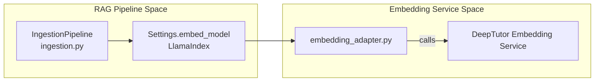

# RAG System

<details>
<summary>Relevant source files</summary>

The following files were used as context for generating this wiki page:

- [.pre-commit-config.yaml](.pre-commit-config.yaml)
- [deeptutor/knowledge/initializer.py](deeptutor/knowledge/initializer.py)
- [deeptutor/services/rag/pipelines/llamaindex/config.py](deeptutor/services/rag/pipelines/llamaindex/config.py)
- [deeptutor/services/rag/pipelines/llamaindex/ingestion.py](deeptutor/services/rag/pipelines/llamaindex/ingestion.py)
- [deeptutor/services/rag/service.py](deeptutor/services/rag/service.py)
- [tests/core/__init__.py](tests/core/__init__.py)
- [tests/core/test_prompt_manager.py](tests/core/test_prompt_manager.py)
- [tests/services/rag/test_pipeline_integration.py](tests/services/rag/test_pipeline_integration.py)
- [tests/services/rag/test_rag_pipelines.py](tests/services/rag/test_rag_pipelines.py)
- [tests/services/rag/testfile.txt](tests/services/rag/testfile.txt)

</details>


## Purpose and Scope

The RAG (Retrieval-Augmented Generation) System provides a unified abstraction layer for querying knowledge bases across multiple retrieval strategies and pipeline implementations. It serves as the primary tool for all intelligent agents to access structured knowledge, supporting vector-based semantic search and multimodal document parsing.

DeepTutor's RAG architecture is "RAG-Anything" compatible, meaning it can ingest various document formats (PDF, Markdown, Text, Office) and extract content into a unified knowledge representation. The system primarily leverages **LlamaIndex** for indexing and retrieval, integrated with a custom embedding layer to support diverse model providers.

---

## System Architecture

The RAG system implements a **provider-based architecture** where `RAGService` acts as the central routing hub. While the architecture is designed to be extensible, the current implementation standardizes on **LlamaIndex** as the core engine.

### Core Components and Data Flow

```mermaid
graph TB
    subgraph "Agent Layer"
        [SmartSolver]
        [QuestionGenerator]
        [ResearchAgent]
    end
    
    subgraph "RAG Tool Interface"
        [rag_search_tool]
    end
    
    subgraph "RAG Service Layer [deeptutor/services/rag/]"
        RAG_SERVICE["RAGService<br/>service.py"]
        FACTORY["Pipeline Factory<br/>factory.py"]
        LLAMA_PIPE["LlamaIndexPipeline<br/>pipelines/llamaindex/pipeline.py"]
        SMART_RETR["SmartRetriever<br/>smart_retriever.py"]
    end
    
    subgraph "Storage Layer"
        KB_BASE_DIR["DEFAULT_KB_BASE_DIR<br/>data/knowledge_bases/"]
        LI_STORAGE["storage.py<br/>VectorStoreIndex"]
    end
    
    [SmartSolver] --> [rag_search_tool]
    [QuestionGenerator] --> [rag_search_tool]
    [ResearchAgent] --> [rag_search_tool]
    
    [rag_search_tool] --> RAG_SERVICE
    RAG_SERVICE --> FACTORY
    FACTORY -->|"get_pipeline()"| LLAMA_PIPE
    RAG_SERVICE -->|"smart_retrieve()"| SMART_RETR
    
    LLAMA_PIPE --> LI_STORAGE
    LI_STORAGE --> KB_BASE_DIR
```

**Sources:** `[deeptutor/services/rag/service.py:18-47]()`, `[deeptutor/services/rag/service.py:195-200]()`, `[deeptutor/services/rag/factory.py:13-14]()`

| Component | File Path | Responsibility |
|:----------|:----------|:---------------|
| `RAGService` | `[deeptutor/services/rag/service.py:18-47]()` | Orchestrates KB-specific provider resolution and search execution. |
| `SmartRetriever` | `[deeptutor/services/rag/smart_retriever.py:10-11]()` | Aggregates multiple search results using query hints and context. |
| `LlamaIndexPipeline` | `[deeptutor/services/rag/pipelines/llamaindex/pipeline.py:36-50]()` | Concrete implementation using `VectorStoreIndex` and `StorageContext`. |
| `KnowledgeBaseInitializer` | `[deeptutor/knowledge/initializer.py:25-48]()` | Handles the initial setup, directory creation, and document processing for a KB. |

---

## Retrieval Pipeline Implementation

### LlamaIndex Integration
The `LlamaIndexPipeline` manages the lifecycle of a knowledge base from initialization to querying.

#### Ingestion and Transformation
DeepTutor uses a dedicated ingestion pipeline to transform documents into nodes.
* **Sentence Splitting**: Uses `SentenceSplitter` with configurable `chunk_size` and `chunk_overlap` `[deeptutor/services/rag/pipelines/llamaindex/ingestion.py:28-31]()`.
* **Multimodal Support**: The pipeline distinguishes between regular documents and pre-embedded nodes (e.g., `ImageNode`) to avoid re-embedding visual content as text `[deeptutor/services/rag/pipelines/llamaindex/ingestion.py:37-59]()`.
* **Pipeline Execution**: The `IngestionPipeline` runs transformations and embedding steps sequentially `[deeptutor/services/rag/pipelines/llamaindex/ingestion.py:26-34]()`.

#### Retrieval Strategies and Profiles
DeepTutor supports multiple retrieval profiles, configured via environment variables or runtime arguments.
* **Retrieval Profiles**: Supports `vector` (pure semantic search) and `hybrid` (vector + BM25) `[deeptutor/services/rag/pipelines/llamaindex/config.py:8-10]()`.
* **Hybrid Configuration**: The `RetrievalConfig` class manages multipliers for `top_k` results across child retrievers and query fusion parameters `[deeptutor/services/rag/pipelines/llamaindex/config.py:14-26]()`.
* **Fallback Logic**: If the `hybrid` profile is requested but dependencies are missing, the system transparently falls back to `vector` retrieval `[deeptutor/services/rag/pipelines/llamaindex/config.py:39-42]()`.

#### Initialization and Processing
1. **Signature Verification**: Uses `EmbeddingSignature` to ensure the index matches the current embedding model configuration.
2. **Indexing**: Documents are transformed into nodes via `documents_to_nodes` `[deeptutor/services/rag/pipelines/llamaindex/ingestion.py:61-78]()`.
3. **Persistence**: The index is persisted to a specific storage directory using `index.storage_context.persist` `[deeptutor/services/rag/pipelines/llamaindex/ingestion.py:86-86]()`.
4. **Incremental Updates**: The system supports adding documents to an existing index via `insert_documents_into_index` `[deeptutor/services/rag/pipelines/llamaindex/ingestion.py:90-96]()`.

**Sources:** `[deeptutor/services/rag/pipelines/llamaindex/ingestion.py:18-34]()`, `[deeptutor/services/rag/pipelines/llamaindex/config.py:14-48]()`, `[deeptutor/services/rag/service.py:54-60]()`

---

## Search and Smart Retrieval

### Search Normalization
The `RAGService.search` method acts as a normalization layer, ensuring consistent result formats across different underlying implementations.
* **Alias Handling**: It aliases `answer` and `content` fields so that consumers can use either key `[deeptutor/services/rag/service.py:91-94]()`.
* **Provider Enforcement**: It explicitly overwrites the `provider` field in results to match the configured system default `[deeptutor/services/rag/service.py:95-95]()`.
* **Event Streaming**: It emits tool events (e.g., "status", "raw_log") to an `event_sink` for real-time frontend updates `[deeptutor/services/rag/service.py:70-85]()`.

### Smart Retrieval Logic
`smart_retrieve` provides a higher-level interface that uses multiple query hints to gather a broader context.
* **Query Hint Aggregation**: Iterates through multiple queries, gathering passages for each `[deeptutor/services/rag/service.py:195-200]()`.
* **Deduplication**: Aggregates unique passages from multiple search results.
* **Contextual Grounding**: Uses the provided `context` to rank or filter retrieved passages before returning the final set to the agent.

**Sources:** `[deeptutor/services/rag/service.py:61-111]()`, `[tests/services/rag/test_rag_pipelines.py:56-93]()`, `[tests/services/rag/test_rag_pipelines.py:107-130]()`

---

## Embedding and Connectivity

The RAG system relies on a unified embedding adapter to bridge LlamaIndex with DeepTutor's internal embedding services.

### Embedding Adapter Architecture



**Sources:** `[deeptutor/services/rag/pipelines/llamaindex/ingestion.py:18-34]()`, `[deeptutor/services/rag/service.py:41-42]()`

### Connectivity and Ingestion Flow
The system ensures that the ingestion process is robust:
* **Pre-embedded Nodes**: To handle multimodal data (like images from `ImageNode`), the system checks `_has_precomputed_embedding` to skip re-embedding nodes that already carry vectors `[deeptutor/services/rag/pipelines/llamaindex/ingestion.py:37-59]()`.
* **Batch Progress**: The initialization process supports a `progress_callback` to track embedding progress across batches `[deeptutor/knowledge/initializer.py:179-186]()`.

---

## Knowledge Base Management

Knowledge bases are managed through a structured lifecycle, coordinated by `KnowledgeBaseInitializer`.

### Initialization Workflow
1. **Directory Creation**: Creates `raw` and `llamaindex_storage` directories `[deeptutor/knowledge/initializer.py:41-43]()`.
2. **Metadata Generation**: Writes a `metadata.json` file containing KB name, creation time, and default RAG provider `[deeptutor/knowledge/initializer.py:116-126]()`.
3. **Registration**: Registers the KB in the central `kb_config.json` with an "initializing" status `[deeptutor/knowledge/initializer.py:49-74]()`.
4. **Document Processing**: Copies source files to the `raw` directory and triggers the RAG service `initialize` call `[deeptutor/knowledge/initializer.py:130-192]()`.

### Cleanup and Deletion
* **Service-Level Deletion**: `RAGService.delete` attempts to call the pipeline's native delete method `[deeptutor/services/rag/service.py:185-186]()`.
* **Fallback Cleanup**: If the pipeline does not implement `delete`, the service manually removes the KB directory from the file system `[deeptutor/services/rag/service.py:188-193]()`.

**Sources:** `[deeptutor/knowledge/initializer.py:107-142]()`, `[deeptutor/services/rag/service.py:181-194]()`, `[tests/services/rag/test_rag_pipelines.py:148-166]()`
