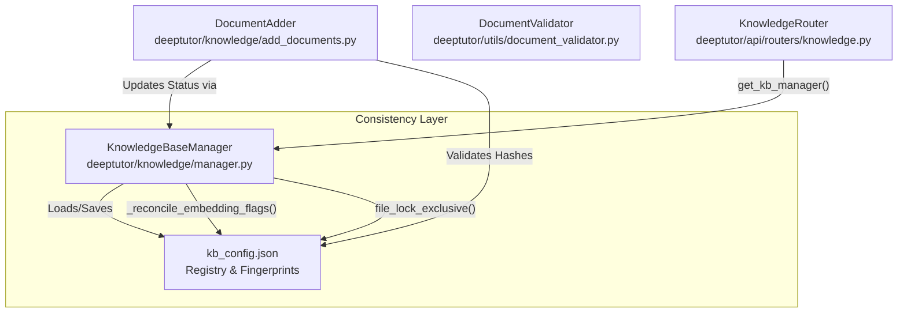
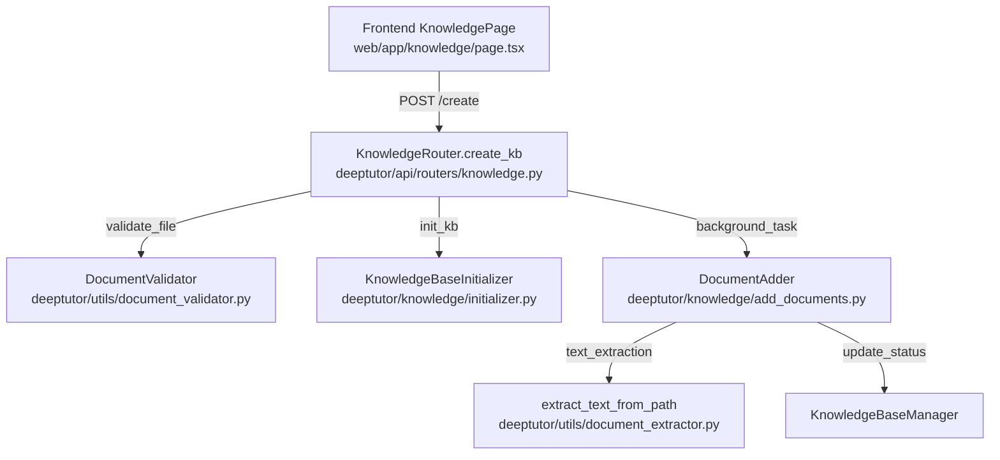

# Knowledge Base Management

<details>
<summary>Relevant source files</summary>

The following files were used as context for generating this wiki page:

- [deeptutor/api/routers/knowledge.py](deeptutor/api/routers/knowledge.py)
- [deeptutor/knowledge/manager.py](deeptutor/knowledge/manager.py)
- [tests/api/test_knowledge_router.py](tests/api/test_knowledge_router.py)
- [tests/knowledge/test_manager_get_info_status.py](tests/knowledge/test_manager_get_info_status.py)
- [web/app/(utility)/knowledge/page.tsx](web/app/(utility)/knowledge/page.tsx)

</details>


## Purpose and Scope

This document describes the knowledge base (KB) management system in DeepTutor, which handles the creation, maintenance, and organization of structured document repositories. Knowledge bases serve as the foundational data source for Retrieval-Augmented Generation (RAG) operations and various intelligent agent modules.

The system is managed primarily by the `KnowledgeBaseManager` [deeptutor/knowledge/manager.py:196-198](), which coordinates multiple RAG providers (primarily LlamaIndex) and ensures data consistency across the filesystem and configuration registries. This page covers KB initialization, document addition, directory structure conventions, and the management of versioned indices.

**Sources:** [deeptutor/knowledge/manager.py:1-23](), [deeptutor/knowledge/add_documents.py:1-22](), [deeptutor/api/routers/knowledge.py:1-6]()

---

## Knowledge Base Directory Structure

Each knowledge base follows a standardized directory layout under `./data/knowledge_bases/<kb_name>/`. The structure separates raw documents, processed content, and versioned search engine indices.

### Standard Directory Layout

```
data/knowledge_bases/
├── kb_config.json                    # Global KB registry and embedding fingerprints
└── <kb_name>/
    ├── metadata.json                 # KB metadata and creation history
    ├── raw/                          # Original documents (PDF, DOCX, etc.)
    ├── llamaindex_storage/           # Standard LlamaIndex persistence (legacy/fallback)
    ├── version-1/                    # Active index version (flat layout)
    │   ├── docstore.json             # LlamaIndex document store
    │   ├── index_store.json          # Index structure
    │   ├── default__vector_store.json# Vector embeddings
    │   └── meta.json                 # Version-specific embedding signature
    └── version-2/                    # Secondary version (e.g., during re-indexing)
```

| Directory/File | Purpose | Code Entity / Provider |
|----------------|---------|------------------------|
| `raw/` | Original source files | `DocumentAdder.raw_dir` [deeptutor/knowledge/add_documents.py:46]() |
| `version-N/` | Flat versioned storage for indices | `list_kb_versions` [deeptutor/knowledge/add_documents.py:19]() |
| `kb_config.json` | Global registry of all KBs | `KnowledgeBaseManager.config_file` [deeptutor/knowledge/manager.py:204]() |
| `metadata.json` | Creation timestamps and file hashes | `DocumentAdder.metadata_file` [deeptutor/knowledge/add_documents.py:49]() |

**Sources:** [deeptutor/knowledge/manager.py:199-204](), [deeptutor/knowledge/add_documents.py:39-52](), [tests/knowledge/test_manager_get_info_status.py:33-49]()

---

## Knowledge Base Management

### KnowledgeBaseManager Class

The `KnowledgeBaseManager` is the central authority for KB lifecycles. It handles the persistence of the global `kb_config.json` and manages the transition between different embedding models using a cross-platform file locking mechanism implemented via `file_lock_shared` and `file_lock_exclusive` [deeptutor/knowledge/manager.py:53-95]().

**System Entity Relationship Diagram**



**Sources:** [deeptutor/knowledge/manager.py:196-204](), [deeptutor/knowledge/manager.py:108-126](), [deeptutor/api/routers/knowledge.py:90-108]()

### Embedding Consistency and Status Promotion
A critical feature of the manager is `_reconcile_embedding_flags` [deeptutor/knowledge/manager.py:108-126](). It compares the active embedding model and dimension (the "fingerprint") against the stored metadata [deeptutor/knowledge/manager.py:97-105](). If a mismatch is detected, the KB is marked with `embedding_mismatch: true` and `needs_reindex: true` [deeptutor/knowledge/manager.py:184-188]().

The manager also handles **Status Promotion**: if a KB is stuck in a `processing` or `initializing` state in the config but a `ready` index version exists on disk, `get_info` automatically promotes the reported status to `ready` to prevent perpetual processing banners [tests/knowledge/test_manager_get_info_status.py:1-11](). This logic specifically ignores promotion if the progress stage is `error`, ensuring failures remain visible to users [tests/knowledge/test_manager_get_info_status.py:130-135]().

**Sources:** [deeptutor/knowledge/manager.py:108-193](), [tests/knowledge/test_manager_get_info_status.py:68-90](), [tests/knowledge/test_manager_get_info_status.py:130-150]()

---

## Document Ingestion Pipeline

The ingestion pipeline handles the transformation of raw bytes into indexable text while enforcing safety and size constraints.

### Validation and Safety
The `DocumentValidator` [deeptutor/utils/document_validator.py:13]() (referenced by the router) enforces strict limits:
* **Max File Size**: 100MB for general files [deeptutor/api/routers/knowledge.py:204]().
* **Allowed Extensions**: Supports a specific set of document and data formats including `.pdf`, `.docx`, `.md`, `.txt`, `.png`, etc. [deeptutor/api/routers/knowledge.py:117-128]().
* **Zip Safety**: The system supports `.zip` uploads, which are safely expanded using `safe_extract_zip` to prevent Zip Slip and zip-bomb attacks [deeptutor/api/routers/knowledge.py:185-201]().

### API and Routing
The `APIRouter` in `deeptutor/api/routers/knowledge.py` exposes endpoints for KB operations. It utilizes a `ProgressBroadcaster` to send real-time updates to the frontend during long-running tasks like indexing [deeptutor/api/routers/knowledge.py:31]().

**Ingestion Flow: Upload to Index**



**Sources:** [deeptutor/api/routers/knowledge.py:18-38](), [deeptutor/api/routers/knowledge.py:185-220](), [web/app/(utility)/knowledge/page.tsx:1-19](), [deeptutor/knowledge/add_documents.py:27-35]()

---

## Metadata and Progress Tracking

The system maintains detailed metadata to provide feedback in the UI and ensure incremental updates.

### Metadata Persistence
`metadata.json` inside each KB directory stores:
* `file_hashes`: Mapping of filenames to SHA256 hashes to prevent re-indexing unchanged files [deeptutor/knowledge/add_documents.py:170]().
* `rag_provider`: The provider used (e.g., `llamaindex`) [deeptutor/knowledge/add_documents.py:184]().
* `last_indexed_at`: Timestamp of the last successful indexing operation [deeptutor/knowledge/add_documents.py:187]().

### Numbered Items and Extraction
During ingestion, documents are processed by the `extract_text_from_path` utility [deeptutor/api/routers/knowledge.py:53-57](). This utility enforces a character limit (`MAX_EXTRACTED_CHARS_PER_DOC`) to ensure system stability when handling exceptionally large documents [deeptutor/api/routers/knowledge.py:54]().

**Sources:** [deeptutor/knowledge/add_documents.py:159-173](), [deeptutor/knowledge/add_documents.py:174-188](), [deeptutor/api/routers/knowledge.py:53-60](), [tests/api/test_knowledge_router.py:111-128]()
