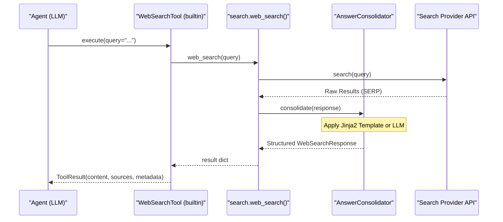

# Web Search and Other Tools

<details>
<summary>Relevant source files</summary>

The following files were used as context for generating this wiki page:

- [AGENTS.md](AGENTS.md)
- [SKILL.md](SKILL.md)
- [deeptutor/agents/_shared/tool_composition.py](deeptutor/agents/_shared/tool_composition.py)
- [deeptutor/agents/chat/agent_loop.py](deeptutor/agents/chat/agent_loop.py)
- [deeptutor/agents/chat/prompt_blocks.py](deeptutor/agents/chat/prompt_blocks.py)
- [deeptutor/agents/research/pipeline.py](deeptutor/agents/research/pipeline.py)
- [deeptutor/app/facade.py](deeptutor/app/facade.py)
- [deeptutor/capabilities/mastery_path.py](deeptutor/capabilities/mastery_path.py)
- [deeptutor/loop_plugins/__init__.py](deeptutor/loop_plugins/__init__.py)
- [deeptutor/loop_plugins/mastery/__init__.py](deeptutor/loop_plugins/mastery/__init__.py)
- [deeptutor/loop_plugins/mastery/plugin.py](deeptutor/loop_plugins/mastery/plugin.py)
- [deeptutor/services/search/__init__.py](deeptutor/services/search/__init__.py)
- [deeptutor/services/search/consolidation.py](deeptutor/services/search/consolidation.py)
- [deeptutor/services/search/providers/__init__.py](deeptutor/services/search/providers/__init__.py)
- [deeptutor/tools/builtin/__init__.py](deeptutor/tools/builtin/__init__.py)
- [deeptutor/tools/paper_search_tool.py](deeptutor/tools/paper_search_tool.py)
- [deeptutor/tools/web_search.py](deeptutor/tools/web_search.py)
- [web/lib/unified-ws.ts](web/lib/unified-ws.ts)

</details>


This page documents the tool integration layer components that provide external information retrieval, document processing, and code execution capabilities to the intelligent agent modules. These tools are managed via a unified `BaseTool` protocol [[deeptutor/core/tool_protocol.py:10-10]]() and registered within the system's tool registry.

The tools covered in this page include:
- **Web Search**: Real-time internet search with multi-provider support and automatic answer consolidation.
- **Paper Search**: Academic paper discovery via the ArXiv API.
- **Code Execution**: Sandboxed Python/C/C++ execution for computation and verification.
- **RAG Tool**: Knowledge base search using Retrieval-Augmented Generation.
- **Brainstorm Tool**: Exploratory topic expansion and rationale generation.
- **Mastery Tools**: Specialized tools for the Mastery Path learning engine.

## Tool Architecture Overview

The following diagram bridges the Natural Language Space (intent) to the Code Entity Space (implementation classes) within the `deeptutor.tools` module.

**Natural Language to Code Entity Mapping**
```mermaid
graph TB
    subgraph "NaturalLanguageSpace"
        ["'Search the web for...'"] --> REQ_SEARCH
        ["'Calculate the integral of...'"] --> REQ_CODE
        ["'Find recent papers on...'"] --> REQ_PAPER
        ["'What does the textbook say about...'"] --> REQ_RAG
        ["'Brainstorm ideas for...'"] --> REQ_BS
    end
    
    subgraph "CodeEntitySpace (deeptutor.tools.builtin)"
        WST["WebSearchTool"]
        CET["CodeExecutionTool"]
        RGT["RAGTool"]
        BST["BrainstormTool"]
        
        subgraph "InternalLogicServices"
            WS_FUNC["web_search.py: web_search()"]
            ET_CLASS["exec_tool.py: ExecTool"]
            PS_CLASS["paper_search_tool.py: ArxivSearchTool"]
            RG_FUNC["rag_tool.py: rag_search()"]
        end
    end

    subgraph "ExternalProvidersArtifacts"
        BRAVE["Brave / Tavily / Jina"]
        DDG["DuckDuckGo (Fallback)"]
        PERPLEXITY["Perplexity API"]
        ARXIV["ArXiv API"]
        SANDBOX["Sandbox Service"]
    end

    REQ_SEARCH --> WST
    REQ_CODE --> CET
    REQ_PAPER --> PS_CLASS
    REQ_RAG --> RGT
    REQ_BS --> BST

    WST --> WS_FUNC
    CET --> ET_CLASS
    RGT --> RG_FUNC
    
    WS_FUNC --> BRAVE
    WS_FUNC --> DDG
    WS_FUNC --> PERPLEXITY
    PS_CLASS --> ARXIV
    ET_CLASS --> SANDBOX
```

**Sources**: [[deeptutor/tools/builtin/__init__.py:1-203]](), [[deeptutor/tools/paper_search_tool.py:24-60]](), [[deeptutor/tools/exec_tool.py:1-20]]()

## Web Search Tool

The `WebSearchTool` class [[deeptutor/tools/builtin/__init__.py:116-153]]() provides a standardized interface for agents to query the internet. It leverages the `web_search` service to fetch results and return them with citations.

### Search Provider Management
The system supports a wide array of providers. Providers like Perplexity, Tavily, and Baidu generate answers natively, while others return raw Search Engine Result Pages (SERP) that require consolidation [[deeptutor/services/search/consolidation.py:25-27]]().

| Provider | Type | API Key Requirement | Description |
| :--- | :--- | :--- | :--- |
| **Brave/Tavily/Jina** | Professional | Required (falls back to DDG if missing) | High-quality search results [[deeptutor/services/search/__init__.py:113-119]]() |
| **Perplexity** | AI Answer | Strictly Required | Direct LLM-powered answers |
| **DuckDuckGo** | Zero-Config | None | Default fallback provider [[deeptutor/services/search/__init__.py:117-117]]() |
| **Serper** | SERP | Required | Google Search API results |

### Answer Consolidation
For providers that do not support native answer generation, the `AnswerConsolidator` [[deeptutor/services/search/consolidation.py:138-160]]() automatically formats raw results.
- **Template-based**: Uses Jinja2 templates specific to the provider (e.g., `serper`, `jina`, `serper_scholar`) [[deeptutor/services/search/consolidation.py:27-135]]().
- **LLM-based**: If `use_llm=True` is specified, the system uses an LLM to synthesize a coherent answer from search snippets [[deeptutor/services/search/consolidation.py:178-181]]().

**Search Data Flow**


**Sources**: [[deeptutor/tools/builtin/__init__.py:116-153]](), [[deeptutor/services/search/consolidation.py:138-189]]()

## Paper Search Tool

The `ArxivSearchTool` (aliased as `PaperSearchTool`) [[deeptutor/tools/paper_search_tool.py:24-207]]() is a dedicated utility for discovering preprints. It returns structured metadata specifically for academic papers.

### Key Functions and Configuration
- **`search_papers`**: Queries ArXiv with parameters for `max_results`, `years_limit` (default 3), and `sort_by` (relevance or date) [[deeptutor/tools/paper_search_tool.py:35-140]]().
- **`format_paper_citation`**: Generates standard "(Author et al., Year)" strings [[deeptutor/tools/paper_search_tool.py:142-159]]().
- **Rate Limiting**: Implements a `delay_seconds=3.0` and `num_retries=2` via the `arxiv.Client` to comply with ArXiv's usage policy [[deeptutor/tools/paper_search_tool.py:29-33]]().

**Sources**: [[deeptutor/tools/paper_search_tool.py:24-140]]()

## Code Execution Tool

The `CodeExecutionTool` [[deeptutor/tools/builtin/__init__.py:156-203]]() allows agents to compile and run code snippets in an isolated sandbox.

### Execution Environment
- **Languages**: Supports `python`, `c`, and `cpp` [[deeptutor/tools/builtin/__init__.py:171-175]]().
- **Isolation**: Commands run with the turn's workspace subdirectory as the current working directory (CWD) [[deeptutor/tools/builtin/__init__.py:169-170]]().
- **Sandboxing**: Inherits OS-level isolation and quotas from `deeptutor.services.sandbox` [[deeptutor/tools/builtin/__init__.py:163-164]]().

**Sources**: [[deeptutor/tools/builtin/__init__.py:156-203]]()

## RAG and Brainstorming Tools

### RAGTool
The `RAGTool` [[deeptutor/tools/builtin/__init__.py:67-114]]() interfaces with the system's Knowledge Base.
- **Implementation**: Calls `rag_search` to retrieve relevant passages from a specific `kb_name` attached to the turn [[deeptutor/tools/builtin/__init__.py:102-107]]().
- **Constraint**: The `kb_name` must be one of the knowledge bases explicitly attached by the user [[deeptutor/tools/builtin/__init__.py:81-82]]().

### BrainstormTool
The `BrainstormTool` [[deeptutor/tools/builtin/__init__.py:32-65]]() is used for divergent thinking.
- **Parameters**: Accepts `topic` and optional `context` [[deeptutor/tools/builtin/__init__.py:38-48]]().
- **Execution**: Calls the `brainstorm` service to explore multiple possibilities and provide rationales [[deeptutor/tools/builtin/__init__.py:55-63]]().

**Sources**: [[deeptutor/tools/builtin/__init__.py:32-114]]()

## Mastery Path Tools

The `MasteryPathCapability` mounts a specialized set of tools to drive adaptive learning [[deeptutor/capabilities/mastery_path.py:64-66]](). These tools are defined in the `MASTERY_TOOL_TYPES` registry [[deeptutor/tools/builtin/__init__.py:11-11]]().

- **`mastery_status`**: Checks the learner's current progress.
- **`mastery_quiz`**: Generates a targeted question to test knowledge.
- **`mastery_grade`**: deterministic engine call to decide whether the learner may advance [[deeptutor/capabilities/mastery_path.py:12-13]]().
- **`mastery_assess`**: Qualitative assessment of learner performance.
- **`mastery_build`**: Constructs or modifies the learning path.

**Sources**: [[deeptutor/capabilities/mastery_path.py:1-76]](), [[deeptutor/tools/builtin/__init__.py:11-11]]()
