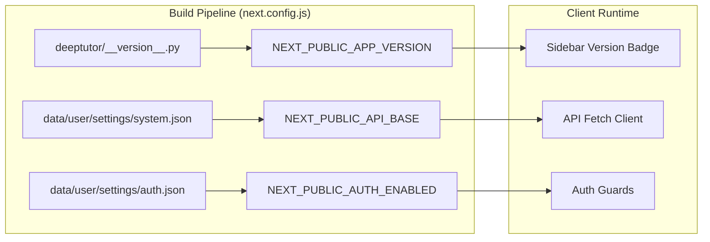
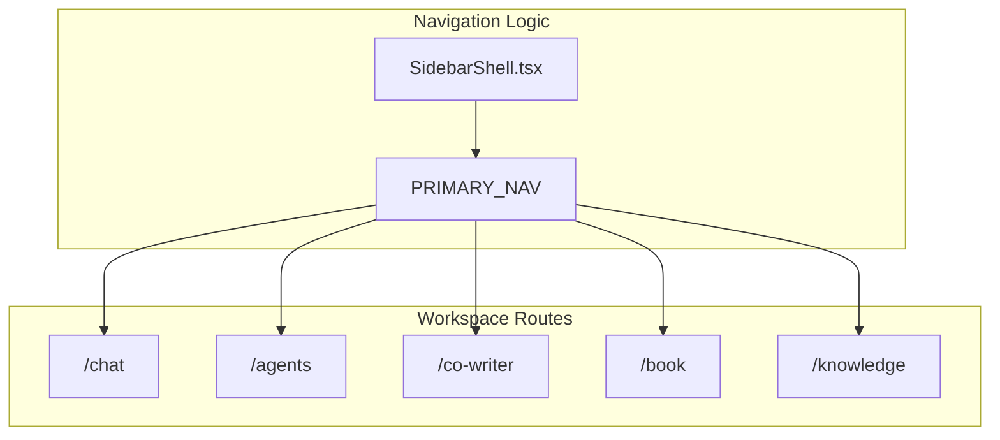

# Frontend Components

Relevant source files

The following files were used as context for generating this wiki page:

- [.github/workflows/docker-release.yml](.github/workflows/docker-release.yml)
- [web/eslint.config.mjs](web/eslint.config.mjs)
- [web/next-env.d.ts](web/next-env.d.ts)
- [web/next.config.js](web/next.config.js)
- [web/package-lock.json](web/package-lock.json)
- [web/package.json](web/package.json)

This page documents the React/Next.js frontend components and architecture. The frontend is built with Next.js 16+ using the App Router and provides web-based interfaces for all DeepTutor intelligent agent modules.

For details on specific areas, see the following child pages:
- [Page Components](#7.1) — Detailed implementation of Research, Question, Solver, and Settings pages.
- [Global State Management](#7.2) — GlobalContext, useGlobal hook, and state orchestration.
- [Theme System](#7.3) — Theme management and localStorage persistence.
- [Markdown Rendering and Export](#7.4) — ReactMarkdown, Mermaid, and PDF export pipeline.
- [Internationalization](#7.5) — i18n setup and translation parity.

---

## Overview

The frontend is a **Next.js 16.2.3** application using the App Router, TypeScript 5, and Tailwind CSS [web/package.json:34-58](). It provides specialized interfaces that interact with backend agents via REST APIs and WebSocket connections for real-time streaming updates.

**Key Technologies:**
- **React 19**: Modern UI library with concurrent rendering support [web/package.json:35-35]().
- **Next.js 16**: Utilizing the App Router and `output: "standalone"` for efficient Docker deployments [web/next.config.js:78-89]().
- **Tailwind CSS 3.4**: Utility-first styling for layout and themes [web/package.json:57-57]().
- **i18next**: Framework for internationalization and locale management [web/package.json:30-30]().
- **Visualization Suite**: Integration with `chart.js`, `cytoscape`, and `mermaid` for complex data rendering [web/package.json:23-33]().

---

## Application Architecture

The application follows a centralized state pattern where a provider wraps the component tree. The build configuration dynamically resolves the application version from the backend source of truth at `deeptutor/__version__.py` to ensure consistency across the stack [web/next.config.js:66-76]().

### Build and Environment Configuration

The frontend consumes settings from `data/user/settings/` at build time, allowing environment variables to act as overrides for Docker or CI environments [web/next.config.js:32-58]().

**Sources:** [web/next.config.js:32-85](), [web/package.json:34-46]()

---

## Component Ecosystem

DeepTutor utilizes a rich set of dependencies to handle agent-generated content, ranging from mathematical animations to complex document previews.

| Category | Libraries / Entities | Purpose |
|------|-------|---------|
| **Rendering** | `react-markdown`, `rehype-katex`, `mermaid` | Renders agentic output including LaTeX and diagrams [web/package.json:33-44](). |
| **Data Viz** | `chart.js`, `react-chartjs-2`, `cytoscape` | Interactive charts and knowledge graphs [web/package.json:23-36](). |
| **Export** | `jspdf`, `html2canvas`, `exceljs` | Client-side generation of PDF and Excel reports [web/package.json:15-31](). |
| **Animation** | `framer-motion` | Smooth UI transitions and agent state changes [web/package.json:28-28](). |

### Navigation and Shell Architecture

The frontend uses a structured navigation system that differentiates between primary workspace tools and secondary system settings.

**Sources:** [web/package.json:23-45](), [web/next.config.js:96-118]()

---

## Development and Quality Control

The frontend includes a robust suite of development tools to maintain code quality and internationalization standards.

- **i18n Audit Pipeline**: Custom scripts (`i18n_parity.mjs`, `i18n_audit.mjs`) ensure translation keys match across supported languages [web/package.json:14-17]().
- **Performance Budgets**: A `route_budgets.mjs` script tracks the bundle size and performance of specific routes [web/package.json:12-13]().
- **ESLint Integration**: Custom rules, such as `i18n/no-literal-ui-text`, prevent hardcoded strings in the UI [web/eslint.config.mjs:1-15]().
- **Testing**: Playwright-based UI audits and node-based script tests [web/package.json:18-20]().

For details, see [Internationalization](#7.5).

**Sources:** [web/package.json:5-21](), [web/eslint.config.mjs:1-19](), [web/next.config.js:1-121]()
