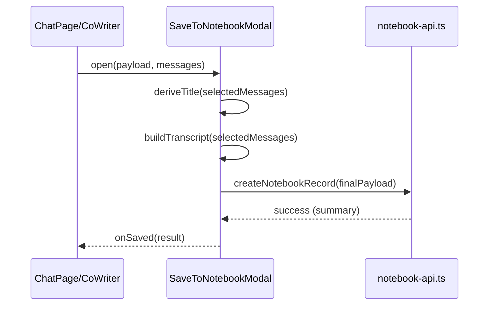

# Page Components

Relevant source files

The following files were used as context for generating this wiki page:

- [deeptutor/services/config/model_catalog.py](deeptutor/services/config/model_catalog.py)
- [deeptutor/services/config/provider_runtime.py](deeptutor/services/config/provider_runtime.py)
- [deeptutor/services/embedding/adapters/base.py](deeptutor/services/embedding/adapters/base.py)
- [deeptutor/services/embedding/adapters/openai_compatible.py](deeptutor/services/embedding/adapters/openai_compatible.py)
- [deeptutor/services/embedding/client.py](deeptutor/services/embedding/client.py)
- [deeptutor/services/embedding/config.py](deeptutor/services/embedding/config.py)
- [tests/services/config/test_embedding_runtime.py](tests/services/config/test_embedding_runtime.py)
- [tests/services/embedding/test_client_runtime.py](tests/services/embedding/test_client_runtime.py)
- [tests/services/embedding/test_extract_embeddings.py](tests/services/embedding/test_extract_embeddings.py)
- [web/app/(utility)/settings/page.tsx](web/app/(utility)/settings/page.tsx)
- [web/app/(workspace)/co-writer/[docId]/page.tsx](web/app/(workspace)/co-writer/[docId]/page.tsx)
- [web/app/(workspace)/playground/page.tsx](web/app/(workspace)/playground/page.tsx)
- [web/components/chat/home/ComposerInput.tsx](web/components/chat/home/ComposerInput.tsx)
- [web/components/chat/home/SimpleComposerInput.tsx](web/components/chat/home/SimpleComposerInput.tsx)
- [web/components/chat/preview/previewers/useTextSource.ts](web/components/chat/preview/previewers/useTextSource.ts)
- [web/components/notebook/SaveToNotebookModal.tsx](web/components/notebook/SaveToNotebookModal.tsx)
- [web/components/quiz/QuizConfigPanel.tsx](web/components/quiz/QuizConfigPanel.tsx)
- [web/components/research/ResearchConfigPanel.tsx](web/components/research/ResearchConfigPanel.tsx)
- [web/components/sidebar/BookRecent.tsx](web/components/sidebar/BookRecent.tsx)
- [web/components/visualize/VisualizeConfigPanel.tsx](web/components/visualize/VisualizeConfigPanel.tsx)
- [web/lib/co-writer-api.ts](web/lib/co-writer-api.ts)
- [web/lib/knowledge-api.ts](web/lib/knowledge-api.ts)
- [web/lib/notebook-api.ts](web/lib/notebook-api.ts)

This document describes the main page components in the DeepTutor web frontend. These are top-level Next.js page components that implement primary user interfaces: Chat (Universal Workspace), Co-Writer, TutorBot Interaction, Settings, and Knowledge Management. Each page manages local UI state while integrating with specialized WebSocket connections and backend services.

---

## Page Component Architecture

The frontend implements a unified workspace architecture where most capabilities (Deep Solve, Quiz Generation, Deep Research, etc.) are hosted within polymorphic Chat Pages or a specialized Playground. The Co-Writer system provides a specialized dual-pane editing experience, while Settings and Knowledge pages serve as utility interfaces for system configuration and data management.

### Component Map to Code Entities

The following diagram bridges the high-level page concepts to their specific implementation files and state providers.

Title: Frontend Page Entity Mapping

```mermaid
graph TB
    subgraph "Next.js_App_Directory"
        ChatRoute["/app/(workspace)/chat/[[...sessionId]]/page.tsx<br/>ChatPage Component"]
        PlaygroundRoute["/app/(workspace)/playground/page.tsx<br/>PlaygroundPage Component"]
        CoWriterRoute["/app/(workspace)/co-writer/[docId]/page.tsx<br/>CoWriterPage Component"]
        KnowledgeRoute["/app/(utility)/knowledge/page.tsx<br/>KnowledgePage Component"]
        SettingsRoute["/app/(utility)/settings/page.tsx<br/>SettingsIndexPage Component"]
    end
    
    subgraph "State_Providers_&_Hooks"
        UnifiedContext["UnifiedChatContext.tsx<br/>useUnifiedChat()"]
        AutoScroll["useChatAutoScroll.ts<br/>useChatAutoScroll()"]
        ComposerRef["ComposerInput.tsx<br/>ComposerInputHandle"]
    end
    
    subgraph "Specialized_Config_Panels"
        QuizConfig["QuizConfigPanel.tsx"]
        ResearchConfig["ResearchConfigPanel.tsx"]
        VizConfig["VisualizeConfigPanel.tsx"]
    end
    
    subgraph "Communication_Layer"
        WSUnified["ws://.../api/v1/ws<br/>Unified WebSocket"]
        KnowledgeAPI["knowledge-api.ts<br/>listKnowledgeBases()"]
        CoWriterAPI["co-writer-api.ts<br/>updateCoWriterDocument()"]
    end
    
    ChatRoute --> UnifiedContext
    ChatRoute --> AutoScroll
    PlaygroundRoute --> QuizConfig
    PlaygroundRoute --> ResearchConfig
    ChatRoute -- "Configures" --> VizConfig
    
    ChatRoute -- "Manages" --> WSUnified
    KnowledgeRoute -- "Fetches" --> KnowledgeAPI
    CoWriterRoute -- "Updates" --> CoWriterAPI
    CoWriterRoute -- "Renders" --> MarkdownRenderer["MarkdownRenderer.tsx"]
```

**Sources:** [web/app/(workspace)/playground/page.tsx:31-53](), [web/app/(workspace)/co-writer/[docId]/page.tsx:148-160](), [web/app/(utility)/settings/page.tsx:1-5](), [web/components/chat/home/ComposerInput.tsx:69-79](), [web/lib/knowledge-api.ts:95-113]()

---

## Workspace and Playground Components

### Capability Playground (`PlaygroundPage`)
The Playground serves as a technical testing environment for individual agent capabilities without the overhead of full session persistence [web/app/(workspace)/playground/page.tsx:1-111]().
- **Tool Testing**: Allows direct execution of atomic tools like `web_search`, `rag`, and `code_execution` [web/app/(workspace)/playground/page.tsx:59-66]().
- **Config persistence**: Uses `loadCapabilityPlaygroundConfigs` and `saveCapabilityPlaygroundConfig` to persist UI settings across reloads [web/app/(workspace)/playground/page.tsx:41-45]().
- **Trace Visualization**: Implements a `TracePanel` to visualize the internal event stream (`thinking`, `tool_call`, `tool_result`) of an agent run [web/app/(workspace)/playground/page.tsx:228-251]().

### Chat Composer (`ComposerInput`)
The primary input mechanism for all conversational pages, supporting rich interaction patterns [web/components/chat/home/ComposerInput.tsx:106-131]().
- **Slash Commands**: Detects `/persona` at the start of input to trigger session persona selection [web/components/chat/home/ComposerInput.tsx:96-104]().
- **At-Mentions**: Supports `@` mentions for selecting specific knowledge bases or notebooks [web/components/chat/home/ComposerInput.tsx:81-84]().
- **Auto-Sizing**: Uses `useAutoSizedTextarea` to grow the input field as the user types [web/components/chat/home/ComposerInput.tsx:177]().

**Sources:** [web/app/(workspace)/playground/page.tsx:1-251](), [web/components/chat/home/ComposerInput.tsx:1-205]()

---

## Specialized Page Components

### Co-Writer Page (`CoWriterPage`)
A dual-pane Markdown editor designed for AI-assisted writing and document refinement [web/app/(workspace)/co-writer/[docId]/page.tsx:148-220]().
- **Selection Edits**: Users can select a text range to trigger a floating popover for `rewrite`, `shorten`, or `expand` operations [web/app/(workspace)/co-writer/[docId]/page.tsx:82-98]().
- **Sync Scroll**: Implements bi-directional scroll synchronization between the editor textarea and the Markdown preview pane [web/app/(workspace)/co-writer/[docId]/page.tsx:76]().
- **Local Persistence**: Maintains a local draft via `LOCAL_DRAFT_PREFIX` in `localStorage` to prevent data loss before the `AUTOSAVE_DEBOUNCE_MS` timer triggers a backend sync [web/app/(workspace)/co-writer/[docId]/page.tsx:77-78]().

### Configuration Panels
Individual capabilities use modular configuration panels that can be embedded in both the main Chat Activity panel and the Playground.
- **QuizConfigPanel**: Manages question counts, difficulty, and specialized modes like "Mimic Paper" which requires a PDF upload [web/components/quiz/QuizConfigPanel.tsx:102-186]().
- **VisualizeConfigPanel**: Configures rendering modes including `chartjs`, `mermaid`, and `manim_video` [web/components/visualize/VisualizeConfigPanel.tsx:26-65]().

**Sources:** [web/app/(workspace)/co-writer/[docId]/page.tsx:63-221](), [web/components/quiz/QuizConfigPanel.tsx:1-186](), [web/components/visualize/VisualizeConfigPanel.tsx:1-65]()

---

## Notebook and Knowledge Integration

### Save to Notebook (`SaveToNotebookModal`)
Allows users to persist conversation segments or capability outputs into their personal notebook [web/components/notebook/SaveToNotebookModal.tsx:146-152]().
- **Transcript Rebuilding**: When provided with a message list, it allows users to pick specific turns. The final user query and transcript are rebuilt from the selection subset using `buildTranscript` and `buildUserQuery` [web/components/notebook/SaveToNotebookModal.tsx:90-110]().
- **Title Derivation**: Automatically suggests a title based on the first selected user message [web/components/notebook/SaveToNotebookModal.tsx:111-119]().

### Knowledge Management (`KnowledgePage`)
A utility page for managing RAG (Retrieval-Augmented Generation) sources [web/lib/knowledge-api.ts:1-20]().
- **Upload Policy**: Enforces file extensions and size limits (e.g., `max_file_size_bytes`) fetched from the backend [web/lib/knowledge-api.ts:28-33]().
- **Cache Management**: Uses `withClientCache` to manage knowledge base lists and file inventories efficiently [web/lib/knowledge-api.ts:96-113]().

Title: Notebook Saving Data Flow

**Sources:** [web/components/notebook/SaveToNotebookModal.tsx:1-233](), [web/lib/knowledge-api.ts:1-155](), [web/lib/notebook-api.ts:1-20]()
