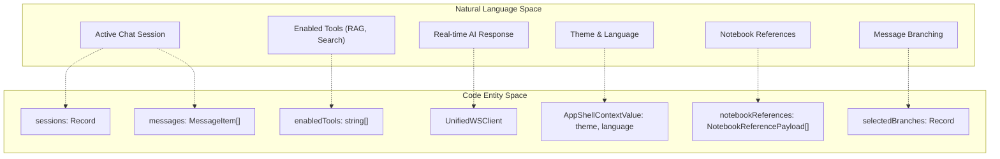
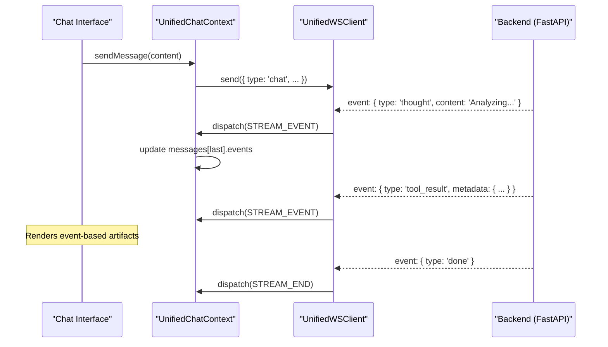

# Global State Management

Relevant source files

The following files were used as context for generating this wiki page:

- [deeptutor/api/routers/sessions.py](deeptutor/api/routers/sessions.py)
- [deeptutor/services/session/sqlite_store.py](deeptutor/services/session/sqlite_store.py)
- [deeptutor/services/storage/attachment_store.py](deeptutor/services/storage/attachment_store.py)
- [tests/services/session/test_sqlite_store.py](tests/services/session/test_sqlite_store.py)
- [web/app/(workspace)/chat/[[...sessionId]]/page.tsx](web/app/(workspace)/chat/[[...sessionId]]/page.tsx)
- [web/app/(workspace)/co-writer/page.tsx](web/app/(workspace)/co-writer/page.tsx)
- [web/components/chat/home/ChatMessages.tsx](web/components/chat/home/ChatMessages.tsx)
- [web/context/AppShellContext.tsx](web/context/AppShellContext.tsx)
- [web/context/UnifiedChatContext.tsx](web/context/UnifiedChatContext.tsx)
- [web/context/app-shell-storage.ts](web/context/app-shell-storage.ts)

## Purpose and Scope

This document describes the global state management system implemented in the DeepTutor frontend. The system provides centralized state orchestration for intelligent agent modules, WebSocket connections, session persistence, and UI settings. It utilizes React Context and a reducer pattern to manage complex data flows between the Next.js frontend and the FastAPI backend, ensuring consistent state across the workspace.

---

## Architecture Overview

DeepTutor employs a multi-context approach to manage different layers of state. While `AppShellContext` handles foundational UI and environment settings, the `UnifiedChatContext` serves as the primary engine for session-based agent interactions, real-time streaming, and edit-branching logic.

### Core Context Providers

The system is anchored by several key providers wrapping the application:

| Component | File | Purpose |
|-----------|------|---------|
| `AppShellContext` | [web/context/AppShellContext.tsx:35-44]() | Manages top-level shell state including theme, language, and sidebar collapse status. |
| `UnifiedChatContext` | [web/context/UnifiedChatContext.tsx:83-100]() | Orchestrates multi-session chat, streaming events, tool configurations, and capability switching. |

### Context and Entity Mapping

The following diagram bridges UI concepts to the specific code entities that manage them.

**Sources:** [web/context/UnifiedChatContext.tsx:83-100](), [web/context/AppShellContext.tsx:35-44](), [web/context/UnifiedChatContext.tsx:157-166]()

---

## Unified Chat State Management

The `UnifiedChatContext` uses a `useReducer` pattern to manage asynchronous streaming data and multi-session history across various capabilities (Deep Solve, Research, etc.).

### State Structure

The state is organized into a `ProviderState` containing a map of `SessionEntry` objects [web/context/UnifiedChatContext.tsx:168-172]().

- **SessionEntry**: Represents a single conversation thread, including its `sessionId`, `messages`, `status` (idle/running/completed/failed), and `activeCapability` [web/context/UnifiedChatContext.tsx:157-166]().
- **MessageItem**: Contains the role, content, and an array of `StreamEvent` objects representing the "thought process" or tool calls associated with that message [web/context/UnifiedChatContext.tsx:145-155]().
- **Edit-Branching**: Managed via `selectedBranches`, which maps a `parent_message_id` (stringified or "null") to the chosen child ID at that branch point [web/context/UnifiedChatContext.tsx:164-165]().
- **MessageRequestSnapshot**: Captures the exact state of tools, knowledge bases, and references (Notebook, History, Book) at the time a message was sent [web/context/UnifiedChatContext.tsx:128-143]().

### Action Dispatching

State updates are handled via a central `reducer` function. Key actions include:
- `ADD_USER_MSG`: Appends a user message and attaches current request snapshots [web/context/UnifiedChatContext.tsx:181-189]().
- `STREAM_START`: Initializes the streaming state for a specific session key [web/context/UnifiedChatContext.tsx:192]().
- `STREAM_EVENT`: Processes incoming chunks or metadata from the WebSocket [web/context/UnifiedChatContext.tsx:193]().
- `LOAD_SESSION`: Hydrates a session from the backend API, including its messages and branch selections [web/context/UnifiedChatContext.tsx:207-221]().
- `SET_SELECTED_BRANCH`: Updates the chosen path in a multi-branch conversation [web/context/UnifiedChatContext.tsx:226-230]().

**Sources:** [web/context/UnifiedChatContext.tsx:174-235]()

---

## WebSocket and Event Orchestration

DeepTutor uses a unified WebSocket protocol via `UnifiedWSClient` [web/context/UnifiedChatContext.tsx:21]() to bridge frontend state with backend agent execution.

### Streaming Data Flow

The flow ensures that UI components can render intermediate results (like Research Outlines or Visualizations) as they arrive via the `events` array [web/context/UnifiedChatContext.tsx:150]().

**Sources:** [web/context/UnifiedChatContext.tsx:20-21](), [web/context/UnifiedChatContext.tsx:192-199]()

---

## Persistence and Shell State

The `AppShellContext` manages state that must persist across the entire application lifecycle, often synchronized with `localStorage` or `sessionStorage`.

### Storage Synchronization

The system uses `app-shell-storage.ts` to manage browser-level persistence [web/context/app-shell-storage.ts:5-11]().

- **Theme**: Persisted in `localStorage` and managed via `applyThemePreference` [web/context/AppShellContext.tsx:117-120]().
- **Language**: Synchronized via `LANGUAGE_EVENT` to ensure i18next and UI stay in sync [web/context/AppShellContext.tsx:122-125]().
- **Active Session**: Tracked in `sessionStorage` via `ACTIVE_SESSION_STORAGE_KEY` [web/context/app-shell-storage.ts:5-9]() so that refreshing a tab maintains the current conversation context [web/context/app-shell-storage.ts:42-49]().
- **Sidebar**: State is stored as "1" (collapsed) or "0" (expanded) in `localStorage` [web/context/app-shell-storage.ts:78-84]().

### Backend Persistence (SQLite)

The frontend state is backed by `SQLiteSessionStore` on the server [deeptutor/services/session/sqlite_store.py:77]().
- **Sessions**: Stores titles and `preferences_json` (including branch selections) [deeptutor/services/session/sqlite_store.py:104-112]().
- **Messages**: Stores content, capability, and `parent_message_id` for branching [deeptutor/services/session/sqlite_store.py:114-129]().
- **Attachments**: Managed via `AttachmentStore`, returning public URLs for the frontend [deeptutor/services/storage/attachment_store.py:64-70]().
- **Truncation**: The API router `_truncate_oversized_events` caps oversized `tool_result` payloads to ensure frontend performance while preserving the full content in the backend store [deeptutor/api/routers/sessions.py:100-132]().

**Sources:** [web/context/AppShellContext.tsx:48-135](), [web/context/app-shell-storage.ts:1-93](), [deeptutor/services/session/sqlite_store.py:100-150](), [deeptutor/api/routers/sessions.py:100-132]()

---

## Specialized State Modules

Beyond global chat, several pages manage their own complex lifecycles while referencing global identifiers.

| Module | File | State Responsibility |
|--------|------|----------------------|
| **Co-Writer** | [web/app/(workspace)/co-writer/page.tsx:34-40]() | Manages document summaries, loading states, and draft deletion lifecycles. |
| **Attachments** | [deeptutor/services/storage/attachment_store.py:103-110]() | Handles local disk persistence and path sanitization for uploaded files via `LocalDiskAttachmentStore`. |
| **Chat Auto-Scroll** | [web/app/(workspace)/chat/[[...sessionId]]/page.tsx:72]() | Manages UI scroll position during real-time streaming using `useChatAutoScroll`. |

### Hook Integration

| Hook | Source | Usage |
|------|--------|-------|
| `useAppShell` | [web/context/AppShellContext.tsx:167-173]() | Access/Modify theme, language, and sidebar status. |
| `useTranslation` | [web/app/(workspace)/co-writer/page.tsx:5]() | Accesses internationalization state managed via the shell's language setting. |
| `useUnifiedChat` | [web/context/UnifiedChatContext.tsx:55-58]() | Access session messages, tool state, and send message functions via `UnifiedChatContext`. |

**Sources:** [web/context/AppShellContext.tsx:167-173](), [web/app/(workspace)/co-writer/page.tsx:32-53](), [deeptutor/services/storage/attachment_store.py:103-110]()
