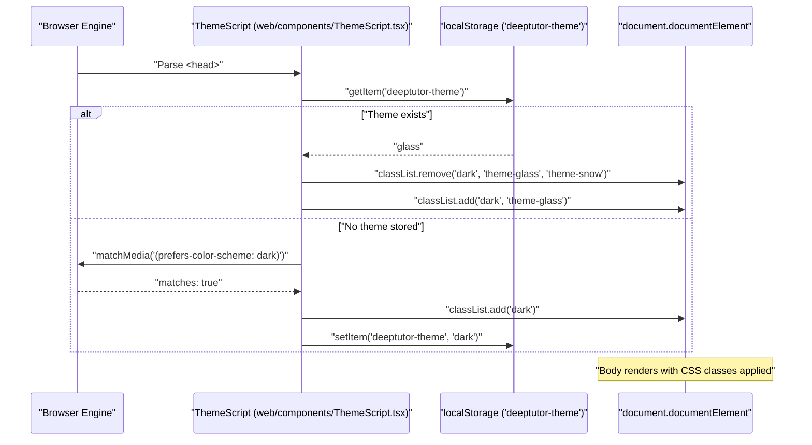
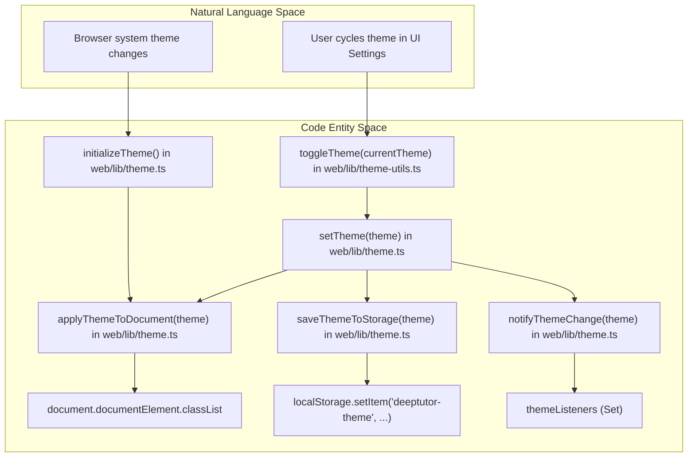

# Theme System

Relevant source files

The following files were used as context for generating this wiki page:

- [assets/roster/forkers.svg](assets/roster/forkers.svg)
- [assets/roster/stargazers.svg](assets/roster/stargazers.svg)
- [web/app/(workspace)/book/page.tsx](web/app/(workspace)/book/page.tsx)
- [web/app/layout.tsx](web/app/layout.tsx)
- [web/components/ThemeScript.tsx](web/components/ThemeScript.tsx)
- [web/lib/debounce.ts](web/lib/debounce.ts)
- [web/lib/theme-utils.ts](web/lib/theme-utils.ts)
- [web/lib/theme.ts](web/lib/theme.ts)

## Purpose and Scope

The DeepTutor theme system provides a robust mechanism for managing visual modes, extending beyond simple light/dark toggles to include specialized themes like `glass` and `snow` [web/lib/theme.ts:6](). It is designed to ensure a seamless user experience by preventing the "Flash of Unstyled Content" (FOUC) during initial page loads and providing persistent synchronization across browser sessions using `localStorage` [web/lib/theme.ts:2-4](). The system leverages Tailwind CSS's class-based strategy and integrates directly into the Next.js layout via a blocking initialization script [web/app/layout.tsx:43-49]().

---

## Architecture Overview

The theme system is composed of three primary layers:
1.  **Blocking Initialization (`ThemeScript`)**: An inline script that executes before React hydration to set the initial theme based on stored preferences or system settings [web/components/ThemeScript.tsx:10-41]().
2.  **Persistence Layer (`theme.ts`)**: Core utilities for interacting with `localStorage`, the browser's `matchMedia` API, and manual pub-sub listeners [web/lib/theme.ts:8-126]().
3.  **Extended Utilities (`theme-utils.ts`)**: Helper functions for common UI tasks like cycling through multiple themes and cross-tab synchronization [web/lib/theme-utils.ts:6-81]().

### System Components and Roles

| Component | File Path | Role |
| :--- | :--- | :--- |
| `ThemeScript` | [web/components/ThemeScript.tsx:10-49]() | Injected into `<head>` as a Server Component to prevent theme flashing [web/components/ThemeScript.tsx:5-9](). |
| `theme.ts` | [web/lib/theme.ts:1-127]() | Core logic for applying, saving, and subscribing to theme changes. |
| `theme-utils.ts` | [web/lib/theme-utils.ts:1-82]() | High-level helpers for UI components (cycling themes, color helpers). |
| `RootLayout` | [web/app/layout.tsx:35-61]() | Injects the `ThemeScript` and applies base font variables and background classes [web/app/layout.tsx:45-51](). |

**Sources:** [web/lib/theme.ts:1-11](), [web/components/ThemeScript.tsx:1-9](), [web/lib/theme-utils.ts:1-4](), [web/app/layout.tsx:4-49]()

---

## Implementation Details

### FOUC Prevention with ThemeScript
To avoid a white flash when a user has a non-default theme enabled, the `ThemeScript` component injects a raw JavaScript string into the document's `<head>` [web/components/ThemeScript.tsx:43-48](). This script must be a Server Component to ensure it is inlined into the SSR HTML so the browser executes it before hydration [web/components/ThemeScript.tsx:5-9]().

**Theme Application Logic:**
*   **`dark`**: Adds `.dark` class [web/components/ThemeScript.tsx:19]().
*   **`glass`**: Adds `.dark` and `.theme-glass` classes [web/components/ThemeScript.tsx:21]().
*   **`snow`**: Adds `.theme-snow` class [web/components/ThemeScript.tsx:23]().
*   **Default/Fallback**: If no theme is stored, it checks `window.matchMedia('(prefers-color-scheme: dark)')`. If dark mode matches, it adds `.dark`; otherwise, it defaults to `.theme-snow` [web/components/ThemeScript.tsx:27-35]().

**Theme Initialization Sequence:**

**Sources:** [web/components/ThemeScript.tsx:11-41](), [web/lib/theme.ts:84-98](), [web/app/layout.tsx:41-53]()

### Theme State Management
The system uses a manual pub-sub pattern to notify listeners of theme changes without requiring a heavy context provider for simple utility functions [web/lib/theme.ts:10-11]().

*   **`subscribeToThemeChanges`**: Allows components to register a `ThemeChangeListener` [web/lib/theme.ts:16-21]().
*   **`setTheme`**: The primary entry point. It calls `applyThemeToDocument`, `saveThemeToStorage`, and `notifyThemeChange` [web/lib/theme.ts:122-126]().
*   **`applyThemeToDocument`**: Directly manipulates `document.documentElement.classList` to add or remove specific theme identifiers [web/lib/theme.ts:84-98]().
*   **`initializeTheme`**: Orchestrates initial startup by checking `localStorage` first via `getStoredTheme`, then falling back to system preferences via `getSystemTheme` [web/lib/theme.ts:104-117]().

**Sources:** [web/lib/theme.ts:10-28](), [web/lib/theme.ts:84-98](), [web/lib/theme.ts:104-126]()

---

## Theme Utilities and Helpers

The `theme-utils.ts` file provides simplified abstractions for common frontend patterns.

### Functional Helpers
*   **`toggleTheme`**: Cycles through themes in a specific circular order: `snow` -> `light` -> `dark` -> `glass` [web/lib/theme-utils.ts:11-17]().
*   **`onThemeChange`**: Listens for the browser `storage` event to synchronize theme changes across multiple open tabs of the same application [web/lib/theme-utils.ts:62-81]().

### Style Mapping
These functions return Tailwind-compatible strings or CSS classes based on the active theme:
*   **`getThemeClass`**: Maps a `Theme` type to its corresponding CSS class string (e.g., `glass` maps to `"dark theme-glass"`) [web/lib/theme-utils.ts:36-41]().
*   **`getTextColorForTheme`**: Returns specific slate text colors based on the theme [web/lib/theme-utils.ts:46-50]().
*   **`getBackgroundForTheme`**: Returns background utility classes like `bg-white` or `dark:bg-slate-800` [web/lib/theme-utils.ts:55-57]().

**Sources:** [web/lib/theme-utils.ts:11-17](), [web/lib/theme-utils.ts:36-57](), [web/lib/theme-utils.ts:62-81]()

---

## Data Flow: Theme Selection to Persistence

The following diagram maps the flow from user interaction to the underlying code entities and browser storage.

**Sources:** [web/lib/theme.ts:11-28](), [web/lib/theme.ts:56-66](), [web/lib/theme.ts:84-98](), [web/lib/theme.ts:104-126](), [web/lib/theme-utils.ts:11-17]()

---

## LocalStorage Schema

The theme system relies on a specific key in the browser's `localStorage` to maintain state across reloads.

| Key | Value Type | Allowed Values |
| :--- | :--- | :--- |
| `deeptutor-theme` | `string` | `"light"`, `"dark"`, `"glass"`, `"snow"` [web/lib/theme.ts:6-8]() |

**Sources:** [web/lib/theme.ts:6-8](), [web/components/ThemeScript.tsx:14-24]()
