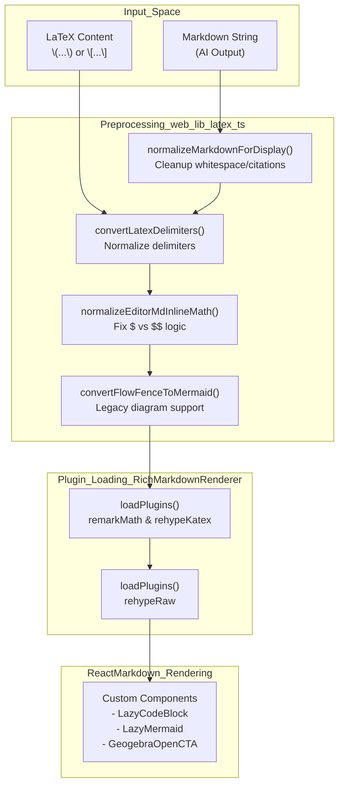
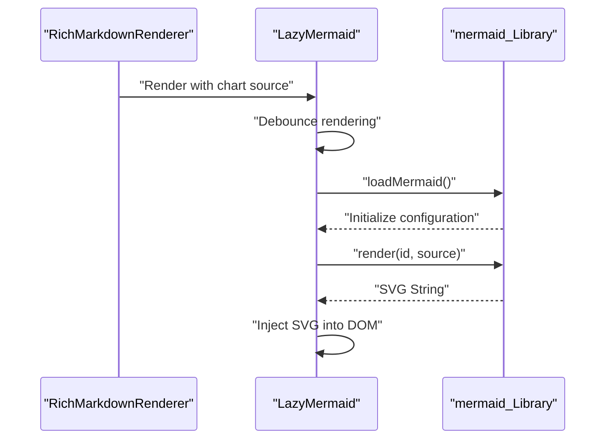

# Markdown Rendering and Export

Relevant source files

The following files were used as context for generating this wiki page:

- [web/components/common/RichMarkdownRenderer.tsx](web/components/common/RichMarkdownRenderer.tsx)
- [web/components/common/SimpleMarkdownRenderer.tsx](web/components/common/SimpleMarkdownRenderer.tsx)
- [web/lib/latex.ts](web/lib/latex.ts)
- [web/lib/markdown-display.ts](web/lib/markdown-display.ts)
- [web/tests/markdown-display.test.ts](web/tests/markdown-display.test.ts)

## Purpose and Scope

This page documents the markdown rendering and PDF export systems in DeepTutor's frontend. The system provides rich content display with support for mathematical formulas, diagrams, tables, and collapsible sections, as well as high-quality PDF export capabilities. This covers:

- **ReactMarkdown configuration** with a plugin ecosystem.
- **Mathematical formula rendering** using KaTeX and delimiter normalization.
- **Mermaid diagram integration** for visualizations, including conversion from legacy formats.
- **Markdown Normalization** for handling AI-generated content and citations.
- **Custom component overrides** for enhanced rendering and trace views.

For theme-related styling, see [7.3 Theme System](). For state management of rendered content, see [7.2 Global State Management]().

---

## Markdown Rendering Architecture

### Core Dependencies

The markdown rendering system is built on a stack of interoperable NPM packages that transform markdown through a unified processing pipeline.

| Package | Purpose |
|---------|---------|
| `react-markdown` | Core markdown-to-React renderer. |
| `remark-gfm` | GitHub Flavored Markdown (tables, task lists). |
| `remark-math` | Parse math syntax in markdown. |
| `rehype-katex` | Render math expressions with KaTeX. |
| `rehype-raw` | Allow raw HTML in markdown. |
| `mermaid` | Diagram rendering engine. |

**Sources:** [web/components/common/RichMarkdownRenderer.tsx:4-8](), [web/components/common/SimpleMarkdownRenderer.tsx:4-5]()

---

### Markdown Processing Pipeline

The pipeline transforms raw AI output into a structured React component tree. Before the markdown is passed to `ReactMarkdown`, it undergoes normalization and cleaning.

**Markdown Processing Flow**

**Sources:** [web/lib/latex.ts:16-51](), [web/lib/latex.ts:195-246](), [web/components/common/RichMarkdownRenderer.tsx:162-168](), [web/components/common/RichMarkdownRenderer.tsx:31-44]()

---

## Renderer Implementations

DeepTutor utilizes two primary rendering components depending on the context: `RichMarkdownRenderer` for user-facing content and `SimpleMarkdownRenderer` for internal trace logs.

### RichMarkdownRenderer

This is the high-fidelity renderer used in primary pages. It supports dynamic loading of plugins to optimize initial bundle size.

- **Dynamic Plugin Loading**: Plugins like `remark-math`, `rehype-katex`, and `rehype-raw` are loaded asynchronously in a `loadPlugins` function within a `useEffect` hook [web/components/common/RichMarkdownRenderer.tsx:180-210]().
- **Lazy Components**: Uses `next/dynamic` for `LazyMermaid`, `LazyCodeBlock`, and `GeogebraOpenCTA` to defer loading of heavy visualization libraries [web/components/common/RichMarkdownRenderer.tsx:31-44]().
- **Source Line Tracking**: Supports `trackSourceLines` prop. When enabled, it bypasses aggressive normalization via `escapeUnknownHtmlTagsForDisplay` to preserve line counts so that AST positions stay faithful for scroll sync [web/components/common/RichMarkdownRenderer.tsx:156-168](). It exposes `data-source-line` attributes via the `sourceLineAttr` helper [web/components/common/RichMarkdownRenderer.tsx:109-115]().
- **Heading IDs**: Automatically generates slugified IDs for headings using `headingId` and `extractText` helpers to support anchor linking [web/components/common/RichMarkdownRenderer.tsx:52-74]().

**Sources:** [web/components/common/RichMarkdownRenderer.tsx:1-210]()

### SimpleMarkdownRenderer

Used for "trace" views (e.g., agent internal thought processes). It focuses on performance and a compact UI.

- **Variant Support**: Supports `trace`, `compact`, and `default` variants. The `traceComponents` mapping adjusts padding (`cellPad`) and margins (`gap`) specifically for internal logs [web/components/common/SimpleMarkdownRenderer.tsx:79-87](), [web/components/common/SimpleMarkdownRenderer.tsx:89-184]().
- **Header Stripping**: Automatically removes leading hashes from headers when they appear in compact lists via the `stripLeadingHashes` utility [web/components/common/SimpleMarkdownRenderer.tsx:61-68]().
- **Filtered Elements**: Explicitly nullifies or simplifies elements like `img`, `progress`, `button`, and `textarea` to maintain a clean trace log [web/components/common/SimpleMarkdownRenderer.tsx:131](), [web/components/common/SimpleMarkdownRenderer.tsx:174-179]().

**Sources:** [web/components/common/SimpleMarkdownRenderer.tsx:1-184]()

---

## Content Normalization and Security

### Markdown Display Utilities (`web/lib/markdown-display.ts`)

Before rendering, markdown is processed to handle common LLM output artifacts and ensure security.

- **HTML Sanitization**: `ALLOWED_HTML_TAGS` defines a whitelist of structural and text-level tags [web/lib/markdown-display.ts:27-136](). Unknown tags (like LLM pseudo-tags `<think>` or `<search>`) are escaped into inline code spans [web/lib/markdown-display.ts:213-233]().
- **Citation Linking**: `normalizeMarkdownForDisplay` automatically linkifies bare citations (e.g., `[1]`) and research-specific IDs (e.g., `[CIT-1-01]`) to their corresponding reference list entries [web/tests/markdown-display.test.ts:36-50]().
- **URL Transformation**: `markdownUrlTransform` implements a strict policy, allowing only specific protocols (`https`, `mailto`, etc.) and permitting raster data images (PNG/JPG base64) only on `` tags for self-contained KB previews [web/lib/markdown-display.ts:175-203]().
- **Empty Block Removal**: Aggressively removes empty tables, empty details/summary blocks, and empty form control placeholders often left behind by AI models [web/lib/markdown-display.ts:4-16](), [web/tests/markdown-display.test.ts:10-29]().

**Sources:** [web/lib/markdown-display.ts:1-233](), [web/tests/markdown-display.test.ts:1-153]()

---

## Mathematical Formula Rendering

Mathematical expressions are typeset using KaTeX. The system supports various AI-generated LaTeX formats and normalizes them for compatibility with `remark-math`.

### Normalization Logic (`web/lib/latex.ts`)

The `convertLatexDelimiters` function handles the following transformations:
- **Block Math**: Converts `\[ ... \]` to `$$ ... $$` [web/lib/latex.ts:33-35]().
- **Inline Math**: Converts `\( ... \)` to `$ ... $` [web/lib/latex.ts:39-41]().
- **Nested Delimiters**: Strips `\( ... \)` if they are wrapped inside `$$ ... $$` to avoid double-rendering [web/lib/latex.ts:23-28]().
- **Loose Blocks**: The `normalizeEditorMdInlineMath` function promotes single-line `$` math to `$$` blocks if the content contains complex LaTeX symbols identified by `LIKELY_LATEX_BLOCK_RE` [web/lib/latex.ts:57-66](), [web/lib/latex.ts:85-93]().

**Sources:** [web/lib/latex.ts:16-114]()

---

## Diagram Rendering

### Mermaid Integration

The system uses a lazy-loaded `Mermaid` component to render diagrams.

**Mermaid Rendering Lifecycle**

- **Loading State**: Displays a `MermaidLoading` component while the library or diagram is being processed [web/components/common/RichMarkdownRenderer.tsx:22-29]().
- **Code Block Detection**: Code blocks with the language `mermaid` are intercepted and passed to the `LazyMermaid` component [web/components/common/RichMarkdownRenderer.tsx:31-34]().

**Sources:** [web/components/common/RichMarkdownRenderer.tsx:22-34]()

### Legacy Flowchart Support

DeepTutor supports standard Mermaid syntax and legacy `flow` code blocks used by some editors.

- **Legacy Conversion**: `convertFlowFenceToMermaid` parses legacy `flow` syntax (e.g., `id=>type: label`) and converts it to Mermaid `graph TD` definitions using the `renderNode` helper [web/lib/latex.ts:195-234]().
- **Edge Parsing**: It handles complex edge logic including labels for conditions (e.g., `cond(yes)->target`) by splitting on `->` [web/lib/latex.ts:237-250]().

**Sources:** [web/lib/latex.ts:195-250]()

---

## Export and Global Styling

### PDF Export Pipeline

The PDF export relies on the rendered DOM and specific CSS rules to ensure high-quality output.

- **Table of Contents**: The `injectEditorMdTableOfContents` function can dynamically replace `[TOC]` markers with a generated list of links by scanning for headings with `collectMarkdownHeadings` [web/lib/latex.ts:130-172](), [web/lib/latex.ts:185-193]().
- **Print Adjustments**: Markdown rendering logic includes checks like `hasRenderableChildren` to avoid rendering empty tables or details blocks that would look broken in a static export [web/components/common/RichMarkdownRenderer.tsx:76-98]().
- **Scroll Management**: The `scrollAnchorIntoView` function ensures that clicking citations or internal links only scrolls the nearest scrollable ancestor, preventing the whole page from jumping during export previews or navigation [web/components/common/RichMarkdownRenderer.tsx:123-144]().

**Sources:** [web/lib/latex.ts:130-193](), [web/components/common/RichMarkdownRenderer.tsx:76-98](), [web/components/common/RichMarkdownRenderer.tsx:123-144]()

### Performance Considerations

- **Bundle Optimization**: Heavy libraries like KaTeX and Mermaid are only loaded when needed via `dynamic` imports and conditional `useEffect` triggers in `RichMarkdownRenderer` [web/components/common/RichMarkdownRenderer.tsx:31-44](), [web/components/common/RichMarkdownRenderer.tsx:180-210]().
- **Memoization**: Content processing and normalization are wrapped in `useMemo` to prevent unnecessary re-renders during streaming AI responses [web/components/common/RichMarkdownRenderer.tsx:162-168](), [web/components/common/RichMarkdownRenderer.tsx:212-220]().

**Sources:** [web/components/common/RichMarkdownRenderer.tsx:31-44](), [web/components/common/RichMarkdownRenderer.tsx:162-220]()
