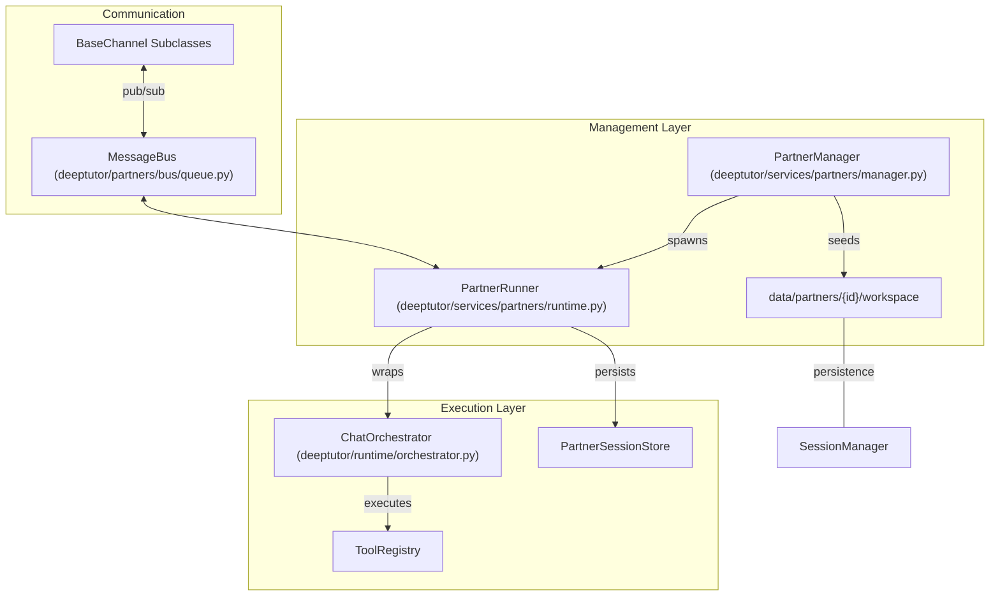
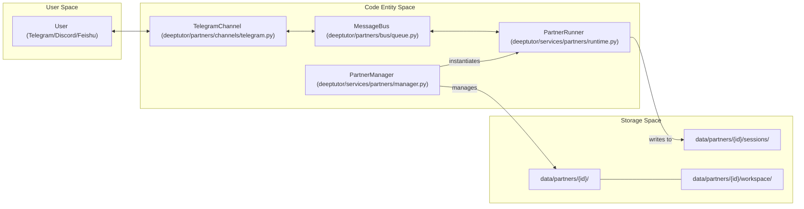

# TutorBot System

Relevant source files

The following files were used as context for generating this wiki page:

- [assets/figs/system/chat-agent-loop.png](assets/figs/system/chat-agent-loop.png)
- [assets/figs/system/partners-architecture.png](assets/figs/system/partners-architecture.png)
- [assets/figs/system/system architecture.png](assets/figs/system/system architecture.png)
- [deeptutor/api/routers/_partners_channel_schema.py](deeptutor/api/routers/_partners_channel_schema.py)
- [deeptutor/partners/channels/discord.py](deeptutor/partners/channels/discord.py)
- [deeptutor/partners/channels/feishu.py](deeptutor/partners/channels/feishu.py)
- [deeptutor/partners/channels/registry.py](deeptutor/partners/channels/registry.py)
- [deeptutor/partners/channels/telegram.py](deeptutor/partners/channels/telegram.py)
- [deeptutor/services/partners/commands.py](deeptutor/services/partners/commands.py)
- [deeptutor_cli/chat.py](deeptutor_cli/chat.py)
- [deeptutor_cli/common.py](deeptutor_cli/common.py)
- [tests/services/partners/test_channel_streaming.py](tests/services/partners/test_channel_streaming.py)
- [tests/services/partners/test_partner_runtime.py](tests/services/partners/test_partner_runtime.py)
- [web/components/partners/PartnerChannels.tsx](web/components/partners/PartnerChannels.tsx)
- [web/lib/partners-api.ts](web/lib/partners-api.ts)

The **TutorBot System** (referred to in the codebase as the "Partners" system) is an autonomous, multi-instance agent subsystem within DeepTutor designed for persistent operation and integration with external messaging platforms [deeptutor/services/partners/manager.py:1-10](). Unlike the standard request-response API, TutorBots function as long-running entities with their own lifecycles, dedicated workspaces, and a specialized tool-augmented agent loop that maintains state across messaging turns [deeptutor/services/partners/runtime.py:13-25]().

## System Overview

The system is orchestrated by the `PartnerManager` (or `TutorBotManager`), which handles the spawning, persistence, and management of bot instances within the DeepTutor server process [deeptutor/services/partners/manager.py:17-30](). Each bot is assigned a unique `partner_id` and maintains an isolated directory structure for logs, media, and local workspace data [deeptutor/services/partners/manager.py:5-15]().

### Core Components

| Component | Code Entity | Responsibility |
| :--- | :--- | :--- |
| **Manager** | `PartnerManager` | Lifecycle management (start/stop), configuration merging, and directory seeding [deeptutor/services/partners/manager.py:17-27](). |
| **Runner** | `PartnerRunner` | The execution engine for a specific bot; bridges the `ChatOrchestrator` to the `MessageBus` [deeptutor/services/partners/runtime.py:13-25](). |
| **API Router** | `deeptutor.api.routers.partners` | REST endpoints for managing bots, "Souls" (persona templates), and channel configurations [deeptutor/api/routers/partners.py:25-150](). |
| **Channel Registry** | `deeptutor.partners.channels.registry` | Auto-discovery for built-in channels (Telegram, Discord, etc.) and external plugins [deeptutor/partners/channels/registry.py:1-10](). |
| **Message Bus** | `MessageBus` | Asynchronous communication layer (Inbound/Outbound) between messaging channels and the agent loop [deeptutor/partners/bus/queue.py:14-20](). |

Sources: [deeptutor/services/partners/manager.py:17-30](), [deeptutor/services/partners/runtime.py:13-25](), [deeptutor/partners/channels/registry.py:1-10](), [deeptutor/partners/bus/queue.py:14-20]()

### High-Level Architecture

The following diagram illustrates the relationship between the bot management layer and the operational execution components.

**TutorBot Operational Flow**

Sources: [deeptutor/services/partners/manager.py:17-30](), [deeptutor/services/partners/runtime.py:13-25](), [deeptutor/partners/bus/queue.py:14-20](), [deeptutor/partners/channels/base.py:10-25]()

## Bot Lifecycle and Persistence

TutorBots are "agent-native" and persistent. When a bot is initialized, the manager ensures the presence of a configuration and seeds the bot's workspace with essential templates.

- **Isolation:** Each bot has its own `workspace` and `sessions` directory to ensure data privacy between different bot instances [deeptutor/services/partners/manager.py:5-15]().
- **Secret Management:** The system automatically masks sensitive channel credentials (tokens, passwords, API keys) in API responses using `_is_secret_field` logic [deeptutor/api/routers/_partners_channel_schema.py:97-118](). Secrets are only revealed via explicit parameters in the management API [web/components/partners/PartnerChannels.tsx:70-73]().
- **Schema-Driven Config:** The system uses Pydantic models (e.g., `TelegramConfig`, `DiscordConfig`) to generate JSON Schemas, allowing the frontend to render configuration forms dynamically for any channel [deeptutor/api/routers/_partners_channel_schema.py:120-146]().
- **Throttled Streaming:** Channels like Telegram and Discord implement `send_delta` with internal buffers and interval-based editing (e.g., 0.6s–0.8s) to comply with platform rate limits while providing a "live" typing experience [deeptutor/partners/channels/telegram.py:35-45](), [deeptutor/partners/channels/discord.py:25-35]().

Sources: [deeptutor/api/routers/_partners_channel_schema.py:120-146](), [deeptutor/partners/channels/telegram.py:35-45](), [deeptutor/partners/channels/discord.py:25-35](), [web/components/partners/PartnerChannels.tsx:70-73]()

## Child Pages

### [TutorBot Agent Loop](#8.1)
Details the internal ReAct pattern used by bots. It covers how the `PartnerRunner` maps `StreamEvent` types (CONTENT, TOOL_CALL, PROGRESS) to outbound messaging platform updates, and how it manages conversation history persistence [tests/services/partners/test_partner_runtime.py:103-118]().
*For details, see [TutorBot Agent Loop](#8.1).*

### [Messaging Channels and Skills](#8.2)
Explores the `BaseChannel` abstraction and the supported messaging platforms like Telegram, Discord, and Feishu [deeptutor/partners/channels/telegram.py:192-200](), [deeptutor/partners/channels/discord.py:38-46](). This page also documents the built-in skill system and the registry used to extend bot capabilities.
*For details, see [Messaging Channels and Skills](#8.2).*

## Technical Summary Diagram

This diagram maps the high-level system concepts to the specific Python classes and directory paths used in the implementation.

**Natural Language to Code Mapping**

Sources: [deeptutor/services/partners/manager.py:5-15](), [deeptutor/services/partners/runtime.py:13-25](), [deeptutor/partners/channels/telegram.py:192-200](), [deeptutor/partners/bus/queue.py:14-20]()
