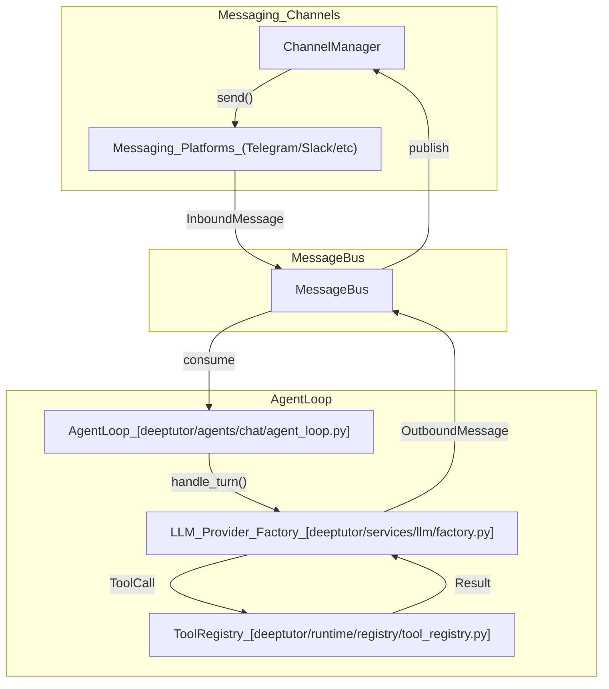
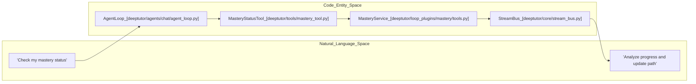

# TutorBot Agent Loop

Relevant source files

The following files were used as context for generating this wiki page:

- [assets/figs/system/chat-agent-loop.png](assets/figs/system/chat-agent-loop.png)
- [assets/figs/system/partners-architecture.png](assets/figs/system/partners-architecture.png)
- [assets/figs/system/system architecture.png](assets/figs/system/system architecture.png)
- [deeptutor/agents/chat/agentic_pipeline.py](deeptutor/agents/chat/agentic_pipeline.py)
- [deeptutor/services/partners/commands.py](deeptutor/services/partners/commands.py)
- [deeptutor/tools/mastery_tool.py](deeptutor/tools/mastery_tool.py)
- [deeptutor_cli/chat.py](deeptutor_cli/chat.py)
- [deeptutor_cli/common.py](deeptutor_cli/common.py)
- [site/src/content/docs/docs/cli/agent-handoff.md](site/src/content/docs/docs/cli/agent-handoff.md)
- [site/src/content/docs/docs/cli/commands.md](site/src/content/docs/docs/cli/commands.md)
- [site/src/content/docs/zh-cn/docs/cli/agent-handoff.md](site/src/content/docs/zh-cn/docs/cli/agent-handoff.md)
- [site/src/content/docs/zh-cn/docs/cli/commands.md](site/src/content/docs/zh-cn/docs/cli/commands.md)
- [tests/services/partners/test_partner_runtime.py](tests/services/partners/test_partner_runtime.py)

The **TutorBot Agent Loop** is the core autonomous processing engine of the TutorBot subsystem. It implements a sophisticated **ReAct (Reasoning and Acting)** pattern, enabling persistent, multi-instance agents to interact with users across various messaging platforms while leveraging specialized tools, subagents, and memory systems.

## Overview and Lifecycle

TutorBot instances are managed by the `TutorBotManager`, which handles the lifecycle of in-process agents within the DeepTutor server. Each bot operates within an isolated workspace containing its specific configurations, logs, and media.

### TutorBotManager Lifecycle
The `TutorBotManager` is responsible for:
1.  **Initialization**: Loading configurations from `bot.yaml` and merging them with runtime overrides.
2.  **Instance Management**: Spawning `TutorBotInstance` objects that track running tasks, agent loops, and heartbeat services.
3.  **Persistence**: Saving bot configurations and "Souls" (persona templates) to disk.
4.  **Security**: Masking sensitive channel secrets (like API tokens) before serializing bot data for the API.

### Data Flow: Message Bus to Agent Loop
The system utilizes a `MessageBus` to decouple messaging channels from the processing logic. The `AgentLoop` consumes inbound messages from the bus and publishes outbound responses via the `MessageTool`.

**TutorBot Message Flow**

Sources: [deeptutor/agents/chat/agent_loop.py:16-30](), [deeptutor/core/stream_bus.py:29-29](), [deeptutor/runtime/registry/tool_registry.py:41-41]()

## AgentLoop Implementation

The `AgentLoop` class [deeptutor/agents/chat/agent_loop.py:16-16]() is the central orchestrator for a single agent turn. It coordinates between LLM providers, tool registries, and session memory using an iterative ReAct cycle.

### Key Components and Configuration
- **AgenticChatPipeline**: Assembles the exploring-loop agent followed by a respond stage [deeptutor/agents/chat/agentic_pipeline.py:145-146]().
- **ChatPromptAssembler**: Constructs the system and user prompt blocks, including memory and tool manifests [deeptutor/agents/chat/agentic_pipeline.py:17-17]().
- **Tool Composition**: Dynamically enables tools based on user permissions (e.g., notebooks, memory) [deeptutor/agents/chat/agentic_pipeline.py:9-15]().
- **Budgeting**: Enforces a `DEFAULT_MAX_ROUNDS` (default 8) to prevent infinite loops during the exploring phase [deeptutor/agents/chat/agentic_pipeline.py:62-62]().

### ReAct Execution Pipeline
The agent follows a structured ReAct execution flow:
1.  **Context Construction**: Gathers history, shared memory, and current message via `UnifiedContext` [deeptutor/agents/chat/agentic_pipeline.py:28-28]().
2.  **LLM Interaction**: Calls the configured LLM using `build_completion_kwargs` [deeptutor/agents/chat/agentic_pipeline.py:22-22]().
3.  **Tool Dispatch**: Iteratively executes tool calls using `dispatch_tool_calls` [deeptutor/agents/chat/agentic_pipeline.py:25-25](). It supports parallel execution up to `MAX_PARALLEL_TOOL_CALLS` [deeptutor/agents/chat/agentic_pipeline.py:27-27]().
4.  **Output Dispatch**: Streams events (thinking, tool calls, content) to the `StreamBus` [deeptutor/agents/chat/agentic_pipeline.py:29-29]().

### Memory and Context Management
The loop employs a multi-tier memory strategy:
- **L1 Trace**: Immediate execution history.
- **L2 Per-Surface Summaries**: Summarized context for specific platforms.
- **L3 Cross-Surface Knowledge**: Long-term persistent memory consolidated by the `MemoryConsolidator`.
- **Context Window Guard**: Maintains a `CONTEXT_WINDOW_GUARD_RATIO` (0.9) to ensure the agent doesn't exceed LLM token limits [deeptutor/agents/chat/agentic_pipeline.py:63-63]().

Sources: [deeptutor/agents/chat/agent_loop.py:16-40](), [deeptutor/agents/chat/agentic_pipeline.py:145-180](), [deeptutor/core/agentic/tool_dispatch.py:27-27]()

## Nano Team Collaboration

TutorBot supports complex task execution through "Nano Teams"—small groups of specialized agents collaborating on a shared goal.

### Subagent Orchestration
Specialized capabilities (like `MasteryPath`) use a dedicated toolset to manage the learning lifecycle. For example, the `MasteryTool` set includes tools for building, grading, and assessing mastery [deeptutor/tools/mastery_tool.py:9-17]().

**Entity Mapping: Agent to Code**

Sources: [deeptutor/tools/mastery_tool.py:1-27](), [deeptutor/agents/chat/agent_loop.py:16-30](), [deeptutor/core/stream_bus.py:29-29]()

## Interactive CLI Loop

The `deeptutor chat` REPL provides a local interface to the agent loop, allowing developers to test capabilities and tool interactions in real-time [deeptutor_cli/chat.py:1-12]().

### REPL Features
- **Session Continuity**: Resumes existing sessions via `--session` [deeptutor_cli/chat.py:44-44]().
- **Slash Commands**: Supports `/cap` to switch capabilities, `/tool` to toggle tools, and `/regenerate` to retry the last turn [deeptutor_cli/chat.py:111-119]().
- **Tool Result Inspection**: The `/show` command allows expanding captured thinking or tool outputs stored in the `ToolResultBuffer` [deeptutor_cli/common.py:30-30]().
- **Streaming Rendering**: The `TurnStreamRenderer` processes `StreamEvent` objects (e.g., `CONTENT`, `TOOL_CALL`, `PROGRESS`) to update the terminal UI [deeptutor_cli/common.py:176-180]().

### Signal Handling
The CLI loop includes a `_SigintInterceptor` to handle `Ctrl-C`. Instead of killing the process, it cancels the running turn server-side and returns control to the REPL [deeptutor_cli/common.py:167-176]().

Sources: [deeptutor_cli/chat.py:79-168](), [deeptutor_cli/common.py:78-131](), [deeptutor_cli/common.py:154-198]()
