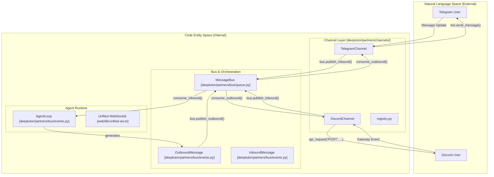
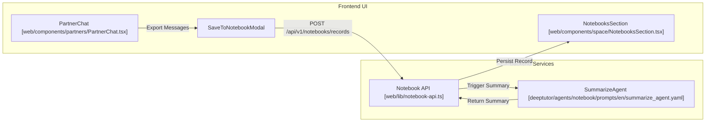

# Messaging Channels and Skills

Relevant source files

The following files were used as context for generating this wiki page:

- [assets/figs/webui/cowriter.png](assets/figs/webui/cowriter.png)
- [deeptutor/agents/notebook/prompts/en/summarize_agent.yaml](deeptutor/agents/notebook/prompts/en/summarize_agent.yaml)
- [deeptutor/agents/notebook/prompts/zh/summarize_agent.yaml](deeptutor/agents/notebook/prompts/zh/summarize_agent.yaml)
- [deeptutor/api/routers/_partners_channel_schema.py](deeptutor/api/routers/_partners_channel_schema.py)
- [deeptutor/partners/__init__.py](deeptutor/partners/__init__.py)
- [deeptutor/partners/bus/__init__.py](deeptutor/partners/bus/__init__.py)
- [deeptutor/partners/bus/events.py](deeptutor/partners/bus/events.py)
- [deeptutor/partners/bus/queue.py](deeptutor/partners/bus/queue.py)
- [deeptutor/partners/channels/__init__.py](deeptutor/partners/channels/__init__.py)
- [deeptutor/partners/channels/base.py](deeptutor/partners/channels/base.py)
- [deeptutor/partners/channels/dingtalk.py](deeptutor/partners/channels/dingtalk.py)
- [deeptutor/partners/channels/discord.py](deeptutor/partners/channels/discord.py)
- [deeptutor/partners/channels/email.py](deeptutor/partners/channels/email.py)
- [deeptutor/partners/channels/feishu.py](deeptutor/partners/channels/feishu.py)
- [deeptutor/partners/channels/registry.py](deeptutor/partners/channels/registry.py)
- [deeptutor/partners/channels/telegram.py](deeptutor/partners/channels/telegram.py)
- [site/src/content/docs/docs/partners/channels.md](site/src/content/docs/docs/partners/channels.md)
- [site/src/content/docs/zh-cn/docs/partners/channels.md](site/src/content/docs/zh-cn/docs/partners/channels.md)
- [tests/services/partners/test_channel_streaming.py](tests/services/partners/test_channel_streaming.py)
- [web/app/(workspace)/partners/[partnerId]/page.tsx](web/app/(workspace)/partners/[partnerId]/page.tsx)
- [web/components/partners/PartnerArchives.tsx](web/components/partners/PartnerArchives.tsx)
- [web/components/partners/PartnerChannels.tsx](web/components/partners/PartnerChannels.tsx)
- [web/components/partners/PartnerChat.tsx](web/components/partners/PartnerChat.tsx)
- [web/components/space/NotebooksSection.tsx](web/components/space/NotebooksSection.tsx)
- [web/lib/chat-export.ts](web/lib/chat-export.ts)
- [web/lib/partners-api.ts](web/lib/partners-api.ts)

DeepTutor's TutorBot subsystem is designed to operate autonomously across various messaging platforms. This is achieved through a decoupled architecture where the `ChannelManager` handles platform-specific communication, and a unified `AgentLoop` executes tasks using a robust "Skill" system.

## Channel Management

The `ChannelManager` (and the associated `BaseChannel` hierarchy) is responsible for abstracting the complexities of different messaging protocols. It handles the lifecycle of enabled channels (such as Telegram, Discord, Slack, Feishu, or WeChat), performs inbound message normalization, and manages asynchronous outbound routing [deeptutor/partners/channels/base.py:21-25]().

### Channel Discovery and Registry
The system uses an auto-discovery mechanism to locate available channel implementations. The `discover_all_with_errors` function scans the `deeptutor.partners.channels` package and identifies `BaseChannel` subclasses [deeptutor/partners/channels/registry.py:63-70](). It also supports external plugins registered via Python `entry_points` [deeptutor/partners/channels/registry.py:40-51]().

### Configuration and Schema Introspection
To allow the Web UI to render generic configuration forms for any channel (built-in or plugin), the system provides a schema introspection bridge [deeptutor/api/routers/_partners_channel_schema.py:1-10]().
*   **Model Resolution:** `resolve_config_model` finds the Pydantic config model (e.g., `TelegramConfig`) paired with a channel class [deeptutor/api/routers/_partners_channel_schema.py:22-31]().
*   **Secret Masking:** The `collect_secret_fields` utility identifies sensitive fields (like `token` or `app_id`) to ensure they are handled securely in the UI [deeptutor/api/routers/_partners_channel_schema.py:97-103]().
*   **UI Integration:** The `PartnerChannels` component uses this schema to generate settings fields dynamically [web/app/(workspace)/partners/[partnerId]/page.tsx:209]().

### Supported Platforms
DeepTutor supports a wide range of messaging platforms. Each channel implementation manages its own connection logic (e.g., WebSockets, Long Polling, or REST).

| Platform | Implementation Class | Configuration Model | Key Features |
| :--- | :--- | :--- | :--- |
| **Telegram** | `TelegramChannel` [deeptutor/partners/channels/telegram.py:192]() | `TelegramConfig` | HTML rendering, file attachments, and streaming edits [deeptutor/partners/channels/telegram.py:106-121](). |
| **Discord** | `DiscordChannel` [deeptutor/partners/channels/discord.py:49]() | `DiscordConfig` | Gateway WebSocket connection, typing indicators, and message splitting [deeptutor/partners/channels/discord.py:72-110](). |
| **Feishu/Lark** | `FeishuChannel` [deeptutor/partners/channels/feishu.py:1]() | `FeishuConfig` | Rich text (post) parsing, interactive card support, and WebSocket long connection [deeptutor/partners/channels/feishu.py:171-200](). |
| **Email** | `EmailChannel` | `EmailConfig` | SMTP/IMAP integration for mail-based interaction. |

### Message Routing and Streaming
Outbound messages are published to the `MessageBus` as `OutboundMessage` events [deeptutor/partners/bus/events.py:19-20](). Channels that support `StreamingSupport` (like Telegram and Discord) can handle progressive delivery via `send_delta`, which edits a single message in real-time as the agent thinks [deeptutor/partners/channels/discord.py:175-184]().

**Messaging Entity and Data Flow Map**

Sources: [deeptutor/partners/channels/registry.py:54-70](), [deeptutor/partners/channels/telegram.py:192-205](), [deeptutor/partners/channels/discord.py:111-151](), [deeptutor/partners/bus/queue.py:1-20]().

## The Skill System

The Skill system allows users to extend the agent's capabilities by injecting behavioral playbooks and CLI tool definitions into the LLM's context.

### Skill Definition (SKILL.md)
Skills are defined using a structured format that includes:
*   **Purpose:** Instructions for the agent on when and how to trigger the skill.
*   **Prerequisites:** Required environment setup (e.g., Python packages).
*   **Command Reference:** A whitelist of `deeptutor` CLI commands the agent is authorized to execute.

### Built-in CLI Skills
The primary skill provided is the `deeptutor` CLI reference, which allows agents to manage the entire platform autonomously [SKILL.md:1-5]().

| Category | Authorized Commands |
| :--- | :--- |
| **Capabilities** | `deep_solve`, `deep_research`, `math_animator`, `deep_question` [SKILL.md:23-47](). |
| **Knowledge** | `kb create`, `kb add`, `kb search`, `kb list` [SKILL.md:49-59](). |
| **Bot Management** | `bot create`, `bot start`, `bot stop`, `bot list` [SKILL.md:61-68](). |
| **Memory & Session** | `session list`, `session open`, `memory show` [SKILL.md:70-85](). |

### Skill Registry and ClawHub
Skills can be managed via the `SkillsSection` in the Web UI [web/components/space/NotebooksSection.tsx:175-219](). The system supports a "ClawHub" registry (referenced in the CLI) for sharing and discovering community-contributed skills.

## Integration with Notebooks
Conversation transcripts from any channel can be saved to the user's personal `Notebook` for long-term retention and RAG (Retrieval-Augmented Generation).
*   **Save Pipeline:** The `SaveToNotebookModal` captures messages from a partner session [web/app/(workspace)/partners/[partnerId]/page.tsx:41-44]().
*   **Summarization:** When a record is saved, a specialized `summarize_agent` generates a 80-180 word summary focused on key conclusions and reuse value [deeptutor/agents/notebook/prompts/en/summarize_agent.yaml:1-20]().
*   **Metadata:** Records are tagged with `record_type: tutorbot` and include partner-specific metadata (e.g., `partner_id`, `partner_name`) [web/app/(workspace)/partners/[partnerId]/page.tsx:103-107]().

**Skill and Notebook Integration Flow**

Sources: [web/app/(workspace)/partners/[partnerId]/page.tsx:94-125](), [deeptutor/agents/notebook/prompts/en/summarize_agent.yaml:1-28](), [web/components/space/NotebooksSection.tsx:175-219]().
