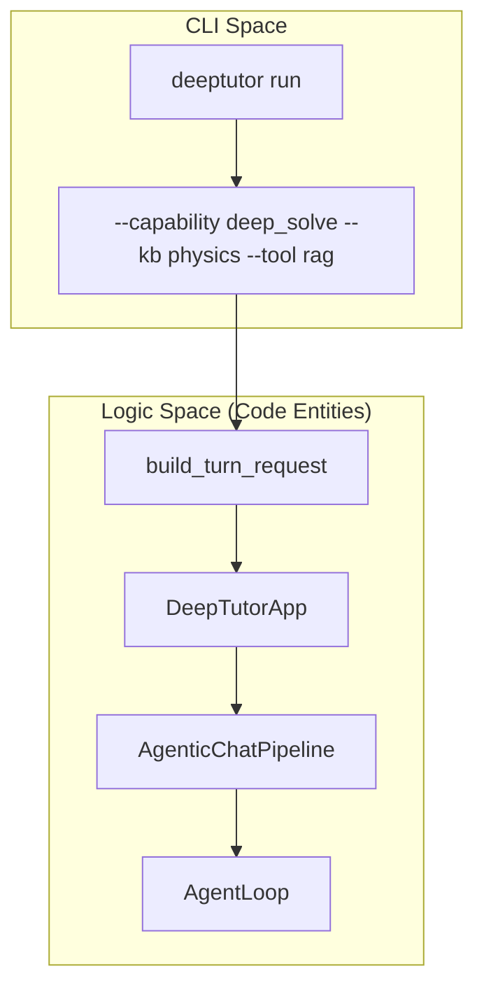
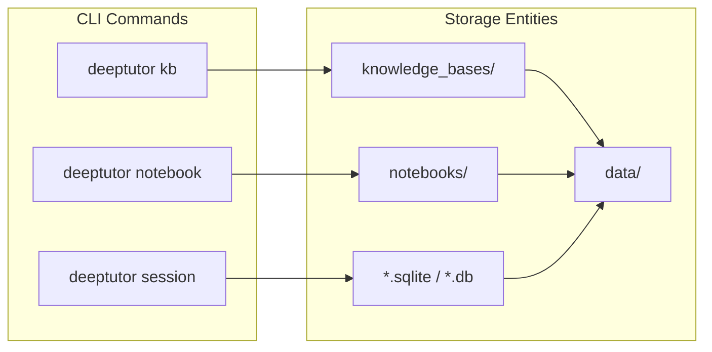

# CLI Reference

Relevant source files

The following files were used as context for generating this wiki page:

- [.github/workflows/pypi-release.yml](.github/workflows/pypi-release.yml)
- [.gitignore](.gitignore)
- [deeptutor/agents/chat/agentic_pipeline.py](deeptutor/agents/chat/agentic_pipeline.py)
- [deeptutor/api/run_server.py](deeptutor/api/run_server.py)
- [deeptutor/tools/mastery_tool.py](deeptutor/tools/mastery_tool.py)
- [deeptutor_cli/main.py](deeptutor_cli/main.py)
- [requirements.txt](requirements.txt)
- [requirements/dev.txt](requirements/dev.txt)
- [requirements/math-animator.txt](requirements/math-animator.txt)
- [site/src/content/docs/docs/cli/agent-handoff.md](site/src/content/docs/docs/cli/agent-handoff.md)
- [site/src/content/docs/docs/cli/commands.md](site/src/content/docs/docs/cli/commands.md)
- [site/src/content/docs/zh-cn/docs/cli/agent-handoff.md](site/src/content/docs/zh-cn/docs/cli/agent-handoff.md)
- [site/src/content/docs/zh-cn/docs/cli/commands.md](site/src/content/docs/zh-cn/docs/cli/commands.md)

The DeepTutor CLI is the primary entry point for interacting with the system's agent-native capabilities, managing knowledge bases, and orchestrating autonomous TutorBots. It is built using the `typer` library [deeptutor_cli/main.py:7-7]() and provides a unified interface for both local development and production operations.

The CLI is registered as the `deeptutor` command [deeptutor_cli/main.py:28-34]() and supports a wide range of sub-commands organized by functional area. It operates in different modes, such as `RunMode.CLI` for interactive use and `RunMode.SERVER` for API hosting [deeptutor_cli/main.py:26-26](), [deeptutor_cli/main.py:133-133]().

### CLI Architecture and Command Registry

The CLI follows a modular registration pattern where the main entry point [deeptutor_cli/main.py:29-58]() delegates to specialized sub-apps.

| Sub-command | Purpose | Source Registry |
| :--- | :--- | :--- |
| `run` | Execute a single-turn capability (e.g., research, solve). | [deeptutor_cli/main.py:74-111]() |
| `chat` | Launch an interactive REPL session. | [deeptutor_cli/main.py:37-37]() |
| `partner` | Manage IM-connected companions (Telegram, Discord, etc.). | [deeptutor_cli/main.py:36-36]() |
| `kb` | Knowledge Base operations (RAG management). | [deeptutor_cli/main.py:38-38]() |
| `skill` | Manage skills and install from hubs like ClawHub. | [deeptutor_cli/main.py:39-39]() |
| `session` | Manage shared sessions and history. | [deeptutor_cli/main.py:43-43]() |
| `notebook` | Manage notebooks and imported markdown records. | [deeptutor_cli/main.py:44-44]() |
| `memory` | View and manage lightweight persistent memory. | [deeptutor_cli/main.py:40-40]() |
| `config` | Inspect system configuration and environment. | [deeptutor_cli/main.py:42-42]() |
| `provider` | Manage LLM provider authentication and OAuth. | [deeptutor_cli/main.py:45-45]() |
| `book` | Manage interactive Books (BookEngine). | [deeptutor_cli/main.py:46-46]() |
| `serve` | Start the FastAPI backend server. | [deeptutor_cli/main.py:124-160]() |
| `start` | Launch backend and frontend together. | [deeptutor_cli/main.py:113-121]() |

**Sources:** [deeptutor_cli/main.py:29-160](), [site/src/content/docs/docs/cli/commands.md:8-232]()

---

### Core Execution Commands

The `run` and `serve` commands represent the two primary modes of operation for the DeepTutor backend.

#### Capability Execution (`run`)
The `run` command allows users to invoke any registered capability (such as `deep_research` or `deep_solve`) directly from the terminal [deeptutor_cli/main.py:74-92](). It utilizes `build_turn_request` [deeptutor_cli/main.py:98-109]() to construct a `TurnRequest` object which is then processed by the `DeepTutorApp` [deeptutor_cli/main.py:110-110](). It supports flags for enabling tools (e.g., `rag`, `web_search`, `reason`), attaching knowledge bases, and passing configuration overrides via `--config` or `--config-json` [deeptutor_cli/main.py:82-90]().

#### API Server (`serve`)
The `serve` command transitions the CLI into `RunMode.SERVER` [deeptutor_cli/main.py:133-133]() and launches the FastAPI application using `uvicorn` [deeptutor_cli/main.py:154-160](). It automatically detects the configured backend port [deeptutor_cli/main.py:135-137](). On Windows, it explicitly sets the `WindowsProactorEventLoopPolicy` to support subprocess execution required by certain agents like the Math Animator [deeptutor_cli/main.py:142-143]().

For detailed usage of these commands and the interactive REPL, see **[Core CLI Commands](#9.1)**.

**Sources:** [deeptutor_cli/main.py:74-160](), [site/src/content/docs/docs/cli/commands.md:8-126]()

---

### Knowledge and Memory Management

DeepTutor provides a suite of commands to manage the data layer that agents interact with.

*   **Knowledge Base (`kb`):** Manages the RAG system, allowing users to create collections from files or directories (`kb create`), add documents (`kb add`), and perform searches [site/src/content/docs/docs/cli/commands.md:128-215]().
*   **Session & Memory:** The `session` command manages conversation histories and allows resuming sessions in the REPL [site/src/content/docs/docs/cli/commands.md:233-246](). The `memory` command interacts with the persistent learner profile and long-term memory summary [deeptutor_cli/main.py:40-40]().
*   **Notebooks:** The `notebook` command manages structured markdown records in the user's workspace [deeptutor_cli/main.py:44-44](), [site/src/content/docs/docs/cli/commands.md:23-23]().

For details on managing data and RAG collections, see **[Knowledge Base and Session Commands](#9.2)**.

**Sources:** [deeptutor_cli/main.py:38-44](), [site/src/content/docs/docs/cli/commands.md:128-246]()

---

### Provider and Authentication

The `provider` sub-command handles authentication and access validation for specialized LLM backends.

*   **OAuth Login:** Supports interactive OAuth flows for providers using the `provider login` command [site/src/content/docs/docs/cli/agent-handoff.md:91-94]().
*   **Token Management:** Once authenticated, tokens are stored in the workspace to allow cloud-based agents or local CLI turns to use specific LLM providers without manual key entry [site/src/content/docs/docs/cli/agent-handoff.md:92-96]().

**Sources:** [deeptutor_cli/main.py:45-45](), [site/src/content/docs/docs/cli/agent-handoff.md:89-97]()

---

### CLI to Code Entity Mapping

The following diagrams bridge the CLI command space to the underlying service and agent entities.

#### Capability Execution Flow
This diagram shows how a CLI `run` command maps to the `DeepTutorApp` facade and the underlying runtime.

Title: "Capability Execution Mapping"

**Sources:** [deeptutor_cli/main.py:74-111](), [deeptutor/agents/chat/agentic_pipeline.py:145-146](), [deeptutor/agents/chat/agentic_pipeline.py:16-16]()

#### Data Management Mapping
This diagram maps CLI sub-commands to the specific storage entities and files they manage.

Title: "CLI to Data Entity Mapping"

**Sources:** [deeptutor_cli/main.py:38-44](), [.gitignore:8-13](), [.gitignore:265-270](), [site/src/content/docs/docs/cli/commands.md:128-246]()
