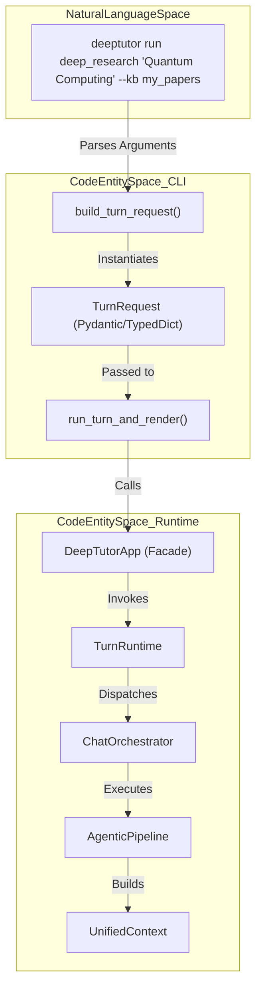
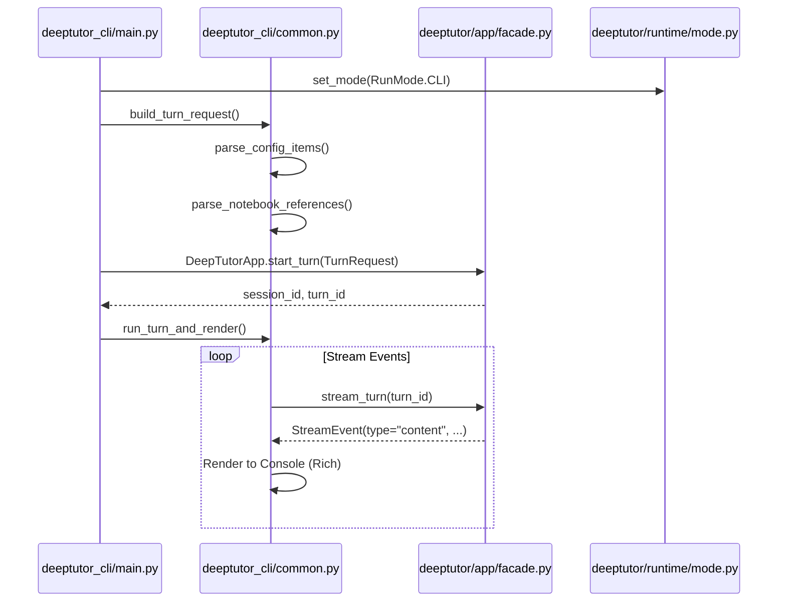

# Core CLI Commands

Relevant source files

The following files were used as context for generating this wiki page:

- [.github/workflows/pypi-release.yml](.github/workflows/pypi-release.yml)
- [.gitignore](.gitignore)
- [assets/figs/system/chat-agent-loop.png](assets/figs/system/chat-agent-loop.png)
- [assets/figs/system/partners-architecture.png](assets/figs/system/partners-architecture.png)
- [assets/figs/system/system architecture.png](assets/figs/system/system architecture.png)
- [deeptutor/api/run_server.py](deeptutor/api/run_server.py)
- [deeptutor/services/partners/commands.py](deeptutor/services/partners/commands.py)
- [deeptutor_cli/_tool_result.py](deeptutor_cli/_tool_result.py)
- [deeptutor_cli/chat.py](deeptutor_cli/chat.py)
- [deeptutor_cli/common.py](deeptutor_cli/common.py)
- [deeptutor_cli/config_cmd.py](deeptutor_cli/config_cmd.py)
- [deeptutor_cli/init_cmd.py](deeptutor_cli/init_cmd.py)
- [deeptutor_cli/init_wizard.py](deeptutor_cli/init_wizard.py)
- [deeptutor_cli/main.py](deeptutor_cli/main.py)
- [requirements.txt](requirements.txt)
- [requirements/dev.txt](requirements/dev.txt)
- [requirements/math-animator.txt](requirements/math-animator.txt)
- [tests/services/partners/test_partner_runtime.py](tests/services/partners/test_partner_runtime.py)

The DeepTutor CLI is an agent-first interface designed to provide direct access to the system's capabilities, tools, and knowledge management functions. It serves as both a development tool for testing agent logic and a production entry point for running tasks without a web browser.

The CLI is implemented using the `typer` library [deeptutor_cli/main.py:28-33]() and sets the global `RunMode` to `CLI` upon entry [deeptutor_cli/main.py:26]().

## Overview of CLI Structure

The CLI is organized into a main application with several sub-commands. While many sub-commands manage specific resources (like `kb`, `session`, or `notebook`), the core commands facilitate the execution of the intelligent agent modules and the management of the backend server.

| Command | Function | Implementation File |
| :--- | :--- | :--- |
| `deeptutor run` | Executes a single capability turn (e.g., research, solve). | [deeptutor_cli/main.py:74-92]() |
| `deeptutor chat` | Starts an interactive REPL for continuous conversation. | [deeptutor_cli/chat.py:40-78]() |
| `deeptutor serve` | Starts the FastAPI API server via `uvicorn`. | [deeptutor_cli/main.py:123-160]() |
| `deeptutor start` | Launches backend and frontend together via the launcher. | [deeptutor_cli/main.py:113-121]() |
| `deeptutor partner` | Manage partners (IM-connected companions). | [deeptutor_cli/main.py:48](), [deeptutor_cli/main.py:60]() |
| `deeptutor book` | Manage interactive Books via the BookEngine. | [deeptutor_cli/main.py:58](), [deeptutor_cli/main.py:70]() |

**Sources:** [deeptutor_cli/main.py:1-72](), [requirements.txt:1-23]()

## Data Flow: From CLI to Agent Execution

The following diagram illustrates how a CLI command like `deeptutor run` transforms raw user input into a structured request that the system can process.

### CLI to Runtime Mapping
"This diagram maps the Natural Language Space (User CLI Input) to the Code Entity Space (Runtime Objects)."

**Sources:** [deeptutor_cli/main.py:74-111](), [deeptutor_cli/common.py:78-96](), [deeptutor_cli/chat.py:156-168]()

## Core Command Details

### deeptutor run
The `run` command is the primary entry point for "agent-first" interactions. It allows users to invoke any registered capability (e.g., `chat`, `deep_solve`, `deep_question`, `deep_research`, `math_animator`) for a single turn [deeptutor_cli/main.py:74-92]().

**Key Arguments & Options:**
* `capability`: The unique name of the capability to invoke [deeptutor_cli/main.py:75-79]().
* `message`: The user's query or task description [deeptutor_cli/main.py:80]().
* `--kb`: Specifies one or more knowledge bases to attach to the context [deeptutor_cli/main.py:83]().
* `--tool`: Enables specific tools like `rag` or `web_search` [deeptutor_cli/main.py:82]().
* `--notebook-ref`: References specific records in the notebook using `notebook_id:record_id` syntax [deeptutor_cli/main.py:84]().
* `--config-json`: Allows passing complex agent-specific overrides as a JSON string [deeptutor_cli/main.py:88-90]().
* `--format`: Controls output rendering, supporting `rich` (terminal UI with Markdown support) or `json` [deeptutor_cli/main.py:91]().

**Implementation Logic:**
1. It calls `build_turn_request` to construct a validated `TurnRequest` [deeptutor_cli/main.py:98-109]().
2. It initializes the `DeepTutorApp` facade and executes the turn via `run_turn_and_render` [deeptutor_cli/main.py:110]().
3. It utilizes `maybe_run` to handle the asynchronous execution of the turn within the synchronous Typer command [deeptutor_cli/main.py:110](), [deeptutor_cli/common.py:18]().

### deeptutor serve
The `serve` command transitions the CLI from a client tool to a server host.
1. It sets the `RunMode` to `SERVER` [deeptutor_cli/main.py:133]().
2. **Windows Compatibility:** On Windows, it switches the event loop policy to `WindowsProactorEventLoopPolicy` to support subprocess execution (required for components like the Math Animator/Manim) [deeptutor_cli/main.py:142-143](), [deeptutor/api/run_server.py:17-18]().
3. **Uvicorn Integration:** It uses `uvicorn` to launch the FastAPI application defined in `deeptutor.api.main:app` [deeptutor_cli/main.py:154-160]().
4. **Hot Reload:** Supports a `--reload` flag that excludes high-churn directories like `web/*` and `data/*` [deeptutor_cli/main.py:159](), [deeptutor/api/run_server.py:46-55]().

### deeptutor chat
The `chat` command provides an interactive REPL (Read-Eval-Print Loop). Unlike `run`, which is stateless per execution, `chat` maintains a session, allowing for multi-turn dialogues.

**REPL Features:**
* **Session Management:** Can resume an existing session using `--session` [deeptutor_cli/chat.py:44]().
* **Slash Commands:** Supports internal commands like `/quit`, `/new` (reset context), `/tool on|off`, `/cap` (switch capability), and `/regenerate` [deeptutor_cli/chat.py:110-121]().
* **State Persistence:** Tracks the current session ID, active tools, and capability in a `ChatState` object [deeptutor_cli/chat.py:28-37]().
* **Cron Service:** Attempts to start a `cron_service` for background tasks during the REPL session [deeptutor_cli/chat.py:81-88]().

**Sources:** [deeptutor_cli/main.py:123-160](), [deeptutor_cli/chat.py:1-168](), [deeptutor/api/run_server.py:1-74]()

## TurnRequest Building Utilities

The CLI relies on internal helpers to bridge CLI options to the `TurnRequest` schema used by the `DeepTutorApp` facade.

### Implementation and Logic
The parsing logic handles the normalization of user input, such as converting colon-separated notebook strings or key-value config pairs into structured objects [deeptutor_cli/common.py:41-75]().

| Function | Responsibility |
| :--- | :--- |
| `parse_config_items` | Converts `key=value` CLI strings into a Python dictionary [deeptutor_cli/common.py:41-49](). |
| `parse_json_object` | Safely parses a JSON string into a dictionary for complex configs [deeptutor_cli/common.py:51-61](). |
| `parse_notebook_references` | Splits `notebook_id:rec1,rec2` strings into structured ID/Record maps [deeptutor_cli/common.py:64-75](). |

### Request Processing Flow
"This diagram shows how the CLI components interact with the Core Services during a command execution."

**Sources:** [deeptutor_cli/main.py:74-111](), [deeptutor_cli/common.py:41-96](), [deeptutor_cli/chat.py:156-168]()
