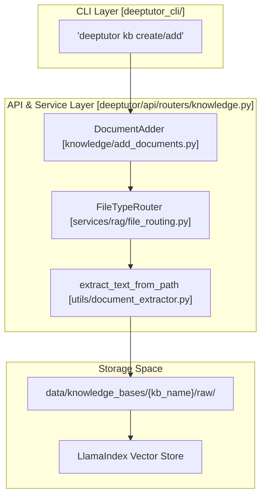
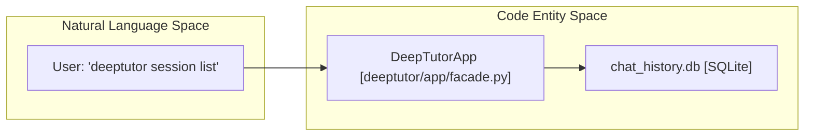
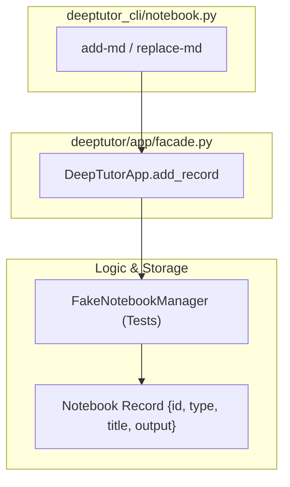

# Knowledge Base and Session Commands

Relevant source files

The following files were used as context for generating this wiki page:

- [deeptutor/api/routers/knowledge.py](deeptutor/api/routers/knowledge.py)
- [deeptutor_cli/notebook.py](deeptutor_cli/notebook.py)
- [tests/api/test_knowledge_router.py](tests/api/test_knowledge_router.py)
- [tests/cli/test_notebook_cli.py](tests/cli/test_notebook_cli.py)

This section provides a technical reference for the DeepTutor CLI sub-commands dedicated to managing persistent data, including Knowledge Bases (KB), chat sessions, long-term memory, and the shared notebook. These commands interact directly with the unified data layout and the underlying storage systems through the `DeepTutorApp` facade [deeptutor/app/facade.py:56-58]().

## Knowledge Base (KB) Commands

The `deeptutor kb` suite allows users to manage RAG (Retrieval-Augmented Generation) resources. These commands interface with the `KnowledgeBaseManager` and specialized logic in the API routers to index, store, and query documents.

### Implementation Details
Knowledge bases are managed via the `kb` sub-app in the CLI. The backend logic is centralized in the knowledge router [deeptutor/api/routers/knowledge.py:66-66](), which handles CRUD operations and file uploads. The system utilizes a multi-provider RAG architecture, primarily centered around `LlamaIndex` [deeptutor/api/routers/knowledge.py:51-51]().

| Sub-command | Description | Backend Implementation |
|:---|:---|:---|
| `list` | Lists all existing knowledge bases. | `list_visible_knowledge_bases` [deeptutor/api/routers/knowledge.py:48-49]() |
| `create` | Initializes a new KB from files or directories. | `KnowledgeBaseInitializer` [deeptutor/api/routers/knowledge.py:35-35]() |
| `add` | Appends new documents to an existing KB. | `DocumentAdder` [deeptutor/api/routers/knowledge.py:34-34]() |
| `search` | Performs a test retrieval query. | `resolve_kb` [deeptutor/api/routers/knowledge.py:45-45]() |
| `set-default` | Configures the default KB for the user. | `get_kb_manager` [deeptutor/api/routers/knowledge.py:90-95]() |

### Data Flow: KB Document Ingestion
The following diagram illustrates the flow from a local file to a searchable vector entity through the CLI and the `DocumentAdder` logic.

**KB Ingestion and Storage Architecture**

**Sources:** [deeptutor/api/routers/knowledge.py:34-57](), [deeptutor/api/routers/knowledge.py:83-85](), [tests/api/test_knowledge_router.py:67-76]()

---

## Session Management Commands

The `deeptutor session` commands provide granular control over conversation history. DeepTutor persists sessions to allow resuming complex agent workflows across the CLI REPL and the Web interface.

### Implementation
Sessions are managed via the `DeepTutorApp` facade. The backend storage is typically a SQLite-backed session store. The CLI commands bridge the user interface to the persistent `chat_history.db`.

| Command | Action | Facade Method |
|:---|:---|:---|
| `list` | Displays recent session history. | `list_sessions()` |
| `show` | Displays messages within a session. | `get_session(session_id)` |
| `open` | Resumes a session in the REPL. | (CLI Internal logic using `session_id`) |
| `rename` | Updates the session title. | `rename_session(session_id, title)` |
| `delete` | Removes session records. | `delete_session(session_id)` |

### Code Entity Association
The session commands bridge the CLI to the backend session storage logic via the `DeepTutorApp` facade.

**Session Command Mapping**

**Sources:** [deeptutor/app/facade.py:56-58](), [deeptutor_cli/notebook.py:10-12]()

---

## Notebook and Memory Commands

DeepTutor distinguishes between session-specific context and persistent user-curated data stored in "Notebooks" or "Memory".

### Notebook Service (`deeptutor notebook`)
The `NotebookManager` (accessed via `DeepTutorApp`) handles records that can be referenced by agents during a turn. These are managed via `deeptutor_cli/notebook.py`.

*   **CLI Operations:** Supports listing [deeptutor_cli/notebook.py:16-20](), creating [deeptutor_cli/notebook.py:22-31](), and showing details [deeptutor_cli/notebook.py:32-53]().
*   **Markdown Integration:** Users can import external notes using `add-md` [deeptutor_cli/notebook.py:68-100]() or update existing records using `replace-md` [deeptutor_cli/notebook.py:102-121]().
*   **Data Structure:** Records include types like `chat`, `question`, `research`, and `solve` [deeptutor_cli/notebook.py:76-76]().
*   **Record Removal:** Records can be deleted individually from a notebook using `remove-record` [deeptutor_cli/notebook.py:55-66]().

**Notebook CLI Data Flow**

**Sources:** [deeptutor_cli/notebook.py:1-121](), [tests/cli/test_notebook_cli.py:14-87]()

### Long-term Memory (`deeptutor memory`)
The memory subsystem provides a structured three-layer store (L1/L2/L3) with an explicit consolidation pipeline.

*   **Three-Layer Architecture:**
    *   **L1 (Trace):** Raw run traces capturing granular agent activity.
    *   **L2 (Summaries):** Normalized document records derived from traces.
    *   **L3 (Knowledge):** Curated slots per surface (chat, notebook, book, TutorBot).
*   **CLI Integration:** Agents interact with this store during turns to maintain long-term context across different interaction surfaces.

---

## Configuration and Initialization

The CLI provides interactive and programmatic ways to configure the environment, primarily through `deeptutor init` and `deeptutor config`.

### Initialization Wizard (`deeptutor init`)
The `init` command drives a multi-step wizard to set up providers and system ports.
*   **LLM Step:** Users select a provider (e.g., OpenAI, Anthropic, DeepSeek) and capture API keys.
*   **Connectivity Probes:** The wizard performs live connectivity probes to validate API keys and base URLs before saving.

### Configuration Inspection (`deeptutor config`)
The `config show` command outputs the current system state in JSON format, including:
*   **Network Ports:** Backend and frontend port assignments.
*   **Runtime Config:** Active LLM, Embedding, and Search provider settings.
*   **Tooling:** A list of currently enabled tools in `main.yaml`.

**Sources:** [deeptutor_cli/notebook.py:1-121](), [deeptutor/api/routers/knowledge.py:1-66](), [tests/cli/test_notebook_cli.py:1-118]()
