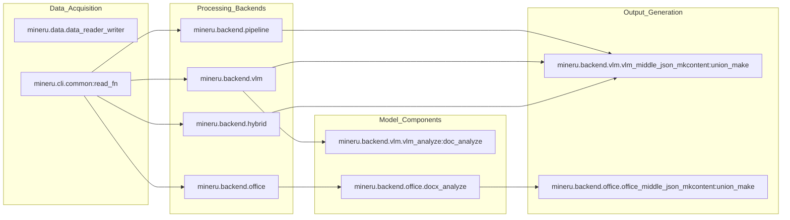

# MinerU Overview

<details>
<summary>Relevant source files</summary>

The following files were used as context for generating this wiki page:

- [README.md](README.md)
- [README_zh-CN.md](README_zh-CN.md)
- [docs/en/index.md](docs/en/index.md)
- [docs/en/quick_start/index.md](docs/en/quick_start/index.md)
- [docs/images/flowchart_en.png](docs/images/flowchart_en.png)
- [docs/images/flowchart_zh_cn.png](docs/images/flowchart_zh_cn.png)
- [docs/images/project_panorama_en.png](docs/images/project_panorama_en.png)
- [docs/images/project_panorama_zh_cn.png](docs/images/project_panorama_zh_cn.png)
- [docs/zh/index.md](docs/zh/index.md)
- [docs/zh/quick_start/index.md](docs/zh/quick_start/index.md)
- [mineru/version.py](mineru/version.py)
- [pyproject.toml](pyproject.toml)

</details>


MinerU is a high-performance tool designed to convert complex PDF documents and images into structured, machine-readable Markdown and JSON formats. It is specifically optimized for high-quality data extraction to support Large Language Model (LLM) training and Retrieval-Augmented Generation (RAG) pipelines.

The system is defined as a "practical document parsing tool for converting PDF, images, DOCX, PPTX, and XLSX into Markdown and JSON" [pyproject.toml:10-10](), supporting a wide range of document elements including multi-column layouts, mathematical formulas (LaTeX), tables, and multi-language text. The current version is `3.4.0` [mineru/version.py:1-1]().

## System Architecture

MinerU employs a multi-backend architecture that allows users to balance between speed, accuracy, and hardware availability. The orchestration is primarily handled by the `do_parse` and `aio_do_parse` functions, which dispatch tasks to specific backends based on the configuration.

### Backend Overview

| Backend | Code Identifier | Description |
| :--- | :--- | :--- |
| **Pipeline** | `pipeline` | A traditional multi-model pipeline using layout detection, OCR, and MFD/MFR. |
| **VLM** | `vlm-auto-engine` | High accuracy via local Vision-Language Models (e.g., Qwen2-VL). |
| **Hybrid** | `hybrid-auto-engine` | Combines VLM layout understanding with traditional OCR/Formula models for high-fidelity reconstruction. |
| **HTTP Client** | `*-http-client` | Offloads inference to remote OpenAI-compatible or VLM servers. |
| **Office** | `docx`, `pptx`, `xlsx` | Native conversion for Office documents bypassing PDF rendering for ~10x speedup. |

Sources: [pyproject.toml:74-118](), [README.md:31-49](), [README_zh-CN.md:31-49]()

### Core Logic Flow
The following diagram illustrates how the system transitions from the CLI entry point to the specialized backend engines and finally to the structured output.

**MinerU Dispatch Architecture**
```mermaid
graph TD
    ["mineru_CLI"] -- "calls" --> Main["mineru.cli.client:main"]
    Main -- "dispatches" --> DP["mineru.cli.common:do_parse"]
    
    DP -- "backend == 'pipeline'" --> PB["mineru.backend.pipeline.pipeline_analyze:doc_analyze"]
    DP -- "backend.startswith('vlm-')" --> VB["mineru.backend.vlm.vlm_analyze:doc_analyze"]
    DP -- "backend.startswith('hybrid-')" --> HB["mineru.backend.hybrid.hybrid_analyze:doc_analyze"]
    
    DP -- "suffix == 'docx'" --> DX["mineru.backend.office.docx_analyze:office_docx_analyze"]
    DP -- "suffix == 'pptx'" --> PX["mineru.backend.office.pptx_analyze:office_pptx_analyze"]
    DP -- "suffix == 'xlsx'" --> XX["mineru.backend.office.xlsx_analyze:office_xlsx_analyze"]
    
    PB & VB & HB -- "produces" --> MJ1["middle_json"]
    DX & PX & XX -- "produces" --> MJ2["middle_json"]
    
    MJ1 -- "passed to" --> VUM["mineru.backend.vlm.vlm_middle_json_mkcontent:union_make"]
    MJ2 -- "passed to" --> OUM["mineru.backend.office.office_middle_json_mkcontent:union_make"]
    
    VUM & OUM -- "generates" --> Output["Markdown / JSON / Images"]
```
Sources: [pyproject.toml:128-135](), [README.md:10-25](), [README_zh-CN.md:31-49]()

## Key Capabilities

*   **Layout Preservation**: Identifies titles, text blocks, images, and tables to maintain document structure.
*   **Formula Recognition**: Specialized models (MFD/MFR) extract mathematical expressions into LaTeX.
*   **Table Reconstruction**: Converts complex tables into structured Markdown or OTSL formats using specialized table recognition logic (Wired vs Wireless).
*   **Multi-Language Support**: Supports a wide array of languages utilizing `fast-langdetect` and language-specific OCR engines [pyproject.toml:49-49]().
*   **Vision-Language Model (VLM) Support**: Integrates with `vllm`, `lmdeploy`, `mlx`, and `transformers` backends for vision understanding [pyproject.toml:74-89]().
*   **Flexible Output**: Generates standard Markdown, NLP-optimized Markdown, and detailed content lists.

## Subsystem Relationships

MinerU bridges the gap between raw document pixels/bytes and structured data through a series of specialized modules and model singletons that manage resource lifecycle.

**Code Entity Mapping**

Sources: [pyproject.toml:107-118](), [README.md:10-25]()

## Interface Options

MinerU provides several ways to interact with the engine:
1.  **CLI**: The `mineru` command for batch processing [pyproject.toml:129-129]().
2.  **API**: A FastAPI-based server (`mineru-api`) for remote integration and async task management [pyproject.toml:134-134]().
3.  **Router**: A load balancer (`mineru-router`) for managing multiple worker instances [pyproject.toml:135-135]().
4.  **Web UI**: A Gradio-based interface (`mineru-gradio`) for interactive use and visualization [pyproject.toml:136-136]().
5.  **Python SDK**: Direct use of `do_parse` or `aio_do_parse` for programmatic control.
6.  **Model Servers**: Specialized servers for VLM backends including `mineru-vllm-server`, `mineru-lmdeploy-server`, and `mineru-openai-server` [pyproject.toml:130-132]().
7.  **Downloader**: `mineru-models-download` for automated model weight acquisition [pyproject.toml:133-133]().

For details on setting up the environment and running your first conversion, see **[Getting Started & Installation](#1.1)**.
For a complete list of configuration options and environment variables, see **[Configuration Reference](#1.2)**.

---
Sources: [pyproject.toml:128-137](), [README.md:1-25](), [mineru/version.py:1-1](), [README_zh-CN.md:1-30]()
