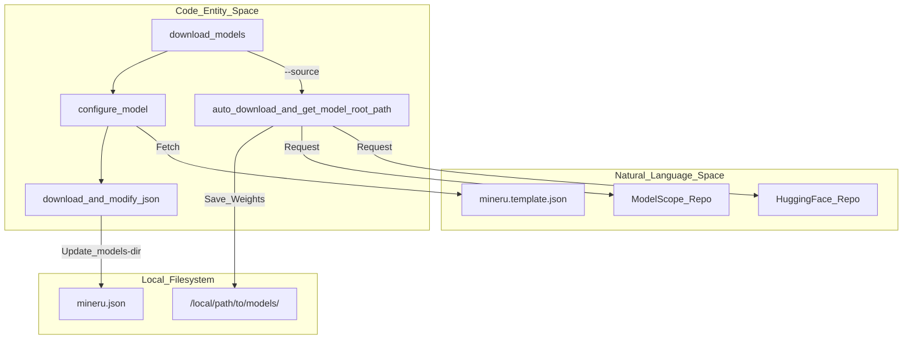
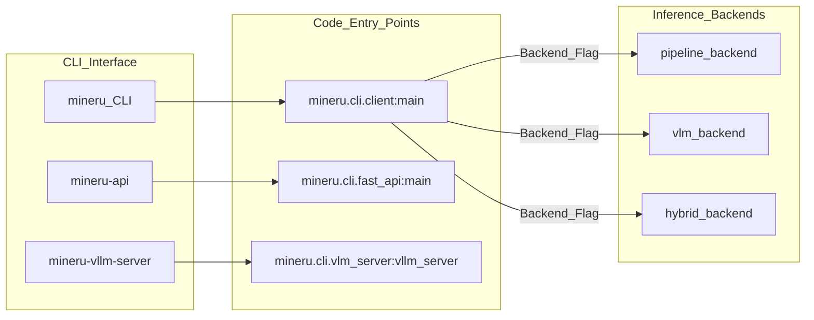

# Getting Started & Installation

<details>
<summary>Relevant source files</summary>

The following files were used as context for generating this wiki page:

- [README.md](README.md)
- [README_zh-CN.md](README_zh-CN.md)
- [docs/en/quick_start/extension_modules.md](docs/en/quick_start/extension_modules.md)
- [docs/en/quick_start/index.md](docs/en/quick_start/index.md)
- [docs/en/usage/model_source.md](docs/en/usage/model_source.md)
- [docs/en/usage/quick_usage.md](docs/en/usage/quick_usage.md)
- [docs/zh/quick_start/extension_modules.md](docs/zh/quick_start/extension_modules.md)
- [docs/zh/quick_start/index.md](docs/zh/quick_start/index.md)
- [docs/zh/usage/model_source.md](docs/zh/usage/model_source.md)
- [docs/zh/usage/quick_usage.md](docs/zh/usage/quick_usage.md)
- [mineru.template.json](mineru.template.json)
- [mineru/cli/models_download.py](mineru/cli/models_download.py)
- [mineru/utils/llm_aided.py](mineru/utils/llm_aided.py)
- [mineru/utils/models_download_utils.py](mineru/utils/models_download_utils.py)
- [pyproject.toml](pyproject.toml)

</details>


This page provides a comprehensive technical guide for installing MinerU, configuring the necessary model assets, and executing your first document conversion. MinerU supports multiple backends (Pipeline, VLM, and Hybrid) and can be deployed across various hardware architectures.

## 1. Installation

MinerU is distributed via PyPI and can be installed using standard Python package managers like `pip` or `uv`. The `mineru` package provides the core library, CLI tools, and optional extensions for various acceleration engines.

### Prerequisites
- **Python Version**: `3.10` to `3.13` is required [pyproject.toml:12-12]().
- **Hardware Support**: While CPU-only is supported, hardware acceleration (NVIDIA CUDA, Apple MPS, or various domestic accelerators) is highly recommended for performance [docs/en/quick_start/index.md:23-25]().

### Installation Scenarios
MinerU supports modular installation based on the intended use case via optional dependencies [pyproject.toml:65-118]().

| Scenario | Command | Description |
| :--- | :--- | :--- |
| **Core Functionality** | `uv pip install "mineru[core]"` | Installs core dependencies including `vlm`, `pipeline`, and `gradio` [docs/en/quick_start/extension_modules.md:9-10](). |
| **S3 Storage Support** | `uv pip install "mineru[s3]"` | Adds support for reading/writing to S3 buckets [docs/en/quick_start/extension_modules.md:17-18](). |
| **VLM Acceleration (vLLM)** | `uv pip install "mineru[core,vllm]"` | Adds `vllm` for optimized VLM inference (Linux recommended) [docs/en/quick_start/extension_modules.md:29-30](). |
| **VLM Acceleration (LMDeploy)** | `uv pip install "mineru[core,lmdeploy]"` | Adds `lmdeploy` as an alternative VLM acceleration engine [docs/en/quick_start/extension_modules.md:45-46](). |
| **Minimal Client** | `uv pip install mineru` | Installs base dependencies for connecting to remote OpenAI-compatible servers [docs/en/quick_start/extension_modules.md:55-56](). |

### Hardware-Specific Notes
- **VLM Acceleration**: Both `vllm` and `lmdeploy` provide nearly identical acceleration effects for graphics cards with Volta architecture and later (8GB+ VRAM) [docs/en/quick_start/extension_modules.md:24-26](). It is not recommended to install both simultaneously to avoid conflicts [docs/en/quick_start/extension_modules.md:40-40]().
- **CUDA Versions**: The default `vllm` installation requires a CUDA 13.0-compatible driver. For CUDA 12.9 environments, users should follow specific installation paths or use the provided Docker images [docs/en/quick_start/extension_modules.md:31-33]().
- **Windows Users**: For CUDA acceleration on Windows, users must manually install `torch` and `torchvision` matching their CUDA version from the official PyTorch website [docs/en/usage/quick_usage.md:23-25]().

Sources: [pyproject.toml:12-120](), [docs/en/quick_start/extension_modules.md:6-67](), [docs/en/quick_start/index.md:23-30](), [docs/en/usage/quick_usage.md:23-25]()

## 2. Model Download & Configuration

MinerU relies on several specialized deep learning models (layout detection, formula recognition, OCR, etc.). These must be downloaded before the first run.

### Automatic Download Tool
The `mineru-models-download` CLI tool (implemented in `mineru/cli/models_download.py`) automates fetching models from HuggingFace or ModelScope and generates the initial `mineru.json` configuration [mineru/cli/models_download.py:129-133]().

```bash
# Interactive download
mineru-models-download

# Specify source and type directly
mineru-models-download --source modelscope --model_type all
```

### Configuration Logic
The download tool performs the following steps:
1.  **Source Selection**: Valid remote sources are `huggingface` and `modelscope`. The `auto` option detects the best source based on network connectivity [mineru/cli/models_download.py:18-18]().
2.  **Asset Fetching**: Downloads pipeline models (e.g., `pp_doclayout_v2`, `unimernet_small`, `slanet_plus`, `pp_formulanet_plus_m`) and VLM models to a local directory [mineru/cli/models_download.py:38-51]().
3.  **Config Generation**: Downloads `mineru.template.json` from GitHub and creates/updates `mineru.json`, persisting the `models-dir` paths [mineru/cli/models_download.py:21-33]().

**Diagram: Model Initialization Flow**
This diagram illustrates how the CLI tool interacts with remote repositories and the local filesystem to prepare the environment.


Sources: [mineru/cli/models_download.py:13-90](), [mineru/cli/models_download.py:114-155](), [mineru/utils/models_download_utils.py:15-102]()

## 3. The `mineru.json` Configuration

The `mineru.json` file is the central configuration hub. By default, it is located in the user's home directory (`~`), but can be overridden via the `MINERU_TOOLS_CONFIG_JSON` environment variable [mineru/utils/models_download_utils.py:25-28]().

### Key Configuration Blocks
| Key | Purpose |
| :--- | :--- |
| `models-dir` | Local paths for `pipeline` and `vlm` model weights [mineru/cli/models_download.py:26-28](). |
| `config_version` | Used by the download tool to determine if the config needs an update (threshold `1.3.2`) [mineru/utils/models_download_utils.py:16-16](). |
| `llm-aided-config` | Configuration for LLM-assisted title hierarchy refinement, supporting OpenAI-compatible APIs [mineru/utils/llm_aided.py:160-167](). |
| `latex-delimiter-config` | Configures LaTeX formula delimiters (defaults to `$`) [docs/en/usage/quick_usage.md:126-129](). |

Users can update model paths manually in `mineru.json` if they move the downloaded folders [docs/en/usage/quick_usage.md:155-158]().

Sources: [mineru/cli/models_download.py:21-33](), [mineru/utils/models_download_utils.py:23-29](), [mineru/utils/llm_aided.py:160-188](), [docs/en/usage/quick_usage.md:117-158]()

## 4. Running Your First Conversion

### Command Line Interface (CLI)
The `mineru` command is the primary entry point for processing local files [pyproject.toml:129-129]().

```bash
# Basic conversion using default backend
mineru -p demo.pdf -o ./output

# Specify backend and input directory
mineru -p ./docs_dir -o ./output -b pipeline
```

### Data Flow Architecture
When a command is executed, the CLI orchestrates the request to specific backends based on the `-b` flag. If no `--api-url` is provided, the CLI launches a temporary local `mineru-api` service [docs/en/usage/quick_usage.md:18-19]().

**Diagram: CLI Execution and Backend Dispatch**
Associating CLI commands with internal orchestration logic and backends.


Sources: [pyproject.toml:128-136](), [docs/en/usage/quick_usage.md:12-14](), [docs/en/usage/quick_usage.md:31-33](), [docs/en/usage/quick_usage.md:15-19]()

## 5. Model Sources & Environment Variables

MinerU supports switching between different model repositories to accommodate network conditions.

| Variable | Default | Description |
| :--- | :--- | :--- |
| `MINERU_MODEL_SOURCE` | `huggingface` | Switch between `huggingface`, `modelscope`, or `local` [mineru/cli/models_download.py:17-18](). |
| `MINERU_TOOLS_CONFIG_JSON` | `mineru.json` | Custom filename/path for the configuration file [mineru/utils/models_download_utils.py:25-25](). |
| `MINERU_API_TASK_RETENTION_SECONDS` | `86400` | Retention duration for completed/failed tasks in `mineru-api` [docs/en/usage/quick_usage.md:49-50](). |

### Switching Sources
To use ModelScope (recommended for users in China):
```bash
export MINERU_MODEL_SOURCE=modelscope
mineru -p demo.pdf -o ./output
```

To use locally downloaded models (offline mode):
```bash
export MINERU_MODEL_SOURCE=local
mineru -p demo.pdf -o ./output
```
In `local` mode, the system retrieves the root paths for `pipeline` and `vlm` repos from the configuration file [mineru/utils/models_download_utils.py:11-11]().

### Model Path Mapping
The utility `auto_download_and_get_model_root_path` handles the resolution of model IDs based on the selected source and repository mode (`pipeline` or `vlm`) [mineru/utils/models_download_utils.py:102-110]().

| Mode | Models Downloaded | Repo Configuration |
| :--- | :--- | :--- |
| `pipeline` | Layout, OCR, Formula, Table [mineru/cli/models_download.py:38-46]() | `models-dir.pipeline` |
| `vlm` | Vision-Language Models [mineru/cli/models_download.py:57-57]() | `models-dir.vlm` |

Sources: [mineru/cli/models_download.py:17-18](), [mineru/utils/models_download_utils.py:11-28](), [docs/en/usage/quick_usage.md:4-7](), [docs/en/usage/quick_usage.md:43-51]()
