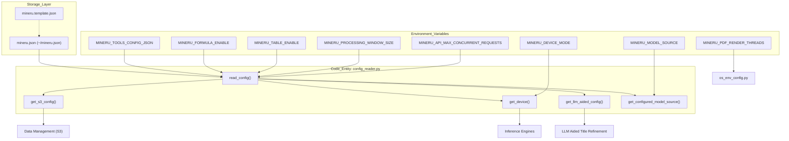
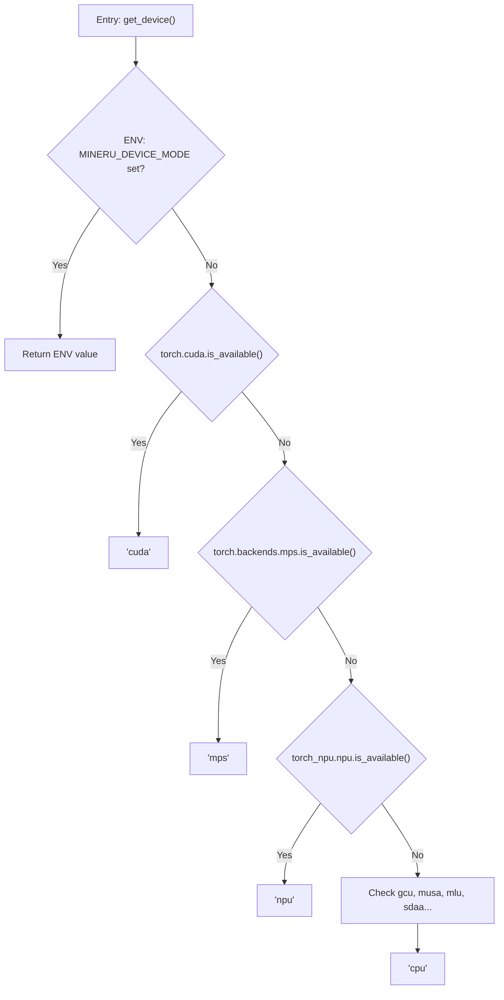
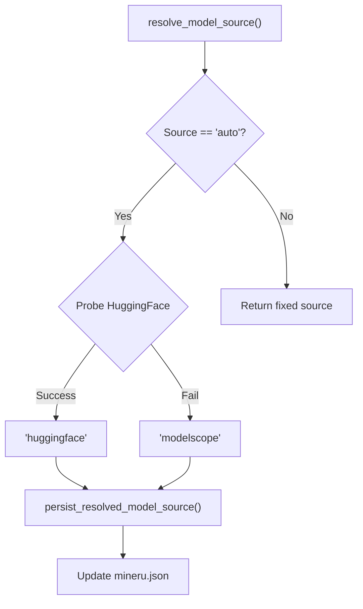

# Configuration Reference

Relevant source files

The following files were used as context for generating this wiki page:

- [docs/en/usage/model_source.md](docs/en/usage/model_source.md)
- [docs/zh/usage/model_source.md](docs/zh/usage/model_source.md)
- [mineru.template.json](mineru.template.json)
- [mineru/cli/models_download.py](mineru/cli/models_download.py)
- [mineru/utils/config_reader.py](mineru/utils/config_reader.py)
- [mineru/utils/llm_aided.py](mineru/utils/llm_aided.py)
- [mineru/utils/model_utils.py](mineru/utils/model_utils.py)
- [mineru/utils/models_download_utils.py](mineru/utils/models_download_utils.py)
- [mineru/utils/os_env_config.py](mineru/utils/os_env_config.py)

This page provides a detailed technical reference for MinerU's configuration system, including the `mineru.json` file, environment variables, and the `config_reader` module that resolves these settings at runtime.

## Configuration Architecture

MinerU uses a multi-layered configuration approach. Settings are first defined in a template, then overridden by a user-provided JSON file, and finally can be superseded by environment variables for runtime flexibility.

### Configuration Resolution Flow

The following diagram illustrates how the `config_reader` module resolves settings from different sources.

**Configuration Resolution Process**

Sources: [mineru/utils/config_reader.py:14-30](), [mineru/utils/config_reader.py:33-60](), [mineru/utils/config_reader.py:63-78](), [mineru/utils/config_reader.py:105-137](), [mineru/utils/config_reader.py:140-155](), [mineru/utils/config_reader.py:158-169](), [mineru/utils/os_env_config.py:15-17]()

---

## The mineru.json Configuration File

The primary configuration file is `mineru.json`. By default, MinerU looks for this file in the user's home directory (`~/mineru.json`), but this can be overridden by setting the `MINERU_TOOLS_CONFIG_JSON` environment variable [mineru/utils/config_reader.py:14-23]().

### Key Configuration Sections

| Section | Description |
| :--- | :--- |
| `models-dir` | Local directory path where model weights are stored. Supports separate paths for `pipeline` and `vlm` backends [mineru/utils/config_reader.py:219-226](), [mineru.template.json:25-28](). |
| `model-source` | Remote repository source. Supports `huggingface`, `modelscope`, or `auto` [mineru/utils/config_reader.py:33-60](), [mineru.template.json:29](). |
| `bucket_info` | Dictionary containing S3/MinIO credentials (AK, SK, Endpoint) indexed by bucket name [mineru/utils/config_reader.py:63-78](). |
| `latex-delimiter-config` | Defines delimiters for `inline` and `display` formulas (e.g., `$` vs `$$`) [mineru/utils/config_reader.py:195-204](), [mineru.template.json:6-15](). |
| `llm-aided-config` | Configuration for LLM-assisted structural refinement, specifically `title_aided` [mineru/utils/config_reader.py:207-216](), [mineru.template.json:16-24](). |
| `config_version` | Tracks the schema version of the configuration file [mineru.template.json:30](). |

### LLM-Aided Configuration
The `llm-aided-config` block enables the `llm_aided` module to refine document structure using OpenAI-compatible APIs [mineru/utils/llm_aided.py:160-167]().

| Key | Description |
| :--- | :--- |
| `api_key` | API key for the LLM provider [mineru.template.json:18](). |
| `base_url` | Base URL for the OpenAI-compatible endpoint [mineru.template.json:19](). |
| `model` | The specific model ID to use (e.g., `qwen3.5-plus`) [mineru.template.json:20](). |
| `enable_thinking` | Enables reasoning/thinking blocks. If enabled, the logic strips `</think>` tags [mineru/utils/llm_aided.py:184-200](). |
| `enable` | Boolean toggle to activate LLM refinement at runtime [mineru.template.json:22](). |

Sources: [mineru/utils/config_reader.py:207-216](), [mineru/utils/llm_aided.py:160-200](), [mineru.template.json:1-32]()

---

## Environment Variables

Environment variables provide the highest level of override and are frequently used in Docker and CI/CD environments.

### System & Device Control
*   `MINERU_DEVICE_MODE`: Manually force the device type (e.g., `cpu`, `cuda`, `mps`, `npu`, `musa`, `mlu`). If not set, `get_device()` performs auto-detection [mineru/utils/config_reader.py:105-137]().
*   `MINERU_TOOLS_CONFIG_JSON`: Specifies an absolute or relative path to the configuration JSON file [mineru/utils/config_reader.py:14-23]().
*   `MINERU_MODEL_SOURCE`: Configures model source. Supported values: `huggingface`, `modelscope`, `local`. Overrides `mineru.json` [docs/en/usage/model_source.md:11-12]().

### Feature Toggles & Performance
*   `MINERU_FORMULA_ENABLE`: Global toggle for formula detection and recognition [mineru/utils/config_reader.py:140-143]().
*   `MINERU_TABLE_ENABLE`: Global toggle for table recognition [mineru/utils/config_reader.py:146-149]().
*   `MINERU_OCR_DET_MASK_INLINE_FORMULA_ENABLE`: If enabled, masks detected inline formulas during the OCR detection phase [mineru/utils/config_reader.py:152-155]().
*   `MINERU_PROCESSING_WINDOW_SIZE`: Sets the window size for document processing chunks. Defaults to 64 [mineru/utils/config_reader.py:158-169]().
*   `MINERU_API_MAX_CONCURRENT_REQUESTS`: Limits concurrent requests in API mode. Defaults to 3 [mineru/utils/config_reader.py:172-192]().
*   `MINERU_PDF_RENDER_THREADS`: Number of threads used for PDF rendering. Defaults to 3 [mineru/utils/os_env_config.py:15-17]().
*   `MINERU_PDF_RENDER_TIMEOUT`: Timeout in seconds for PDF rendering operations. Defaults to 300 [mineru/utils/os_env_config.py:10-12]().

Sources: [mineru/utils/config_reader.py:105-192](), [mineru/utils/os_env_config.py:10-28](), [docs/en/usage/model_source.md:11-26]()

---

## Runtime Configuration Resolution

The `config_reader` module provides utility functions to resolve settings dynamically.

### Device Detection Logic
The `get_device()` function in `config_reader.py` follows a specific priority order:
1. Check `MINERU_DEVICE_MODE` environment variable.
2. Check `torch.cuda.is_available()` -> `cuda`.
3. Check `torch.backends.mps.is_available()` -> `mps`.
4. Check specialized hardware in order: `npu` (Ascend), `gcu` (Enflame), `musa` (Moore Threads), `mlu` (Cambricon), `sdaa` (Tecorigin).
5. Default to `cpu`.

**Hardware Detection Sequence**

Sources: [mineru/utils/config_reader.py:105-137]()

### Model Source Resolution
MinerU handles model sources with logic in `models_download_utils.py` and `config_reader.py`. When set to `auto`, it probes HuggingFace accessibility [mineru/utils/models_download_utils.py:190-200](). Once resolved, it persists the actual source to `mineru.json` [mineru/utils/models_download_utils.py:88-99]().

**Model Source Resolution Logic**

Sources: [mineru/utils/models_download_utils.py:88-101](), [mineru/utils/models_download_utils.py:189-204](), [docs/en/usage/model_source.md:25-31]()

### Configuration Persistence
When models are downloaded via the `mineru-models-download` CLI command, the system automatically updates the configuration file. The `persist_downloaded_model_config` function writes the local path for the downloaded repository (either `pipeline` or `vlm`) and the source used into `mineru.json` [mineru/utils/models_download_utils.py:168-187]().

---

## Configuration API Reference

### config_reader.py Functions

| Function | Role |
| :--- | :--- |
| `read_config()` | Loads and parses `mineru.json` [mineru/utils/config_reader.py:17-30](). |
| `get_configured_model_source()` | Reads the model source from config [mineru/utils/config_reader.py:33-60](). |
| `get_s3_config(bucket_name)` | Retrieves S3 credentials [mineru/utils/config_reader.py:63-78](). |
| `get_device()` | Detects hardware acceleration [mineru/utils/config_reader.py:105-137](). |
| `get_latex_delimiter_config()` | Returns formula delimiter settings [mineru/utils/config_reader.py:195-204](). |
| `get_llm_aided_config()` | Retrieves structural refinement config [mineru/utils/config_reader.py:207-216](). |
| `get_local_models_dir()` | Returns local model directory [mineru/utils/config_reader.py:219-226](). |

### os_env_config.py Functions

| Function | Role |
| :--- | :--- |
| `get_load_images_threads()` | Returns PDF rendering thread count [mineru/utils/os_env_config.py:15-17](). |
| `get_load_images_timeout()` | Returns PDF rendering timeout [mineru/utils/os_env_config.py:10-12](). |

Sources: [mineru/utils/config_reader.py:17-226](), [mineru/utils/os_env_config.py:5-28](), [mineru/utils/models_download_utils.py:168-187]()
