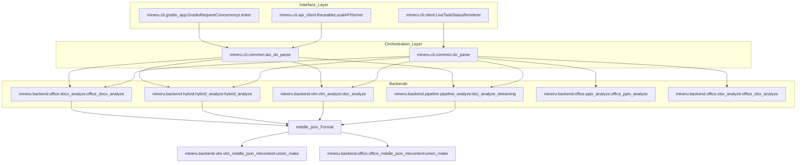
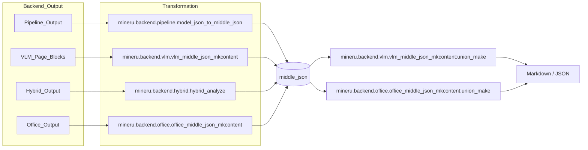

# Core Architecture

Relevant source files

The following files were used as context for generating this wiki page:

- [mineru/backend/pipeline/model_json_to_middle_json.py](mineru/backend/pipeline/model_json_to_middle_json.py)
- [mineru/backend/pipeline/pipeline_analyze.py](mineru/backend/pipeline/pipeline_analyze.py)
- [mineru/cli/client.py](mineru/cli/client.py)
- [mineru/cli/common.py](mineru/cli/common.py)
- [mineru/cli/gradio_app.py](mineru/cli/gradio_app.py)
- [mineru/utils/pdf_classify.py](mineru/utils/pdf_classify.py)
- [mineru/utils/pdf_image_tools.py](mineru/utils/pdf_image_tools.py)
- [mineru/utils/pdf_reader.py](mineru/utils/pdf_reader.py)
- [mineru/utils/pdf_text_tool.py](mineru/utils/pdf_text_tool.py)
- [mineru/utils/pdfium_guard.py](mineru/utils/pdfium_guard.py)
- [mineru/utils/span_pre_proc.py](mineru/utils/span_pre_proc.py)

MinerU is designed as a multi-backend document parsing framework that transforms raw PDF bytes, images, or Office documents into structured Markdown and JSON. The system abstracts the complexity of different AI models and OCR engines through a unified orchestration layer, allowing users to choose between speed, accuracy, and local vs. remote computing power.

## High-Level Data Flow

The data flow in MinerU typically follows a four-stage process:
1.  **Input Handling**: Raw bytes are read and validated via `read_fn`, which handles PDF, various image formats, and office documents [mineru/cli/common.py:171-184]().
2.  **Orchestration**: The system determines which backend to invoke based on the `backend` parameter. For programmatic use, `do_parse` or `aio_do_parse` act as the primary entry points.
3.  **Backend Analysis**: One of the three core backends (Pipeline, VLM, or Hybrid) processes the document to generate a raw `model_output`.
4.  **Standardization & Export**: Raw outputs are converted into a standardized `middle_json` format, which is then processed by `union_make` to generate final Markdown or Content Lists [mineru/cli/common.py:24-25]().

### System Component Diagram
The following diagram illustrates how CLI/API calls translate into internal code entities and flow through the backends.

**MinerU Execution Path**

Sources: [mineru/cli/client.py:179-183](), [mineru/cli/common.py:24-30](), [mineru/cli/gradio_app.py:72-133](), [mineru/cli/gradio_app.py:54-54]()

---

## The Three Backends

MinerU provides three distinct architectural paths for document parsing, each optimized for different hardware and accuracy requirements.

### 1. Pipeline Backend
The **Pipeline Backend** is the "traditional" approach. It utilizes a series of specialized small models: YOLO-based layout detection (`PP-DocLayoutV2`), specialized models for formula detection (MFD) and recognition (MFR), and an OCR engine for text extraction. It supports streaming processing via window-based batching.

*   **Key Logic**: Orchestrated by `doc_analyze_streaming` [mineru/backend/pipeline/pipeline_analyze.py:157-166](), which manages a processing window to handle multi-file batches efficiently [mineru/backend/pipeline/pipeline_analyze.py:207-212](). It uses a `ModelSingleton` to manage lifecycle for layout and OCR models [mineru/backend/pipeline/pipeline_analyze.py:33-59]().
*   **Transformation**: Model results are converted to the intermediate format via `append_batch_results_to_middle_json` [mineru/backend/pipeline/model_json_to_middle_json.py:107-117]().
*   **For details, see [Pipeline Backend](#2.1).**

### 2. VLM Backend
The **VLM Backend** leverages Vision-Language Models (like `MinerU2.5-Pro`) to perform end-to-end document understanding. It supports multiple inference engines including `vllm`, `lmdeploy`, `mlx`, `sglang`, and `transformers`.

*   **Key Logic**: Managed by engine utilities that select the appropriate runner (e.g., `vllm`, `lmdeploy`) [mineru/utils/engine_utils.py:20-20](). It uses `vlm_doc_analyze` as the primary entry point for document analysis [mineru/cli/common.py:26-27]().
*   **For details, see [VLM Backend](#2.2).**

### 3. Hybrid Backend
The **Hybrid Backend** combines the structural layout understanding of VLMs with the high-precision OCR and formula recognition of the pipeline models. It uses the VLM to define document structure and then "fills" the content using specialized models for text and formulas.

*   **Key Logic**: Invoked via `_load_hybrid_analyze_entrypoint` which dynamically loads the hybrid module to ensure local dependencies like `torch` are present [mineru/cli/common.py:76-87](). It requires `mineru[pipeline]` dependencies to function [mineru/cli/common.py:60-66]().
*   **For details, see [Hybrid Backend](#2.3).**

---

## Standardized Intermediate Representation (`middle_json`)

Regardless of the backend used, all data is eventually transformed into a common schema known as `middle_json`. This format decouples model-specific output from the final document generation logic.

**Data Flow to Output**

Sources: [mineru/cli/common.py:24-30](), [mineru/backend/pipeline/model_json_to_middle_json.py:72-81](), [mineru/backend/pipeline/pipeline_analyze.py:12-17]()

### Key Format Components
| Component | Responsibility |
| :--- | :--- |
| `middle_json` | The internal intermediate representation that standardizes all model outputs [mineru/cli/common.py:24-25](). |
| `union_make` | The final assembly function that handles language-aware text merging and formatting for different modes (Markdown, Content List V1/V2) [mineru/cli/common.py:24-25](). |
| `MakeMode` | Defines output targets: `MM_MD`, `CONTENT_LIST`, `CONTENT_LIST_V2` [mineru/cli/common.py:21-21](). |

**For details, see [middle_json Format & Content Generation](#2.4).**

---

## Interface Orchestration

The system is exposed via several entry points that all converge on the `do_parse` or `aio_do_parse` logic.

*   **CLI**: Provides a batch-capable client with live status rendering via `LiveTaskStatusRenderer` [mineru/cli/client.py:179-183](). It handles task planning and unique naming for output files via `uniquify_task_stems` [mineru/cli/client.py:134-168]().
*   **FastAPI**: Provides a multi-file `/tasks` endpoint. It supports asynchronous task submission and utilizes the core parsing logic.
*   **Gradio**: Offers an interactive UI with local API integration via `ReusableLocalAPIServer` [mineru/cli/gradio_app.py:54-54]() and a concurrency limiter `GradioRequestConcurrencyLimiter` [mineru/cli/gradio_app.py:72-133]().
*   **Client-Side Post-processing**: The `regenerate_client_side_outputs` function allows re-rendering Markdown/JSON from an existing `middle_json` without re-running heavy inference [mineru/cli/client.py:51-51]().

Sources: [mineru/cli/client.py:134-168](), [mineru/cli/gradio_app.py:54-133](), [mineru/cli/common.py:110-118](), [mineru/cli/client.py:51-51]()
