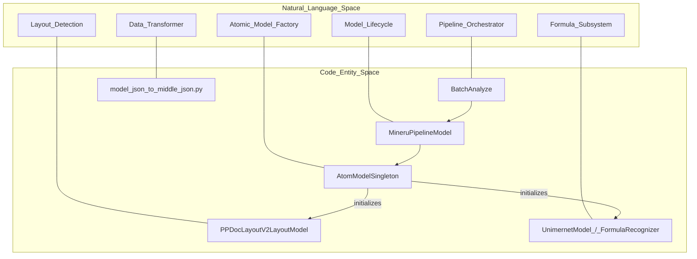
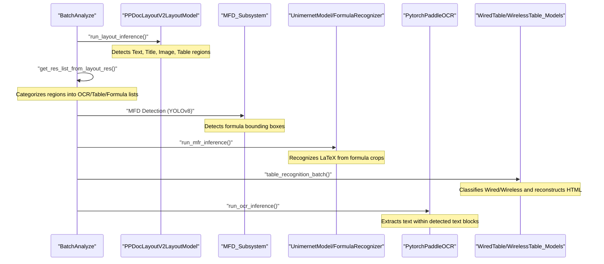

# Pipeline Backend

Relevant source files

The following files were used as context for generating this wiki page:

- [mineru/backend/pipeline/batch_analyze.py](mineru/backend/pipeline/batch_analyze.py)
- [mineru/backend/pipeline/model_init.py](mineru/backend/pipeline/model_init.py)
- [mineru/backend/pipeline/model_json_to_middle_json.py](mineru/backend/pipeline/model_json_to_middle_json.py)
- [mineru/backend/pipeline/para_split.py](mineru/backend/pipeline/para_split.py)
- [mineru/backend/pipeline/pipeline_analyze.py](mineru/backend/pipeline/pipeline_analyze.py)
- [mineru/model/utils/tools/infer/predict_system.py](mineru/model/utils/tools/infer/predict_system.py)
- [mineru/utils/cut_image.py](mineru/utils/cut_image.py)
- [mineru/utils/ocr_utils.py](mineru/utils/ocr_utils.py)
- [mineru/utils/span_block_fix.py](mineru/utils/span_block_fix.py)

The Pipeline Backend is the traditional multi-model orchestration layer in MinerU. It employs a sequential approach to document analysis, where specialized computer vision models are chained together to perform layout detection, formula recognition, OCR, and table reconstruction. This backend is optimized for high-throughput batch processing and precise control over individual model components.

## Architecture Overview

The pipeline operates by transforming raw PDF pages into a structured `middle_json` format. The process is managed by `BatchAnalyze`, which coordinates model initialization, batching, and data transformation [mineru/backend/pipeline/batch_analyze.py:52-77](). Unlike the VLM or Hybrid backends, the Pipeline backend relies heavily on atomic CV models for each semantic task.

### Code Entity Relationship
The following diagram illustrates how high-level pipeline concepts map to specific classes and functions in the codebase.

Title: Pipeline Backend Entity Mapping

Sources: [mineru/backend/pipeline/batch_analyze.py:52-77](), [mineru/backend/pipeline/model_init.py:126-130](), [mineru/backend/pipeline/model_init.py:148-158](), [mineru/backend/pipeline/model_json_to_middle_json.py:1-25]()

## Model Orchestration & Lifecycle

### AtomModelSingleton
`AtomModelSingleton` provides granular access to individual "atomic" models such as OCR, Table Classification, and Layout. It implements a thread-safe singleton pattern using a `threading.RLock` to prevent redundant model loading [mineru/backend/pipeline/model_init.py:148-158]().
*   **Caching Mechanism**: It uses a complex key based on model parameters (e.g., `det_db_box_thresh`, `lang`, `device`) to cache model instances in the `_models` dictionary [mineru/backend/pipeline/model_init.py:161-187]().
*   **Atomic Models**: Managed via the `AtomicModel` registry, including `Layout`, `MFR`, `OCR`, `WirelessTable`, `WiredTable`, `TableCls`, and `TableOrientationCls` [mineru/backend/pipeline/model_init.py:189-220]().

### Inference Locking
To support concurrency between backends (e.g., pipeline and hybrid), MinerU implements inference-level locks. Functions like `run_layout_inference`, `run_mfr_inference`, and `run_ocr_inference` wrap native model calls to prevent race conditions on shared GPU resources [mineru/backend/pipeline/model_init.py:22-60](). These locks are globally toggled via the `MINERU_ENABLE_PIPELINE_INFERENCE_LOCKS` environment variable [mineru/backend/pipeline/model_init.py:28-30]().

## The BatchAnalyze Pipeline

The `BatchAnalyze` class is the primary execution engine. It implements a multi-stage process to extract information from page images using optimized batch sizes for different hardware [mineru/backend/pipeline/batch_analyze.py:38-41]().

### Data Flow Execution
Title: BatchAnalyze Execution Flow

Sources: [mineru/backend/pipeline/batch_analyze.py:12-35](), [mineru/backend/pipeline/model_init.py:42-60](), [mineru/backend/pipeline/model_init.py:148-187](), [mineru/backend/pipeline/batch_analyze.py:52-81]()

### Key Processing Stages
1.  **Layout Detection**: Uses `PPDocLayoutV2LayoutModel` to identify primary document structures like `doc_title`, `abstract`, `table`, and `image` [mineru/backend/pipeline/model_init.py:126-130]().
2.  **Formula Processing**:
    *   **Recognition (MFR)**: Uses either `UnimernetModel` or `FormulaRecognizer` (PP-FormulaNet-Plus-M). The selection is controlled by the `MINERU_FORMULA_CH_SUPPORT` environment variable [mineru/backend/pipeline/model_init.py:62-69]().
3.  **Table Analysis**:
    *   **Orientation**: `MineruTableOrientationClsModel` corrects table rotation before recognition [mineru/backend/pipeline/model_init.py:72-82]().
    *   **Classification**: `PaddleTableClsModel` determines if a table is "Wired" or "Wireless" [mineru/backend/pipeline/model_init.py:85-86]().
    *   **Reconstruction**: Uses `UnetTableModel` (Wired) or `PaddleTableModel` (Wireless) to produce structured HTML [mineru/backend/pipeline/model_init.py:89-112]().
4.  **OCR**: The `ocr_model_init` function initializes the `PytorchPaddleOCR` engine [mineru/backend/pipeline/model_init.py:133-145](). `BatchAnalyze` can optionally mask inline formulas during OCR detection to prevent noise [mineru/backend/pipeline/batch_analyze.py:84-97]().

## Data Transformation: Model JSON to Middle JSON

After models generate raw detections, the data is standardized into the `middle_json` format via `model_json_to_middle_json.py`.

### Page Info Construction
The function `page_model_info_to_page_info` orchestrates the conversion [mineru/backend/pipeline/model_json_to_middle_json.py:28-64]().
1.  **MagicModel Instance**: A `MagicModel` object is created to handle the logic of merging and filtering blocks [mineru/backend/pipeline/model_json_to_middle_json.py:34-42]().
2.  **Image Cropping**: For spans marked as `IMAGE`, `TABLE`, `CHART`, or `INTERLINE_EQUATION`, the system performs physical cropping and persistence via `cut_image_and_table` [mineru/backend/pipeline/model_json_to_middle_json.py:50-57]().
3.  **Table Image Replacement**: Replaces base64 encoded images inside table HTML with local file paths [mineru/backend/pipeline/model_json_to_middle_json.py:60]().

### Intermediate Format Mapping
| Source Model Output | Middle JSON Entity | Description |
| :--- | :--- | :--- |
| PPDocLayoutV2 | `preproc_blocks` | Structured regions (Text, Title, etc.) [mineru/backend/pipeline/model_json_to_middle_json.py:45]() |
| MFR | `interline_equation` | LaTeX content with bounding boxes [mineru/backend/pipeline/model_json_to_middle_json.py:51-56]() |
| OCR | `spans` | Text fragments with confidence and coordinates [mineru/backend/pipeline/model_json_to_middle_json.py:140-142]() |

## Formula and Text Block Refinement

The pipeline includes specialized logic to handle edge cases in document layout:

*   **Post-OCR Recognition**: If initial extraction fails (e.g., text embedded in images), `_apply_post_ocr` triggers a secondary OCR pass on cropped span images using `run_ocr_inference` to recover content [mineru/backend/pipeline/model_json_to_middle_json.py:148-194]().
*   **Vertical Text Handling**: For documents with vertical text, the pipeline calculates the height-to-width ratio of spans. If more than 80% of spans are vertical, the block is processed using `merge_spans_to_vertical_line` [mineru/utils/span_block_fix.py:9-30](), [mineru/utils/span_block_fix.py:39-42]().
*   **Paragraph Splitting**: The `para_split` module analyzes line alignment and "ragged" edges to detect paragraph boundaries [mineru/backend/pipeline/para_split.py:16-56](). It identifies list patterns and index blocks based on indentation and numeric markers [mineru/backend/pipeline/para_split.py:59-117]().

## Performance Optimization

### Batching Strategies
The pipeline defines specific base batch sizes for different tasks to balance throughput and memory [mineru/backend/pipeline/batch_analyze.py:38-41]():
*   **Layout Detection**: 1 (`LAYOUT_BASE_BATCH_SIZE`)
*   **MFR (Formula)**: 16 (`MFR_BASE_BATCH_SIZE`)
*   **OCR Detection**: 8 (`OCR_DET_BASE_BATCH_SIZE`)
*   **Table Classification**: 16 (`TABLE_Wired_Wireless_CLS_BATCH_SIZE`)

### Memory Management
The `clean_memory` utility is used to manage hardware resources after intensive processing [mineru/backend/pipeline/pipeline_analyze.py:23](). The `AtomModelSingleton` ensures that only one instance of each model configuration exists in memory [mineru/backend/pipeline/model_init.py:148-158]().

### PDF Rendering & Streaming
PDF images are loaded via `load_images_from_pdf_doc` [mineru/backend/pipeline/pipeline_analyze.py:22](). The `doc_analyze_streaming` function implements a "processing window" strategy (default 64 pages) to process large documents in chunks, reducing peak memory usage [mineru/backend/pipeline/pipeline_analyze.py:157-207](). This window size is configurable via `get_processing_window_size` [mineru/backend/pipeline/pipeline_analyze.py:207]().

Sources: [mineru/backend/pipeline/batch_analyze.py:38-107](), [mineru/backend/pipeline/model_init.py:22-60](), [mineru/backend/pipeline/model_init.py:148-187](), [mineru/backend/pipeline/model_json_to_middle_json.py:28-64](), [mineru/backend/pipeline/model_json_to_middle_json.py:148-194](), [mineru/utils/span_block_fix.py:9-42](), [mineru/backend/pipeline/para_split.py:59-117](), [mineru/backend/pipeline/pipeline_analyze.py:23-42](), [mineru/backend/pipeline/pipeline_analyze.py:157-207]()
