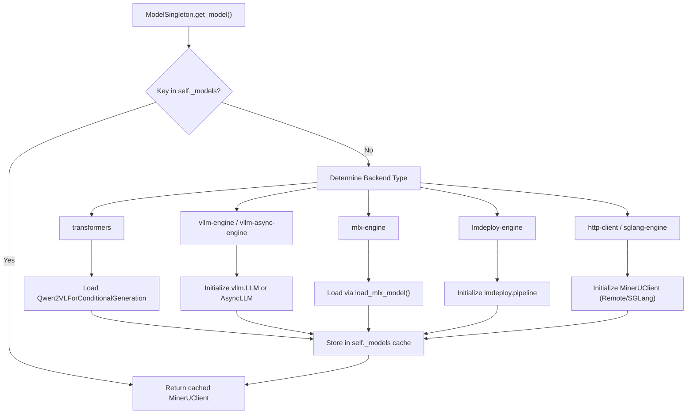
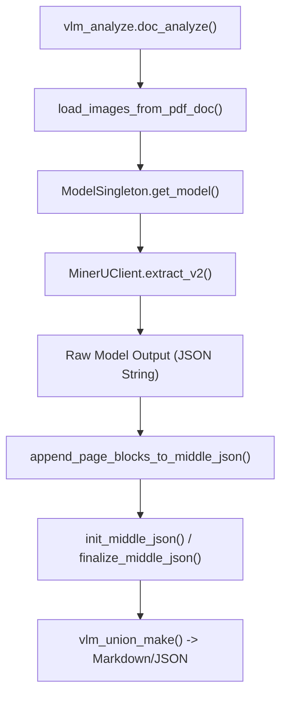

# VLM Backend

Relevant source files

The following files were used as context for generating this wiki page:

- [mineru/backend/vlm/utils.py](mineru/backend/vlm/utils.py)
- [mineru/backend/vlm/vlm_analyze.py](mineru/backend/vlm/vlm_analyze.py)
- [mineru/cli/vlm_preload.py](mineru/cli/vlm_preload.py)
- [mineru/cli/vlm_server.py](mineru/cli/vlm_server.py)
- [mineru/model/vlm/__init__.py](mineru/model/vlm/__init__.py)
- [mineru/model/vlm/lmdeploy_server.py](mineru/model/vlm/lmdeploy_server.py)
- [mineru/model/vlm/vllm_server.py](mineru/model/vlm/vllm_server.py)
- [mineru/utils/check_sys_env.py](mineru/utils/check_sys_env.py)

The Vision-Language Model (VLM) backend represents the high-accuracy inference path in MinerU. Unlike the traditional pipeline which uses separate models for layout, OCR, and formulas, the VLM backend leverages powerful end-to-end models (primarily MinerU2.5-Pro / Qwen2-VL) to perform document understanding in a unified manner. It is designed to handle complex layouts, mathematical formulas, and tables with high structural integrity.

## ModelSingleton Lifecycle

MinerU manages VLM instances through the `ModelSingleton` class to ensure efficient resource utilization and prevent redundant model loading. This is critical given the high VRAM requirements of VLMs.

- **Initialization**: The `ModelSingleton` follows a classic singleton pattern to maintain a single registry of loaded models in `_models` [mineru/backend/vlm/vlm_analyze.py:43-52]().
- **Model Retrieval**: The `get_model` method uses a cache key composed of `(backend, model_path, server_url)` to store and retrieve `MinerUClient` instances [mineru/backend/vlm/vlm_analyze.py:54-63]().
- **Resource Management**: It handles the setup of various execution environments, including setting default GPU memory utilization via `set_default_gpu_memory_utilization()` [mineru/backend/vlm/vlm_analyze.py:134-135]() and managing batch sizes for different engines [mineru/backend/vlm/vlm_analyze.py:106-107]().
- **Auto-Download**: If no `model_path` is provided for local backends, it triggers `auto_download_and_get_model_root_path` to fetch models from HuggingFace or ModelScope [mineru/backend/vlm/vlm_analyze.py:80-81]().
- **Shutdown**: The `shutdown_cached_models` function is used to clear the singleton and free VRAM during application exit [mineru/backend/vlm/vlm_analyze.py:243-254]().
- **Preloading**: The `preload_vlm_model` function allows for warm-starting the backend by initializing the `ModelSingleton` before the first request arrives [mineru/cli/vlm_preload.py:61-75]().

### Model Loading Logic
Title: "ModelSingleton Initialization Flow"

Sources: [mineru/backend/vlm/vlm_analyze.py:43-205]()

## Supported Inference Engines

The VLM backend supports a wide range of inference engines to accommodate different hardware, from local consumer GPUs to high-throughput servers.

| Engine | Hardware Target | Implementation Detail |
| :--- | :--- | :--- |
| `vllm-engine` | Linux / NVIDIA / NPU | Supports sync `LLM`. Uses `mod_kwargs_by_device_type` for hardware-specific tuning [mineru/backend/vlm/vlm_analyze.py:118-142](). |
| `vllm-async-engine` | Linux / NVIDIA / NPU | Uses `AsyncLLM` for concurrent request handling [mineru/backend/vlm/vlm_analyze.py:143-153](). |
| `lmdeploy-engine` | Linux / Windows | Uses `lmdeploy.pipeline` with either `turbomind` or `pytorch` backends. Supports multiple accelerators (CUDA, Ascend, MACA, Cambricon) [mineru/backend/vlm/vlm_analyze.py:154-178](). |
| `transformers` | General / CPU | Standard HuggingFace implementation using `Qwen2VLForConditionalGeneration`. Uses `get_device()` to resolve execution target [mineru/backend/vlm/vlm_analyze.py:82-105](). |
| `mlx-engine` | Apple Silicon | Utilizes `load_mlx_model` for native macOS acceleration. Requires macOS 13.5+ [mineru/backend/vlm/vlm_analyze.py:108-113](). |
| `sglang-engine` | High-throughput | Initialized via `sglang.Engine` for optimized serving [mineru/backend/vlm/vlm_analyze.py:179-192](). |
| `http-client` | Remote Server | Connects to OpenAI-compatible VLM servers (vLLM/LMDeploy) via `MinerUClient` [mineru/backend/vlm/vlm_analyze.py:193-205](). |

Sources: [mineru/backend/vlm/vlm_analyze.py:82-205](), [mineru/backend/vlm/utils.py:60-80](), [mineru/utils/check_sys_env.py:26-33]()

## The Two-Step Extract Protocol

The VLM backend operates on a protocol orchestrated by `doc_analyze` and `aio_doc_analyze`.

1. **Layout & Text Extraction**: The model processes page images (loaded via `load_images_from_pdf_doc`) to generate a structured JSON-like string containing the document content, including LaTeX for formulas and Markdown/HTML for tables.
2. **Structural Refinement**: The raw model output is parsed and converted into the standardized `middle_json` format via `append_page_blocks_to_middle_json`.

### Custom Logits Processors
To ensure the VLM follows the required structural output format and avoids hallucinations, MinerU can inject `MinerULogitsProcessor` when using the vLLM backend [mineru/backend/vlm/vlm_analyze.py:138-140](). This constrains the model's generation to valid tokens that match the internal schema, ensuring that elements like `table` or `formula` tags are correctly opened and closed. The availability of this feature depends on the hardware's compute capability (>= 8.0 for CUDA) and vLLM version (>= 0.10.1) [mineru/backend/vlm/utils.py:12-57]().

Sources: [mineru/backend/vlm/vlm_analyze.py:138-140](), [mineru/backend/vlm/utils.py:12-57]()

## Data Flow: vlm_analyze to middle_json

The primary entrypoint for the VLM backend is `vlm_analyze.doc_analyze`.

Title: "VLM Backend Execution Pipeline"

### Key Functions and Classes
- `doc_analyze` / `aio_doc_analyze`: The synchronous and asynchronous entrypoints that handle PDF-to-image conversion, model inference, and coordinate the transition to intermediate formats [mineru/backend/vlm/vlm_analyze.py:257-328](), [mineru/backend/vlm/vlm_analyze.py:331-403]().
- `append_page_blocks_to_middle_json`: A transformation layer that parses the VLM's raw JSON-string inference result and maps it into the standardized `middle_json` schema [mineru/backend/vlm/vlm_analyze.py:17-18]().
- `init_middle_json` / `finalize_middle_json`: Lifecycle functions for creating and sealing the intermediate representation [mineru/backend/vlm/vlm_analyze.py:19-20]().
- `vlm_analyze` uses `load_images_from_pdf_doc` from `pdf_image_tools.py` to render PDF pages at a specific DPI (default 200) for the VLM [mineru/utils/pdf_image_tools.py:34-49]().

Sources: [mineru/backend/vlm/vlm_analyze.py:257-403](), [mineru/backend/vlm/vlm_analyze.py:17-21](), [mineru/utils/pdf_image_tools.py:34-49]()

## Standalone VLM Servers

MinerU provides specialized CLI commands to run standalone VLM inference servers. These servers expose an OpenAI-compatible API, allowing MinerU clients to offload heavy VLM computations to remote hardware.

- **mineru-vllm-server**: Starts a vLLM-based server via `vllm_main` [mineru/model/vlm/vllm_server.py:65](). It automatically handles hardware-specific arguments like `gpu_memory_utilization` and `compilation_config` using `mod_kwargs_by_device_type` [mineru/model/vlm/vllm_server.py:55]().
- **mineru-lmdeploy-server**: Launches an LMDeploy server. It supports multiple backends (turbomind/pytorch) and is particularly useful for Windows environments or specific Chinese accelerators like Ascend or MooreThreads [mineru/model/vlm/lmdeploy_server.py:11-90]().
- **mineru-openai-server**: A general-purpose command for starting VLM servers that follow the OpenAI Chat Completions protocol. It acts as a wrapper that dispatches to either vLLM or LMDeploy based on installation availability or user choice [mineru/cli/vlm_server.py:18-59]().

These servers are typically consumed by setting the `backend` to `http-client` and providing the `server_url` in the parse request [mineru/backend/vlm/vlm_analyze.py:193-205]().

Sources: [mineru/model/vlm/lmdeploy_server.py:11-90](), [mineru/model/vlm/vllm_server.py:5-66](), [mineru/cli/vlm_server.py:18-59](), [mineru/backend/vlm/vlm_analyze.py:193-205]()

## Hardware-Specific Configurations

The VLM backend includes logic to optimize performance across different AI accelerators (NPU, MUSA, XPU, etc.).

- **vLLM Device Tuning**: `mod_kwargs_by_device_type` modifies engine parameters based on the `MINERU_VLLM_DEVICE` environment variable [mineru/backend/vlm/utils.py:185-186](). For example, Kunlunxin (`kxpu`) disables chunked prefill and prefix caching [mineru/backend/vlm/utils.py:144-145](), while Corex (`corex`) sets specific compilation modes [mineru/backend/vlm/utils.py:126-131]().
- **LMDeploy Backend Selection**: `set_lmdeploy_backend` automatically chooses between `turbomind` and `pytorch` based on OS (Linux vs Windows) and GPU compute capability [mineru/backend/vlm/utils.py:60-80]().
- **VRAM-Aware Batching**: `set_default_batch_size` calculates the optimal inference batch size based on available VRAM (e.g., 8 for >=16GB, 1 for <8GB) [mineru/backend/vlm/utils.py:95-111]().
- **Accelerator Specifics**: Hardware-specific compilation and block sizes are defined in `_get_device_config` [mineru/backend/vlm/utils.py:114-149]().

Sources: [mineru/backend/vlm/utils.py:60-149](), [mineru/backend/vlm/utils.py:95-111]()
