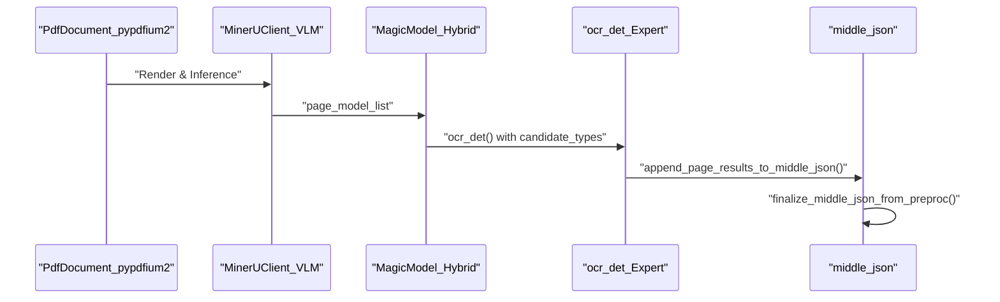

# Hybrid Backend

<details>
<summary>Relevant source files</summary>

The following files were used as context for generating this wiki page:

- [mineru/backend/hybrid/__init__.py](mineru/backend/hybrid/__init__.py)
- [mineru/backend/hybrid/hybrid_analyze.py](mineru/backend/hybrid/hybrid_analyze.py)
- [mineru/backend/hybrid/hybrid_model_output_to_middle_json.py](mineru/backend/hybrid/hybrid_model_output_to_middle_json.py)
- [mineru/backend/utils/para_block_utils.py](mineru/backend/utils/para_block_utils.py)
- [mineru/backend/vlm/model_output_to_middle_json.py](mineru/backend/vlm/model_output_to_middle_json.py)
- [mineru/utils/engine_utils.py](mineru/utils/engine_utils.py)
- [mineru/utils/title_level_postprocess.py](mineru/utils/title_level_postprocess.py)

</details>


The Hybrid Backend (`hybrid-auto-engine`) is a dual-path document analysis system that combines the structural understanding of Vision-Language Models (VLM) with the precision of specialized OCR and formula recognition models. It is designed to overcome the limitations of pure VLM approaches (e.g., hallucination in formulas or complex tables) by using the VLM as a "layout engine" while delegating content extraction to expert models.

## 1. Architecture Overview

The hybrid backend operates by first utilizing a VLM to identify document structure and then applying traditional pipeline models for high-fidelity content extraction. It supports different effort levels (`medium` and `high`) to balance speed and accuracy [mineru/backend/hybrid/hybrid_analyze.py:110-115]().

### Hybrid Pipeline Lifecycle
1.  **VLM Layout Analysis**: The VLM identifies regions (text, title, table, image, equation). In `medium` effort mode, layout labels are mapped to VLM extraction types via `MEDIUM_EFFORT_LAYOUT_LABEL_TO_VLM_TYPE` [mineru/backend/hybrid/hybrid_analyze.py:83-107]().
2.  **MagicModel Reconstruction**: The `MagicModel` class in the hybrid module transforms VLM outputs into a standardized block-based structure, handling coordinate normalization and category mapping [mineru/backend/hybrid/hybrid_model_output_to_middle_json.py:68-76]().
3.  **Expert Model Refinement**: 
    *   **OCR Detection**: Specialized models refine text detection. The `ocr_det` function performs batch OCR detection on cropped regions [mineru/backend/hybrid/hybrid_analyze.py:150-158]().
    *   **Post-OCR Refinement**: After block construction, `_apply_post_ocr` runs expert OCR models on cropped images to refine text content and scores [mineru/backend/hybrid/hybrid_model_output_to_middle_json.py:127-143]().
4.  **LLM-Aided Refinement**: Optional post-processing for title hierarchy and semantic grouping using LLMs [mineru/utils/title_level_postprocess.py:32-43]().

### System Entity Bridge
The following diagram illustrates how high-level logical components map to specific code entities within the hybrid backend.

**Hybrid Backend Entity Mapping**
```mermaid
graph TD
    subgraph "NaturalLanguageSpace"
        A["LayoutEngine"]
        B["StructureReconstructor"]
        C["TitleOptimizer"]
        D["ContentMerger"]
    end

    subgraph "CodeEntitySpace"
        A1["hybrid_analyze.py"]
        B1["MagicModel_Hybrid"]
        C1["llm_aided_title"]
        D1["append_page_results_to_middle_json"]
    end

    A --- A1
    B --- B1
    C --- C1
    D --- D1

    A1 -->| "page_model_list" | B1
    B1 -->| "page_blocks" | D1
    D1 -->| "para_blocks" | C1
    C1 -->| "level" | MJ["middle_json"]
```
Sources: [mineru/backend/hybrid/hybrid_analyze.py:15-27](), [mineru/backend/hybrid/hybrid_model_output_to_middle_json.py:68-76](), [mineru/utils/title_level_postprocess.py:32-43](), [mineru/backend/hybrid/hybrid_model_output_to_middle_json.py:192-201]().

## 2. MagicModel Structure Reconstruction

The `MagicModel` (Hybrid version) is responsible for mapping VLM-detected categories to internal `BlockType` and `ContentType` enums. It manages the integration of PDF-extracted spans, inline formulas, and OCR results.

| Category Type | Mapping Method | Output Block Collections |
| :--- | :--- | :--- |
| **Visual** | `get_image_blocks()`, `get_table_blocks()` | `image_blocks`, `table_blocks` [mineru/backend/hybrid/hybrid_model_output_to_middle_json.py:77-78]() |
| **Structural** | `get_title_blocks()`, `get_list_blocks()` | `title_blocks`, `list_blocks` [mineru/backend/hybrid/hybrid_model_output_to_middle_json.py:80-85]() |
| **Content** | `get_text_blocks()`, `get_code_blocks()` | `text_blocks`, `code_blocks` [mineru/backend/hybrid/hybrid_model_output_to_middle_json.py:82-91]() |

### Content Refinement Logic
The reconstruction process involves several refinement steps:
- **Title Height Analysis**: `_resolve_title_line_avg_height` calculates average line height for titles, prioritizing `_ocr_det_lines` (Hybrid OCR detection hints) over standard line bboxes [mineru/backend/hybrid/hybrid_model_output_to_middle_json.py:32-44]().
- **Image/Table Cropping**: For spans marked as `IMAGE`, `TABLE`, or `CHART`, the system invokes `cut_image_and_table` to generate physical image assets [mineru/backend/hybrid/hybrid_model_output_to_middle_json.py:96-98]().
- **Post-OCR Fallback**: If OCR confidence is low, the system attempts to restore content via `_restore_post_ocr_fallback` [mineru/backend/hybrid/hybrid_model_output_to_middle_json.py:154-158]().

## 3. Hybrid Analysis Pipeline

The hybrid pipeline coordinates data flow between the VLM and specialized models. It uses `pypdfium2` for page rendering and coordinate calculations [mineru/backend/hybrid/hybrid_analyze.py:9-11]().

**Data Flow: hybrid_analyze**

Sources: [mineru/backend/hybrid/hybrid_analyze.py:11-12](), [mineru/backend/hybrid/hybrid_analyze.py:150-158](), [mineru/backend/hybrid/hybrid_model_output_to_middle_json.py:192-201]().

### Expert Model Integration
The hybrid backend can switch between VLM-native OCR and specialized pipeline OCR based on the `ocr_classify` result [mineru/backend/hybrid/hybrid_analyze.py:140-148]().
1. **OCR Detection**: `ocr_det` performs batch processing of cropped images. It uses `crop_img` with padding to extract regions for the OCR engine [mineru/backend/hybrid/hybrid_analyze.py:191-193]().
2. **Formula Masking**: Mathematical Formula Detection (MFD) results are used to mask formula regions during OCR detection via `mask_formula_regions_for_ocr_det`, preventing the OCR engine from corrupting LaTeX formulas [mineru/backend/hybrid/hybrid_analyze.py:201-204]().
3. **Batch Processing**: The pipeline supports batching for MFR (Mathematical Formula Recognition) and OCR to optimize GPU utilization [mineru/backend/hybrid/hybrid_analyze.py:69-70]().

## 4. LLM-Aided Title Refinement

The system can optionally use an LLM to refine document hierarchy when `title_aided` is enabled in configuration [mineru/utils/title_level_postprocess.py:32-38]().
1.  **Configuration Resolution**: `_resolve_title_aided_config` checks the `mineru.json` for `title_aided` settings [mineru/utils/title_level_postprocess.py:17-29]().
2.  **Refinement Execution**: `apply_title_leveling_to_pdf_info` triggers the `llm_aided_title` function, which uses semantic context to correct VLM-predicted title levels [mineru/utils/title_level_postprocess.py:32-43]().

## 5. Middle JSON Finalization

In the hybrid flow, `finalize_middle_json_from_preproc` is called to group spans into paragraphs and apply layout-level corrections.

### Paragraph and Text Merging
- **Paragraph Building**: `build_para_blocks_from_preproc` initializes the paragraph-level structure by copying layout blocks [mineru/backend/utils/para_block_utils.py:42-44]().
- **Text Merging**: `merge_para_text_blocks` merges adjacent text blocks across pages. It uses `LINE_STOP_FLAG` (e.g., `.`, `!`, `?`, `。`) to determine if a block ends a sentence [mineru/backend/utils/para_block_utils.py:8-14](), [mineru/backend/utils/para_block_utils.py:47-51]().
- **Merge Barriers**: Types like `TITLE` and `INTERLINE_EQUATION` act as `SECTION_MERGE_BARRIER_TYPES`, preventing incorrect semantic merging [mineru/backend/utils/para_block_utils.py:9-14]().

### Standardization
- **Title Normalization**: `_normalize_split_title_blocks` ensures that Hybrid-specific title types (DOC_TITLE, PARAGRAPH_TITLE) are standardized to `BlockType.TITLE` for the final output schema [mineru/backend/hybrid/hybrid_model_output_to_middle_json.py:165-179]().
- **Metadata Cleanup**: Internal processing keys like `_ocr_det_lines` and `line_avg_height` are removed during the final stage via `cleanup_internal_para_block_metadata` [mineru/backend/utils/para_block_utils.py:27-30]().

Sources: [mineru/backend/hybrid/hybrid_analyze.py](), [mineru/backend/hybrid/hybrid_model_output_to_middle_json.py](), [mineru/backend/utils/para_block_utils.py](), [mineru/utils/title_level_postprocess.py]().
