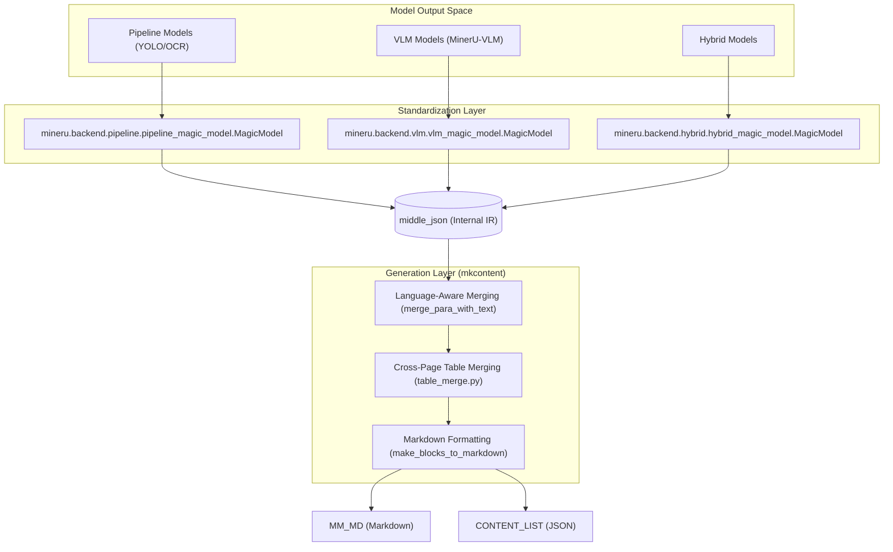
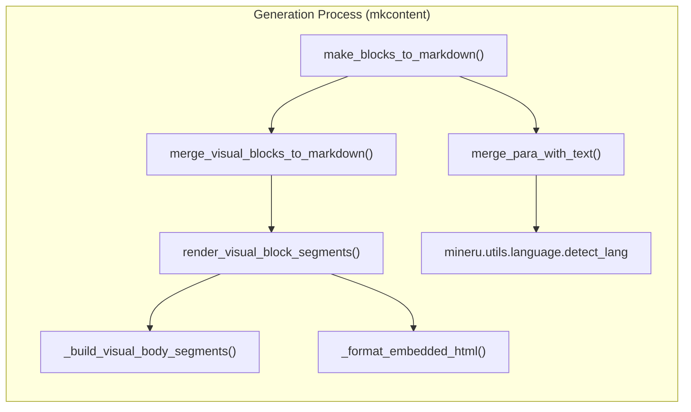

# middle_json Format & Content Generation

Relevant source files

The following files were used as context for generating this wiki page:

- [docs/en/faq/index.md](docs/en/faq/index.md)
- [docs/en/reference/output_files.md](docs/en/reference/output_files.md)
- [docs/zh/faq/index.md](docs/zh/faq/index.md)
- [docs/zh/reference/output_files.md](docs/zh/reference/output_files.md)
- [mineru/backend/hybrid/hybrid_magic_model.py](mineru/backend/hybrid/hybrid_magic_model.py)
- [mineru/backend/pipeline/pipeline_magic_model.py](mineru/backend/pipeline/pipeline_magic_model.py)
- [mineru/backend/pipeline/pipeline_middle_json_mkcontent.py](mineru/backend/pipeline/pipeline_middle_json_mkcontent.py)
- [mineru/backend/vlm/vlm_magic_model.py](mineru/backend/vlm/vlm_magic_model.py)
- [mineru/backend/vlm/vlm_middle_json_mkcontent.py](mineru/backend/vlm/vlm_middle_json_mkcontent.py)
- [mineru/utils/boxbase.py](mineru/utils/boxbase.py)
- [mineru/utils/char_utils.py](mineru/utils/char_utils.py)
- [mineru/utils/draw_bbox.py](mineru/utils/draw_bbox.py)
- [mineru/utils/enum_class.py](mineru/utils/enum_class.py)
- [mineru/utils/magic_model_utils.py](mineru/utils/magic_model_utils.py)
- [mineru/utils/table_continuation.py](mineru/utils/table_continuation.py)
- [mineru/utils/table_merge.py](mineru/utils/table_merge.py)
- [mineru/utils/visual_magic_model_utils.py](mineru/utils/visual_magic_model_utils.py)

The `middle_json` is the central intermediate representation in MinerU. It serves as a standardized bridge between raw model outputs (from the Pipeline, VLM, Hybrid, or Office backends) and the final document formats. This decoupling allows MinerU to support diverse model architectures while maintaining a consistent logic for text merging, reading order, and Markdown generation.

## 1. Data Flow Overview

The conversion process consists of two primary stages:
1.  **Standardization**: Model-specific results (from PDF, images, or Office docs) are transformed into the `middle_json` schema. In the pipeline backend, this is handled by `model_json_to_middle_json.py`.
2.  **Content Generation (`union_make`)**: The `middle_json` is processed to produce final outputs like `MM_MD` (Multi-modal Markdown) or `CONTENT_LIST`.

### System Data Flow Diagram
"Natural Language Space" to "Code Entity Space" mapping:

**Sources:** [mineru/backend/pipeline/pipeline_magic_model.py:17-127](), [mineru/backend/vlm/vlm_magic_model.py:29-183](), [mineru/backend/hybrid/hybrid_magic_model.py:45-192](), [mineru/utils/table_merge.py:1-230]()

---

## 2. The middle_json Schema

The `middle_json` structure is organized by pages and contains detailed layout, block, and span information.

### Key Components
-   **`pdf_info`**: A list where each element represents a page.
-   **`preproc_blocks`**: Sorted blocks of content representing the initial model detection results [mineru/utils/draw_bbox.py:32-34]().
-   **`para_blocks`**: Final content blocks after paragraph reconstruction and splitting.
-   **`discarded_blocks`**: Elements like headers, footers, and page numbers typically excluded from main Markdown [mineru/utils/draw_bbox.py:170-172]().

### Block Types (`BlockType`)
Defined in `mineru.utils.enum_class`, common types include:
-   `TEXT`, `TITLE`, `IMAGE`, `TABLE`, `CHART`, `CAPTION`, `FOOTNOTE`, `CODE`, `ALGORITHM`, `INTERLINE_EQUATION`.
-   Structural subtypes: `IMAGE_BODY`, `TABLE_BODY`, `CHART_BODY`, `IMAGE_CAPTION`, `TABLE_CAPTION`.
[mineru/utils/enum_class.py:4-50]()

---

## 3. Standardization Implementation

Standardization logic varies by backend to account for different output granularities.

### Pipeline Standardization
The pipeline uses `MagicModel` to map `PP-DocLayoutV2` labels to internal block types [mineru/backend/pipeline/pipeline_magic_model.py:19-43](). It handles coordinate correction, OCR span extraction via `txt_spans_extract` [mineru/backend/pipeline/pipeline_magic_model.py:94-101](), and sorts blocks by index [mineru/backend/pipeline/pipeline_magic_model.py:121-121](). It also detects vertical text blocks [mineru/backend/pipeline/pipeline_magic_model.py:131-136]().

### VLM & Hybrid Standardization
VLM and Hybrid backends share common utility logic for visual block regrouping:
-   **Regrouping**: `regroup_visual_blocks` associates captions and footnotes with their parent image/table/chart [mineru/backend/vlm/vlm_magic_model.py:18-19]().
-   **Caption Fallback**: `fallback_inline_caption_fragments` and `fallback_leading_table_continuation_captions` handle cases where captions are misclassified as normal text [mineru/utils/visual_magic_model_utils.py:101-138]().
-   **Formula Cleaning**: `isolated_formula_clean` removes LaTeX delimiters like `\[` and `\]` [mineru/utils/visual_magic_model_utils.py:59-66]().

### Character Normalization
MinerU ensures text consistency across all backends:
-   **VLM Content**: Uses `full_to_half_exclude_marks` to convert full-width characters to half-width while preserving specific symbols [mineru/backend/vlm/vlm_middle_json_mkcontent.py:65-69]().
-   **Table Text**: `_normalize_cell_text` strips whitespace and normalizes characters for signature matching during table merging [mineru/utils/table_merge.py:70-71]().

**Sources:** [mineru/backend/pipeline/pipeline_magic_model.py:19-127](), [mineru/utils/visual_magic_model_utils.py:59-138](), [mineru/backend/vlm/vlm_middle_json_mkcontent.py:65-69](), [mineru/utils/table_merge.py:70-71]()

---

## 4. Content Generation Logic

The content generation logic converts the intermediate IR into final user-facing formats.

### Language-Aware Text Merging
The `merge_para_with_text` function handles nuances of joining lines:
-   **Language Detection**: Uses `detect_lang` to determine context [mineru/backend/vlm/vlm_middle_json_mkcontent.py:11-11]().
-   **Western Languages**: It includes hyphen detection (`is_hyphen_at_line_end`) to merge broken words across lines [mineru/backend/vlm/vlm_middle_json_mkcontent.py:8-8]().
-   **Spacing**: Logic in `_has_following_joinable_span` prevents trailing spaces at the end of paragraphs by checking if subsequent spans are joinable [mineru/backend/vlm/vlm_middle_json_mkcontent.py:72-85]().

### Cross-Page Table Merging
MinerU implements sophisticated logic to merge tables split across pages in `mineru/utils/table_merge.py`:
-   **Row Scanning**: `_scan_rows` calculates effective column metrics and tracks row/column spans [mineru/utils/table_merge.py:78-146]().
-   **Signature Matching**: `_build_row_signature` creates a fingerprint of row structure (texts, spans) to detect continuation [mineru/utils/table_merge.py:149-157]().
-   **Header Caching**: `_build_front_cache` stores the first few rows (up to `MAX_HEADER_ROWS`) to compare against potential continuations on subsequent pages [mineru/utils/table_merge.py:160-172]().

### Visual Block Rendering
For complex blocks like images and tables, `render_visual_block_segments` transforms internal spans into Markdown/HTML segments:
-   **Images**: Renders `` Markdown tags. If `content` (description) is present, it wraps it in a `
` HTML block [mineru/backend/vlm/vlm_middle_json_mkcontent.py:102-117]().
-   **Tables**: Converts table content to HTML. It prefixes image sources with bucket paths using `_prefix_table_img_src` and replaces `<eq>` tags with LaTeX delimiters [mineru/backend/vlm/vlm_middle_json_mkcontent.py:33-57]().
-   **Algorithms/Code**: Renders code blocks with language guessing (`guess_lang`) or HTML-based algorithm formatting [mineru/backend/vlm/vlm_middle_json_mkcontent.py:146-160]().

### Content Construction Logic

**Sources:** [mineru/backend/pipeline/pipeline_middle_json_mkcontent.py:18-88](), [mineru/backend/vlm/vlm_middle_json_mkcontent.py:119-210](), [mineru/utils/table_merge.py:78-172]()

---

## 5. Output Versions & Modes

MinerU supports multiple output schemas via `MakeMode`:

| Mode | Description |
| :--- | :--- |
| `MM_MD` | Multi-modal Markdown including images, tables, and formulas [mineru/utils/enum_class.py:90](). |
| `NLP_MD` | Pure text Markdown, excluding images and tables for LLM training [mineru/utils/enum_class.py:91](). |
| `CONTENT_LIST` | A JSON-structured list of all document elements [mineru/utils/enum_class.py:92](). |
| `CONTENT_LIST_V2` | Enhanced JSON schema with granular metadata (introduced in v2.5) [mineru/utils/enum_class.py:93](). |

### Output Types Mapping
`ContentType` and `ContentTypeV2` define the span-level and block-level classification for structured JSON outputs:
-   **ContentType**: `IMAGE`, `TABLE`, `TEXT`, `INLINE_EQUATION` [mineru/utils/enum_class.py:51-60]().
-   **ContentTypeV2**: `CODE`, `ALGORITHM`, `SIMPLE_TABLE`, `COMPLEX_TABLE`, `LIST_TEXT`, `PAGE_HEADER` [mineru/utils/enum_class.py:62-87]().

**Sources:** [mineru/utils/enum_class.py:51-93](), [docs/zh/reference/output_files.md:113-188]()
