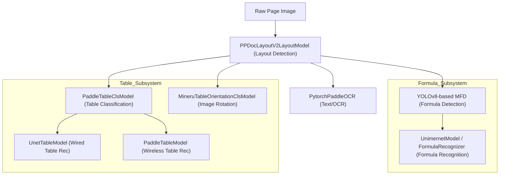

# Model Subsystems

<details>
<summary>Relevant source files</summary>

The following files were used as context for generating this wiki page:

- [mineru/backend/pipeline/batch_analyze.py](mineru/backend/pipeline/batch_analyze.py)
- [mineru/backend/pipeline/model_init.py](mineru/backend/pipeline/model_init.py)
- [mineru/backend/pipeline/model_list.py](mineru/backend/pipeline/model_list.py)
- [mineru/model/table/cls/mineru_table_ori_cls.py](mineru/model/table/cls/mineru_table_ori_cls.py)

</details>


MinerU utilizes a collection of specialized machine learning models to perform document decomposition. These models are managed as atomic units and orchestrated by the pipeline to transform raw page images into structured data. This page provides a high-level overview of these subsystems and their roles within the MinerU architecture.

The lifecycle of these models is managed by the `AtomModelSingleton` [mineru/backend/pipeline/model_init.py:148-157](), which ensures that heavy model weights are loaded into memory only once and shared across processing tasks using a thread-safe implementation [mineru/backend/pipeline/model_init.py:184-187]().

## Subsystem Architecture Overview

The following diagram illustrates how the different model subsystems interact during the processing of a single document page within the `BatchAnalyze` orchestration layer [mineru/backend/pipeline/batch_analyze.py:52-81]().

### Model Interaction Flow

Sources: [mineru/backend/pipeline/batch_analyze.py:52-81](), [mineru/backend/pipeline/model_init.py:189-220]()

### Model Entity Mapping
This diagram maps system functions to their specific implementation classes and file paths within the codebase, as resolved by the `AtomModelSingleton` [mineru/backend/pipeline/model_init.py:159-187]().

```mermaid
classDiagram
    class "AtomModelSingleton" as AMS {
        +get_atom_model(atom_model_name)
        -_models: dict
    }
    class "PPDocLayoutV2LayoutModel" as PLM {
        +__init__(weight, device)
    }
    class "UnimernetModel" as UM {
        +predict(mfd_res, image)
    }
    class "FormulaRecognizer" as FR {
        +predict(mfd_res, image)
    }
    class "UnetTableModel" as UTM {
        +__init__(ocr_engine)
    }
    class "MineruTableOrientationClsModel" as MTOCM {
        +batch_predict(table_info_list)
    }

    AMS ..> PLM : "creates AtomicModel.Layout"
    AMS ..> UM : "creates AtomicModel.MFR"
    AMS ..> MTOCM : "creates AtomicModel.TableOrientationCls"
    AMS ..> UTM : "creates AtomicModel.WiredTable"
    
    PLM --|> "mineru/model/layout/pp_doclayoutv2.py"
    UM --|> "mineru/model/mfr/unimernet/Unimernet.py"
    FR --|> "mineru/model/mfr/pp_formulanet_plus_m/predict_formula.py"
    UTM --|> "mineru/model/table/rec/unet_table/main.py"
    MTOCM --|> "mineru/model/table/cls/mineru_table_ori_cls.py"
```
Sources: [mineru/backend/pipeline/model_init.py:159-220](), [mineru/backend/pipeline/model_list.py:2-10](), [mineru/model/table/cls/mineru_table_ori_cls.py:25-27]()

## Layout Detection & Reading Order
The layout detection subsystem identifies functional regions such as text blocks, titles, figures, tables, and formulas.

*   **Primary Model**: `PPDocLayoutV2LayoutModel`, which categorizes regions into functional labels like `doc_title`, `table`, and `display_formula`.
*   **Initialization**: Managed via `pp_doclayout_v2_model_init` [mineru/backend/pipeline/model_init.py:126-130]().
*   **Post-processing**: The system removes empty OCR text blocks during analysis via `_prune_empty_ocr_text_blocks` [mineru/backend/pipeline/batch_analyze.py:166-180]().
*   **Concurrency**: Layout inference is protected by `PIPELINE_LAYOUT_INFERENCE_LOCK` [mineru/backend/pipeline/model_init.py:24]() when enabled via environment variables [mineru/backend/pipeline/model_init.py:28-30]().

For details, see [Layout Detection & Reading Order](#3.1).

## Table Recognition
MinerU employs a dual-path recognition strategy to handle the structural diversity of tables.

*   **Orientation Correction**: Detects if table images are rotated and corrects them using `MineruTableOrientationClsModel` [mineru/backend/pipeline/model_init.py:72-82](). It uses OCR scores to determine the final rotation angle (0, 90, or 270 degrees) [mineru/model/table/cls/mineru_table_ori_cls.py:22]().
*   **Classification**: `PaddleTableClsModel` determines if a table is `WiredTable` (has visible grid lines) or `WirelessTable`.
*   **Wired Tables**: Processed via `UnetTableModel` [mineru/backend/pipeline/model_init.py:98]() which utilizes a UNet-based architecture.
*   **Wireless Tables**: Processed via `PaddleTableModel` [mineru/backend/pipeline/model_init.py:111]() utilizing the SlanetPlus architecture.

For details, see [Table Recognition](#3.2).

## OCR Engine
The OCR subsystem handles text extraction from non-digitized PDF regions and image-based content.

*   **Engine**: `PytorchPaddleOCR`, initialized via `ocr_model_init` [mineru/backend/pipeline/model_init.py:133-145]().
*   **Optimization**: Supports batch detection and recognition controlled by constants like `OCR_DET_BASE_BATCH_SIZE` [mineru/backend/pipeline/batch_analyze.py:40]().
*   **Language Support**: Configured during initialization with support for normalized language codes [mineru/backend/pipeline/model_init.py:139]().
*   **Masking**: Can mask inline formulas to improve OCR accuracy for surrounding text via `mask_formula_regions_for_ocr_det` [mineru/backend/pipeline/batch_analyze.py:88]().

For details, see [OCR Engine](#3.3).

## Formula Recognition (MFD/MFR)
Mathematical content is handled by a specialized two-stage pipeline: Mathematical Formula Detection (MFD) and Mathematical Formula Recognition (MFR).

*   **Recognition (MFR)**: MinerU supports two primary recognition models initialized via `mfr_model_init` [mineru/backend/pipeline/model_init.py:115-123]():
    *   `UnimernetModel`: The default model for general formula recognition [mineru/backend/pipeline/model_init.py:117]().
    *   `FormulaRecognizer`: PP-FormulaNet-Plus-M, used when Chinese formula support is enabled [mineru/backend/pipeline/model_init.py:119]().
*   **Batching**: Inference can be batched with a base size of 16 [mineru/backend/pipeline/batch_analyze.py:39]().

For details, see [Formula Recognition (MFD/MFR)](#3.4).

## Model Management & Initialization
Models are initialized through a centralized factory pattern in `atom_model_init` [mineru/backend/pipeline/model_init.py:189-220]() to manage device placement and lifecycle.

| Model Category | Class Name | Initialization Function |
| :--- | :--- | :--- |
| Layout | `PPDocLayoutV2LayoutModel` | `pp_doclayout_v2_model_init` [mineru/backend/pipeline/model_init.py:126]() |
| MFR | `UnimernetModel` / `FormulaRecognizer` | `mfr_model_init` [mineru/backend/pipeline/model_init.py:115]() |
| OCR | `PytorchPaddleOCR` | `ocr_model_init` [mineru/backend/pipeline/model_init.py:133]() |
| Table Cls | `PaddleTableClsModel` | `table_cls_model_init` [mineru/backend/pipeline/model_init.py:85]() |
| Wired Table | `UnetTableModel` | `wired_table_model_init` [mineru/backend/pipeline/model_init.py:89]() |
| Wireless Table | `PaddleTableModel` | `wireless_table_model_init` [mineru/backend/pipeline/model_init.py:102]() |
| Orientation | `MineruTableOrientationClsModel` | `table_orientation_cls_model_init` [mineru/backend/pipeline/model_init.py:72]() |

Sources: [mineru/backend/pipeline/model_init.py:1-220](), [mineru/backend/pipeline/batch_analyze.py:38-50](), [mineru/backend/pipeline/model_list.py:1-11](), [mineru/model/table/cls/mineru_table_ori_cls.py:13-22]()
