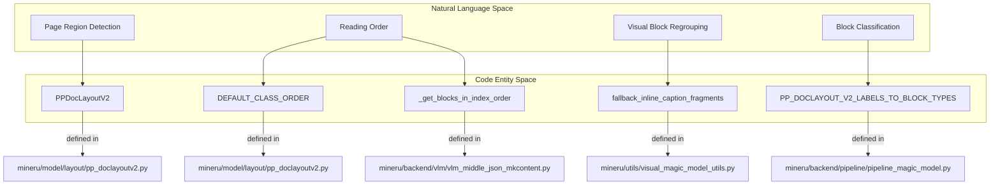
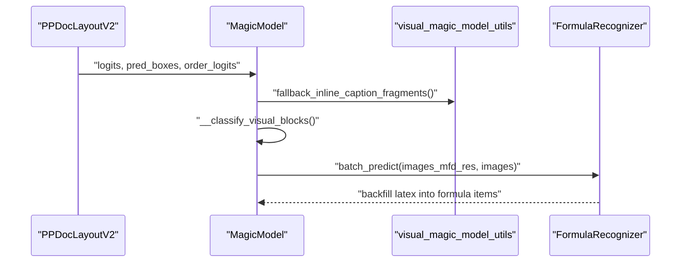
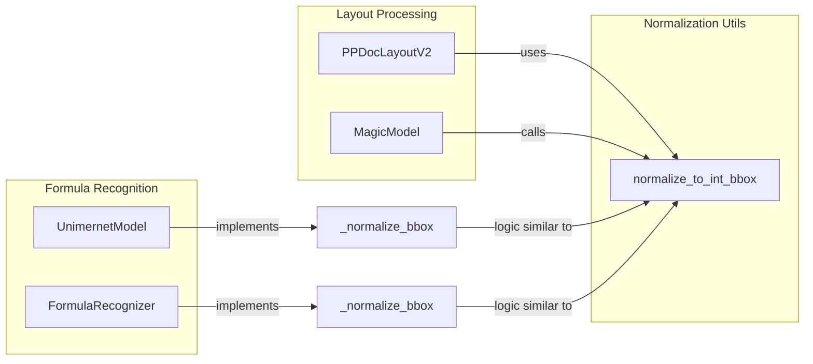

# Layout Detection & Reading Order

Relevant source files

The following files were used as context for generating this wiki page:

- [mineru/model/layout/pp_doclayoutv2.py](mineru/model/layout/pp_doclayoutv2.py)
- [mineru/model/mfr/pp_formulanet_plus_m/predict_formula.py](mineru/model/mfr/pp_formulanet_plus_m/predict_formula.py)
- [mineru/model/mfr/unimernet/Unimernet.py](mineru/model/mfr/unimernet/Unimernet.py)
- [mineru/model/utils/pytorchocr/modeling/heads/rec_ppformulanet_head.py](mineru/model/utils/pytorchocr/modeling/heads/rec_ppformulanet_head.py)
- [mineru/model/utils/pytorchocr/modeling/heads/rec_unimernet_head.py](mineru/model/utils/pytorchocr/modeling/heads/rec_unimernet_head.py)
- [mineru/utils/bbox_utils.py](mineru/utils/bbox_utils.py)
- [mineru/utils/pdf_classify.py](mineru/utils/pdf_classify.py)
- [mineru/utils/pdf_image_tools.py](mineru/utils/pdf_image_tools.py)
- [mineru/utils/pdf_reader.py](mineru/utils/pdf_reader.py)
- [mineru/utils/pdf_text_tool.py](mineru/utils/pdf_text_tool.py)
- [mineru/utils/pdfium_guard.py](mineru/utils/pdfium_guard.py)
- [mineru/utils/span_pre_proc.py](mineru/utils/span_pre_proc.py)

The Layout Detection and Reading Order subsystem is responsible for identifying functional regions within a document page (e.g., text, titles, images, tables, formulas) and determining the logical sequence in which these regions should be read. This process bridges the gap between raw pixel data and a structured document hierarchy.

## System Architecture & Data Flow

MinerU utilizes a multi-stage approach to layout analysis. In the **Pipeline Backend**, layout information is processed and orchestrated via the `MagicModel` class, which handles the mapping of raw layout labels to internal block types and performs structural refinement [mineru/backend/pipeline/pipeline_magic_model.py:17-127]().

The system relies on specialized models for different tasks:
- **PP-DocLayoutV2**: The primary engine for region detection and reading order prediction [mineru/model/layout/pp_doclayoutv2.py:25-26]().
- **Formula Detection (MFD)**: Locates interline and inline equations, which are then processed by MFR models.
- **Formula Recognition (MFR)**: Models like `UnimernetModel` [mineru/model/mfr/unimernet/Unimernet.py:26-41]() or `FormulaRecognizer` (PP-FormulaNet-Plus-M) [mineru/model/mfr/pp_formulanet_plus_m/predict_formula.py:23-44]() convert detected regions into LaTeX.

### Layout Detection Process
1.  **Region Detection**: The system uses **PP-DocLayoutV2** for page segmentation. The model outputs classification logits, predicted bounding boxes, and reading order information [mineru/model/layout/pp_doclayoutv2.py:184-200]().
2.  **Label Mapping**: `MagicModel` maps `PP-DocLayoutV2` labels to `BlockType` enums. For example, "algorithm" is mapped to `BlockType.CODE`, and "display_formula" is mapped to `BlockType.INTERLINE_EQUATION` [mineru/backend/pipeline/pipeline_magic_model.py:19-43]().
3.  **Specialized Detection & Refinement**:
    *   **Text Refinement**: The `__fix_text_block` function merges spans into lines. It detects vertical text based on span distribution and uses `merge_spans_to_vertical_line` or `merge_spans_to_line` accordingly [mineru/backend/pipeline/pipeline_magic_model.py:130-161]().
    *   **Visual Regrouping**: Captions and footnotes are associated with their corresponding visual bodies (images, tables, charts) using utilities like `find_best_visual_parent` [mineru/backend/pipeline/pipeline_magic_model.py:10-14]().
    *   **Seal Detection**: Layout blocks labeled "seal" are normalized into `BlockType.IMAGE` with a "seal" `sub_type` [mineru/backend/pipeline/pipeline_magic_model.py:117-119]().

### Reading Order & Block Sorting
Once regions are identified, they are sorted to ensure the final output follows the intended human reading order.
1.  **PP-DocLayoutV2 Reading Order**: This model includes a built-in reading order head that predicts `order_logits` [mineru/model/layout/pp_doclayoutv2.py:184-192](). It uses a `DEFAULT_CLASS_ORDER` mapping to remap the 25 classes into specific ordering priorities [mineru/model/layout/pp_doclayoutv2.py:91-117]().
2.  **Sorting Logic**: Blocks are sorted primarily by the `index` assigned during detection [mineru/backend/pipeline/pipeline_magic_model.py:121](). During final content generation, `_get_blocks_in_index_order` ensures that visual sub-blocks (captions, bodies, footnotes) follow this index [mineru/backend/vlm/vlm_middle_json_mkcontent.py:136-143]().
3.  **Vertical Text Handling**: If a block is identified as `BlockType.VERTICAL_TEXT`, lines are sorted from top-to-bottom using `vertical_line_sort_spans_from_top_to_bottom` [mineru/backend/pipeline/pipeline_magic_model.py:138-141]().

### Layout to Code Entity Mapping
The following diagram illustrates how conceptual layout components map to specific implementation classes and functions.

**Title: Layout Entity Mapping**

Sources: [mineru/model/layout/pp_doclayoutv2.py:91-117](), [mineru/backend/vlm/vlm_middle_json_mkcontent.py:136-143](), [mineru/backend/pipeline/pipeline_magic_model.py:19-43](), [mineru/backend/pipeline/pipeline_magic_model.py:123-124]()

## Implementation Detail: Region Detection

MinerU uses `PP-DocLayoutV2` which classifies regions into 25 distinct labels, including `abstract`, `algorithm`, `aside_text`, `chart`, and `display_formula` [mineru/model/layout/pp_doclayoutv2.py:33-59]().

### Label Classification
The model uses specific confidence thresholds for each class to filter out low-probability detections before determining the reading order [mineru/model/layout/pp_doclayoutv2.py:62-88]().

| Label Index | Class Name | Threshold | BlockType Mapping |
| :--- | :--- | :--- | :--- |
| 6 | `doc_title` | 0.4 | `BlockType.DOC_TITLE` |
| 17 | `paragraph_title`| 0.4 | `BlockType.PARAGRAPH_TITLE` |
| 5 | `display_formula`| 0.4 | `BlockType.INTERLINE_EQUATION` |
| 21 | `table` | 0.5 | `BlockType.TABLE` |
| 14 | `image` | 0.5 | `BlockType.IMAGE` |
| 22 | `text` | 0.4 | `BlockType.TEXT` |

### Visual Block Refinement
*   **Visual Classification**: `MagicModel` classifies visual blocks into "body", "caption", and "footnote" using the `VISUAL_TYPE_MAPPING` [mineru/backend/pipeline/pipeline_magic_model.py:47-68]().
*   **Formula Backfilling**: MFR models like `UnimernetModel` [mineru/model/mfr/unimernet/Unimernet.py:26-41]() or `FormulaRecognizer` [mineru/model/mfr/pp_formulanet_plus_m/predict_formula.py:23-44]() process detected formula regions in batches and backfill the resulting LaTeX strings into the `latex` field of the result dictionary [mineru/model/mfr/unimernet/Unimernet.py:194-195](), [mineru/model/mfr/pp_formulanet_plus_m/predict_formula.py:208-209]().
*   **Code Language Guessing**: For code blocks, the system attempts to guess the programming language using `guess_language_by_text` and stores it in `guess_lang` [mineru/backend/pipeline/pipeline_magic_model.py:154-157]().

**Title: Detection and Refinement Pipeline**

Sources: [mineru/model/layout/pp_doclayoutv2.py:184-200](), [mineru/backend/pipeline/pipeline_magic_model.py:123-125](), [mineru/model/mfr/pp_formulanet_plus_m/predict_formula.py:133-149]()

## Implementation Detail: Reading Order

Reading order is determined by a combination of model-based prediction and internal sorting logic.

### Logic & Algorithms
1.  **Transformer-Based Ordering**: `PP-DocLayoutV2` uses a transformer decoder to predict the sequence. It employs a bidirectional attention mask via `_create_bidirectional_mask` to handle dependencies between detected regions during the reading-order head's forward pass [mineru/model/layout/pp_doclayoutv2.py:133-163]().
2.  **Class-Based Reordering**: The `DEFAULT_CLASS_ORDER` provides a mapping to adjust the model's raw output sequence into a standardized reading order [mineru/model/layout/pp_doclayoutv2.py:91-117]().
3.  **Content Rendering Order**: During the Markdown conversion phase, blocks are retrieved using `get_blocks_in_index_order`. This ensures that even within a visual block (like a Table), the caption, body, and footnote appear in the correct sequence [mineru/backend/pipeline/pipeline_middle_json_mkcontent.py:91-100]().
4.  **XY-Cut Algorithm**: In specific scenarios where model prediction is unavailable or for legacy support, geometric block sorting algorithms like `XY-Cut` are utilized to recursively partition the page into a reading tree based on horizontal and vertical gaps.

## Coordinate Normalization and Scaling

Coordinates are managed across different scales (model input vs. raw image pixels).
*   **Layout Normalization**: `PP-DocLayoutV2` operates on a default image size of `(800, 800)` [mineru/model/layout/pp_doclayoutv2.py:30]().
*   **Standard Utility**: `normalize_to_int_bbox` converts various bounding box formats into standard `[xmin, ymin, xmax, ymax]` integer coordinates while optionally clipping to `image_size` [mineru/utils/bbox_utils.py:7-51]().
*   **MFR Normalization**: Both UniMERNet and PP-FormulaNet-Plus-M implement internal `_normalize_bbox` methods to ensure crops are within image boundaries before recognition [mineru/model/mfr/unimernet/Unimernet.py:54-70](), [mineru/model/mfr/pp_formulanet_plus_m/predict_formula.py:74-90]().

### Coordinate Handling Logic
This diagram shows the relationship between different coordinate handling entities.

**Title: Coordinate Handling Logic**

Sources: [mineru/utils/bbox_utils.py:7-51](), [mineru/model/layout/pp_doclayoutv2.py:30](), [mineru/model/mfr/unimernet/Unimernet.py:54-70](), [mineru/model/mfr/pp_formulanet_plus_m/predict_formula.py:74-90](), [mineru/backend/pipeline/pipeline_magic_model.py:28-28]()
