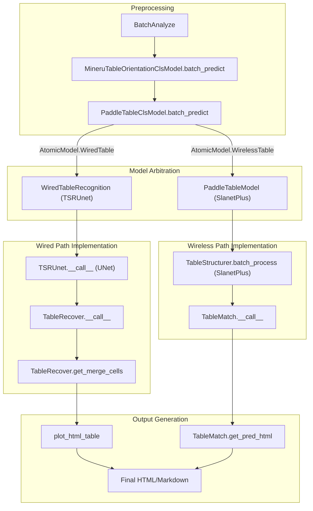
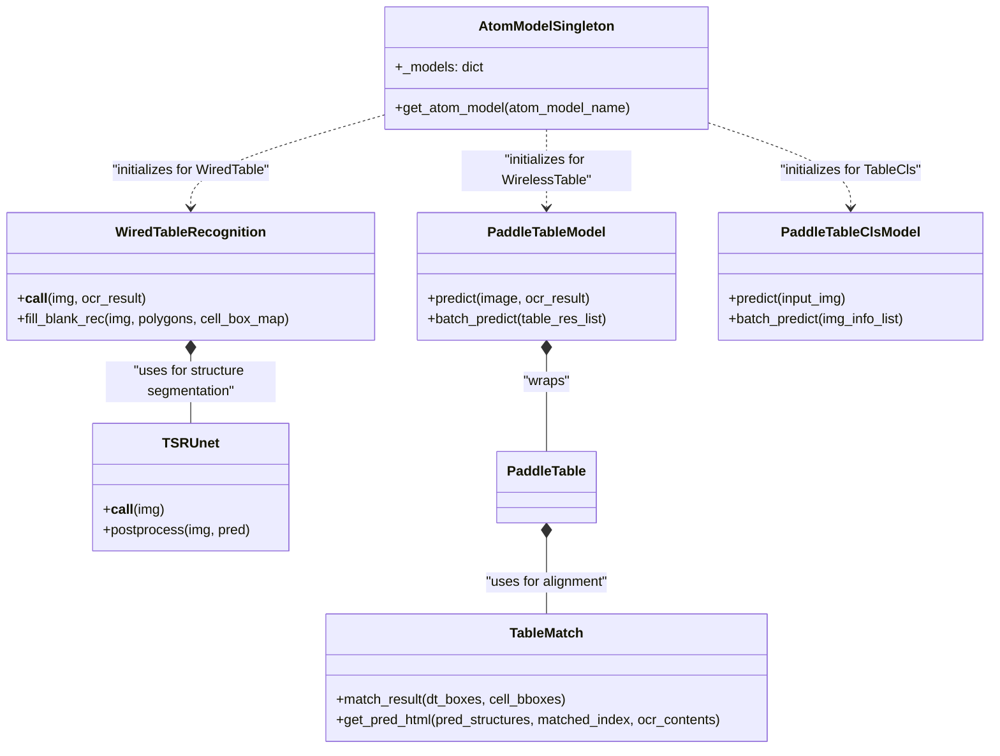

# Table Recognition

Relevant source files

The following files were used as context for generating this wiki page:

- [mineru/model/table/cls/paddle_table_cls.py](mineru/model/table/cls/paddle_table_cls.py)
- [mineru/model/table/rec/onnxruntime_provider.py](mineru/model/table/rec/onnxruntime_provider.py)
- [mineru/model/table/rec/slanet_plus/__init__.py](mineru/model/table/rec/slanet_plus/__init__.py)
- [mineru/model/table/rec/slanet_plus/main.py](mineru/model/table/rec/slanet_plus/main.py)
- [mineru/model/table/rec/slanet_plus/matcher.py](mineru/model/table/rec/slanet_plus/matcher.py)
- [mineru/model/table/rec/slanet_plus/matcher_utils.py](mineru/model/table/rec/slanet_plus/matcher_utils.py)
- [mineru/model/table/rec/slanet_plus/table_structure.py](mineru/model/table/rec/slanet_plus/table_structure.py)
- [mineru/model/table/rec/slanet_plus/table_structure_utils.py](mineru/model/table/rec/slanet_plus/table_structure_utils.py)
- [mineru/model/table/rec/unet_table/__init__.py](mineru/model/table/rec/unet_table/__init__.py)
- [mineru/model/table/rec/unet_table/main.py](mineru/model/table/rec/unet_table/main.py)
- [mineru/model/table/rec/unet_table/table_recover.py](mineru/model/table/rec/unet_table/table_recover.py)
- [mineru/model/table/rec/unet_table/table_structure_unet.py](mineru/model/table/rec/unet_table/table_structure_unet.py)
- [mineru/model/table/rec/unet_table/utils.py](mineru/model/table/rec/unet_table/utils.py)
- [mineru/model/table/rec/unet_table/utils_table_line_rec.py](mineru/model/table/rec/unet_table/utils_table_line_rec.py)
- [mineru/model/table/rec/unet_table/utils_table_recover.py](mineru/model/table/rec/unet_table/utils_table_recover.py)

The table recognition system in MinerU is a sophisticated dual-path pipeline designed to handle both "Wired" (tables with explicit grid lines) and "Wireless" (tables relying on whitespace alignment) structures. It incorporates automated orientation correction, specialized classification, and a custom grid reconstruction algorithm to produce high-fidelity HTML and Markdown representations of tabular data.

## System Architecture

The table recognition logic is orchestrated within the `MineruPipelineModel` and `BatchAnalyze` classes. When a table region is detected by the layout model, the system extracts the table image and routes it through a series of specialized models managed by the `AtomModelSingleton`.

### Table Recognition Data Flow
The following diagram illustrates the lifecycle of a table from a raw image to a reconstructed HTML structure, mapping high-level steps to their corresponding code entities.

**Diagram: Table Processing Pipeline**

**Sources:** [mineru/model/table/rec/unet_table/main.py:68-129](), [mineru/model/table/rec/slanet_plus/main.py:165-187](), [mineru/model/table/cls/paddle_table_cls.py:134-150]()

---

## Orientation & Classification

Before recognition begins, classification steps ensure the table image is in the optimal state for the recognition models.

### 1. Orientation Correction
The orientation logic ensures tables are upright before structural analysis.
- **Model:** `MineruTableOrientationClsModel` [mineru/model/table/cls/mineru_table_ori_cls.py:25-27]().
- **Logic:** It uses a dual-gated approach. First, it identifies "rotation candidates" by detecting vertical (high-aspect-ratio) text boxes [mineru/model/table/cls/mineru_table_ori_cls.py:68-90](). If a candidate is found, it performs OCR recognition on three rotations (0°, 90°, 270°) and selects the orientation with the highest confidence score [mineru/model/table/cls/mineru_table_ori_cls.py:166-172]().
- **Parameters:** It samples up to 18 boxes for scoring [mineru/model/table/cls/mineru_table_ori_cls.py:18-18]() and uses a priority threshold of 0.9 for the 0° orientation to avoid unnecessary rotations [mineru/model/table/cls/mineru_table_ori_cls.py:20-20]().

### 2. Wired vs. Wireless Classification
The `PaddleTableClsModel` [mineru/model/table/cls/paddle_table_cls.py:16-26]() determines which recognition path to take by classifying the table structure.
- **Wired Tables:** Characterized by visible cell borders. Handled by the UNet-based `TSRUnet`.
- **Wireless Tables:** Characterized by open structures relying on alignment. Handled by `SlanetPlus` or `RapidTable`.
- **Implementation:** Uses an ONNX inference session (`onnxruntime.InferenceSession`) to predict the class and confidence score [mineru/model/table/cls/paddle_table_cls.py:18-20](). The model accepts a batch of images and updates the `table_res` dictionary with `cls_label` and `cls_score` [mineru/model/table/cls/paddle_table_cls.py:134-150]().
- **Preprocessing:** Images are resized to 224x224 and normalized using mean `[0.485, 0.456, 0.406]` and std `[0.229, 0.224, 0.225]` [mineru/model/table/cls/paddle_table_cls.py:21-25]().

**Sources:** [mineru/model/table/cls/mineru_table_ori_cls.py:25-192](), [mineru/model/table/cls/paddle_table_cls.py:16-76](), [mineru/model/table/cls/paddle_table_cls.py:134-150]()

---

## Wired Table Recognition (TSRUnet)

The wired path uses a UNet-based architecture to segment table lines and a geometric recovery algorithm to reconstruct the grid.

### TSRUnet Model
The `TSRUnet` class [mineru/model/table/rec/unet_table/table_structure_unet.py:25-38]() performs:
1.  **Inference:** Predicts a segmentation mask where pixel values represent horizontal (1) or vertical (2) lines [mineru/model/table/rec/unet_table/table_structure_unet.py:79-82]().
2.  **Line Extraction:** Uses morphological operations (`cv2.morphologyEx`) and `get_table_line` [mineru/model/table/rec/unet_table/utils_table_line_rec.py:129-146]() to extract discrete line segments from the mask [mineru/model/table/rec/unet_table/table_structure_unet.py:117-128]().
3.  **Refinement:** Adjusts and extends lines to ensure intersections are closed using `final_adjust_lines` and `adjust_lines` [mineru/model/table/rec/unet_table/table_structure_unet.py:131-137]().
4.  **Rotation Fix:** Calculates the rotation angle of the table lines via `cal_rotate_angle` [mineru/model/table/rec/unet_table/table_structure_unet.py:164-177]() and optionally performs `rotate_image` to normalize the grid [mineru/model/table/rec/unet_table/table_structure_unet.py:140-146]().

### TableRecover & Grid Reconstruction
The `WiredTableRecognition` class [mineru/model/table/rec/unet_table/main.py:61-66]() orchestrates the full recovery:
- **`TableRecover`:** Transforms predicted polygons into a logical grid with `logic_points` [mineru/model/table/rec/unet_table/main.py:89-91]().
- **Cell Matching:** Maps OCR results to predicted polygons using `match_ocr_cell` [mineru/model/table/rec/unet_table/main.py:107]().
- **Blank Filling:** If a detected cell has no OCR content, the system crops the image and performs targeted OCR via `fill_blank_rec` [mineru/model/table/rec/unet_table/main.py:109](). This includes a noise filter `_should_drop_blank_cell_rec_result` to drop low-confidence or irrelevant characters [mineru/model/table/rec/unet_table/main.py:174-184]().
- **HTML Plotting:** Final HTML is generated by `plot_html_table` [mineru/model/table/rec/unet_table/main.py:121]().

**Sources:** [mineru/model/table/rec/unet_table/main.py:46-129](), [mineru/model/table/rec/unet_table/table_structure_unet.py:25-150](), [mineru/model/table/rec/unet_table/utils_table_line_rec.py:129-175](), [mineru/model/table/rec/unet_table/utils_table_recover.py:122-158]()

---

## Wireless Table Recognition (SlanetPlus)

Wireless tables are processed using the `PaddleTableModel` wrapper around the `SlanetPlus` architecture.

### TableStructurer
The `TableStructurer` [mineru/model/table/rec/slanet_plus/table_structure.py:28-40]() uses an ONNX model to predict both the table structure (HTML tags) and the cell bounding boxes.
- **Output:** A sequence of structure tokens (e.g., `<tr>`, `<td>`, `</td>`) and a list of cell coordinates [mineru/model/table/rec/slanet_plus/table_structure.py:53-68]().
- **Batch Processing:** `batch_process` enables high-throughput inference across multiple table images using `BatchTablePreprocess` [mineru/model/table/rec/slanet_plus/table_structure.py:70-113]().

### TableMatch & HTML Reconstruction
The `PaddleTable` class aligns OCR text with the predicted structure:
1.  **Normalization:** Standardizes cell bboxes and restores scale via `adapt_slanet_plus` [mineru/model/table/rec/slanet_plus/main.py:137-145]().
2.  **Vectorized Matching:** Efficiently calculates mapping between OCR results and predicted structure using `match_result` [mineru/model/table/rec/slanet_plus/matcher.py:132-159](). It uses IoU and distance scores to pair OCR boxes with cell boxes [mineru/model/table/rec/slanet_plus/matcher.py:73-102]().
3.  **Logic Point Decoding:** Extracts logical coordinates (row/column spans) using `decode_logic_points` [mineru/model/table/rec/slanet_plus/main.py:68]().
4.  **HTML Generation:** The `table_matcher` generates the final HTML string by combining predicted structures, cell bboxes, and OCR results [mineru/model/table/rec/slanet_plus/main.py:62]().

**Sources:** [mineru/model/table/rec/slanet_plus/main.py:37-71](), [mineru/model/table/rec/slanet_plus/table_structure.py:28-113](), [mineru/model/table/rec/slanet_plus/matcher.py:120-159]()

---

## Model Arbitration Logic

The system uses the `AtomModelSingleton` to manage the lifecycle of these models. The specific recognition model is selected based on the output of the classification step.

**Diagram: Code Entity Mapping**

| System Concept | Implementation Class | Primary File |
| :--- | :--- | :--- |
| **Model Manager** | `AtomModelSingleton` | `mineru/backend/pipeline/model_init.py` |
| **Wired Recognition** | `WiredTableRecognition` | [mineru/model/table/rec/unet_table/main.py:61-66]() |
| **Wireless Recognition** | `PaddleTableModel` | [mineru/model/table/rec/slanet_plus/main.py:153-163]() |
| **Structure Recovery** | `TableRecover` | [mineru/model/table/rec/unet_table/main.py:65-65]() |
| **Table Classifier** | `PaddleTableClsModel` | [mineru/model/table/cls/paddle_table_cls.py:16-26]() |
| **Table Structurer** | `TableStructurer` | [mineru/model/table/rec/slanet_plus/table_structure.py:28-40]() |
| **Inference Session** | `OrtInferSession` | [mineru/model/table/rec/unet_table/utils.py:26-41]() |

## Table Merging and Continuation

For tables spanning multiple pages, MinerU implements specialized merging logic in `mineru/utils/table_merge.py`.

- **Row Scanning:** `_scan_rows` calculates effective column metrics and preserved rowspans across boundaries [mineru/utils/table_merge.py:78-146]().
- **Continuation Detection:** `is_table_continuation_text` and `_is_continuation_caption` identify "Continued Table" markers in captions [mineru/utils/table_merge.py:11-11](), [mineru/utils/table_merge.py:203-205]().
- **State Management:** `TableMergeState` caches header signatures and row metrics to determine if a subsequent table is a logical continuation of the previous one [mineru/utils/table_merge.py:54-67]().

**Sources:** [mineru/utils/table_merge.py:11-205](), [mineru/model/table/rec/unet_table/main.py:46-51](), [mineru/model/table/rec/slanet_plus/main.py:153-163](), [mineru/model/table/rec/unet_table/utils.py:26-41](), [mineru/model/table/rec/slanet_plus/table_structure.py:28-40](), [mineru/model/table/cls/paddle_table_cls.py:16-76]()
