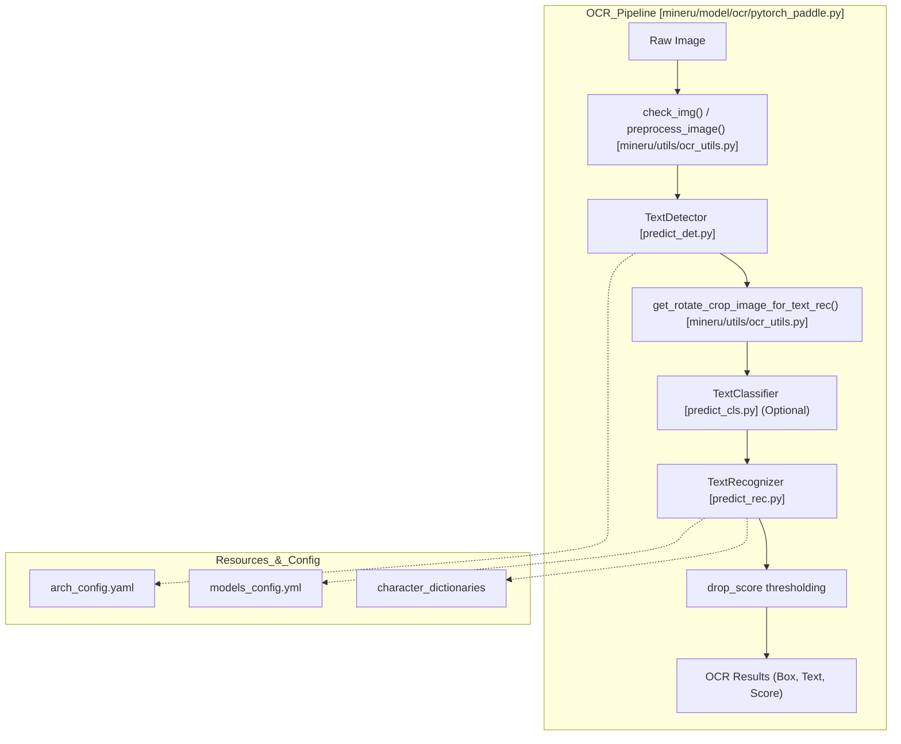
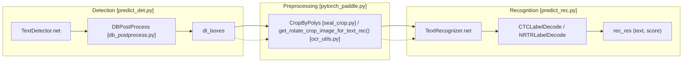

# OCR Engine

Relevant source files

The following files were used as context for generating this wiki page:

- [mineru/backend/utils/ocr_det_utils.py](mineru/backend/utils/ocr_det_utils.py)
- [mineru/model/ocr/pytorch_paddle.py](mineru/model/ocr/pytorch_paddle.py)
- [mineru/model/utils/pytorchocr/base_ocr_v20.py](mineru/model/utils/pytorchocr/base_ocr_v20.py)
- [mineru/model/utils/pytorchocr/data/imaug/operators.py](mineru/model/utils/pytorchocr/data/imaug/operators.py)
- [mineru/model/utils/pytorchocr/modeling/backbones/__init__.py](mineru/model/utils/pytorchocr/modeling/backbones/__init__.py)
- [mineru/model/utils/pytorchocr/modeling/backbones/rec_lcnetv4.py](mineru/model/utils/pytorchocr/modeling/backbones/rec_lcnetv4.py)
- [mineru/model/utils/pytorchocr/modeling/heads/det_db_head.py](mineru/model/utils/pytorchocr/modeling/heads/det_db_head.py)
- [mineru/model/utils/pytorchocr/modeling/heads/rec_multi_head.py](mineru/model/utils/pytorchocr/modeling/heads/rec_multi_head.py)
- [mineru/model/utils/pytorchocr/modeling/necks/__init__.py](mineru/model/utils/pytorchocr/modeling/necks/__init__.py)
- [mineru/model/utils/pytorchocr/modeling/necks/db_fpn.py](mineru/model/utils/pytorchocr/modeling/necks/db_fpn.py)
- [mineru/model/utils/pytorchocr/modeling/necks/rnn.py](mineru/model/utils/pytorchocr/modeling/necks/rnn.py)
- [mineru/model/utils/pytorchocr/postprocess/db_postprocess.py](mineru/model/utils/pytorchocr/postprocess/db_postprocess.py)
- [mineru/model/utils/pytorchocr/postprocess/rec_postprocess.py](mineru/model/utils/pytorchocr/postprocess/rec_postprocess.py)
- [mineru/model/utils/pytorchocr/utils/resources/arch_config.yaml](mineru/model/utils/pytorchocr/utils/resources/arch_config.yaml)
- [mineru/model/utils/pytorchocr/utils/resources/dict/ppocrv6_dict.txt](mineru/model/utils/pytorchocr/utils/resources/dict/ppocrv6_dict.txt)
- [mineru/model/utils/pytorchocr/utils/resources/models_config.yml](mineru/model/utils/pytorchocr/utils/resources/models_config.yml)
- [mineru/model/utils/tools/infer/predict_cls.py](mineru/model/utils/tools/infer/predict_cls.py)
- [mineru/model/utils/tools/infer/predict_det.py](mineru/model/utils/tools/infer/predict_det.py)
- [mineru/model/utils/tools/infer/predict_rec.py](mineru/model/utils/tools/infer/predict_rec.py)
- [mineru/model/utils/tools/infer/pytorchocr_utility.py](mineru/model/utils/tools/infer/pytorchocr_utility.py)
- [mineru/resources/fasttext-langdetect/lid.176.ftz](mineru/resources/fasttext-langdetect/lid.176.ftz)
- [mineru/utils/language.py](mineru/utils/language.py)
- [mineru/utils/ocr_language.py](mineru/utils/ocr_language.py)

The OCR Engine in MinerU is a high-performance, multi-language optical character recognition subsystem. It is built upon a custom port of PaddleOCR to PyTorch (`paddleocr2pytorch`), enabling seamless integration with the rest of the PyTorch-based MinerU pipeline while leveraging pre-trained weights from the PaddleOCR ecosystem.

## Core Architecture: PytorchPaddleOCR

The primary interface for OCR operations is the `PytorchPaddleOCR` class, which inherits from `TextSystem` [[mineru/model/ocr/pytorch_paddle.py:50]](). It orchestrates detection and recognition models, manages language-specific configurations, and handles image preprocessing and batch optimization.

### Implementation and Data Flow
The OCR pipeline follows a "Detect-then-Recognize" flow, with specific logic for script types and hardware acceleration.

1.  **Initialization**: The engine resolves the hardware device (CPU/GPU/NPU) via `get_device()` [[mineru/model/ocr/pytorch_paddle.py:60]](). It automatically normalizes requested languages to supported model keys [[mineru/model/ocr/pytorch_paddle.py:66-71]]().
2.  **Model Loading**: It loads network configurations from `arch_config.yaml` [[mineru/model/utils/pytorchocr/utils/resources/arch_config.yaml:1-330]]() and defines model paths using `ModelPath.pytorch_paddle` [[mineru/model/ocr/pytorch_paddle.py:72]]().
3.  **Detection**: The `TextDetector` identifies text bounding boxes using algorithms like DB (Differentiable Binarization) [[mineru/model/utils/tools/infer/predict_det.py:41]](). It supports specialized configurations for "seal" detection, including `poly` box types [[mineru/model/ocr/pytorch_paddle.py:88-99]]().
4.  **Recognition**: Cropped text line images are processed by the `TextRecognizer` [[mineru/model/utils/tools/infer/predict_rec.py:16]](). It uses a default batch size of 6 (`rec_batch_num`) [[mineru/model/ocr/pytorch_paddle.py:87]]().
5.  **Seal OCR**: A specialized mode for seal/stamp recognition exists (`is_seal`), utilizing custom clipping and sorting logic via `SortPolyBoxes` and `CropByPolys` [[mineru/model/ocr/pytorch_paddle.py:108-110]]().

### OCR Pipeline Entity Map
This diagram maps the logical OCR stages to the specific code entities and files that implement them.

Title: OCR Engine Data Flow and Components

**Sources:** [[mineru/model/ocr/pytorch_paddle.py:50-107]](), [[mineru/model/utils/pytorchocr/utils/resources/arch_config.yaml:1-330]](), [[mineru/model/utils/pytorchocr/utils/resources/models_config.yml:1-58]](), [[mineru/model/utils/tools/infer/predict_det.py:15-128]]()

## Language Detection and Multi-Language Support

MinerU supports a vast array of languages by mapping ISO language codes and script families to specific PaddleOCR model configurations.

### Language Mapping Logic
The engine groups similar scripts into "families" to use optimized multi-language models:
*   **Arabic Aliases**: Includes `ar`, `fa`, `ug`, `ur`, `ps`, etc. [[mineru/utils/ocr_language.py:51]]().
*   **Cyrillic Aliases**: Includes `bg`, `mn`, `kk`, `ky`, `tg`, etc. [[mineru/utils/ocr_language.py:54-85]]().
*   **Devanagari Aliases**: Includes `hi`, `mr`, `ne`, `sa`, etc. [[mineru/utils/ocr_language.py:86-100]]().

### Language Detection
MinerU utilizes `fasttext` and `fast-langdetect` for identifying text languages.
*   **Fasttext Model**: The engine loads a pre-trained identification model `lid.176.ftz` [[mineru/resources/fasttext-langdetect/lid.176.ftz]]().
*   **Normalization**: The `normalize_ocr_model_lang` function resolves language codes to specific model keys (e.g., `seal` to `seal_lite` on CPU) [[mineru/utils/ocr_language.py:134-157]]().

### Model Configuration (`models_config.yml`)
Mappings between language keys and specific weights (Safetensors or PTH) are defined in `models_config.yml` [[mineru/model/utils/pytorchocr/utils/resources/models_config.yml:1-58]]().

| Language Key | Detection Model | Recognition Model | Dictionary File |
| :--- | :--- | :--- | :--- |
| `ch` | `ch_PP-OCRv6_small_det_infer.safetensors` | `ch_PP-OCRv6_small_rec_infer.safetensors` | `ppocrv6_dict.txt` [[mineru/model/utils/pytorchocr/utils/resources/models_config.yml:6-9]]() |
| `arabic` | `ch_PP-OCRv6_small_det_infer.safetensors` | `arabic_PP-OCRv5_rec_infer.pth` | `ppocrv5_arabic_dict.txt` [[mineru/model/utils/pytorchocr/utils/resources/models_config.yml:26-29]]() |
| `seal` | `seal_PP-OCRv4_det_server_infer.pth` | `ch_PP-OCRv6_medium_rec_infer.safetensors` | `ppocrv6_dict.txt` [[mineru/model/utils/pytorchocr/utils/resources/models_config.yml:50-53]]() |

**Sources:** [[mineru/model/utils/pytorchocr/utils/resources/models_config.yml:1-58]](), [[mineru/utils/ocr_language.py:134-157]]()

## OCR Model Architectures

The port supports PaddleOCR architectures (v3 to v6), defined in `arch_config.yaml`.

### Detection Models
The detection backbone typically uses **PPLCNetV4**, **PPHGNetV2**, or **MobileNetV3** with the **DBHead** (Differentiable Binarization) [[mineru/model/utils/pytorchocr/utils/resources/arch_config.yaml:14-115]]().
*   **PP-OCRv6**: Uses `PPLCNetV4` backbone and `RepLKFPN` neck [[mineru/model/utils/pytorchocr/utils/resources/arch_config.yaml:95-107]]().
*   **Inference Precision**: The `BaseOCRV20` class manages `fp16` vs `fp32` logic, defaulting to `fp16` on non-CPU devices [[mineru/model/utils/pytorchocr/base_ocr_v20.py:25-37]]().

### Recognition Models
Recognition models utilize algorithms like **SVTR_LCNet**, **SVTR_HGNet**, or **CRNN** [[mineru/model/utils/pytorchocr/utils/resources/arch_config.yaml:132-310]]().
*   **PP-OCRv6 LightSVTR**: Implements a `MultiHead` structure that handles `ctc_logits` directly for inference efficiency [[mineru/model/utils/pytorchocr/modeling/heads/rec_multi_head.py:68-75]]().
*   **Weight Compatibility**: Supports loading weights from both standard PyTorch `.pth` and HuggingFace-style `.safetensors` [[mineru/model/utils/pytorchocr/base_ocr_v20.py:59-87]]().

**Sources:** [[mineru/model/utils/pytorchocr/utils/resources/arch_config.yaml:1-330]](), [[mineru/model/utils/pytorchocr/base_ocr_v20.py:14-112]](), [[mineru/model/utils/pytorchocr/modeling/heads/rec_multi_head.py:22-77]]()

## Batch Optimization and Post-Processing

### Batch Inference
*   **Recognition**: Uses `rec_batch_num` to process multiple text crops simultaneously. The `TextRecognizer` resizes and normalizes images into a batch tensor [[mineru/model/utils/tools/infer/predict_rec.py:105-156]]().
*   **Classification**: The `TextClassifier` sorts text bars by aspect ratio to speed up batch processing [[mineru/model/utils/tools/infer/predict_cls.py:64-72]]().

### Seal Rectification and Cropping
Specialized logic handles curved text in stamps:
*   **SortPolyBoxes**: Ranks polygons based on minimum Y-coordinate to establish reading order [[mineru/model/ocr/seal_crop.py:26-39]]().
*   **CropByPolys**: Supports `poly` box types, using `get_poly_rect_crop` for complex curved shapes [[mineru/model/ocr/seal_crop.py:42-64]]().
*   **Debug Artifacts**: When enabled via `MINERU_SEAL_OCR_DEBUG`, the engine dumps detection visualizations and cropped images for inspection [[mineru/model/ocr/pytorch_paddle.py:128-173]]().

### Code Interaction: Detection to Recognition
This diagram illustrates the internal handoff between detection and recognition components.

Title: Detection to Recognition Handoff

**Sources:** [[mineru/model/ocr/pytorch_paddle.py:108-112]](), [[mineru/model/ocr/seal_crop.py:42-64]](), [[mineru/model/utils/tools/infer/predict_rec.py:16-103]](), [[mineru/model/utils/tools/infer/predict_det.py:15-128]]()
