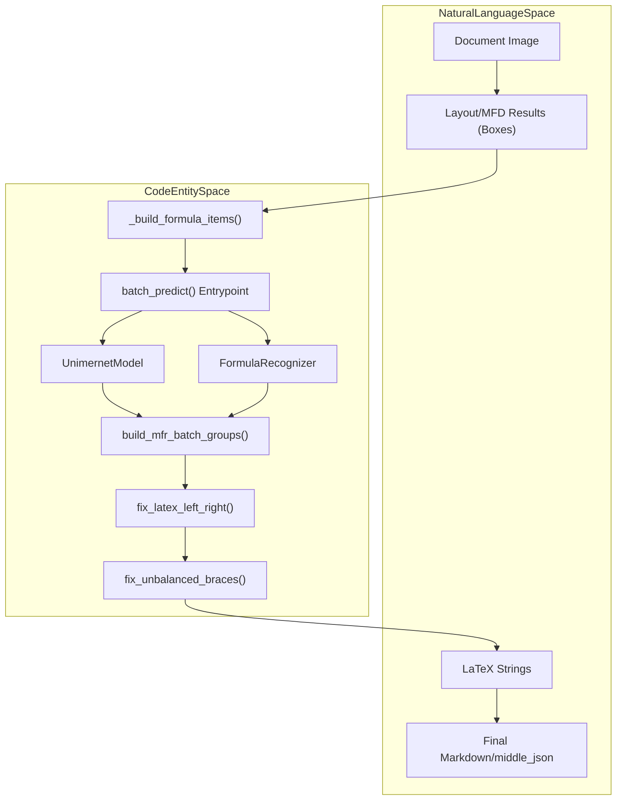
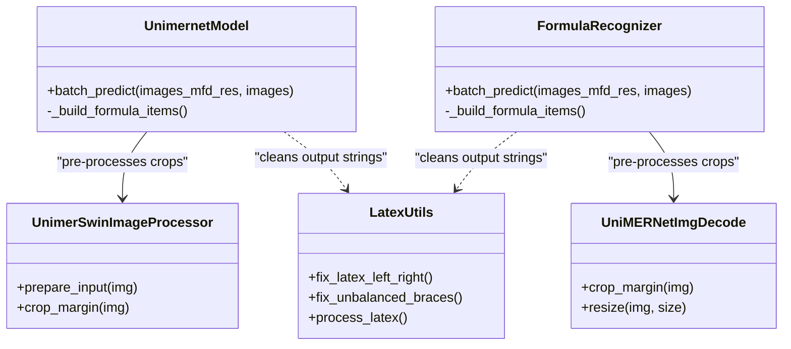

# Formula Recognition (MFD/MFR)

Relevant source files

The following files were used as context for generating this wiki page:

- [mineru/model/layout/pp_doclayoutv2.py](mineru/model/layout/pp_doclayoutv2.py)
- [mineru/model/mfr/pp_formulanet_plus_m/__init__.py](mineru/model/mfr/pp_formulanet_plus_m/__init__.py)
- [mineru/model/mfr/pp_formulanet_plus_m/predict_formula.py](mineru/model/mfr/pp_formulanet_plus_m/predict_formula.py)
- [mineru/model/mfr/pp_formulanet_plus_m/processors.py](mineru/model/mfr/pp_formulanet_plus_m/processors.py)
- [mineru/model/mfr/unimernet/Unimernet.py](mineru/model/mfr/unimernet/Unimernet.py)
- [mineru/model/mfr/unimernet/unimernet_hf/modeling_unimernet.py](mineru/model/mfr/unimernet/unimernet_hf/modeling_unimernet.py)
- [mineru/model/mfr/unimernet/unimernet_hf/unimer_mbart/modeling_unimer_mbart.py](mineru/model/mfr/unimernet/unimernet_hf/unimer_mbart/modeling_unimer_mbart.py)
- [mineru/model/mfr/unimernet/unimernet_hf/unimer_swin/image_processing_unimer_swin.py](mineru/model/mfr/unimernet/unimernet_hf/unimer_swin/image_processing_unimer_swin.py)
- [mineru/model/mfr/utils.py](mineru/model/mfr/utils.py)
- [mineru/model/utils/pytorchocr/modeling/heads/rec_ppformulanet_head.py](mineru/model/utils/pytorchocr/modeling/heads/rec_ppformulanet_head.py)
- [mineru/model/utils/pytorchocr/modeling/heads/rec_unimernet_head.py](mineru/model/utils/pytorchocr/modeling/heads/rec_unimernet_head.py)
- [mineru/utils/bbox_utils.py](mineru/utils/bbox_utils.py)

The Formula Recognition subsystem in MinerU identifies mathematical expressions within document images and converts them into high-quality LaTeX strings. This process is split into two distinct stages: **Mathematical Formula Detection (MFD)**, which locates formulas on a page, and **Mathematical Formula Recognition (MFR)**, which performs the image-to-LaTeX conversion.

## MFD/MFR Inference Pipeline

The pipeline operates by first detecting bounding boxes for formulas and then cropping those regions for sequence generation.

### 1. Mathematical Formula Detection (MFD)
MinerU utilizes specialized models for formula detection, primarily integrated through the layout detection stage using **PP-DocLayoutV2** [mineru/model/layout/pp_doclayoutv2.py:1-130]().

*   **Detection Categories**: The system distinguishes between `inline_formula` (formulas within text lines) and `display_formula` (standalone block formulas) [mineru/model/layout/pp_doclayoutv2.py:39-49]().
*   **Confidence Thresholds**: Default thresholds are set to `0.4` for `display_formula` and `inline_formula` to ensure high recall during the detection phase [mineru/model/layout/pp_doclayoutv2.py:68-78]().
*   **Data Extraction**: The function `_build_formula_items` in both `UnimernetModel` and `FormulaRecognizer` filters MFD results to extract items with formula labels and prepares them for recognition [mineru/model/mfr/unimernet/Unimernet.py:76-97](), [mineru/model/mfr/pp_formulanet_plus_m/predict_formula.py:96-117]().

**Sources:** [mineru/model/layout/pp_doclayoutv2.py:33-88](), [mineru/model/mfr/unimernet/Unimernet.py:76-97](), [mineru/model/mfr/pp_formulanet_plus_m/predict_formula.py:96-117]().

### 2. Mathematical Formula Recognition (MFR)
Once formula regions are identified, MFR models perform image-to-text conversion specifically tuned for mathematical notation. MinerU supports two primary backends: **UniMERNet** and **PP-FormulaNet-Plus-M**.

#### Architecture Comparison

| Feature | UniMERNet | PP-FormulaNet-Plus-M |
| :--- | :--- | :--- |
| **Base Architecture** | Swin Transformer (Encoder) + MBart (Decoder) | PP-FormulaNet (PaddleOCR-based) |
| **Implementation** | `UnimernetModel` [mineru/model/mfr/unimernet/Unimernet.py:26]() | `FormulaRecognizer` [mineru/model/mfr/pp_formulanet_plus_m/predict_formula.py:23]() |
| **Pre-processing** | `UnimerSwinImageProcessor` [mineru/model/mfr/unimernet/unimernet_hf/unimer_swin/image_processing_unimer_swin.py:11]() | `UniMERNetImgDecode`, `ToBatch` [mineru/model/mfr/pp_formulanet_plus_m/predict_formula.py:62-67]() |
| **Batching Strategy** | Area-based sorting [mineru/model/mfr/unimernet/Unimernet.py:152-160]() | Area-based sorting [mineru/model/mfr/pp_formulanet_plus_m/predict_formula.py:172-184]() |
| **Decoder Head** | `UnimerMBartForCausalLM` [mineru/model/mfr/unimernet/unimernet_hf/unimer_mbart/modeling_unimer_mbart.py:15]() | `UniMERNetHead` [mineru/model/utils/pytorchocr/modeling/heads/rec_ppformulanet_head.py:38]() |

**Sources:** [mineru/model/mfr/unimernet/Unimernet.py:26-41](), [mineru/model/mfr/pp_formulanet_plus_m/predict_formula.py:23-57](), [mineru/model/mfr/unimernet/unimernet_hf/modeling_unimernet.py:61-81](), [mineru/model/mfr/pp_formulanet_plus_m/processors.py:19-32](), [mineru/model/mfr/unimernet/unimernet_hf/unimer_swin/image_processing_unimer_swin.py:11-18]().

### Data Flow: From Detection to LaTeX
The following diagram illustrates how the system coordinates between detection and recognition.

**Formula Recognition Flow**

**Sources:** [mineru/model/mfr/unimernet/Unimernet.py:76-97](), [mineru/model/mfr/pp_formulanet_plus_m/predict_formula.py:96-117](), [mineru/model/mfr/unimernet/Unimernet.py:113-197](), [mineru/model/mfr/pp_formulanet_plus_m/predict_formula.py:133-211](), [mineru/model/mfr/utils.py:10-50]().

---

## Implementation Details

### UniMERNet Model
The UniMERNet implementation utilizes a `VisionEncoderDecoderModel` architecture [mineru/model/mfr/unimernet/unimernet_hf/modeling_unimernet.py:61]().

*   **Encoder/Decoder**: Uses `UnimerSwinModel` as the vision encoder and `UnimerMBartForCausalLM` as the text decoder [mineru/model/mfr/unimernet/unimernet_hf/modeling_unimernet.py:104-105](), [mineru/model/mfr/unimernet/unimernet_hf/unimer_mbart/modeling_unimer_mbart.py:15]().
*   **Batch Optimization**: Crop images are sorted by area to minimize padding overhead [mineru/model/mfr/unimernet/Unimernet.py:152-155](). `build_mfr_batch_groups` is used to group images with similar areas into batches [mineru/model/mfr/unimernet/Unimernet.py:160-161]().
*   **Inference**: Uses `self.model.generate()` with a `TokenizerWrapper` to produce LaTeX strings, specifically using `fixed_str` which removes excessive whitespace [mineru/model/mfr/unimernet/unimernet_hf/modeling_unimernet.py:147-162]().

**Sources:** [mineru/model/mfr/unimernet/Unimernet.py:152-170](), [mineru/model/mfr/unimernet/unimernet_hf/modeling_unimernet.py:61-162]().

### PP-FormulaNet-Plus-M
This model is integrated via the `BaseOCRV20` framework [mineru/model/mfr/pp_formulanet_plus_m/predict_formula.py:23](), leveraging components from the PaddleOCR-to-PyTorch port.

*   **Architecture**: Defined in `PP-FormulaNet_plus-M.pth` and configured via `PP-FormulaNet_plus-M_inference.yml` [mineru/model/mfr/pp_formulanet_plus_m/predict_formula.py:29-44]().
*   **Pre-processing**: `UniMERNetImgDecode` performs `crop_margin` using grayscale thresholding and `cv2.findNonZero` to isolate the formula within its crop [mineru/model/mfr/pp_formulanet_plus_m/processors.py:34-52]().
*   **Attention Mechanism**: Uses `AttentionMaskConverter` to handle causal and sliding window masks for the transformer-based decoder [mineru/model/utils/pytorchocr/modeling/heads/rec_ppformulanet_head.py:43-60]().

**Sources:** [mineru/model/mfr/pp_formulanet_plus_m/predict_formula.py:23-71](), [mineru/model/mfr/pp_formulanet_plus_m/processors.py:19-52](), [mineru/model/utils/pytorchocr/modeling/heads/rec_ppformulanet_head.py:43-70]().

### LaTeX Refinement
Raw model outputs are cleaned using specialized utilities in `mineru/model/mfr/utils.py` to ensure valid syntax.
*   **`fix_latex_left_right`**: Balances `\left` and `\right` delimiters and ensures they are followed by valid separators like `(`, `[`, or `{` [mineru/model/mfr/utils.py:10-50]().
*   **`fix_unbalanced_braces`**: Uses a stack-based approach to detect and remove unclosed curly braces `{}` [mineru/model/mfr/utils.py:163-207]().
*   **`process_latex`**: Handles backslash spacing for specific LaTeX commands and ensures valid character escapes for standard LaTeX rendering [mineru/model/mfr/utils.py:210-241]().

**Sources:** [mineru/model/mfr/utils.py:10-241]().

---

## Technical Data Flow Diagram

The diagram below bridges high-level system concepts with specific code classes and methods.

**MFD/MFR Class Interaction**

**Sources:** [mineru/model/mfr/unimernet/Unimernet.py:26](), [mineru/model/mfr/pp_formulanet_plus_m/predict_formula.py:23](), [mineru/model/mfr/pp_formulanet_plus_m/processors.py:19](), [mineru/model/mfr/unimernet/unimernet_hf/unimer_swin/image_processing_unimer_swin.py:11](), [mineru/model/mfr/utils.py:10-241]().

### Key Functions and Classes
- **`_build_formula_items`**: In both `UnimernetModel` and `FormulaRecognizer`, this method extracts formula bounding boxes from MFD results and prepares them for MFR [mineru/model/mfr/unimernet/Unimernet.py:76-97](), [mineru/model/mfr/pp_formulanet_plus_m/predict_formula.py:96-117]().
- **`fix_latex_left_right`**: Critical utility for LaTeX syntax validation and delimiter balancing [mineru/model/mfr/utils.py:10-50]().
- **`UnimernetModel` (HF wrapper)**: Implements the `generate` loop for the UniMERNet architecture [mineru/model/mfr/unimernet/unimernet_hf/modeling_unimernet.py:61-162]().
- **`UniMERNetImgDecode`**: Handles margin cropping and resizing for formula crops, used by PP-FormulaNet-Plus-M [mineru/model/mfr/pp_formulanet_plus_m/processors.py:19-168]().
- **`UnimerSwinImageProcessor`**: Handles margin cropping and resizing for formula crops, used by UniMERNet [mineru/model/mfr/unimernet/unimernet_hf/unimer_swin/image_processing_unimer_swin.py:11-180]().

**Sources:**
- [mineru/model/mfr/unimernet/Unimernet.py]()
- [mineru/model/mfr/pp_formulanet_plus_m/predict_formula.py]()
- [mineru/model/mfr/pp_formulanet_plus_m/processors.py]()
- [mineru/model/mfr/utils.py]()
- [mineru/model/mfr/unimernet/unimernet_hf/modeling_unimernet.py]()
- [mineru/model/mfr/unimernet/unimernet_hf/unimer_swin/image_processing_unimer_swin.py]()
- [mineru/model/mfr/unimernet/unimernet_hf/unimer_mbart/modeling_unimer_mbart.py]()
- [mineru/model/utils/pytorchocr/modeling/heads/rec_ppformulanet_head.py]()
- [mineru/model/layout/pp_doclayoutv2.py]()
