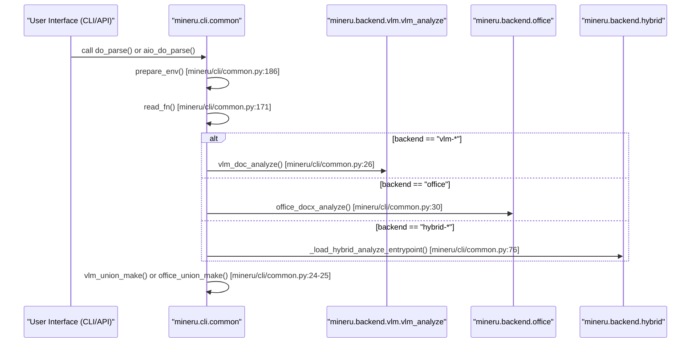

# CLI & API Interfaces

<details>
<summary>Relevant source files</summary>

The following files were used as context for generating this wiki page:

- [README.md](README.md)
- [README_zh-CN.md](README_zh-CN.md)
- [docs/en/quick_start/index.md](docs/en/quick_start/index.md)
- [docs/zh/quick_start/index.md](docs/zh/quick_start/index.md)
- [mineru/cli/api_client.py](mineru/cli/api_client.py)
- [mineru/cli/api_protocol.py](mineru/cli/api_protocol.py)
- [mineru/cli/client.py](mineru/cli/client.py)
- [mineru/cli/common.py](mineru/cli/common.py)
- [mineru/cli/fast_api.py](mineru/cli/fast_api.py)
- [mineru/cli/gradio_app.py](mineru/cli/gradio_app.py)
- [mineru/cli/router.py](mineru/cli/router.py)
- [mineru/utils/cli_parser.py](mineru/utils/cli_parser.py)
- [pyproject.toml](pyproject.toml)

</details>


This page provides a high-level overview of the user-facing entry points for MinerU. The system supports multiple interaction modes ranging from command-line tools for batch processing to a programmatic Python API for deep integration, and web-based interfaces for interactive use.

## Interface Overview

MinerU exposes its functionality through several distinct layers, all of which eventually resolve to the core processing logic in the `mineru.cli.common` module or the specialized backend analysis engines.

### Interface-to-Code Mapping
The following diagram illustrates how different user interfaces map to specific entry point scripts and functions within the codebase.

**User Interface Entry Points**
```mermaid
graph TD
    subgraph "User_Space"
        CLI["mineru CLI"]
        WEB["Gradio Web UI"]
        API_REQ["FastAPI Request"]
        PROG["Python Script"]
    end

    subgraph "Code_Entry_Points"
        client_main["mineru.cli.client:main"]
        gradio_main["mineru.cli.gradio_app:main"]
        fastapi_main["mineru.cli.fast_api:main"]
        sdk_call["demo/demo.py"]
    end

    subgraph "Internal_Dispatch"
        aio_parse["aio_do_parse"]
        sync_parse["do_parse"]
    end

    CLI --> client_main
    WEB --> gradio_main
    API_REQ --> fastapi_main
    PROG --> sdk_call

    client_main --> sync_parse
    gradio_main --> aio_parse
    fastapi_main --> aio_parse
    sdk_call --> aio_parse
    
    sync_parse --- ["mineru/cli/common.py:36-36"]()
    aio_parse --- ["mineru/cli/common.py:35-35"]()
```
**Sources:** [mineru/cli/client.py:129-129](), [mineru/cli/fast_api.py:34-44](), [mineru/cli/gradio_app.py:33-40](), [pyproject.toml:128-136]()

---

## [Command-Line Interface (mineru CLI)](#4.1)

The CLI is the primary tool for local document conversion and environment management. It is designed to handle both single files and batch processing with support for various backends.

*   **`mineru`**: The main command for converting PDFs, images, or Office docs [pyproject.toml:129](). It handles input normalization such as task stem truncation via `normalize_task_stem` [mineru/cli/common.py:110-111]() and uniquification using `uniquify_task_stems` [mineru/cli/common.py:134-168]().
*   **`mineru-api`**: Launches the FastAPI server for remote request handling [pyproject.toml:134]().
*   **`mineru-router`**: A load balancer service that manages a pool of workers and routes requests to upstream services [pyproject.toml:135]().
*   **`mineru-gradio`**: Launches the Gradio-based web interface [pyproject.toml:136]().
*   **`mineru-vllm-server` / `mineru-lmdeploy-server` / `mineru-openai-server`**: Specialized commands for running standalone VLM inference servers [pyproject.toml:130-132]().
*   **Lifecycle Management**: The CLI utilizes `LocalAPIServer` [mineru/cli/api_client.py:94]() and `ReusableLocalAPIServer` [mineru/cli/gradio_app.py:54]() to manage the lifecycle of local inference servers, including process cleanup via `stop_managed_process` [mineru/cli/api_client.py:222-242]().

For a full reference of flags and command usage, see **[Command-Line Interface (mineru CLI)](#4.1)**.

---

## [FastAPI & Gradio Web Interfaces](#4.2)

For server-side deployments and interactive testing, MinerU provides built-in web services that expose the processing pipeline over HTTP.

*   **FastAPI Server (`mineru-api`)**: Exposes asynchronous endpoints for file parsing. It uses `AsyncParseTask` [mineru/cli/fast_api.py:142-171]() to track state from `pending` to `completed` [mineru/cli/fast_api.py:78-82](). It manages concurrency via `_request_semaphore` [mineru/cli/fast_api.py:96]() and supports specialized headers like `X-MinerU-Task-Id` [mineru/cli/fast_api.py:88]().
*   **Gradio Web UI (`mineru-gradio`)**: A visual interface for interactive document conversion. It includes a `GradioRequestConcurrencyLimiter` [mineru/cli/gradio_app.py:72-199]() to manage browser-side pressure and provides a live status panel for task tracking.
*   **Load Balancer (`mineru-router`)**: Orchestrates multiple upstream workers. It uses `ParseRequestOptions` [mineru/cli/api_request.py:45-45]() to standardize request parameters between the router and individual API nodes.

For details on API schemas and running the web UI, see **[FastAPI & Gradio Web Interfaces](#4.2)**.

---

## [Programmatic Python API](#4.3)

Developers can integrate MinerU directly into their Python applications using high-level orchestration functions that abstract away the complexity of model management.

*   **Core Orchestration**: `do_parse()` (synchronous) and `aio_do_parse()` (asynchronous) are the primary entry points [mineru/cli/common.py:35-36](). They handle the selection of VLM engines via `get_vlm_engine()` [mineru/cli/common.py:20]() and coordinate backend-specific analysis.
*   **Input Processing**: The `read_fn()` utility normalizes various inputs (PDF, PNG, JPG, DOCX, PPTX, XLSX) [mineru/cli/common.py:171-184](). For images, it performs an internal conversion to PDF bytes using `images_bytes_to_pdf_bytes()` [mineru/cli/common.py:179]().
*   **Office Support**: Specific analyzers like `office_docx_analyze`, `office_pptx_analyze`, and `office_xlsx_analyze` handle non-PDF formats [mineru/cli/common.py:28-30]().
*   **Environment Setup**: `prepare_env()` [mineru/cli/common.py:186-191]() automatically creates the necessary directory structure for output Markdown and images.

### Data Flow to Code Entity Mapping
The diagram below shows how a request moves from the API/CLI layer through the core functions to the specific analysis backends.

**Processing Orchestration Flow**

**Sources:** [mineru/cli/common.py:13-30](), [mineru/cli/fast_api.py:34-44](), [mineru/cli/client.py:42-49]()

For detailed documentation on function signatures and data structures, see **[Programmatic Python API](#4.3)**.
