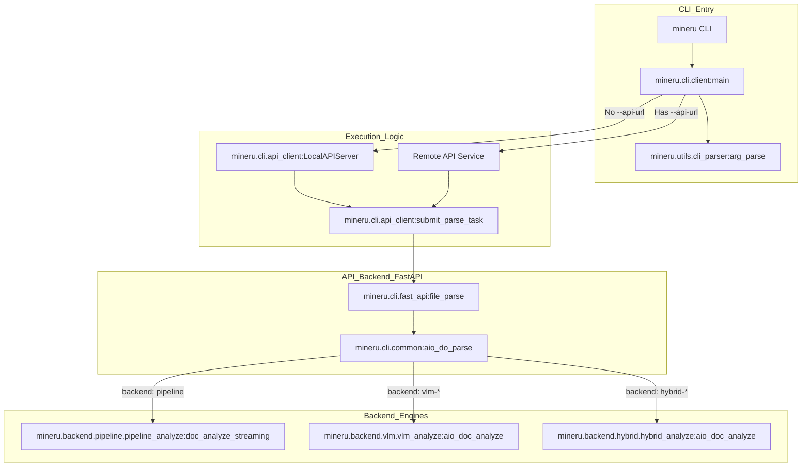
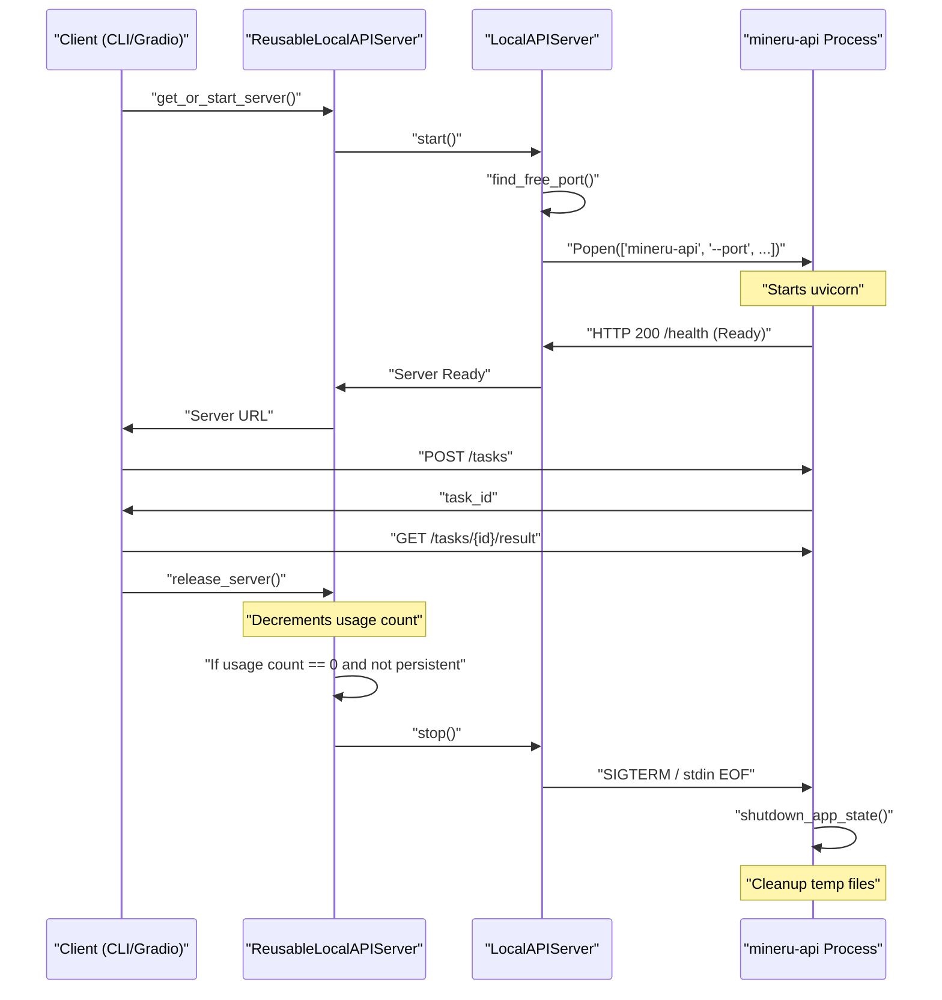
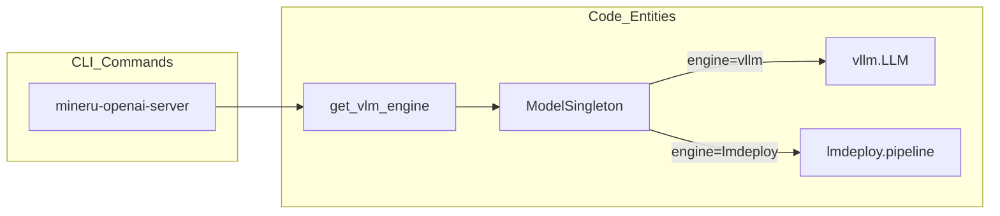

# Command-Line Interface (mineru CLI)

Relevant source files

The following files were used as context for generating this wiki page:

- [docs/en/usage/advanced_cli_parameters.md](docs/en/usage/advanced_cli_parameters.md)
- [docs/en/usage/cli_tools.md](docs/en/usage/cli_tools.md)
- [docs/en/usage/index.md](docs/en/usage/index.md)
- [docs/zh/usage/advanced_cli_parameters.md](docs/zh/usage/advanced_cli_parameters.md)
- [docs/zh/usage/cli_tools.md](docs/zh/usage/cli_tools.md)
- [docs/zh/usage/index.md](docs/zh/usage/index.md)
- [mineru/cli/api_request.py](mineru/cli/api_request.py)
- [mineru/cli/client.py](mineru/cli/client.py)
- [mineru/cli/common.py](mineru/cli/common.py)
- [mineru/cli/gradio_app.py](mineru/cli/gradio_app.py)
- [mineru/cli/output_paths.py](mineru/cli/output_paths.py)
- [mineru/cli/visualization.py](mineru/cli/visualization.py)

The MinerU Command-Line Interface (CLI) provides a suite of tools for document conversion, model management, and service deployment. It serves as the primary entry point for users to interact with the MinerU ecosystem, offering both local processing and remote client-server capabilities. Starting with version 3.0, the `mineru` CLI acts as an orchestration client that communicates with a `mineru-api` backend [docs/en/usage/cli_tools.md:100-105]().

## 1. CLI Entry Points Overview

MinerU defines several executable commands mapped to specific functions within the codebase.

| Command | Entry Point Function | Purpose |
| :--- | :--- | :--- |
| `mineru` | `mineru.cli.client:main` | Main document parsing tool (Local/Client) [mineru/cli/client.py:1146-1148](). |
| `mineru-models-download` | `mineru.cli.models_download:download_models` | Downloads and configures model weights [mineru/cli/models_download.py:144-148](). |
| `mineru-api` | `mineru.cli.fast_api:main` | Starts a FastAPI server for remote parsing [mineru/cli/fast_api.py:1022-1024](). |
| `mineru-router` | `mineru.cli.router:main` | Starts a load-balancing router for multiple workers [mineru/cli/router.py:461-463](). |
| `mineru-gradio` | `mineru.cli.gradio_app:main` | Starts a Gradio-based web interface [mineru/cli/gradio_app.py:1162-1164](). |
| `mineru-vllm-server` | `mineru.cli.vlm_server:vllm_server` | Starts a vLLM-backed OpenAI-compatible server. |
| `mineru-lmdeploy-server` | `mineru.cli.vlm_server:lmdeploy_server` | Starts an LMDeploy-backed OpenAI-compatible server. |
| `mineru-openai-server` | `mineru.cli.vlm_server:openai_server` | Generic OpenAI-compatible server wrapper [docs/en/usage/quick_usage.md:103-104](). |

**Sources:** [mineru/cli/client.py:1146-1148](), [mineru/cli/fast_api.py:1022-1024](), [mineru/cli/gradio_app.py:1162-1164](), [mineru/cli/router.py:461-463](), [mineru/cli/models_download.py:144-148](), [docs/en/usage/quick_usage.md:103-104]()

---

## 2. The `mineru` Command

The `mineru` command is the core utility for converting PDFs, images, and Office documents into Markdown.

### 2.1 Execution Flow and Dispatch
The CLI uses a "Client-Server" architecture. If no `--api-url` is provided, the CLI launches a `LocalAPIServer` [mineru/cli/client.py:93-94]() to handle the parsing logic. Tasks are submitted via the `submit_parse_task` protocol [mineru/cli/api_client.py:476]() and monitored using a `LiveTaskStatusRenderer` [mineru/cli/client.py:179-183]() for real-time console updates.

**CLI Dispatch Architecture**

**Sources:** [mineru/cli/client.py:93-94](), [mineru/cli/client.py:179-183](), [mineru/cli/api_client.py:476](), [mineru/cli/fast_api.py:527-535](), [mineru/cli/common.py:27](), [mineru/utils/cli_parser.py:62]()

### 2.2 Key Flags and Parameters
*   **`-p, --path`**: Input file path or directory. Supports `.pdf`, images, `.docx`, `.pptx`, and `.xlsx` [docs/en/usage/cli_tools.md:11-12]().
*   **`-o, --output`**: Directory for results [docs/en/usage/cli_tools.md:12]().
*   **`-b, --backend`**: Engine selection (`pipeline`, `vlm-engine`, `hybrid-engine`, `vlm-http-client`, `hybrid-http-client`) [docs/en/usage/cli_tools.md:15-16]().
*   **`-m, --method`**: Parsing strategy (`auto`, `txt`, `ocr`) [docs/en/usage/cli_tools.md:14]().
*   **`-l, --lang`**: Specifies document language to improve OCR accuracy (pipeline only) [docs/en/usage/cli_tools.md:18-19]().
*   **`-s, --start` / `-e, --end`**: Page range for parsing (0-indexed) [docs/en/usage/cli_tools.md:21-22]().
*   **`--api-url`**: Connects to an existing MinerU API service [docs/en/usage/cli_tools.md:13]().
*   **`-u, --url`**: OpenAI-compatible backend URL for http-client backends [docs/en/usage/cli_tools.md:20]().
*   **`--effort`**: Hybrid parsing intensity (`medium`, `high`) [docs/en/usage/cli_tools.md:17]().

**Sources:** [docs/en/usage/cli_tools.md:11-22]()

### 2.3 Output Directory Structure
The output is organized by filename and parse method. The `resolve_parse_dir` function calculates the final destination based on backend and file type [mineru/cli/output_paths.py:29-58]().
*   `{filename}/{method}/images/`: Extracted images and formulas.
*   `{filename}/{method}/{filename}.md`: Final Markdown.
*   `{filename}/{method}/{filename}_middle.json`: Intermediate representation.
*   `{filename}/{method}/{filename}_model.json`: Raw model inference results.

**Sources:** [mineru/cli/common.py:186-192](), [mineru/cli/output_paths.py:29-58]()

---

## 3. Web and API Interfaces

### 3.1 `mineru-api` (FastAPI)
The API server provides synchronous and asynchronous endpoints. It manages concurrency via an `asyncio.Semaphore` based on `MINERU_API_MAX_CONCURRENT_REQUESTS` [mineru/cli/fast_api.py:94-96]().
*   **Task Management**: Uses `AsyncParseTask` to track status (`pending`, `processing`, `completed`, `failed`) [mineru/cli/fast_api.py:141-169]().
*   **Endpoints**:
    *   `POST /tasks`: Asynchronous submission returning a `task_id` [mineru/cli/fast_api.py:596-600]().
    *   `POST /file_parse`: Synchronous parsing that waits for completion [mineru/cli/fast_api.py:527-535]().
    *   `GET /health`: Returns service metadata, protocol version [mineru/cli/api_protocol.py:53](), and concurrency limits [mineru/cli/fast_api.py:465-480]().

**Sources:** [mineru/cli/fast_api.py:94-96](), [mineru/cli/fast_api.py:141-169](), [mineru/cli/fast_api.py:527-600](), [mineru/cli/api_protocol.py:53]()

### 3.2 `mineru-router`
A load-balancing gateway that aggregates multiple `mineru-api` workers.
*   **Upstream Management**: Supports multiple `--upstream-url` targets and can launch local workers via `--local-gpus` [mineru/cli/router.py:461-463]().
*   **Health Checking**: Periodically refreshes worker states via `WorkerPool` to distribute tasks to healthy nodes [mineru/cli/router.py:72-76]().

**Sources:** [mineru/cli/router.py:72-76](), [mineru/cli/router.py:461-463]()

### 3.3 `mineru-gradio`
A visual interface supporting real-time status updates and side-by-side visualization [mineru/cli/gradio_app.py:202-219]().
*   **Concurrency Limiter**: Uses `GradioRequestConcurrencyLimiter` to manage UI requests [mineru/cli/gradio_app.py:72-75]().
*   **Lifecycle Management**: Automatically launches a `ReusableLocalAPIServer` if no `--api-url` is provided [mineru/cli/gradio_app.py:54]().

**Sources:** [mineru/cli/gradio_app.py:54](), [mineru/cli/gradio_app.py:72-75](), [mineru/cli/gradio_app.py:202-219]()

---

## 4. Local API Server Lifecycle

MinerU manages temporary API servers using `LocalAPIServer` and `ReusableLocalAPIServer`.

### 4.1 Implementation Details
*   **`LocalAPIServer`**: Starts a `mineru-api` process on a free port and creates a temporary directory [mineru/cli/api_client.py:253-264]().
*   **`ReusableLocalAPIServer`**: Extends `LocalAPIServer` to allow reuse across multiple requests (e.g., in Gradio), reducing startup overhead [mineru/cli/gradio_app.py:54]().
*   **Shutdown Logic**: Implements a `stdin` watcher to ensure the server exits if the parent process terminates [mineru/cli/fast_api.py:113-131]().

**Server Lifecycle Diagram**

**Sources:** [mineru/cli/fast_api.py:113-131](), [mineru/cli/gradio_app.py:54](), [mineru/cli/api_client.py:253-264]()

---

## 5. VLM Servers and Visualization

### 5.1 VLM Inference Servers
Commands like `mineru-openai-server` provide high-performance inference.
*   **Model Lifecycle**: The `mineru-api` can preload models via `maybe_preload_vlm_model` [mineru/cli/fast_api.py:57-60]().
*   **Preloading**: The `--enable-vlm-preload` flag allows warming up the VLM model during service startup [docs/en/usage/cli_tools.md:45-46]().

**Model Implementation Mapping**

**Sources:** [mineru/cli/fast_api.py:57-60](), [mineru/cli/common.py:20](), [docs/en/usage/cli_tools.md:45-46]()

### 5.2 Visualization
The CLI supports layout visualization via `VisualizationJob`, which renders bounding boxes for layout regions and text spans [mineru/cli/visualization.py:22-35](). This is used by `mineru-gradio` [mineru/cli/gradio_app.py:51]() to verify parsing accuracy by calling `run_visualization_job` [mineru/cli/visualization.py:84-86]().

**Sources:** [mineru/cli/visualization.py:22-35](), [mineru/cli/visualization.py:84-86](), [mineru/cli/common.py:19]()
