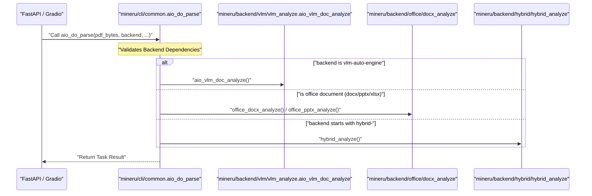

# FastAPI & Gradio Web Interfaces

<details>
<summary>Relevant source files</summary>

The following files were used as context for generating this wiki page:

- [mineru/cli/api_client.py](mineru/cli/api_client.py)
- [mineru/cli/api_protocol.py](mineru/cli/api_protocol.py)
- [mineru/cli/client.py](mineru/cli/client.py)
- [mineru/cli/common.py](mineru/cli/common.py)
- [mineru/cli/fast_api.py](mineru/cli/fast_api.py)
- [mineru/cli/gradio_app.py](mineru/cli/gradio_app.py)
- [mineru/cli/router.py](mineru/cli/router.py)
- [mineru/resources/gradio_app.css](mineru/resources/gradio_app.css)
- [mineru/resources/gradio_app.js](mineru/resources/gradio_app.js)
- [mineru/resources/gradio_header.html](mineru/resources/gradio_header.html)
- [mineru/utils/cli_parser.py](mineru/utils/cli_parser.py)

</details>


This page documents the web-based entry points for MinerU: the **FastAPI** server, the **mineru-router** load balancer, and the **Gradio** web interface. These interfaces serve as high-level wrappers around the asynchronous parsing pipeline, enabling remote access, multi-GPU orchestration, and interactive document conversion.

## Overview of Web Interfaces

MinerU provides three primary web-based modes of operation:
1.  **FastAPI (`mineru-api`)**: A high-performance REST API designed for programmatic integration and batch processing [mineru/cli/fast_api.py:212-221]().
2.  **Router (`mineru-router`)**: A load balancer that aggregates multiple `mineru-api` upstreams or manages local GPU workers [mineru/cli/router.py:21-23]().
3.  **Gradio (`mineru-gradio`)**: A user-friendly web UI for interactive document uploading, real-time previewing, and result downloading [mineru/cli/gradio_app.py:19-21]().

All interfaces rely on the same underlying asynchronous orchestration logic provided by `aio_do_parse` [mineru/cli/common.py:35-35]().

### System Architecture Diagram

The following diagram illustrates how the web interfaces interact with the core parsing engine and the task management system.

**Web Interface to Code Entity Mapping**
```mermaid
graph TD
    subgraph "Client_Space"
        [User] --> ["gradio_app.py"]
        ["API_Client"] --> ["router.py"]
    end

    subgraph "Interface_Layer"
        ["gradio_app.py"] -- "uses" --> ["ReusableLocalAPIServer"]
        ["fast_api.py"] -- "manages" --> ["AsyncParseTask"]
        ["router.py"] -- "orchestrates" --> ["WorkerPool"]
    end

    subgraph "Task_&_Orchestration"
        ["AsyncParseTask"] --> ["aio_do_parse"]
        ["aio_do_parse"] -- "mineru/cli/common.py" --> ["Dispatcher"]
    end

    subgraph "Processing_Backends"
        ["Dispatcher"] -- "VLM" --> ["aio_vlm_doc_analyze"]
        ["Dispatcher"] -- "Office" --> ["office_docx_analyze"]
        ["Dispatcher"] -- "Hybrid" --> ["hybrid_analyze"]
    end

    ["ReusableLocalAPIServer"] -- "api_client.py" --> ["fast_api.py"]
    ["WorkerPool"] -- "proxies_to" --> ["fast_api.py"]
```
Sources: [mineru/cli/fast_api.py:142-171](), [mineru/cli/router.py:21-23](), [mineru/cli/common.py:35-35](), [mineru/cli/common.py:24-30](), [mineru/cli/api_client.py:54-54]()

---

## FastAPI Server (`mineru-api`)

The FastAPI server (`fast_api.py`) is the core service component. It manages a task queue and provides endpoints for document processing.

### Core Endpoints

| Endpoint | Method | Description |
| :--- | :--- | :--- |
| `/tasks` | `POST` | Asynchronous submission via `submit_async_task`. Returns a `task_id` immediately [mineru/cli/fast_api.py:355-375](). |
| `/tasks/{task_id}/status` | `GET` | Returns `AsyncParseTask` state (`pending`, `processing`, `completed`, `failed`) [mineru/cli/fast_api.py:78-81](). |
| `/tasks/{task_id}/result` | `GET` | Downloads the final ZIP result if the task is terminal [mineru/cli/fast_api.py:420-442](). |
| `/file_parse` | `POST` | Legacy synchronous endpoint using `do_file_parse` [mineru/cli/fast_api.py:292-301](). |
| `/health` | `GET` | Returns server metadata and `API_PROTOCOL_VERSION` [mineru/cli/fast_api.py:279-288](). |

### Task Management: `AsyncParseTask`
The server tracks requests using the `AsyncParseTask` dataclass [mineru/cli/fast_api.py:142-171](). 
- **Retention**: Tasks and their outputs are kept for a duration defined by `DEFAULT_TASK_RETENTION_SECONDS` (24h) [mineru/cli/fast_api.py:85-85]().
- **Cleanup**: A background task `cleanup_expired_tasks` runs at intervals defined by `DEFAULT_TASK_CLEANUP_INTERVAL_SECONDS` [mineru/cli/fast_api.py:86-86]().

### Concurrency Control
- **Semaphore**: Uses an `asyncio.Semaphore` (`_request_semaphore`) to limit active processing [mineru/cli/fast_api.py:96-96]().
- **Queuing**: When the semaphore is full, tasks are placed in a `pending` state. The `to_status_payload` method includes `queued_ahead` to inform the client of their position [mineru/cli/fast_api.py:173-196]().

Sources: [mineru/cli/fast_api.py:78-104](), [mineru/cli/fast_api.py:142-196](), [mineru/cli/fast_api.py:355-442](), [mineru/cli/api_protocol.py:2-4]()

---

## Load Balancer (`mineru-router`)

The `mineru-router` acts as a reverse proxy and load balancer for multiple `mineru-api` instances.

### Key Features
- **Worker Management**: Automatically detects local GPUs to spawn local workers using `LOCAL_GPU_AUTO` [mineru/cli/router.py:70-70]().
- **Upstream Aggregation**: Aggregates existing `mineru-api` upstreams or remote sources via `upstream_urls` [mineru/cli/router.py:68-69]().
- **Health Checks**: The `WorkerPool` periodically refreshes worker status and monitors `UPSTREAM_FAILURE_THRESHOLD` [mineru/cli/router.py:72-76]().

### Data Flow
1.  **Request Arrival**: The router receives a `POST /tasks` request handled by `parse_request_form` [mineru/cli/router.py:44-44]().
2.  **Worker Selection**: It selects a worker from the `WorkerPool`, maintaining task affinity.
3.  **Proxying**: It forwards the file uploads and parameters to the chosen upstream [mineru/cli/router.py:21-23]().
4.  **Task Tracking**: The router maps `task_id` to the specific upstream worker for status and result consistency.

Sources: [mineru/cli/router.py:44-78](), [mineru/cli/api_client.py:28-42](), [mineru/cli/api_protocol.py:2-4]()

---

## Gradio Web UI (`gradio_app.py`)

The Gradio interface provides a visual frontend for the MinerU pipeline, supporting interactive exploration of parsing results.

### Features & Implementation
- **Local API Lifecycle**: Uses `ReusableLocalAPIServer` to manage a dedicated `mineru-api` instance in the background [mineru/cli/gradio_app.py:54-54]().
- **Concurrency Limiter**: Implements `GradioRequestConcurrencyLimiter` using `asyncio.Semaphore` and `threading.Lock` to manage UI-side pressure [mineru/cli/gradio_app.py:72-75]().
- **Wait Snapshots**: Provides `GradioConcurrencyWaitSnapshot` to show users their position in the local queue [mineru/cli/gradio_app.py:57-63]().
- **Visualization**: Integrates `VisualizationJob` to generate side-by-side comparisons of original PDFs and detected layout blocks [mineru/cli/gradio_app.py:51-51]().

### UI Component Mapping
- **Input**: `gr.File` for document selection and `PDF` component for preview [mineru/cli/gradio_app.py:20-21]().
- **Logs**: A `gr.Textbox` with custom JavaScript autoscroll (`STATUS_BOX_AUTOSCROLL_JS`) for real-time processing logs [mineru/cli/gradio_app.py:202-219]().
- **Styling**: Uses custom CSS (`gradio_app.css`) and JS (`gradio_app.js`) assets for a polished look [mineru/resources/gradio_app.css:1-16](), [mineru/resources/gradio_app.js:1-10]().

Sources: [mineru/cli/gradio_app.py:51-219](), [mineru/cli/api_client.py:54-54](), [mineru/resources/gradio_app.css:1-16](), [mineru/resources/gradio_app.js:1-10]()

---

## The Async Pipeline: `aio_do_parse`

Both FastAPI and Gradio interfaces invoke `aio_do_parse` as the primary entry point for non-blocking execution. This function handles the routing between backends.

**Pipeline Orchestration Sequence**

Sources: [mineru/cli/common.py:35-35](), [mineru/cli/common.py:24-30](), [mineru/cli/common.py:69-74]()

### Key Utility Functions in `common.py`
- **`uniquify_task_stems`**: Assigns task-local unique stems while preserving input order to prevent collisions [mineru/cli/common.py:134-168]().
- **`normalize_upload_filename`**: Sanitizes user-provided filenames to be filesystem-safe [mineru/cli/common.py:114-118]().
- **`prepare_env`**: Creates the necessary directory structure (`/images` subfolder) for a specific task [mineru/cli/common.py:186-191]().
- **`ensure_backend_dependencies`**: Dynamically checks for `torch` before attempting to load specific backend modules [mineru/cli/common.py:69-74]().
- **`read_fn`**: Handles initial file reading and converts image inputs into PDF bytes using `images_bytes_to_pdf_bytes` [mineru/cli/common.py:171-183]().

Sources: [mineru/cli/common.py:69-191]()
