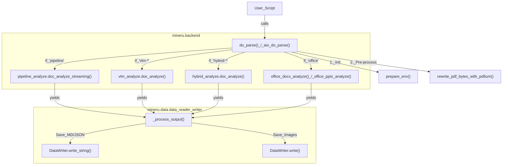
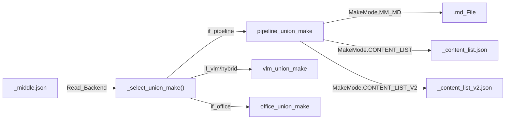

# Programmatic Python API

Relevant source files

The following files were used as context for generating this wiki page:

- [demo/demo.py](demo/demo.py)
- [mineru/backend/utils/formula_number.py](mineru/backend/utils/formula_number.py)
- [mineru/cli/backend_options.py](mineru/cli/backend_options.py)
- [mineru/cli/client_side_output.py](mineru/cli/client_side_output.py)
- [mineru/data/data_reader_writer/__init__.py](mineru/data/data_reader_writer/__init__.py)
- [mineru/data/data_reader_writer/base.py](mineru/data/data_reader_writer/base.py)
- [mineru/data/data_reader_writer/dummy.py](mineru/data/data_reader_writer/dummy.py)
- [mineru/data/data_reader_writer/filebase.py](mineru/data/data_reader_writer/filebase.py)
- [mineru/data/data_reader_writer/multi_bucket_s3.py](mineru/data/data_reader_writer/multi_bucket_s3.py)
- [mineru/data/data_reader_writer/s3.py](mineru/data/data_reader_writer/s3.py)
- [mineru/data/io/__init__.py](mineru/data/io/__init__.py)
- [mineru/data/io/base.py](mineru/data/io/base.py)
- [mineru/data/io/http.py](mineru/data/io/http.py)
- [mineru/data/io/s3.py](mineru/data/io/s3.py)
- [mineru/data/utils/__init__.py](mineru/data/utils/__init__.py)
- [mineru/utils/pdf_page_id.py](mineru/utils/pdf_page_id.py)
- [tests/unittest/pdfs/test.pdf](tests/unittest/pdfs/test.pdf)
- [tests/unittest/test_e2e.py](tests/unittest/test_e2e.py)

The Programmatic Python API provides developers with direct access to MinerU's document parsing capabilities. It centers around orchestration functions that handle the lifecycle of document conversion across different backends (Pipeline, VLM, Hybrid, and Office) and a robust I/O abstraction layer for local and cloud storage.

## Core Orchestration Functions

The primary entry points for programmatic usage are defined in `mineru/cli/common.py`. These functions abstract the complexity of backend selection, environment preparation, and output generation.

### `do_parse()`
The synchronous entry point used by the CLI and local scripts. It iterates through document bytes, initializes the requested backend, and coordinates the flow from raw data to structured output [mineru/cli/common.py:186-191](). It supports PDF, images, and Office documents (`docx`, `pptx`, `xlsx`) [mineru/cli/common.py:42-47]().

### `aio_do_parse()`
The asynchronous version of the parsing pipeline, designed for integration into web servers (FastAPI) or concurrent processing tasks. It utilizes `asyncio` to manage non-blocking I/O operations, particularly useful when calling remote VLM endpoints via `vlm-http-client` [mineru/cli/common.py:27]().

### Parsing Workflow Diagram
This diagram maps the high-level request to the specific code entities that execute the parsing logic.

**Title: MinerU Programmatic Parsing Flow**

Sources: [mineru/cli/common.py:24-30](), [mineru/cli/common.py:186-191](), [mineru/cli/common.py:31-34](), [tests/unittest/test_e2e.py:99-105]()

---

## Data Reader & Writer Abstractions

MinerU decouples data storage from the processing logic using the `DataReader` and `DataWriter` abstractions defined in the `mineru.data` module [mineru/data/data_reader_writer/__init__.py:2-4](). This allows the system to support local filesystems, HTTP sources, and S3-compatible storage.

### DataWriter Implementation
The `DataWriter` interface ensures that whether the output is a local directory or a cloud bucket, the parsing logic remains identical.

*   **`FileBasedDataWriter`**: The standard implementation for local filesystem operations [mineru/data/data_reader_writer/filebase.py:4](). It is used to save images and markdown results during the parse lifecycle [tests/unittest/test_e2e.py:115-140]().
*   **S3 & Multi-Bucket Support**: Integration with S3 is supported via `S3Reader` / `S3Writer` and `MultiBucketS3DataReader` / `MultiBucketS3DataWriter` [mineru/data/data_reader_writer/multi_bucket_s3.py:62-158]().
*   **`MultiS3Mixin`**: Manages multiple S3 configurations, ensuring bucket names are unique and providing a default bucket/prefix for relative paths [mineru/data/data_reader_writer/multi_bucket_s3.py:21-59]().
*   **`DummyDataWriter`**: A no-op writer used for testing or dry-run scenarios [mineru/data/data_reader_writer/dummy.py:3]().

### Utility Functions for Data
The `mineru.cli.common` module and `mineru.data` submodules provide helper functions to standardize input data:

| Function | Purpose |
| :--- | :--- |
| `read_fn(path)` | Reads a file, guesses its type, and converts images to PDF bytes if necessary [mineru/cli/common.py:171-184](). |
| `rewrite_pdf_bytes_with_pdfium()` | Normalizes the PDF byte stream and handles page range extraction [mineru/cli/common.py:33-34](). |
| `get_end_page_id()` | Safely calculates the final page index to process, preventing out-of-range errors [mineru/utils/pdf_page_id.py:5-10](). |
| `guess_suffix_by_path()` | Determines file type based on path extension [demo/demo.py:11](). |
| `uniquify_task_stems()` | Assigns unique filenames to tasks to prevent collisions [mineru/cli/common.py:134-168](). |

Sources: [mineru/cli/common.py:171-184](), [mineru/data/data_reader_writer/multi_bucket_s3.py:62-158](), [mineru/utils/pdf_page_id.py:5-10](), [demo/demo.py:11-13]()

---

## Client-Side Output Generation

When interacting with a remote server or re-processing existing results, MinerU allows for the regeneration of final outputs (Markdown, Content Lists) using the intermediate `middle_json` format.

### `regenerate_client_side_outputs()`
This function reads a `_middle.json` file and calls the appropriate `union_make` function based on the backend specified in the JSON metadata. It ensures that the client can produce the same high-quality Markdown and JSON content lists as the server without re-running heavy inference [mineru/cli/client_side_output.py:44-97]().

**Title: Client-Side Output Workflow**

Sources: [mineru/cli/common.py:24-25](), [mineru/cli/client_side_output.py:44-97](), [mineru/cli/client.py:51]()

---

## API Client Usage Patterns (demo.py)

The `demo/demo.py` script illustrates how to use the `mineru.cli.api_client` to interact with either a remote MinerU server or a dynamically spawned local server.

### Key Client Patterns:
1.  **Local Server Lifecycle**: Using `LocalAPIServer` to start a managed FastAPI process for the duration of a script [demo/demo.py:148-150]().
2.  **Task Submission**: Bundling files as `UploadAsset` and submitting them via `submit_parse_task` [demo/demo.py:163-167]().
3.  **Status Polling**: Using `wait_for_task_result` with a callback to monitor progress [demo/demo.py:182-187]().
4.  **Result Extraction**: Downloading the final ZIP and using `safe_extract_zip` to unpack the Markdown and images [demo/demo.py:189-200]().

### Configuration Parameters
The API accepts parameters to tune the output, built using `build_parse_request_form_data` [demo/demo.py:55-74]():
*   **`backend`**: Selection between `pipeline`, `vlm-engine`, `hybrid-engine`, etc. [mineru/cli/backend_options.py:3-7]().
*   **`effort`**: Controls the analysis intensity for hybrid backends (`medium`, `high`) [mineru/cli/backend_options.py:8-9]().
*   **`parse_method`**: Options like `auto`, `ocr`, or `txt` [demo/demo.py:101]().
*   **`formula_enable` / `table_enable`**: Boolean flags to toggle specialized parsing modules [demo/demo.py:103-104]().

### Post-Processing Logic
Programmatic users can also leverage internal post-processing utilities like `formula_number.py` to refine the document structure:
*   **`optimize_formula_number_blocks()`**: Merges isolated formula numbers into adjacent LaTeX formula blocks using `\tag{}` [mineru/backend/utils/formula_number.py:155-166]().
*   **`finalize_client_side_middle_json()`**: Refines title levels and metadata before final rendering [mineru/cli/client_side_output.py:9-71]().

Sources: [demo/demo.py:55-200](), [mineru/cli/backend_options.py:3-22](), [mineru/utils/pdf_page_id.py:5-10](), [mineru/backend/utils/formula_number.py:155-179]()
