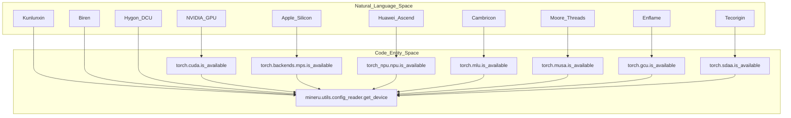
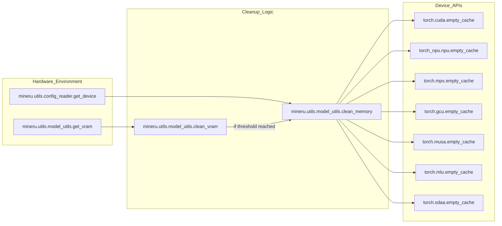

# Hardware Acceleration

Relevant source files

The following files were used as context for generating this wiki page:

- [docs/zh/usage/acceleration_cards/AMD.md](docs/zh/usage/acceleration_cards/AMD.md)
- [docs/zh/usage/acceleration_cards/Ascend.md](docs/zh/usage/acceleration_cards/Ascend.md)
- [docs/zh/usage/acceleration_cards/Biren.md](docs/zh/usage/acceleration_cards/Biren.md)
- [docs/zh/usage/acceleration_cards/Cambricon.md](docs/zh/usage/acceleration_cards/Cambricon.md)
- [docs/zh/usage/acceleration_cards/Enflame.md](docs/zh/usage/acceleration_cards/Enflame.md)
- [docs/zh/usage/acceleration_cards/Hygon.md](docs/zh/usage/acceleration_cards/Hygon.md)
- [docs/zh/usage/acceleration_cards/IluvatarCorex.md](docs/zh/usage/acceleration_cards/IluvatarCorex.md)
- [docs/zh/usage/acceleration_cards/Kunlunxin.md](docs/zh/usage/acceleration_cards/Kunlunxin.md)
- [docs/zh/usage/acceleration_cards/METAX.md](docs/zh/usage/acceleration_cards/METAX.md)
- [docs/zh/usage/acceleration_cards/MooreThreads.md](docs/zh/usage/acceleration_cards/MooreThreads.md)
- [docs/zh/usage/acceleration_cards/THead.md](docs/zh/usage/acceleration_cards/THead.md)
- [docs/zh/usage/acceleration_cards/Tecorigin.md](docs/zh/usage/acceleration_cards/Tecorigin.md)
- [docs/zh/usage/acceleration_cards/VastAI.md](docs/zh/usage/acceleration_cards/VastAI.md)
- [mineru/utils/config_reader.py](mineru/utils/config_reader.py)
- [mineru/utils/model_utils.py](mineru/utils/model_utils.py)

MinerU provides extensive support for a wide variety of hardware accelerators, ranging from standard NVIDIA GPUs and Apple Silicon to a broad ecosystem of domestic Chinese AI chips. This hardware abstraction is primarily managed through centralized device detection in `config_reader.py` and specialized inference engine configurations in the VLM and Pipeline backends.

## Device Detection and Logic

The system identifies the available hardware at runtime to determine which execution provider to use for models (PyTorch, ONNX Runtime, vLLM, etc.).

### Device Resolution Flow
The `get_device()` function in `mineru/utils/config_reader.py` resolves the execution device using the following priority:
1.  **Environment Variable**: Checks `MINERU_DEVICE_MODE` [mineru/utils/config_reader.py:106-108]().
2.  **NVIDIA CUDA**: Checks `torch.cuda.is_available()` [mineru/utils/config_reader.py:110-111]().
3.  **Apple MPS**: Checks `torch.backends.mps.is_available()` [mineru/utils/config_reader.py:112-113]().
4.  **Specialized Accelerators**: Iteratively checks for NPU (Huawei), GCU (Enflame), MUSA (MooreThreads), MLU (Cambricon), and SDAA (Tecorigin) via their respective torch extensions [mineru/utils/config_reader.py:115-135]().

### Hardware-Code Mapping
The following diagram illustrates how natural language hardware categories map to specific code entities and detection logic within the MinerU codebase.

**Title: Hardware Detection and Entity Mapping**

Sources: [mineru/utils/config_reader.py:105-138]()

## VLM Engine Configuration

The VLM backend contains specialized logic for domestic accelerators, particularly for `vllm` and `lmdeploy` engines.

### Device-Specific Configurations
Engine parameters are often adjusted based on the `MINERU_VLLM_DEVICE` or `MINERU_LMDEPLOY_DEVICE` environment variables.

*   **Kunlunxin (kxpu)**: Requires setting `MINERU_VLLM_DEVICE=kxpu` [docs/zh/usage/acceleration_cards/Kunlunxin.md:42]().
*   **MooreThreads (musa)**: Due to vLLM v1 support limitations, MinerU uses the v0 engine for MUSA [docs/zh/usage/acceleration_cards/MooreThreads.md:44-47]().
*   **Cambricon (mlu)**: Currently adopts the v0 engine for vLLM due to compatibility issues with vLLM v1 [docs/zh/usage/acceleration_cards/Cambricon.md:68-71]().

### Backend Selection
For `lmdeploy`, the backend is determined by environment variables:
- **ascend/maca/camb**: Uses the `pytorch` backend by setting `MINERU_LMDEPLOY_DEVICE` to `ascend` [docs/zh/usage/acceleration_cards/Ascend.md:77](), `maca` [docs/zh/usage/acceleration_cards/METAX.md:57](), or `camb` [docs/zh/usage/acceleration_cards/Cambricon.md:45]().

Sources: [mineru/utils/config_reader.py:105-138](), [docs/zh/usage/acceleration_cards/MooreThreads.md:44-47](), [docs/zh/usage/acceleration_cards/Cambricon.md:68-71]()

## Supported Accelerators Detail

### Huawei Ascend (NPU)
*   **Driver/CANN**: Requires CANN environment (e.g., driver 23.0.3) [docs/zh/usage/acceleration_cards/Ascend.md:7]().
*   **Backends**: Supports both `vllm` and `lmdeploy`. `MINERU_LMDEPLOY_DEVICE` should be set to `ascend` [docs/zh/usage/acceleration_cards/Ascend.md:14, 77]().
*   **Special Handling**: For 310P cards, `--enforce-eager --dtype float16` parameters are required for vLLM commands [docs/zh/usage/acceleration_cards/Ascend.md:89-93]().
*   **Environment**: Uses `ASCEND_RT_VISIBLE_DEVICES` for isolation [docs/zh/usage/acceleration_cards/Ascend.md:174]().

### METAX (MACA)
*   **Engine**: Supported via `maca.Dockerfile`. It supports both `vllm` and `lmdeploy` backends [docs/zh/usage/acceleration_cards/METAX.md:24-36]().
*   **Environment**: Uses `MINERU_LMDEPLOY_DEVICE=maca` [docs/zh/usage/acceleration_cards/METAX.md:57]().
*   **Tooling**: Monitoring via `mx-smi` [docs/zh/usage/acceleration_cards/METAX.md:147]().

### T-Head (PPU)
*   **Engine**: Supports `vllm` and `lmdeploy` via `ppu.Dockerfile` [docs/zh/usage/acceleration_cards/THead.md:19-30]().
*   **Environment**: Requires `--device=/dev/alixpu` and `--device=/dev/alixpu_ctl` when running containers [docs/zh/usage/acceleration_cards/THead.md:38-39]().
*   **Tooling**: Monitoring via `ppu-smi` [docs/zh/usage/acceleration_cards/THead.md:138]().

### Kunlunxin (KXPU)
*   **Configuration**: Requires `MINERU_VLLM_DEVICE=kxpu` [docs/zh/usage/acceleration_cards/Kunlunxin.md:42]().
*   **Environment**: Uses `XPU_VISIBLE_DEVICES` for isolation [docs/zh/usage/acceleration_cards/Kunlunxin.md:119]().

### VastAI (VACC)
*   **Backend Support**: Exclusively supports `vlm-engine` and `vlm-http-client` using the vLLM backend [docs/zh/usage/acceleration_cards/VastAI.md:75, 215]().
*   **Requirement**: vLLM commands must include `--enforce_eager` [docs/zh/usage/acceleration_cards/VastAI.md:124]().
*   **Environment**: Uses `VACC_VISIBLE_DEVICES` [docs/zh/usage/acceleration_cards/VastAI.md:69]().

### MooreThreads (MUSA)
*   **Environment**: Requires `MTHREADS_VISIBLE_DEVICES=all` and `MINERU_VLLM_DEVICE=musa` [docs/zh/usage/acceleration_cards/MooreThreads.md:29-30]().
*   **Engine**: Uses vLLM v0 due to v1 compatibility issues [docs/zh/usage/acceleration_cards/MooreThreads.md:45-47]().

### Tecorigin (SDAA)
*   **Support**: Supports `vllm` across all conversion modes via the `sdaa-vllm-latest` image [docs/zh/usage/acceleration_cards/Tecorigin.md:30, 49-106]().
*   **Environment**: Uses `SDAA_VISIBLE_DEVICES` [docs/zh/usage/acceleration_cards/Tecorigin.md:115]().
*   **Tooling**: Monitoring via `teco-smi -c` [docs/zh/usage/acceleration_cards/Tecorigin.md:116]().

### Summary of Domestic Accelerator Support

| Accelerator | Symbol | Visibility Env Var | SMI Tool |
| :--- | :--- | :--- | :--- |
| Huawei Ascend | `npu` | `ASCEND_RT_VISIBLE_DEVICES` | `npu-smi` |
| Cambricon | `mlu` | `MLU_VISIBLE_DEVICES` | `cnmon` |
| METAX | `maca` | `CUDA_VISIBLE_DEVICES` | `mx-smi` |
| Tecorigin | `sdaa` | `SDAA_VISIBLE_DEVICES` | `teco-smi` |
| T-Head | `ppu` | `PPU_VISIBLE_DEVICES` | `ppu-smi` |
| Kunlunxin | `kxpu` | `XPU_VISIBLE_DEVICES` | `xpu-smi` |
| Hygon DCU | `dcu` | `HIP_VISIBLE_DEVICES` | `hy-smi` |
| Biren | `supa` | `SUPA_VISIBLE_DEVICES` | `brsmi` |
| VastAI | `vacc` | `VACC_VISIBLE_DEVICES` | N/A |
| Enflame | `gcu` | `TOPS_VISIBLE_DEVICES` | `efsmi` |
| MooreThreads | `musa` | `MTHREADS_VISIBLE_DEVICES` | `mthreads-gmi` |

Sources: [docs/zh/usage/acceleration_cards/Ascend.md](), [docs/zh/usage/acceleration_cards/METAX.md](), [docs/zh/usage/acceleration_cards/THead.md](), [docs/zh/usage/acceleration_cards/Kunlunxin.md](), [docs/zh/usage/acceleration_cards/VastAI.md](), [docs/zh/usage/acceleration_cards/Tecorigin.md](), [docs/zh/usage/acceleration_cards/MooreThreads.md](), [docs/zh/usage/acceleration_cards/Enflame.md:104-106](), [docs/zh/usage/acceleration_cards/Cambricon.md:153-155]()

## Optimization Strategies

### Memory Management
The system provides utilities to monitor and clean hardware memory to prevent Out-Of-Memory (OOM) errors during long-running batch tasks.

**Title: Hardware Memory Lifecycle**

Sources: [mineru/utils/model_utils.py:183-205](), [mineru/utils/model_utils.py:208-212]()

### Precision and Eager Execution
Many domestic cards (like Ascend 310P and VastAI) require eager mode execution to avoid graph compilation issues or precision mismatches. This is handled by adding `--enforce-eager` (or `--enforce_eager`) and specifying `--dtype float16` in the engine arguments [docs/zh/usage/acceleration_cards/Ascend.md:89-93](), [docs/zh/usage/acceleration_cards/VastAI.md:124]().

### Memory Cleanup Implementation
The `clean_memory()` function in `mineru/utils/model_utils.py` provides device-specific cache clearing for CUDA, NPU, MPS, GCU, MUSA, MLU, and SDAA using their respective `empty_cache()` implementations [mineru/utils/model_utils.py:183-205]().

Sources: [docs/zh/usage/acceleration_cards/Ascend.md:88-93](), [docs/zh/usage/acceleration_cards/VastAI.md:123-125](), [mineru/utils/model_utils.py:183-205]()
