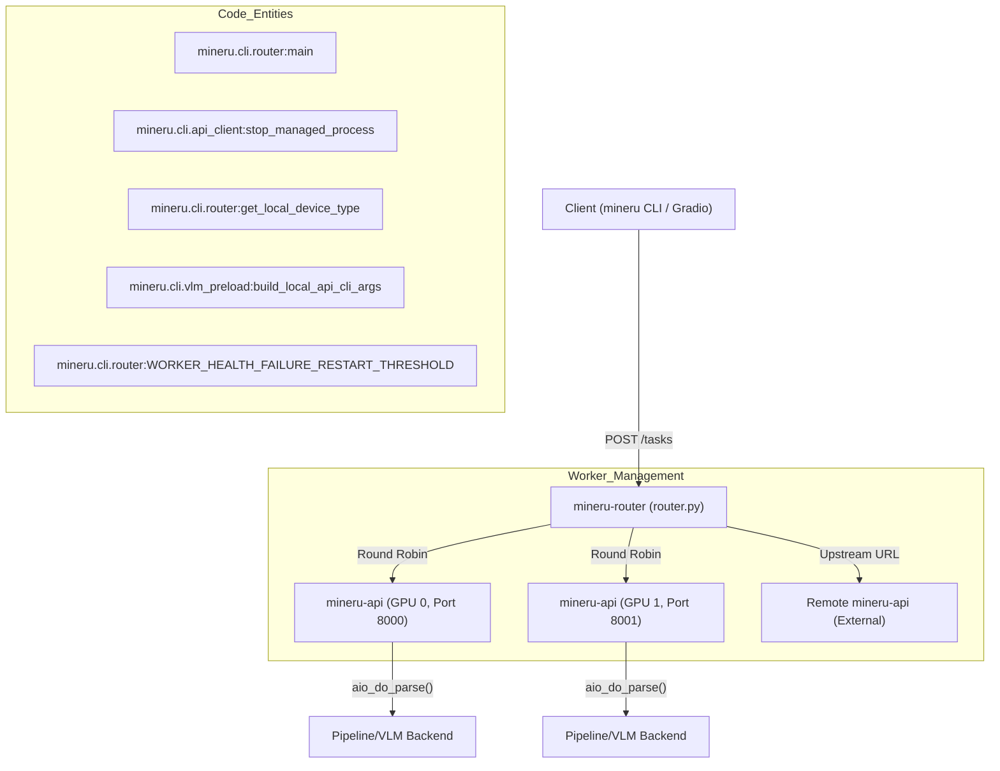
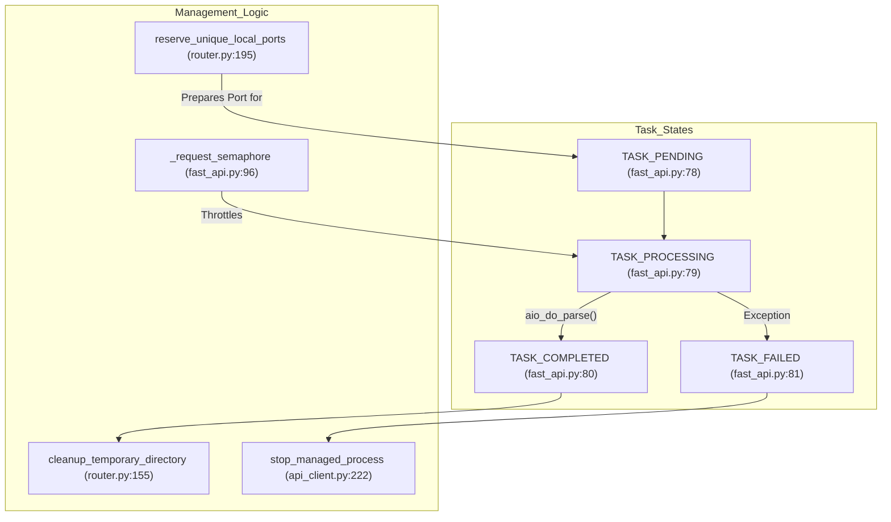

# Multi-GPU & Enterprise Deployments

Relevant source files

The following files were used as context for generating this wiki page:

- [docs/en/quick_start/extension_modules.md](docs/en/quick_start/extension_modules.md)
- [docs/zh/quick_start/extension_modules.md](docs/zh/quick_start/extension_modules.md)
- [mineru/cli/api_client.py](mineru/cli/api_client.py)
- [mineru/cli/api_protocol.py](mineru/cli/api_protocol.py)
- [mineru/cli/fast_api.py](mineru/cli/fast_api.py)
- [mineru/cli/router.py](mineru/cli/router.py)
- [mineru/utils/cli_parser.py](mineru/utils/cli_parser.py)
- [projects/README.md](projects/README.md)
- [projects/README_zh-CN.md](projects/README_zh-CN.md)

This page documents the high-performance and distributed deployment options for MinerU. While the core library provides powerful PDF parsing capabilities, enterprise scenarios often require distributing workloads across multiple GPUs, managing long-running task queues, and integrating with high-throughput inference engines like `vLLM` or `lmdeploy`.

> [!NOTE]
> As of recent updates, the `projects` directory in the main repository has been archived to consolidate resources. New community-driven deployment projects are now hosted in the [awesome-mineru](https://github.com/opendatalab/awesome-mineru) repository [projects/README.md:1-6]().

## 1. Multi-GPU Parallel Inference (mineru-router)

MinerU provides a sophisticated routing and load-balancing layer via the `mineru-router` CLI. This component is designed to distribute inference tasks across multiple local GPUs or aggregate multiple remote `mineru-api` instances.

### Implementation Details
The router manages a pool of workers. When started with `--local-gpus auto`, it detects available hardware and spawns one worker per GPU [mineru/cli/router.py:70-71](), [mineru/cli/router.py:220-224]().

- **GPU Detection**: The `get_local_device_type()` function identifies available accelerators by calling `get_device()` from the configuration reader [mineru/cli/router.py:220-224]().
- **Process Management**: Local workers are started as managed subprocesses using `build_managed_process_popen_kwargs` [mineru/cli/api_client.py:148-154](). The router assigns a unique port and specific environment variables to each worker to ensure VRAM isolation [mineru/cli/router.py:195-211]().
- **Health Checks**: The router continuously monitors workers via the `/health` endpoint [mineru/cli/router.py:66-67](). If a worker fails multiple health checks (threshold defined by `WORKER_HEALTH_FAILURE_RESTART_THRESHOLD`), it is excluded or restarted [mineru/cli/router.py:75-76]().
- **Concurrency Control**: The router tracks the `WorkerState`, including the current `processing_window_size` to prevent overloading individual nodes [mineru/cli/router.py:76]().

### Data Flow: Router Load Balancing
The following diagram illustrates how a client request is distributed to a specific GPU worker process managed by the router.

**MinerU Router Distribution**

Sources: [mineru/cli/router.py:55-76](), [mineru/cli/router.py:134-141](), [mineru/cli/router.py:195-225](), [mineru/cli/api_client.py:148-154](), [mineru/cli/api_client.py:222-236]()

## 2. Distributed Inference Acceleration

Enterprise deployments often leverage `vllm` or `lmdeploy` to handle the heavy Vision-Language Model (VLM) requirements of MinerU.

- **Launch Modes**: The router can launch local workers using automated port discovery to prevent conflicts [mineru/cli/router.py:195-211](). It supports `subprocess` and `spawn` modes, with `spawn` being preferred for specific hardware like Huawei Ascend (NPU) [mineru/cli/api_client.py:135-146]().
- **Port Management**: To prevent conflicts during parallel startup, `reserve_unique_local_ports()` temporarily binds multiple sockets to find and hold free ports before worker initialization [mineru/cli/router.py:195-211]().
- **Inference Engines**:
    - **vLLM**: Provides acceleration for Volta+ architectures. Recommended for high-throughput VLM inference [docs/en/quick_start/extension_modules.md:22-30]().
    - **LMDeploy**: Offers alternative acceleration, particularly useful for specific hardware targets [docs/en/quick_start/extension_modules.md:38-46]().
- **Lightweight Clients**: Programmatic clients can connect to remote servers by specifying the API URL, bypassing local model loading [mineru/cli/fast_api.py:155](). This allows edge devices with only CPU to leverage powerful remote GPU clusters [docs/en/quick_start/extension_modules.md:52-67]().

Sources: [mineru/cli/router.py:195-211](), [mineru/cli/api_client.py:135-146](), [mineru/cli/fast_api.py:155](), [docs/en/quick_start/extension_modules.md:22-67]()

## 3. Service Orchestration (MinerU Tianshu)

MinerU provides multiple entry points for service-oriented architecture, allowing separation of concerns between the API layer, the routing layer, and the VLM inference layer.

| Service CLI | Implementation Entrypoint | Purpose |
| :--- | :--- | :--- |
| `mineru-api` | `mineru.cli.fast_api:create_app` | Primary FastAPI server with async task support and GZip middleware [mineru/cli/fast_api.py:212-221]() |
| `mineru-router` | `mineru.cli.router:main` | Multi-GPU Load Balancer and Worker Pool Manager [mineru/cli/router.py:18-21]() |
| `mineru-vllm-server` | `mineru.cli.vlm_server:vllm_server` | Standalone vLLM inference engine for document analysis |
| `mineru-openai-server` | `mineru.cli.vlm_server:openai_server` | OpenAI-compatible VLM server interface |

### Enterprise Service Features
- **Async Task Support**: The `mineru-api` implements an `AsyncParseTask` class to track long-running jobs [mineru/cli/fast_api.py:142-171]().
- **Task Persistence**: Tasks are tracked with status URLs and result URLs, allowing clients to poll for completion [mineru/cli/fast_api.py:173-196]().
- **MCP Server Integration**: MinerU supports the Model Context Protocol (MCP) for integration with AI assistants, allowing LLMs to directly invoke MinerU parsing capabilities via standardized tool definitions.
- **Tianshu (天枢) Load Balancing**: In enterprise contexts, MinerU utilizes `LitServe` or `mineru-router` to manage request distribution and worker lifecycle.

Sources: [mineru/cli/fast_api.py:142-221](), [mineru/cli/router.py:18-21](), [mineru/cli/api_protocol.py:2-4]()

## 4. Task Management & Lifecycle

In enterprise deployments, managing task persistence and status is handled by the API and Router layers.

- **Task Queue States**: The system maintains internal task states: `TASK_PENDING`, `TASK_PROCESSING`, `TASK_COMPLETED`, and `TASK_FAILED` [mineru/cli/fast_api.py:78-81]().
- **Retention & Cleanup**: Task data is retained for a duration set by `DEFAULT_TASK_RETENTION_SECONDS` (default 24 hours) [mineru/cli/fast_api.py:85](). Temporary directories are scrubbed using `cleanup_temporary_directory` which includes retry logic (defined by `LOCAL_API_CLEANUP_RETRIES`) for robust cleanup [mineru/cli/router.py:155-173]().
- **Process Lifecycle**: The system manages worker processes and uses `stop_managed_process` to ensure clean shutdowns, including signaling process trees on Windows (via `taskkill /T`) and Linux (via `os.killpg`) [mineru/cli/api_client.py:157-191](), [mineru/cli/api_client.py:222-236]().
- **Concurrency Limiting**: A `_request_semaphore` in the FastAPI layer controls the number of simultaneous active parsing requests based on `MAX_CONCURRENT_REQUESTS` [mineru/cli/fast_api.py:95-97]().

**Task Lifecycle and Code Mapping**

Sources: [mineru/cli/fast_api.py:78-97](), [mineru/cli/router.py:155-173](), [mineru/cli/api_client.py:157-236]()

## 5. Enterprise Configuration & Protocol

MinerU uses a standardized protocol for multi-client/server communication.

- **API Protocol**: The system uses `API_PROTOCOL_VERSION` (currently version 2) to ensure compatibility between clients and servers [mineru/cli/api_protocol.py:2]().
- **Argument Parsing**: The `cli_parser.py` utility handles complex CLI configurations for enterprise scripts, allowing unknown arguments (prefixed with `--`) to be coerced into appropriate types (bool, float, int) for internal function calls [mineru/utils/cli_parser.py:7-23](), [mineru/utils/cli_parser.py:25-53]().
- **Public Access Security**: The router and API include logic to validate and warn if the service is exposed on public interfaces via `MINERU_API_ALLOW_PUBLIC_HTTP_CLIENT_ENV` or `MINERU_ROUTER_ALLOW_PUBLIC_HTTP_CLIENT_ENV` [mineru/cli/fast_api.py:92-93](), [mineru/cli/router.py:77-78]().
- **GZip Compression**: Enterprise deployments enable `GZipMiddleware` in the FastAPI app to reduce bandwidth for large JSON/Markdown responses [mineru/cli/fast_api.py:28]().

Sources: [mineru/cli/fast_api.py:28-93](), [mineru/cli/router.py:77-78](), [mineru/utils/cli_parser.py:7-53](), [mineru/cli/api_protocol.py:2]()
