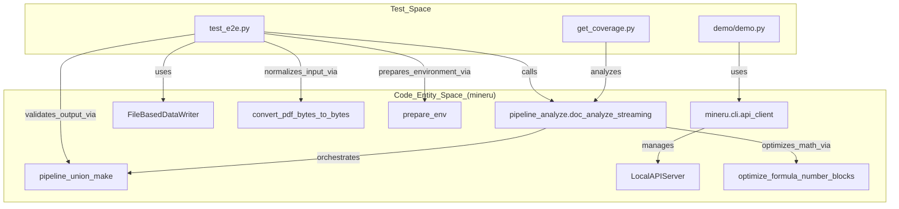
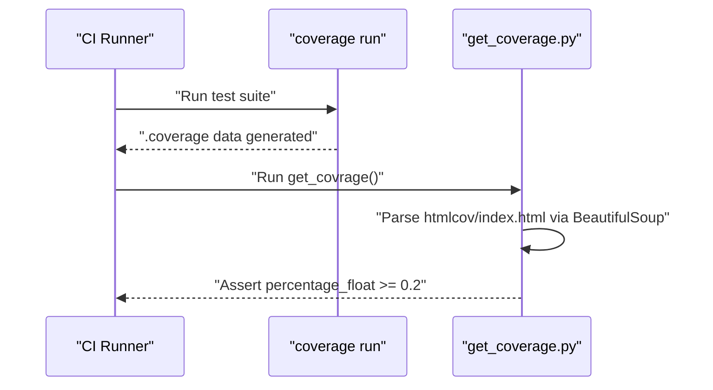

# Test Suite

Relevant source files

The following files were used as context for generating this wiki page:

- [.github/ISSUE_TEMPLATE/bug_report.yml](.github/ISSUE_TEMPLATE/bug_report.yml)
- [.github/ISSUE_TEMPLATE/config.yml](.github/ISSUE_TEMPLATE/config.yml)
- [demo/demo.py](demo/demo.py)
- [mineru/backend/utils/formula_number.py](mineru/backend/utils/formula_number.py)
- [mineru/cli/backend_options.py](mineru/cli/backend_options.py)
- [mineru/utils/pdf_page_id.py](mineru/utils/pdf_page_id.py)
- [tests/get_coverage.py](tests/get_coverage.py)
- [tests/unittest/pdfs/test.pdf](tests/unittest/pdfs/test.pdf)
- [tests/unittest/test_e2e.py](tests/unittest/test_e2e.py)

The MinerU test suite provides a comprehensive framework for validating document parsing accuracy, CLI functionality, and model performance. It spans from low-level unit tests to high-level end-to-end (E2E) integration tests and specialized benchmark tools.

## Test Architecture Overview

The testing infrastructure is designed to ensure consistency across the three primary backends (Pipeline, VLM, and Hybrid) while maintaining high code coverage. Tests are orchestrated via GitHub Actions for continuous integration.

### Test Flow and Entity Mapping

The following diagram illustrates how test entities interact with the core MinerU processing functions and utility modules.

**MinerU Test Flow and Entity Mapping**

Sources: [tests/unittest/test_e2e.py:8-20](), [tests/unittest/test_e2e.py:47-48](), [tests/unittest/test_e2e.py:84-86](), [tests/unittest/test_e2e.py:99-105](), [tests/unittest/test_e2e.py:119-129](), [demo/demo.py:9-11](), [demo/demo.py:148-154](), [mineru/backend/utils/formula_number.py:155-156]()

## Unit and End-to-End Tests

The core validation logic resides in the `tests/unittest/` directory. These tests focus on the internal consistency of the parsing logic and the correctness of the intermediate `middle_json` format.

### End-to-End (E2E) Validation
`test_e2e.py` validates the entire flow from raw PDF bytes to final Markdown and JSON content lists.
- **Pipeline Testing**: The `test_pipeline_with_two_config` function iterates through sample PDFs and runs the `pipeline_doc_analyze_streaming` function using both `txt` and `ocr` methods [tests/unittest/test_e2e.py:23-71]().
- **Result Transformation**: It uses `pipeline_union_make` to convert `pdf_info` from the `middle_json` into final `MM_MD` (Markdown) and `CONTENT_LIST` formats [tests/unittest/test_e2e.py:119-129]().
- **Content Verification**: The `assert_content` function uses fuzzy string matching (`fuzz.ratio`) and HTML parsing (`BeautifulSoup`) to verify that images, tables, equations, and text are correctly extracted [tests/unittest/test_e2e.py:152-219]().

### Specialized Logic Testing
- **Table Recognition**: Validates table reconstruction logic by checking for specific target strings (e.g., "Model", "Regression", "0.98740") within the generated HTML `table_body` [tests/unittest/test_e2e.py:171-203]().
- **Formula Number Optimization**: The `formula_number.py` module contains logic to merge formula tags (e.g., `(1.1)`) with LaTeX content using `build_tagged_formula_content` [mineru/backend/utils/formula_number.py:53-65](). It supports both pipeline [mineru/backend/utils/formula_number.py:155-165]() and hybrid [mineru/backend/utils/formula_number.py:168-178]() backends.
- **Equation Validation**: Tests check for LaTeX delimiters (`$$`) and specific symbols (e.g., `lambda`, `frac`, `bar`) to ensure formula recognition accuracy [tests/unittest/test_e2e.py:205-209]().

Sources: [tests/unittest/test_e2e.py:23-219](), [mineru/backend/utils/formula_number.py:53-178](), [tests/unittest/pdfs/test.pdf:1-53]()

## CLI and Integration Tests

These tests verify the external interfaces of the system, ensuring that the command-line tools and SDK wrappers function correctly.

### API and Client Integration
The `demo/demo.py` script serves as a functional integration test for the API client logic.
- **Local Server Lifecycle**: It demonstrates starting a `LocalAPIServer` [demo/demo.py:148-149]() and waiting for it to be ready via `wait_for_local_api_ready` [demo/demo.py:151-154]().
- **Task Submission**: It tests the `submit_parse_task` and `wait_for_task_result` flow, including status callbacks [demo/demo.py:163-187]().
- **Result Handling**: Validates the `download_result_zip` and `safe_extract_zip` utilities [demo/demo.py:189-200]().

### CLI Workflow and Utils
- **Environment Preparation**: Uses `prepare_env` to set up local directories for images and markdown output [tests/unittest/test_e2e.py:84-84]().
- **Backend Normalization**: The `backend_options.py` module ensures that CLI inputs are mapped to valid internal backends (e.g., mapping `vlm-auto-engine` to `vlm-engine`) [mineru/cli/backend_options.py:25-28](), [mineru/cli/backend_options.py:39-46]().
- **Page Range Logic**: Tests the `get_end_page_id` utility to ensure boundary conditions for page ranges are handled correctly [mineru/utils/pdf_page_id.py:5-10]().

Sources: [demo/demo.py:144-203](), [tests/unittest/test_e2e.py:84-115](), [mineru/cli/backend_options.py:25-50](), [mineru/utils/pdf_page_id.py:5-10]()

## Coverage and CI Tooling

MinerU uses `coverage.py` to track test effectiveness and automated scripts to process results.

### Coverage Execution Flow
The coverage pipeline ensures that new changes do not degrade the tested code paths.

**Coverage Pipeline Sequence**

Sources: [tests/get_coverage.py:7-20]()

### Coverage Tools
- **get_coverage.py**: Processes the `htmlcov/index.html` file using `BeautifulSoup` to extract the total coverage percentage (`pc_cov`) and asserts it meets a minimum threshold (currently set to 0.2 for baseline validation) [tests/get_coverage.py:7-20]().

Sources: [tests/get_coverage.py:1-23]()
