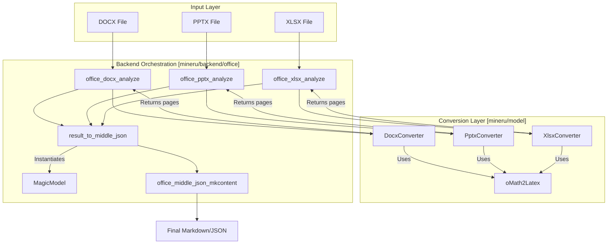

# Office Document Support (DOCX & PPTX)

Relevant source files

The following files were used as context for generating this wiki page:

- [demo/office_docs/docx_01.docx](demo/office_docs/docx_01.docx)
- [demo/office_docs/pptx_01.pptx](demo/office_docs/pptx_01.pptx)
- [demo/office_docs/xlsx_01.xlsx](demo/office_docs/xlsx_01.xlsx)
- [mineru/backend/office/docx_analyze.py](mineru/backend/office/docx_analyze.py)
- [mineru/backend/office/mkcontent/__init__.py](mineru/backend/office/mkcontent/__init__.py)
- [mineru/backend/office/mkcontent/inline_renderer.py](mineru/backend/office/mkcontent/inline_renderer.py)
- [mineru/backend/office/mkcontent/output_builders.py](mineru/backend/office/mkcontent/output_builders.py)
- [mineru/backend/office/model_output_to_middle_json.py](mineru/backend/office/model_output_to_middle_json.py)
- [mineru/backend/office/office_magic_model.py](mineru/backend/office/office_magic_model.py)
- [mineru/backend/office/office_middle_json_mkcontent.py](mineru/backend/office/office_middle_json_mkcontent.py)
- [mineru/backend/office/pptx_analyze.py](mineru/backend/office/pptx_analyze.py)
- [mineru/backend/office/xlsx_analyze.py](mineru/backend/office/xlsx_analyze.py)
- [mineru/backend/utils/markdown_utils.py](mineru/backend/utils/markdown_utils.py)
- [mineru/backend/utils/office_chart.py](mineru/backend/utils/office_chart.py)
- [mineru/cli/public_http_client_policy.py](mineru/cli/public_http_client_policy.py)
- [mineru/model/docx/docx_converter.py](mineru/model/docx/docx_converter.py)
- [mineru/model/docx/main.py](mineru/model/docx/main.py)
- [mineru/model/docx/tools/__init__.py](mineru/model/docx/tools/__init__.py)
- [mineru/model/docx/tools/math/__init__.py](mineru/model/docx/tools/math/__init__.py)
- [mineru/model/docx/tools/math/latex_dict.py](mineru/model/docx/tools/math/latex_dict.py)
- [mineru/model/docx/tools/math/omml.py](mineru/model/docx/tools/math/omml.py)
- [mineru/model/docx/tools/office_xml.py](mineru/model/docx/tools/office_xml.py)
- [mineru/model/office_stream.py](mineru/model/office_stream.py)
- [mineru/model/pptx/package_normalizer.py](mineru/model/pptx/package_normalizer.py)
- [mineru/model/pptx/pptx_converter.py](mineru/model/pptx/pptx_converter.py)
- [mineru/model/pptx/xycut_pp_sorter.py](mineru/model/pptx/xycut_pp_sorter.py)
- [mineru/model/xlsx/__init__.py](mineru/model/xlsx/__init__.py)
- [mineru/model/xlsx/main.py](mineru/model/xlsx/main.py)
- [mineru/model/xlsx/xlsx_converter.py](mineru/model/xlsx/xlsx_converter.py)
- [mineru/utils/office_rich_text.py](mineru/utils/office_rich_text.py)

MinerU provides native support for Microsoft Office documents (DOCX, PPTX, and XLSX). Unlike the PDF conversion path which requires heavy-duty computer vision models for layout detection and OCR, the Office pipeline leverages the structured XML data within OpenXML (OOXML) files. This architectural choice results in a **10x speed improvement** compared to PDF rendering while maintaining high fidelity for text, tables, and mathematical formulas.

## Architecture Overview

The Office support is split into specialized converters: `DocxConverter`, `PptxConverter`, and `XlsxConverter`. These bypass the traditional `BatchAnalyze` pipeline used for PDFs, feeding directly into a specialized `MagicModel` that prepares the data for `middle_json` generation.

### System Data Flow

The following diagram illustrates how an Office document is transformed into the final Markdown/JSON output, bridging the gap between raw file parsing and the unified internal representation.

**Office Document Processing Pipeline**

**Sources:** [mineru/backend/office/docx_analyze.py:11-29](), [mineru/model/docx/docx_converter.py:80-101](), [mineru/backend/office/office_magic_model.py:13-157](), [mineru/backend/office/model_output_to_middle_json.py:126-171]().

---

## DOCX Conversion Pipeline

The DOCX pipeline is orchestrated by `office_docx_analyze` [mineru/backend/office/docx_analyze.py:11-29](). It utilizes the `DocxConverter` class to parse the document structure.

### Key Implementation Details
1.  **OpenXML Parsing**: Uses `lxml` and `python-docx` to traverse the document body. It maps various XML namespaces (e.g., `w`, `a`, `wp`, `mc`, `v`) to extract text runs, drawing elements, and relationships [mineru/model/docx/docx_converter.py:43-78]().
2.  **Table Handling**: While text is parsed natively, complex table structures are pre-processed using the `mammoth` library to generate clean HTML representations, stored in `_mammoth_tables_html` [mineru/model/docx/docx_converter.py:94-95]().
3.  **Media Extraction**: Images are extracted from the DOCX zip package. The converter handles vector images and serializes them using `serialize_office_image` [mineru/model/docx/docx_converter.py:38-40]().
4.  **Equation Conversion**: Office Math (OMML) is converted to LaTeX using a specialized `oMath2Latex` utility [mineru/model/docx/docx_converter.py:22]().
5.  **Chart Extraction**: Charts are processed via `extract_chart_html_from_ooxml`, which attempts to recover data from embedded workbooks or cached XML values [mineru/model/docx/docx_converter.py:41]().
6.  **Package Normalization**: Before parsing, `normalize_docx_package` is used to repair ZIP-level issues and missing internal relationships [mineru/model/docx/docx_converter.py:20]().
7.  **Style Caching**: To handle large documents efficiently, `DocxConverter` implements `_style_lookup_cache` and `_style_bool_cache` to avoid repeated linear scanning of `styles.xml` [mineru/model/docx/docx_converter.py:115-116]().

**Sources:** [mineru/model/docx/docx_converter.py:43-116](), [mineru/backend/office/docx_analyze.py:11-29](), [mineru/model/docx/docx_converter.py:20-22](), [mineru/backend/utils/office_chart.py:159-178]().

---

## PPTX & XLSX Support

The `PptxConverter` and `XlsxConverter` handle slide and spreadsheet data respectively.

### PPTX Pipeline
The `PptxConverter` [mineru/model/pptx/pptx_converter.py:88-107]() iterates through slides and shapes, using a spatial sorting algorithm to maintain reading order.
- **Shape Flattening**: Recursively flattens grouped shapes while applying coordinate transformations via `_SlideTransform` [mineru/model/pptx/pptx_converter.py:54-80]().
- **Spatial Sorting**: Uses `sort_entries` (based on XY-Cut) to order shapes on a slide based on their bounding boxes [mineru/model/pptx/pptx_converter.py:25]().
- **Normalization**: If initial parsing fails, it attempts to fix the package using `normalize_pptx_package` [mineru/model/pptx/pptx_converter.py:152-162]().

### XLSX Pipeline
The `XlsxConverter` [mineru/model/xlsx/xlsx_converter.py:167-187]() transforms spreadsheets into structured tables.
- **Data Region Detection**: Identifies the bounding rectangle of non-empty cells in a worksheet using `DataRegion` [mineru/model/xlsx/xlsx_converter.py:39-62]().
- **Rich Text & Math**: Supports rich text within cells via `openpyxl` and maps math formulas to their respective cell locations using `math_map` [mineru/model/xlsx/xlsx_converter.py:181-185]().
- **Normalization**: Similar to other formats, uses `normalize_xlsx_package` for package-level fault tolerance [mineru/model/xlsx/xlsx_converter.py:193-200]().

**Sources:** [mineru/model/pptx/pptx_converter.py:88-162](), [mineru/model/xlsx/xlsx_converter.py:167-200](), [mineru/model/xlsx/xlsx_converter.py:39-62](), [mineru/model/pptx/pptx_converter.py:25-54]().

---

## Office Math (OMML) to LaTeX

The `oMath2Latex` class [mineru/model/docx/tools/math/omml.py:200-215]() performs a recursive transformation of the Office Math XML tree into standard LaTeX strings.

### Mapping Logic
- **Characters**: Uses a comprehensive dictionary `T` in `latex_dict.py` to map Unicode math symbols to LaTeX commands (e.g., `\u2211` to `\sum`) [mineru/model/docx/tools/math/latex_dict.py:83-152]().
- **Font Styles**: Maps OMML `<m:scr>` values (script, fraktur, double-struck, sans-serif, monospace) to LaTeX math font commands like `\mathscr`, `\mathfrak`, `\mathbb`, `\mathsf`, and `\mathtt` [mineru/model/docx/tools/math/omml.py:47-53]().
- **Recursive Parsing**: Implements a `Tag2Method` pattern where each OMML tag (e.g., `sSub`, `sSup`, `num`, `den`) is mapped to a handler that builds the LaTeX equivalent [mineru/model/docx/tools/math/omml.py:207-229]().

**Sources:** [mineru/model/docx/tools/math/omml.py:47-229](), [mineru/model/docx/tools/math/latex_dict.py:83-152]().

---

## MagicModel & Content Generation

Once the converters produce a raw list of blocks, the `MagicModel` class normalizes these into a format compatible with the MinerU `middle_json` schema.

### Block Classification and Refinement
The `MagicModel` [mineru/backend/office/office_magic_model.py:13-16]() performs the following:
1.  **Caption Association**: Categorizes generic caption blocks into `image_caption`, `table_caption`, or `chart_caption` via `classify_caption_blocks` [mineru/backend/office/office_magic_model.py:21]().
2.  **Span Parsing**: Extracts inline styles (bold, italic, underline, strikethrough, emphasis, superscript, subscript) from text blocks using `parse_text_block_spans` [mineru/backend/office/office_magic_model.py:41]().
3.  **Section Numbering**: The `result_to_middle_json` function automatically calculates hierarchical section numbers (e.g., "1.2.1") for titled blocks and resets deeper level counters when a higher level title is encountered [mineru/backend/office/model_output_to_middle_json.py:132-152]().

### Rendering and Markdown Output
The `office_middle_json_mkcontent` module orchestrates the final Markdown construction [mineru/backend/office/office_middle_json_mkcontent.py:1-36]().
- **Output Builders**: Uses `union_make` to dispatch to various output formats (Markdown, Content List V1/V2) [mineru/backend/office/office_middle_json_mkcontent.py:10-19]().
- **Inline Rendering**: Handles the logic for applying Markdown or HTML styles based on the block type. It supports `OFFICE_MARKDOWN_STYLE_WRAPPERS` for standard formatting and `OFFICE_COMPLEX_HTML_STYLES` for features like underline or emphasis [mineru/backend/office/mkcontent/inline_renderer.py:29-59]().
- **Table Cleaning**: Tables are cleaned and sanitized during block parsing to ensure valid HTML/Markdown output [mineru/backend/office/office_magic_model.py:53-54]().

**Sources:** [mineru/backend/office/office_magic_model.py:13-157](), [mineru/backend/office/model_output_to_middle_json.py:126-171](), [mineru/backend/office/office_middle_json_mkcontent.py:1-36](), [mineru/backend/office/mkcontent/inline_renderer.py:29-59]().
