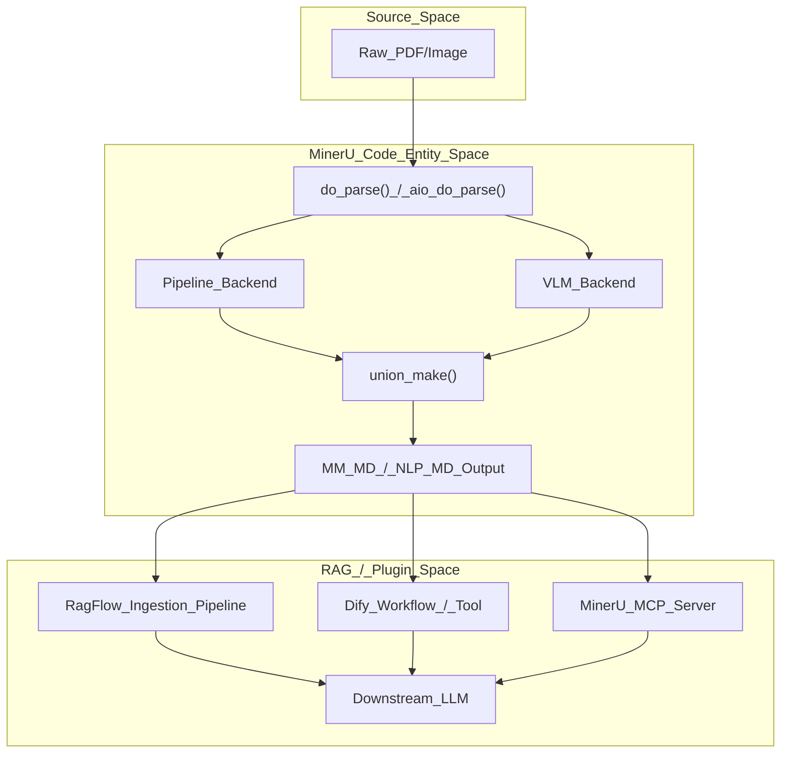
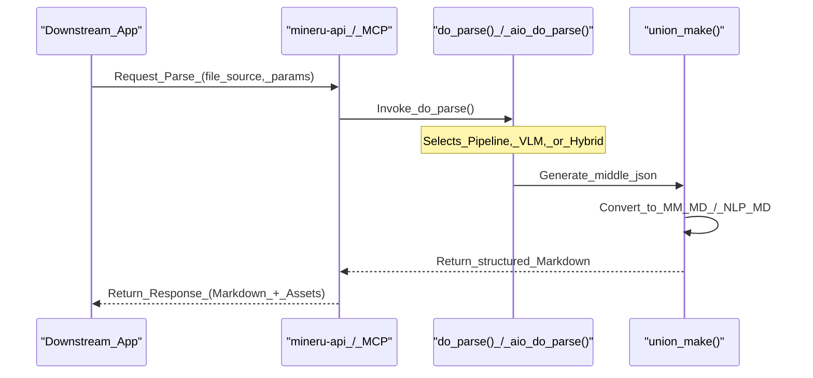

# RAG & Plugin Integrations

Relevant source files

The following files were used as context for generating this wiki page:

- [docs/assets/images/RagFlow_01.png](docs/assets/images/RagFlow_01.png)
- [docs/assets/images/RagFlow_02.png](docs/assets/images/RagFlow_02.png)
- [docs/zh/usage/plugin/BISHENG.md](docs/zh/usage/plugin/BISHENG.md)
- [docs/zh/usage/plugin/Cherry_Studio.md](docs/zh/usage/plugin/Cherry_Studio.md)
- [docs/zh/usage/plugin/Coze.md](docs/zh/usage/plugin/Coze.md)
- [docs/zh/usage/plugin/DataFlow.md](docs/zh/usage/plugin/DataFlow.md)
- [docs/zh/usage/plugin/Dify.md](docs/zh/usage/plugin/Dify.md)
- [docs/zh/usage/plugin/DingTalk.md](docs/zh/usage/plugin/DingTalk.md)
- [docs/zh/usage/plugin/FastGPT.md](docs/zh/usage/plugin/FastGPT.md)
- [docs/zh/usage/plugin/ModelWhale.md](docs/zh/usage/plugin/ModelWhale.md)
- [docs/zh/usage/plugin/RagFlow.md](docs/zh/usage/plugin/RagFlow.md)
- [docs/zh/usage/plugin/Sider.md](docs/zh/usage/plugin/Sider.md)
- [docs/zh/usage/plugin/n8n.md](docs/zh/usage/plugin/n8n.md)

MinerU is designed as a high-performance document parsing engine that serves as the foundational data ingestion layer for Retrieval-Augmented Generation (RAG) pipelines and AI assistant ecosystems. By converting complex PDFs into structured, machine-readable Markdown (specifically the `MM_MD` and `NLP_MD` formats), MinerU enables Large Language Models (LLMs) to accurately interpret formulas, tables, and multi-column layouts.

This page documents the integration patterns with major RAG frameworks and plugin ecosystems, detailing how MinerU's output feeds into downstream pipelines.

## Integration Architecture

MinerU typically integrates into downstream systems via three primary methods:
1.  **Direct API Integration**: Using the FastAPI server or `mineru-api` to process documents on-demand.
2.  **MCP (Model Context Protocol)**: Exposing MinerU tools to AI clients like Claude, Cursor, and Cherry Studio via the `mineru-mcp` command [docs/zh/usage/plugin/Cherry_Studio.md:36-37]().
3.  **Native Plugin/Parser**: Built-in support within RAG platforms (e.g., RagFlow, Dify) where MinerU is a selectable ingestion engine [docs/zh/usage/plugin/RagFlow.md:4-5]().

### Data Flow: From PDF to RAG Context

The following diagram illustrates how MinerU bridges the gap between raw document bytes and the LLM's context window within a RAG framework.

**MinerU-to-RAG Data Flow**

**Sources:** [docs/zh/usage/plugin/RagFlow.md:68-82](), [docs/zh/usage/plugin/Dify.md:54-68]().

---

## RAG Framework Integrations

### RagFlow
RagFlow has deeply integrated MinerU as a native PDF parser. In RagFlow, MinerU can be selected within the **Ingestion Pipeline** settings of a knowledge base [docs/zh/usage/plugin/RagFlow.md:1-5]().

*   **Implementation**: RagFlow invokes the MinerU executable (often within a Docker container) to process documents before chunking and embedding [docs/zh/usage/plugin/RagFlow.md:13-15]().
*   **Configuration**: Users set `MINERU_EXECUTABLE` in the RagFlow `.env` file to point to the virtual environment's `mineru` binary [docs/zh/usage/plugin/RagFlow.md:21-30]().
*   **Workflow**:
    1.  Knowledge Base -> Configuration [docs/zh/usage/plugin/RagFlow.md:72-74]().
    2.  Locate **PDF Parser** in the Ingestion Pipeline section [docs/zh/usage/plugin/RagFlow.md:75-77]().
    3.  Select **MinerU** from the dropdown [docs/zh/usage/plugin/RagFlow.md:78-80]().

**Sources:** [docs/zh/usage/plugin/RagFlow.md:1-84]().

### Dify
MinerU provides an official plugin for Dify (v0.4.0+) available on the Dify Marketplace. It supports both the official MinerU Cloud API and local API deployments [docs/zh/usage/plugin/Dify.md:1-17]().

*   **Tool Nodes**: The plugin provides a `Parse File` tool that can be inserted into Dify **Chatflow** or **Workflow** [docs/zh/usage/plugin/Dify.md:54-61]().
*   **Variables**: It maps the MinerU `text` output (Markdown) to the LLM's `context` variable [docs/zh/usage/plugin/Dify.md:62-68]().
*   **Advanced Use Case**: Automated batch processing where MinerU output is converted to Base64 and uploaded to S3 via the `botos3` plugin [docs/zh/usage/plugin/Dify.md:90-156]().

**Sources:** [docs/zh/usage/plugin/Dify.md:1-171]().

### FastGPT
FastGPT is a knowledge base Q&A system that combines LLMs with visual orchestration. MinerU is integrated as a system plugin to provide professional document parsing support [docs/zh/usage/plugin/FastGPT.md:1-5]().

**Sources:** [docs/zh/usage/plugin/FastGPT.md:1-13]().

### ADP (DataFlow)
The **ADP (Agent Data Platform)** by OriginHub integrates MinerU within its **DataFlow** module [docs/zh/usage/plugin/DataFlow.md:1-5](). MinerU serves as the core document corpus extraction engine, enabling automated data governance and preparation for model/agent training [docs/zh/usage/plugin/DataFlow.md:3-8]().

**Sources:** [docs/zh/usage/plugin/DataFlow.md:1-11]().

---

## AI Assistant & Plugin Integrations

### Model Context Protocol (MCP)
MinerU implements an MCP server (`mineru-mcp`) that allows AI assistants to invoke parsing tools directly.

*   **Key Tools**:
    *   `parse_documents`: Converts URLs or local paths to Markdown [docs/zh/usage/plugin/Cherry_Studio.md:147-150]().
    *   `get_ocr_languages`: Retrieves a list of supported OCR languages [docs/zh/usage/plugin/Cherry_Studio.md:151-153]().
*   **Integrations**:
    *   **Cherry Studio**: Configured as a "Standard Input/Output (stdio)" MCP server using `uvx mineru-mcp` [docs/zh/usage/plugin/Cherry_Studio.md:24-48]().
    *   **Claude/Cursor**: Used to provide high-fidelity document context during coding or analysis sessions.

**Sources:** [docs/zh/usage/plugin/Cherry_Studio.md:1-238]().

### ByteDance Coze (扣子)
MinerU is available in the Coze Plugin Store, providing the `parse_file` tool for building intelligent agents and workflows [docs/zh/usage/plugin/Coze.md:1-5](). 

*   **Setup**: Users search for `MinerU` in the plugin configuration and add the `parse_file` tool [docs/zh/usage/plugin/Coze.md:26-32]().
*   **Workflow**: A `Start` node with a file input connects to the `MinerU` node, which then feeds `parse_file.text` to the `End` node [docs/zh/usage/plugin/Coze.md:66-72]().

**Sources:** [docs/zh/usage/plugin/Coze.md:1-92]().

### DingTalk (钉钉)
DingTalk has integrated MinerU capabilities into **DingTalk Docs** and **AI Tables** [docs/zh/usage/plugin/DingTalk.md:7](). It provides document parsing functionality to ecosystem developers via its open platform APIs, supporting digitized workflows for enterprise management [docs/zh/usage/plugin/DingTalk.md:3-7]().

**Sources:** [docs/zh/usage/plugin/DingTalk.md:1-12]().

### BISHENG (毕昇)
BISHENG is an open-source LLM application development platform for enterprise scenarios. MinerU is integrated as a plugin to support intelligent application landing by providing robust document parsing [docs/zh/usage/plugin/BISHENG.md:1-9]().

**Sources:** [docs/zh/usage/plugin/BISHENG.md:1-11]().

### Sider
Sider is a browser sidebar AI assistant that integrates MinerU within its **Wisebase** module [docs/zh/usage/plugin/Sider.md:1-5](). This integration allows users to build personal libraries from PDFs and extract precise information using MinerU's parsing capabilities [docs/zh/usage/plugin/Sider.md:5-10]().

**Sources:** [docs/zh/usage/plugin/Sider.md:1-10]().

### ModelWhale
ModelWhale provides a cloud-based analysis environment where MinerU is used to build agents and workflows, accelerating AI application development through its powerful document parsing capabilities [docs/zh/usage/plugin/ModelWhale.md:3-5]().

**Sources:** [docs/zh/usage/plugin/ModelWhale.md:1-19]().

### n8n
MinerU integrates with the n8n automation platform, allowing users to incorporate advanced document parsing into complex multi-step workflows [docs/zh/usage/plugin/n8n.md:1-10]().

---

## Plugin Ecosystem Map

The following table summarizes the integration status and primary use cases for MinerU across various platforms:

| Platform | Integration Type | Primary Resource | Key Capability |
| :--- | :--- | :--- | :--- |
| **RagFlow** | Native Parser | `docs/zh/usage/plugin/RagFlow.md` | Deep document understanding for enterprise RAG. |
| **Dify** | Marketplace Plugin | `docs/zh/usage/plugin/Dify.md` | Workflow automation and Chat PDF apps. |
| **Cherry Studio** | MCP Server | `docs/zh/usage/plugin/Cherry_Studio.md` | Local AI assistant document processing. |
| **FastGPT** | System Plugin | `docs/zh/usage/plugin/FastGPT.md` | Knowledge base Q&A systems. |
| **Coze** | Plugin Store | `docs/zh/usage/plugin/Coze.md` | Zero-code agent and workflow construction. |
| **DingTalk** | SaaS Integration | `docs/zh/usage/plugin/DingTalk.md` | Enterprise office document parsing (DLU). |
| **BISHENG** | Plugin | `docs/zh/usage/plugin/BISHENG.md` | Enterprise-grade LLM application platform. |
| **Sider** | Wisebase Module | `docs/zh/usage/plugin/Sider.md` | Browser-based AI knowledge management. |
| **ModelWhale** | Canvas/Notebook | `docs/zh/usage/plugin/ModelWhale.md` | Scientific research data extraction. |
| **DataFlow** | ADP Integration | `docs/zh/usage/plugin/DataFlow.md` | Automated data governance and preparation. |
| **n8n** | Workflow Node | `docs/zh/usage/plugin/n8n.md` | Workflow automation for document processing. |

**Sources:** [docs/zh/usage/plugin/DingTalk.md:1-12](), [docs/zh/usage/plugin/Sider.md:1-10](), [docs/zh/usage/plugin/ModelWhale.md:1-19](), [docs/zh/usage/plugin/DataFlow.md:1-11](), [docs/zh/usage/plugin/BISHENG.md:1-9](), [docs/zh/usage/plugin/Coze.md:1-92]().

---

## Technical Implementation for Developers

When integrating MinerU into a new downstream pipeline, the primary interface is the `do_parse()` or `aio_do_parse()` logic, which orchestrates the backend selection and output generation.

**Downstream Pipeline Integration Pattern**

**Sources:** [docs/zh/usage/plugin/Dify.md:120-133](), [docs/zh/usage/plugin/Cherry_Studio.md:143-155]().
