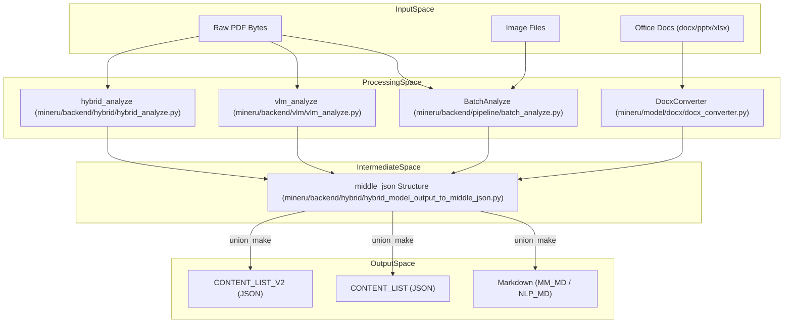
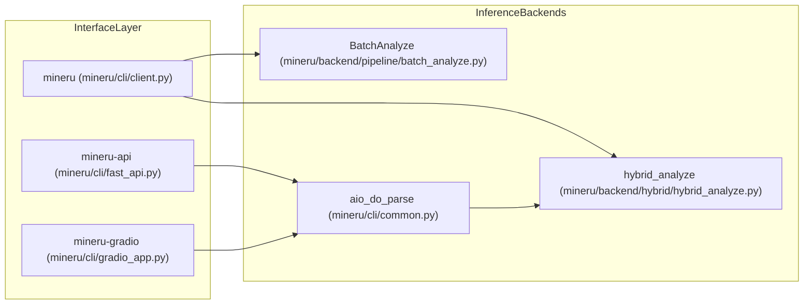

# Glossary

Relevant source files

The following files were used as context for generating this wiki page:

- [README.md](README.md)
- [README_zh-CN.md](README_zh-CN.md)
- [docs/en/quick_start/index.md](docs/en/quick_start/index.md)
- [docs/zh/quick_start/index.md](docs/zh/quick_start/index.md)
- [mineru/backend/hybrid/hybrid_analyze.py](mineru/backend/hybrid/hybrid_analyze.py)
- [mineru/backend/hybrid/hybrid_magic_model.py](mineru/backend/hybrid/hybrid_magic_model.py)
- [mineru/backend/hybrid/hybrid_model_output_to_middle_json.py](mineru/backend/hybrid/hybrid_model_output_to_middle_json.py)
- [mineru/backend/pipeline/batch_analyze.py](mineru/backend/pipeline/batch_analyze.py)
- [mineru/backend/pipeline/model_init.py](mineru/backend/pipeline/model_init.py)
- [mineru/backend/pipeline/pipeline_magic_model.py](mineru/backend/pipeline/pipeline_magic_model.py)
- [mineru/backend/pipeline/pipeline_middle_json_mkcontent.py](mineru/backend/pipeline/pipeline_middle_json_mkcontent.py)
- [mineru/backend/utils/para_block_utils.py](mineru/backend/utils/para_block_utils.py)
- [mineru/backend/vlm/model_output_to_middle_json.py](mineru/backend/vlm/model_output_to_middle_json.py)
- [mineru/backend/vlm/vlm_magic_model.py](mineru/backend/vlm/vlm_magic_model.py)
- [mineru/backend/vlm/vlm_middle_json_mkcontent.py](mineru/backend/vlm/vlm_middle_json_mkcontent.py)
- [mineru/utils/boxbase.py](mineru/utils/boxbase.py)
- [mineru/utils/char_utils.py](mineru/utils/char_utils.py)
- [mineru/utils/draw_bbox.py](mineru/utils/draw_bbox.py)
- [mineru/utils/enum_class.py](mineru/utils/enum_class.py)
- [mineru/utils/magic_model_utils.py](mineru/utils/magic_model_utils.py)
- [mineru/utils/table_continuation.py](mineru/utils/table_continuation.py)
- [mineru/utils/table_merge.py](mineru/utils/table_merge.py)
- [mineru/utils/title_level_postprocess.py](mineru/utils/title_level_postprocess.py)
- [mineru/utils/visual_magic_model_utils.py](mineru/utils/visual_magic_model_utils.py)
- [pyproject.toml](pyproject.toml)

This glossary defines the core technical terms, data structures, and domain-specific concepts used within the MinerU codebase, providing a bridge between conceptual documentation and the underlying implementation.

## Core System Concepts

### Pipeline Backend
The traditional extraction architecture that uses a sequence of specialized small models. It coordinates layout detection, formula recognition, and OCR to reconstruct the document.
*   **Logic**: Uses `BatchAnalyze` [mineru/backend/pipeline/batch_analyze.py:52-81]() to process document windows and `MagicModel` (Pipeline version) for structure reconstruction [mineru/backend/pipeline/pipeline_magic_model.py:17-127]().
*   **Batching**: Employs specific batch sizes for different stages, such as `LAYOUT_BASE_BATCH_SIZE` (1), `MFR_BASE_BATCH_SIZE` (16), and `OCR_DET_BASE_BATCH_SIZE` (8) [mineru/backend/pipeline/batch_analyze.py:38-40]().
*   **Model Management**: Uses `AtomModelSingleton` to ensure models like OCR and MFR are loaded only once and shared across the pipeline [mineru/backend/pipeline/model_init.py:148-188]().

### VLM Backend
A modern extraction architecture that leverages Vision-Language Models (e.g., MinerU2.5-Pro) to perform end-to-end document understanding.
*   **Structure Reconstruction**: Uses `MagicModel` (VLM version) to convert raw VLM output blocks into a structured hierarchy [mineru/backend/vlm/vlm_magic_model.py:29-184]().
*   **Content Generation**: Maps VLM output types into standardized `BlockType` and `ContentType` during the `union_make` process [mineru/backend/vlm/vlm_middle_json_mkcontent.py:162-232]().
*   **Text Merging**: Uses `merge_para_with_text` to join spans while handling hyphens and full-to-half width conversion [mineru/backend/vlm/vlm_middle_json_mkcontent.py:146]().

### Hybrid Backend
An advanced architecture that combines VLM-based layout understanding with specialized pipeline models (OCR, MFR) to achieve high accuracy.
*   **Logic**: Orchestrates between VLM analysis and specialized atom models via `hybrid_analyze` [mineru/backend/hybrid/hybrid_analyze.py:30-36]().
*   **Effort Levels**: Supports `medium` and `high` efforts, where `medium` effort forces image analysis off to maintain a fast path [mineru/backend/hybrid/hybrid_analyze.py:110-122]().
*   **Inference Locks**: Provides thread-safe execution of shared models via `run_layout_inference`, `run_mfr_inference`, and `run_ocr_inference` [mineru/backend/pipeline/model_init.py:41-60]().
*   **MagicModel (Hybrid)**: Reconstructs page structure by merging VLM/Layout detections with OCR results [mineru/backend/hybrid/hybrid_model_output_to_middle_json.py:68-124]().

### Office Backend
Specialized processing for Office documents (`.docx`, `.pptx`, `.xlsx`).
*   **Native Conversion**: Bypasses PDF rendering to convert XML/OOXML structures directly into `middle_json` using tools like `DocxConverter` [mineru/model/docx/docx_converter.py:43](), `mammoth` [pyproject.toml:56](), and `python-docx` [pyproject.toml:54]().
*   **Speed**: Offers significant performance improvements (up to 10x) compared to rendering-based PDF pipelines.

### middle_json
The standardized intermediate representation used by MinerU. All backends convert raw model outputs into this schema before final Markdown/JSON generation.
*   **Standardization**: Converts varied model outputs into a unified structure containing `pdf_info`, `_backend`, `_effort`, and `_version_name` [mineru/backend/hybrid/hybrid_model_output_to_middle_json.py:181-190]().

**Sources:** [mineru/backend/pipeline/batch_analyze.py:38-81](), [mineru/backend/hybrid/hybrid_analyze.py:110-122](), [mineru/backend/pipeline/model_init.py:41-188](), [mineru/backend/vlm/vlm_middle_json_mkcontent.py:146-232](), [mineru/backend/hybrid/hybrid_model_output_to_middle_json.py:181-190](), [mineru/backend/vlm/vlm_magic_model.py:29-184]()

---

## Data Flow & Architecture

The following diagram illustrates the relationship between input types, processing backends, and the unified output generation.

### Data Transformation Lifecycle

**Sources:** [mineru/backend/pipeline/batch_analyze.py:52](), [mineru/backend/hybrid/hybrid_analyze.py:30](), [mineru/backend/hybrid/hybrid_model_output_to_middle_json.py:181](), [mineru/utils/enum_class.py:89-93](), [mineru/backend/vlm/vlm_analyze.py:30]()

---

## Domain Terms

### MFD (Mathematical Formula Detection)
The process of locating mathematical formulas within a page image.
*   **Implementation**: Controlled via `formula_enable` flag in `BatchAnalyze` [mineru/backend/pipeline/batch_analyze.py:66]().

### MFR (Mathematical Formula Recognition)
The process of converting detected formula images into LaTeX strings.
*   **Models**: Supports `unimernet_small` and `pp_formulanet_plus_m` [mineru/backend/pipeline/model_init.py:114-123]().
*   **Inference**: Orchestrated via `run_mfr_inference` to handle resource contention [mineru/backend/pipeline/model_init.py:49-53]().

### Layout Analysis
The classification of page regions into categories such as `text`, `title`, `figure`, `table`, or `formula`.
*   **Block Types**: Defined in `BlockType` [mineru/utils/enum_class.py:4-50](), including specialized types like `abstract`, `doc_title`, and `vertical_text`.
*   **Mapping**: `MEDIUM_EFFORT_LAYOUT_LABEL_TO_VLM_TYPE` maps pipeline layout labels to VLM types for the hybrid backend [mineru/backend/hybrid/hybrid_analyze.py:83-107]().
*   **PP-DocLayoutV2**: Primary model for layout detection in the pipeline backend [mineru/backend/pipeline/model_init.py:126-130]().

### Reading Order
The logic used to sort detected layout blocks into a human-readable sequence.
*   **Implementation**: Blocks are sorted by their `index` property in `middle_json` [mineru/backend/hybrid/hybrid_model_output_to_middle_json.py:116]().

### Table Recognition (TabRec)
The process of identifying table structure (rows, columns, cells).
*   **Models**: Includes `slanet_plus` (Wireless) and `unet_structure` (Wired) [mineru/utils/enum_class.py:105-106]().
*   **Orientation**: `MineruTableOrientationClsModel` [mineru/backend/pipeline/model_init.py:81]() handles table rotation detection.
*   **Cross-Page Merging**: Managed via `cross_page_table_merge` during middle_json finalization [mineru/backend/hybrid/hybrid_model_output_to_middle_json.py:16]().

---

## Implementation Components

### Model Singletons
MinerU uses singleton patterns to manage heavy ML models in memory, ensuring thread-safe initialization and resource sharing.

| Class | Purpose | File Pointer |
| :--- | :--- | :--- |
| `AtomModelSingleton` | Manages pipeline models (OCR, MFD, MFR, Layout) | [mineru/backend/pipeline/model_init.py:148-188]() |
| `PytorchPaddleOCR` | Port of PaddleOCR to PyTorch for character detection/recognition | [mineru/model/ocr/pytorch_paddle.py]() |
| `HybridModelSingleton` | Singleton wrapper for hybrid-specific pipeline models | [mineru/backend/pipeline/model_init.py:22]() |
| `ModelSingleton` | Lifecycle management for VLM backend models | [mineru/backend/vlm/vlm_analyze.py:31]() |

### Content Generation
Final output generation is handled by `union_make` functions that transform `middle_json` into target formats.

| Entity | Role | File Pointer |
| :--- | :--- | :--- |
| `union_make` (VLM) | Renders Markdown and JSON from VLM outputs | [mineru/backend/vlm/vlm_middle_json_mkcontent.py]() |
| `merge_para_with_text` | Core utility for joining spans into paragraphs with hyphen handling | [mineru/backend/vlm/vlm_middle_json_mkcontent.py:146]() |
| `blocks_to_page_info` | Converts MagicModel blocks into middle_json page structures | [mineru/backend/hybrid/hybrid_model_output_to_middle_json.py:52-124]() |

---

## Execution Entity Map

The following diagram maps user-facing interfaces to the underlying orchestration and inference layers.

### Entrypoint to Inference Mapping

**Sources:** [pyproject.toml:128-136](), [mineru/backend/pipeline/batch_analyze.py:52](), [mineru/backend/hybrid/hybrid_analyze.py:30]()

---

## Abbreviations & Constants

*   **MFD**: Mathematical Formula Detection.
*   **MFR**: Mathematical Formula Recognition.
*   **VLM**: Vision-Language Model.
*   **MM_MD**: Multi-Modal Markdown (includes image/table links) [mineru/utils/enum_class.py:90]().
*   **NLP_MD**: Text-only Markdown optimized for NLP tasks [mineru/utils/enum_class.py:91]().
*   **BlockType**: Class for page element classification [mineru/utils/enum_class.py:4-50]().
*   **ContentType**: Class for granular span content classification [mineru/utils/enum_class.py:51-60]().
*   **ModelPath**: Centralized registry for model weights on HF/ModelScope [mineru/utils/enum_class.py:96-108]().
*   **MFR_BASE_BATCH_SIZE**: Default batch size for formula recognition (16) [mineru/backend/pipeline/batch_analyze.py:39]().
*   **OCR_DET_BASE_BATCH_SIZE**: Default batch size for OCR detection (8) [mineru/backend/pipeline/batch_analyze.py:40]().
*   **LAYOUT_BASE_BATCH_SIZE**: Default batch size for layout inference (1) [mineru/backend/pipeline/batch_analyze.py:38]().

**Sources:** [mineru/utils/enum_class.py:1-134](), [mineru/backend/pipeline/batch_analyze.py:38-40]()
