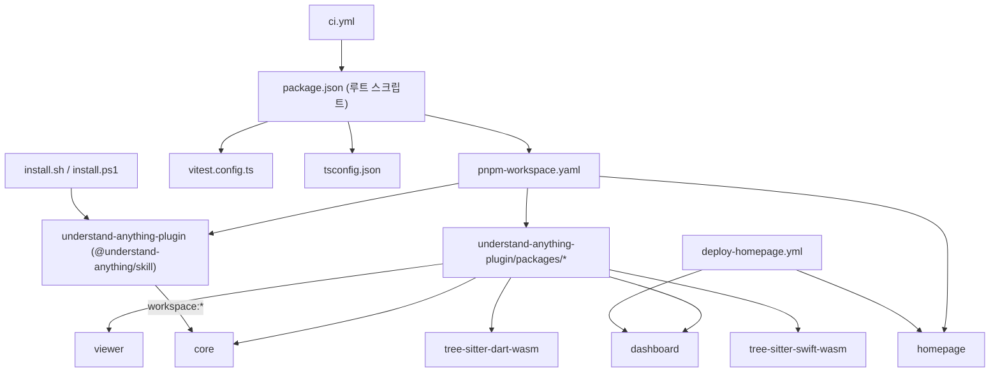
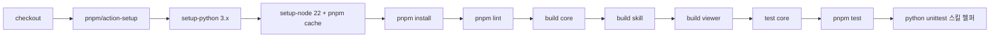
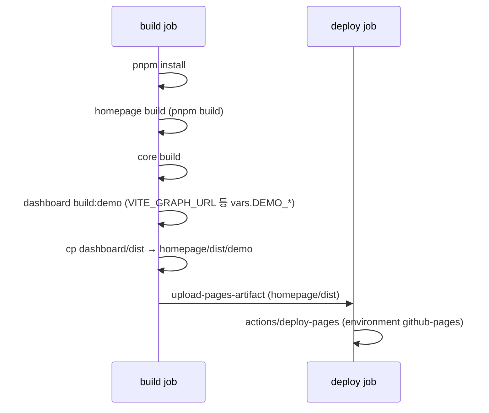
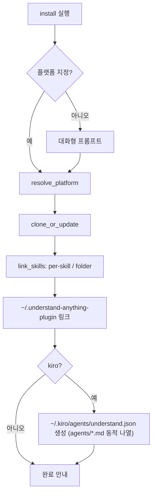

# build_ci_and_workspace_config

## 소개

`build_ci_and_workspace_config`는 Understand-Anything 모노레포의 **루트 수준 빌드·CI·워크스페이스·설치 구성**을 담당하는 모듈입니다. 애플리케이션 로직은 없고, 다음을 정의합니다.

- pnpm 워크스페이스 구성과 루트 스크립트 (`package.json`, `pnpm-workspace.yaml`)
- 공용 TypeScript 설정 (`tsconfig.json`)
- 테스트 러너 집계 (`vitest.config.ts`)
- GitHub Actions CI/배포 (`.github/workflows/ci.yml`, `.github/workflows/deploy-homepage.yml`)
- 다중 플랫폼 설치 스크립트 (`install.sh`, `install.ps1`)
- 플러그인 하위 패키지 매니페스트 (`understand-anything-plugin/package.json`, `viewer`, `tree-sitter-dart-wasm`, `tree-sitter-swift-wasm`)

형제 모듈: [homepage](homepage.md), [core_package_config](core_package_config.md). 빌드 대상 코드는 [knowledge_graph_core_engine](knowledge_graph_core_engine.md), [source_code_parsing_plugins](source_code_parsing_plugins.md), [interactive_dashboard_ui](interactive_dashboard_ui.md), [skill_commands_and_graph_assembly](skill_commands_and_graph_assembly.md) 문서를 참고하세요.

## 아키텍처

### 워크스페이스

루트 `pnpm-workspace.yaml`은 세 종류를 패키지로 등록합니다: `understand-anything-plugin/packages/*`, `understand-anything-plugin`, `homepage`. `allowBuilds`는 네이티브 빌드 스크립트 실행을 허용할 의존성(`esbuild`, `sharp`, 각 `tree-sitter-*` 문법, `@tree-sitter-grammars/tree-sitter-kotlin`)을 명시합니다. 루트 `package.json`의 `pnpm.onlyBuiltDependencies`와 `understand-anything-plugin/package.json`도 유사한 목록을 갖습니다(플러그인 쪽 목록에는 `sharp`가 없음). 새 네이티브 문법 의존성을 추가할 때는 이 목록들을 함께 갱신해야 합니다.

`understand-anything-plugin/pnpm-workspace.yaml`은 `packages/*`만 등록하는 플러그인 단독 워크스페이스 정의입니다.

`tree-sitter-dart-wasm`, `tree-sitter-swift-wasm`은 빌드 스크립트가 없는 **벤더링된 WASM 문법** 패키지입니다(`web-tree-sitter@^0.26`용 dylink.0 ABI). 네이티브 `tree-sitter`가 darwin/arm64 + Node 24에서 실패하기 때문에 WASM을 쓰는 프로젝트 방침과 연결됩니다(자세한 내용은 [source_code_parsing_plugins](source_code_parsing_plugins.md)).

### 루트 스크립트 (`package.json`)

| 스크립트 | 동작 |
|---|---|
| `prepare` | `pnpm --filter @understand-anything/core build` — 설치 시 core 자동 빌드 |
| `build` | `pnpm -r build` — 전체 재귀 빌드 |
| `test` | `vitest run` — 루트 `vitest.config.ts` 사용 |
| `lint` | `eslint .` |
| `dev:dashboard` | dashboard 개발 서버 |
| `benchmark:large-repo` | `node scripts/benchmark-large-repo.mjs` |

`packageManager`로 pnpm 10.6.2가 고정되어 있고, 루트 패키지는 `private`이며 `"type": "module"`(ESM)입니다.

### 패키지별 빌드 진입점

- `@understand-anything/skill` (`understand-anything-plugin/package.json`): `build`는 `tsc`(`src` → `dist`). `test`는 안내 메시지만 출력하며, 실제 스킬 테스트는 저장소 루트 `tests/skill/`에 있습니다.
- `understand-anything-viewer`: `build`는 `node build.mjs`, `pack:release`는 빌드 후 `npm pack`. 릴리스 시 tarball 이름은 `understand-anything-viewer.tgz`여야 합니다(CLAUDE.md 참조).
- core / dashboard: [core_package_config](core_package_config.md), [dashboard_build_config](dashboard_build_config.md) 참조.

### TypeScript / Vitest

- 루트 `tsconfig.json`: `ES2022`, `moduleResolution: bundler`, `strict`, declaration/sourceMap 활성화. 플러그인 `tsconfig.json`은 동일 옵션에 `outDir: dist`, `rootDir: src`, `include: ["src"]`를 추가합니다.
- 루트 `vitest.config.ts`는 `tests/**`, `understand-anything-plugin/src/**`, `understand-anything-plugin/packages/dashboard/**`의 테스트를 집계하고 `packages/core/**`는 제외합니다(core는 자체 설정으로 별도 실행하여 중복 집계를 방지).
- `understand-anything-plugin/vitest.config.ts`는 `include: []`로, 상위 설정 상속을 막고 플러그인 패키지에서 테스트가 실행되지 않게 하는 용도입니다(테스트를 마켓플레이스 번들 밖으로 옮겼기 때문).

## CI/CD 워크플로

### `ci.yml`

`pull_request`와 `main` 푸시에서 실행됩니다. `concurrency` 그룹 `ci-${{ github.ref }}`로 같은 ref의 진행 중 실행을 취소합니다. 매트릭스는 `ubuntu-latest`, `windows-latest`(`fail-fast: false`).

순서 주의: core 빌드가 skill/viewer 빌드보다 먼저여야 하며(skill이 `@understand-anything/core`에 `workspace:*`로 의존), Python 단계는 `merge-batch-graphs`, `merge-subdomain-graphs`, `parse-knowledge-base` 테스트를 실행합니다([skill_graph_merge_scripts](skill_graph_merge_scripts.md)). CI는 Node 22를 사용합니다.

### `deploy-homepage.yml`

`main` 푸시(`homepage/**`, dashboard, core, 워크플로 파일 변경 시) 또는 `workflow_dispatch`로 실행됩니다. 권한은 `contents: read`, `pages: write`, `id-token: write`.

데모 대시보드는 저장소 변수 `DEMO_GRAPH_URL`, `DEMO_DOMAIN_GRAPH_URL`, `DEMO_META_URL`을 `VITE_*` 환경변수로 받아 빌드되어 홈페이지 산출물의 `/demo` 아래에 병합됩니다. 자세한 내용은 [homepage](homepage.md), [dashboard_build_config](dashboard_build_config.md).

## 설치 스크립트 (`install.sh`, `install.ps1`)

두 스크립트는 동일한 동작을 각 OS에 맞게 구현합니다. 저장소를 `UA_DIR`(기본 `~/.understand-anything/repo`)에 클론(또는 `git pull --ff-only`)하고, 플랫폼별 스킬 디렉터리에 심볼릭 링크(Windows는 junction)를 만듭니다.

| 옵션 | 설명 |
|---|---|
| `<platform>` | 설치 (생략 시 대화형 선택) |
| `--update` / `-Update` | `git pull --ff-only` |
| `--uninstall 
` / `-Uninstall 
` | 링크 제거 (체크아웃은 유지) |
| `--help` / `-Help` | 사용법 |

환경변수: `UA_REPO_URL`(클론 URL), `UA_DIR`(클론 위치).

지원 플랫폼: gemini, codex, opencode, pi, openclaw, antigravity, vibe, vscode, hermes, cline, kimi, trae, nanobot, kiro. 링크 스타일은 두 가지입니다.

- `per-skill`: `understand-anything-plugin/skills/*` 각각을 대상 디렉터리에 링크
- `folder`: `skills/` 전체를 `understand-anything`이라는 이름으로 한 번에 링크

안전장치:
- 언링크 시 실제 파일/디렉터리는 삭제하지 않습니다(`install.sh`는 `-L` 검사, `install.ps1`은 `Remove-Reparse`가 junction/symlink만 삭제). 체크아웃이 사라진 경우 `understand-anything-plugin/skills/`를 가리키는 오래된 링크를 스캔해 정리합니다.
- `install.ps1`의 `New-Junction`은 링크가 아닌 기존 경로를 덮어쓰기를 거부합니다.
- 플러그인 루트 링크가 이미 있으면 그대로 둡니다.
- Kiro의 `resources` 목록은 에이전트 정의(`agents/*.md`)에서 동적으로 생성되어, 에이전트 추가/삭제 시 어긋나지 않습니다. `install.sh`는 `jq` 없이 `LC_ALL=C sort`로 결정적 순서를 만듭니다.
- codex는 `/` 대신 `$understand`로 호출하고, vscode는 `.copilot-plugin/plugin.json`으로 자동 탐색할 수 있다는 안내를 출력합니다.

새 플랫폼을 추가하려면 `install.sh`의 `platforms_table`과 `install.ps1`의 `$Platforms`를 **동시에** 수정해야 합니다.

## 유지보수 참고

- **버전 동기화**: 푸시 시 6개 파일(`understand-anything-plugin/package.json`, `.claude-plugin/plugin.json`, `packages/viewer/package.json`, 루트 `.claude-plugin/plugin.json`, `.cursor-plugin/plugin.json`, `.copilot-plugin/plugin.json`)의 `version`을 함께 올립니다. 현재 skill과 viewer는 모두 `2.9.7`입니다.
- **Node 버전**: 문서상 Node ≥ 22, CI도 22 사용. viewer 패키지의 `engines`는 `>=18`.
- **테스트 위치**: core는 `pnpm --filter @understand-anything/core test`, 나머지는 루트 `pnpm test`.
- **viewer**: dashboard UI 또는 `vite.config.ts` 미들웨어가 바뀌면 viewer를 갱신하고 릴리스 tarball을 다시 업로드해야 합니다.
