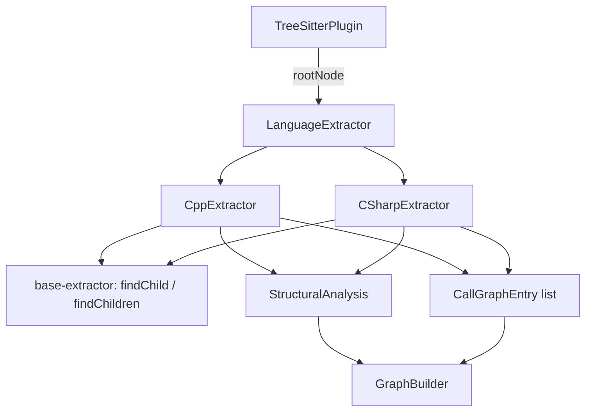
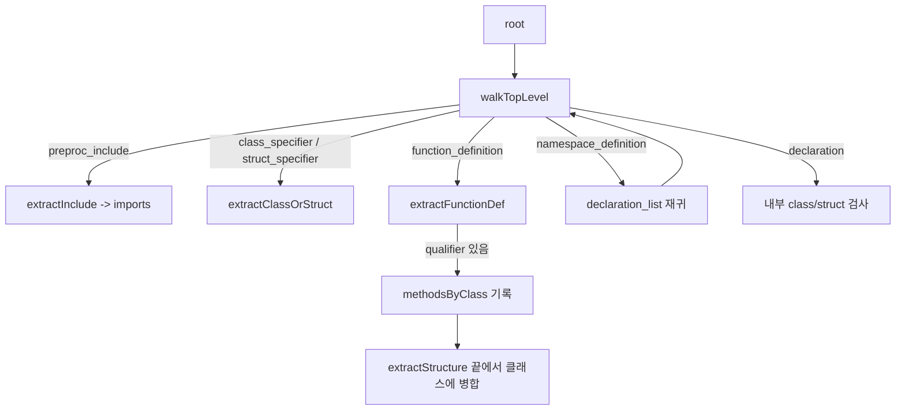
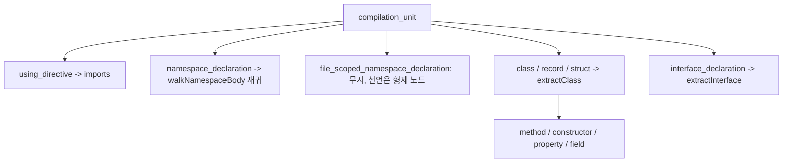

# c_family_extractors 모듈

`c_family_extractors`는 tree-sitter 구문 트리에서 C/C++ 및 C# 소스의 구조 정보(함수, 클래스, import, export)와 호출 그래프를 뽑아내는 언어별 추출기 모음입니다.

| 추출기 | 파일 | `languageIds` |
|---|---|---|
| `CppExtractor` | `understand-anything-plugin/packages/core/src/plugins/extractors/cpp-extractor.ts` | `["cpp", "c"]` |
| `CSharpExtractor` | `understand-anything-plugin/packages/core/src/plugins/extractors/csharp-extractor.ts` | `["csharp"]` |

두 클래스는 `LanguageExtractor` 인터페이스(`./types.js`)를 구현합니다. 공통 헬퍼 `findChild`, `findChildren`은 `base-extractor.ts`에서 가져옵니다. 이 헬퍼는 [extractor_base](extractor_base.md)에서 다룹니다. 추출기를 호출하는 쪽은 `TreeSitterPlugin`이며, 상위 구조는 [core_language_extractors](core_language_extractors.md)와 [core_plugin_system](core_plugin_system.md)을 참고하세요.

## 아키텍처

각 추출기가 노출하는 메서드는 두 개입니다.

- `extractStructure(rootNode): StructuralAnalysis`는 `functions`, `classes`, `imports`, `exports`를 반환합니다.
- `extractCallGraph(rootNode): CallGraphEntry[]`는 `{caller, callee, lineNumber}` 목록을 반환합니다.

두 메서드 모두 입력은 `TreeSitterNode` 루트입니다. 줄 번호는 `startPosition.row + 1`로 1부터 시작합니다.

## CppExtractor

### 구조 추출 흐름

### 동작

- **함수 이름**: `extractFuncDeclName`이 `function_declarator`의 `declarator` 필드를 읽습니다. `identifier`, `field_identifier`, `qualified_identifier`를 처리하며, 마지막 형태(`Server::start`)에서는 이름(`start`)과 한정자(`Server`)를 분리합니다.
- **파라미터**: `extractParams`가 `parameter_declaration`을 순회하고, `unwrapDeclaratorName`이 포인터·참조·배열 declarator를 재귀적으로 벗겨 실제 이름을 얻습니다. 예: `char** pp`는 `pp`, `int arr[]`는 `arr`.
- **owner 결정**: 클래스 내부 인라인 메서드는 `owner`가 클래스명, 클래스 밖 정의(`void B::run()`)는 한정자, 자유 함수는 `""`입니다.
- **out-of-class 메서드 병합**: `methodsByClass` 맵에 모아 두었다가 `extractStructure` 끝에서 같은 이름의 클래스 `methods`에 중복 없이 추가합니다.
- **접근 제어**: class는 기본 `private`, struct는 기본 `public`입니다. `access_specifier`를 만나면 현재 접근 수준을 갱신합니다. `public` 메서드만 export하고 필드는 `properties`에만 들어갑니다.
- **export 규칙**: C/C++에는 export 문법이 없으므로 다음 규칙으로 대신합니다.
  - 클래스/struct 이름은 항상 export합니다.
  - `static`이 아닌 최상위 함수는 export합니다. `isStatic`이 `storage_class_specifier`를 확인합니다.
  - `static` 함수는 export하지 않습니다.
- **include**: `<iostream>`은 꺾쇠를 제거하고, `"config.h"`는 `string_content`를 꺼냅니다. `specifiers`는 `[source]`입니다.
- **namespace**: `namespace_definition`의 `declaration_list`로 재귀하므로 네임스페이스 안의 함수와 클래스도 잡힙니다. 네임스페이스 이름 자체는 기록하지 않습니다.

### 호출 그래프

`function_definition`에 들어갈 때 함수 이름을 스택에 push하고 나올 때 pop합니다. `call_expression`마다 스택 최상단을 caller로 기록합니다. 함수 밖 호출(전역 초기화 등)은 무시합니다. callee 이름은 다음처럼 정합니다.

| 호출 형태 | callee |
|---|---|
| `foo()` (`identifier`) | `foo` |
| `obj.method()` / `p->m()` (`field_expression`) | 필드 이름만(`method`) |
| `ns::f()` (`qualified_identifier`) | 전체 텍스트 |

## CSharpExtractor

### 매핑 규칙

- **타입 매핑**: `class_declaration`, `record_declaration`, `struct_declaration`은 `extractClass`를 거쳐 `classes`에 들어갑니다. 인터페이스는 `extractInterface`가 처리하며 메서드 시그니처와 프로퍼티를 수집합니다.
- **함수 매핑**: 메서드와 생성자는 `functions` 배열과 소속 클래스의 `methods`에 모두 들어갑니다. 생성자는 클래스와 같은 이름이고 `returnType`이 없습니다. 메서드의 반환 타입은 `returns` 필드에서 읽습니다.
- **프로퍼티와 필드**: 둘 다 클래스의 `properties`에 들어갑니다. 필드는 `variable_declaration`의 `variable_declarator`를 각각 등록합니다.
- **export 규칙**: `hasModifier(node, "public")`이 참일 때만 export합니다. C# tree-sitter는 `modifier` 노드를 여러 개 분리해 내보내므로 각 노드의 자식 키워드를 검사합니다. 그래서 `public` 클래스의 `public` 생성자는 같은 이름으로 두 번 export됩니다(테스트로 고정된 동작).
- **using**: `using System.Collections.Generic;`의 `source`는 전체 경로, `specifiers`는 마지막 성분(`Generic`)입니다. alias 형태(`using A = X.Y;`)는 대상 `qualified_name`을 사용합니다.
- **namespace**: 블록 스코프는 `walkNamespaceBody`로 중첩까지 재귀합니다. 파일 스코프(`namespace X;`)는 선언이 루트의 형제 노드이므로 별도 처리 없이 최상위 순회에서 잡힙니다.

### 호출 그래프

`method_declaration`과 `constructor_declaration`에서 스택을 관리합니다.

- `invocation_expression`은 `function` 필드의 텍스트를 callee로 씁니다. 예: `Console.WriteLine`.
- `object_creation_expression`은 `new Bar` 형태로 기록합니다. 타입은 `identifier` 또는 `generic_name`에서 가져옵니다.
- 메서드 밖 호출은 무시합니다(필드 초기화 등).

## 두 추출기의 차이

| 항목 | CppExtractor | CSharpExtractor |
|---|---|---|
| export 기준 | 비-static 함수, public 멤버, 타입 이름 | `public` modifier |
| 함수의 `owner` | 채움(클래스명 또는 `""`) | 채우지 않음 |
| 호출 이름 | 멤버 호출은 필드명만 | 전체 식 텍스트 |
| 객체 생성 호출 | 별도 처리 없음 | `new X`로 기록 |
| 네임스페이스 | 재귀하되 이름은 무시 | 재귀하되 이름은 무시 |

## 테스트

`__tests__/cpp-extractor.test.ts`와 `__tests__/csharp-extractor.test.ts`는 `web-tree-sitter`(WASM)와 `tree-sitter-cpp`, `tree-sitter-c-sharp` 문법을 `beforeAll`에서 한 번 로드합니다. 각 테스트는 `parse(code)` 헬퍼로 코드를 파싱한 뒤 `tree.delete()`와 `parser.delete()`로 WASM 메모리를 해제합니다. 주요 검증 항목은 다음과 같습니다.

- 자유 함수·인라인 메서드·클래스 밖 메서드의 owner 구분
- 접근 지정자에 따른 export
- include/using 파싱과 줄 번호
- 호출 그래프의 caller 추적
- C#의 struct/record 타입, 파일 스코프 namespace

`web-tree-sitter`를 쓰는 이유(native 바인딩이 darwin/arm64 + Node 24에서 실패)는 프로젝트 `CLAUDE.md`에 적혀 있습니다.

## 알려진 한계

- C++ 템플릿, 연산자 오버로드, 소멸자, 람다는 별도로 다루지 않습니다.
- C++ `declaration` 안에 있는 함수 선언(프로토타입)은 `functions`에 넣지 않습니다.
- C#의 `enum`, `delegate`, `event`는 추출하지 않습니다.
- 호출 그래프는 이름 기반이라 오버로드와 동명 메서드를 구분하지 못합니다.
