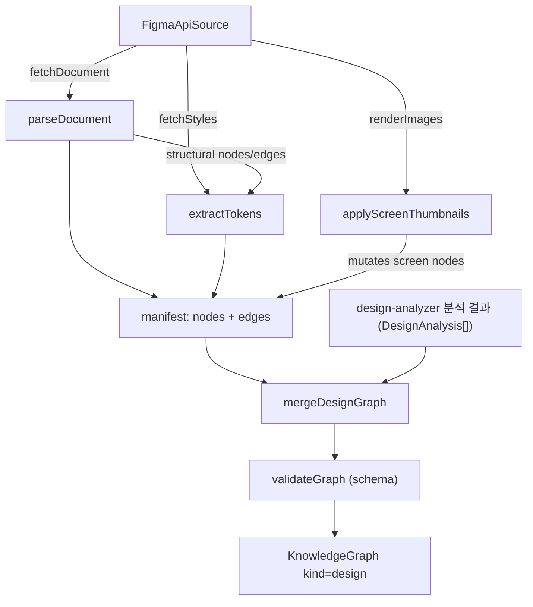
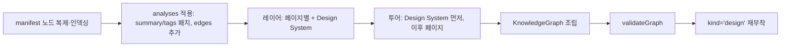
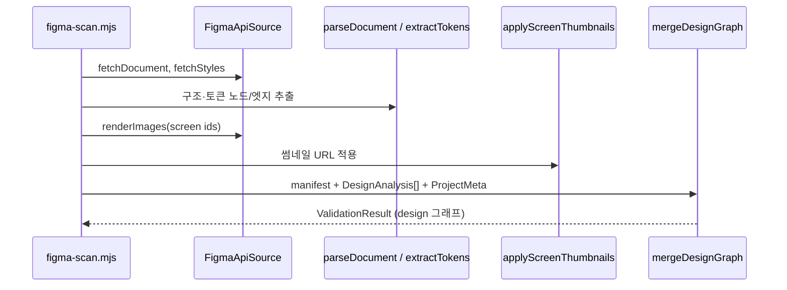

# core_figma 모듈

## 개요

`core_figma`는 Figma 파일을 **디자인 지식 그래프**(`KnowledgeGraph.kind = "design"`)로 변환하는 `@understand-anything/core`의 하위 모듈이다. 위치는 `understand-anything-plugin/packages/core/src/figma/`이다. Figma REST API에서 문서·스타일·이미지를 가져오고, 구조 노드(page/screen/component/componentSet/instance)와 디자인 토큰 노드를 추출하며, LLM 보강 결과를 병합해 검증된 그래프를 만든다.

상위 모듈: [knowledge_graph_core_engine](knowledge_graph_core_engine.md). 그래프 스키마 검증은 `../schema`, 타입은 `../types`(`GraphNode`, `GraphEdge`, `FigmaMeta`, `Layer`, `TourStep`)를 사용한다. 저장·신선도 관련 로직은 [core_search_persistence_staleness](core_search_persistence_staleness.md)를 참고한다.

## 구성 요소

| 파일 | 컴포넌트 | 역할 |
|---|---|---|
| `figma/source/api-source.ts` | `FigmaApiSource`, `parseFileKey` | Figma REST API 클라이언트 (`fetchDocument`, `fetchStyles`, `renderImages`) |
| `figma/parse/parse-document.ts` | `parseDocument` | 문서 트리 → 구조 노드/엣지 |
| `figma/parse/tokens.ts` | `extractTokens` | 게시된 스타일 → `token` 노드와 `uses_token` 엣지 |
| `figma/thumbnails.ts` | `applyScreenThumbnails` | screen 노드에 `figmaMeta.thumbnailUrl` 설정 |
| `figma/merge.ts` | `mergeDesignGraph` | 매니페스트 + LLM 분석 병합, 레이어/투어 생성, 검증 |
| `figma/__tests__/thumbnails.test.ts` | `node` (테스트 헬퍼) | `applyScreenThumbnails` 동작 검증 |

`FigmaSource`, `FigmaDocument`, `FigmaNode`, `FigmaStyles` 타입은 `figma/source/types.ts`에 정의되어 있으며 이 문서의 제공 코드에는 포함되지 않았다.

## 아키텍처

이 모듈은 오케스트레이션을 직접 하지 않는다. 주석에 따르면 `figma-scan.mjs` 스크립트가 이 함수들을 조합한다(Phase 1: 결정적 스캔, Phase 2: `design-analyzer` LLM 보강).

## 컴포넌트 상세

### FigmaApiSource / parseFileKey
- `parseFileKey(urlOrKey)`: `figma.com/file|design/<key>` URL 또는 순수 키에서 파일 키를 추출한다. 실패 시 예외.
- 생성자: 토큰은 인자 또는 `process.env.FIGMA_TOKEN`. 없으면 안내 메시지와 함께 예외를 던진다.
- 토큰은 `X-Figma-Token` 헤더로만 전송하며 URL·로그에 노출하지 않는다.
- `fetchDocument()` → `GET /files/:key`, `fetchStyles()` → `GET /files/:key/styles`, `renderImages(nodeIds)` → `GET /images/:key?ids=…&format=png&scale=1` (빈 배열이면 요청 없이 `{}` 반환).
- HTTP 실패 시 `Figma API <path> failed: <status>` 예외.

### parseDocument
`CANVAS` → `page` 노드, 페이지 자식 처리 규칙:

| Figma 타입 | 결과 |
|---|---|
| `FRAME` | `screen` 노드 + `contains` 엣지, 하위를 깊게 순회해 `INSTANCE` 수집 |
| `COMPONENT` | `component` 노드 + `contains` |
| `COMPONENT_SET` | `componentSet` + 각 variant `component`에 `variant_of`(0.9) |
| `SECTION` | 재귀로 평탄화 (v1) |
| 기타 | 무시 (v1) |

노드 id는 `<type>:<figmaId>`이며 중복은 `seen` 집합으로 제거한다. `INSTANCE`는 `instance` 노드가 되어 screen에 `contains`(1.0), 컴포넌트에 `instance_of`(0.8)로 연결되고, `componentKey`(문서 `components` 맵의 게시 키)와 `prototypeTargets`를 메타에 담는다. `summary`는 이름으로 채운 자리표시자이며 Phase 2에서 LLM이 보강한다.

### extractTokens
- 게시된 스타일(`styles.meta.styles`)만 `token:<kind>:<slug>` 노드로 만든다. `FILL→color`, `TEXT→type`, `EFFECT→effect`, `GRID→grid`.
- 문서 트리를 순회하며, 스타일이 적용된 리프 레이어의 사용 관계를 **가장 가까운 구조 노드 조상**에게 귀속시켜 `uses_token`(0.5) 엣지를 만든다. 파일-로컬 스타일 id는 `doc.styles[localId].key`로 게시 키에 연결하고, 없으면 직접 일치를 시도한다. `(consumer|token)` 쌍으로 중복 제거.

### applyScreenThumbnails
`images`(Figma nodeId → 서명된 URL)에 있는 **screen** 노드에만 `figmaMeta.thumbnailUrl`을 in-place로 설정하고 갱신 개수를 반환한다. URL이 몇 시간 뒤 만료되므로 UP_TO_DATE 경로에서도 재렌더링해 이 함수로 갱신한다. 테스트(`thumbnails.test.ts`)는 (1) screen만 대상이며 맵에 없으면 건드리지 않음, (2) 매칭이 없으면 0 반환·무변경을 검증한다.

### mergeDesignGraph

- LLM은 **기존 노드의 `summary`/`tags`만** 패치할 수 있고 새 구조 노드는 만들 수 없다(매니페스트에 없는 id는 무시). 엣지는 그대로 추가된다.
- 레이어: `contains` 부모 체인을 따라 각 노드의 소속 `page`를 찾아 `layer:<pageId>`로 묶고, 페이지 밖은 `layer:unscoped`. `component`/`componentSet`/`token`은 `layer:design-system`에 모은다(순환 방지용 guard 포함).
- 투어: Design System 단계 → 페이지별 단계, 단계당 최대 8개 노드.
- `validateGraph`가 `kind`를 버리므로 성공 시 `kind = "design"`을 다시 붙인다. 반환값은 `ValidationResult`.

## 데이터 흐름 요약

## 사용 시 유의점
- `FIGMA_TOKEN` 환경변수(개인 액세스 토큰)가 필요하다.
- 썸네일 URL은 만료되므로 그래프 재사용 시 갱신해야 한다.
- v1 제약: `SECTION`은 평탄화되고 그 외 최상위 타입은 무시된다. 토큰은 게시된 스타일만 포함된다.
