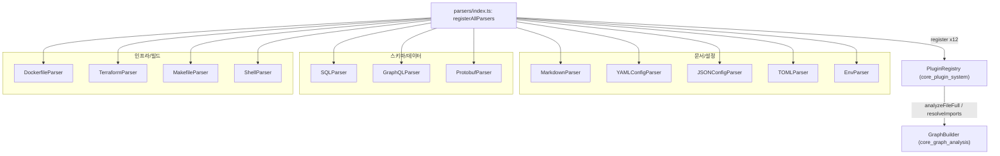
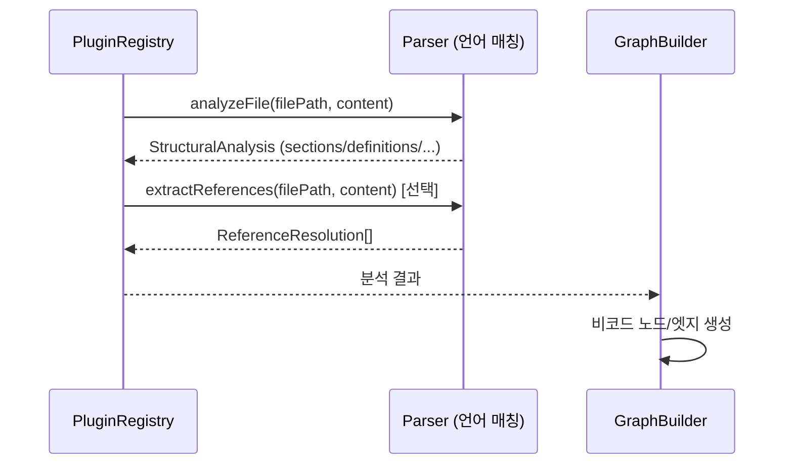

# core_file_parsers 모듈

## 개요

`core_file_parsers`는 `understand-anything-plugin/packages/core/src/plugins/parsers/` 아래에 있는 **비코드(non-code) 파일 파서** 모음입니다. tree-sitter 기반 언어 추출기([core_language_extractors](core_language_extractors.md))가 다루지 않는 Markdown, YAML, JSON, TOML, `.env`, Dockerfile, SQL, GraphQL, Protobuf, Terraform, Makefile, Shell 파일에서 구조 정보를 뽑아 `StructuralAnalysis`로 반환합니다.

- 모든 파서는 `AnalyzerPlugin` 인터페이스(`../../types.js`)를 구현합니다: `name`, `languages`, `analyzeFile(filePath, content)`, 선택적으로 `extractReferences(filePath, content)`.
- 파싱은 대부분 **정규식 + 라인 스캔 + 중괄호 깊이 매칭**으로 이루어지며, 외부 의존성은 `yaml` 라이브러리(YAML 파서)뿐입니다.
- 결과는 [core_graph_analysis](core_graph_analysis.md)의 `GraphBuilder.addNonCodeFileWithAnalysis`가 소비하여 knowledge graph의 비코드 노드/엣지가 됩니다.
- `registerAllParsers(registry)`가 12개 파서를 [core_plugin_system](core_plugin_system.md)의 `PluginRegistry`에 일괄 등록합니다.

## 아키텍처



## 공통 계약

모든 파서의 `analyzeFile`은 `functions`, `classes`, `imports`, `exports`를 빈 배열로 채우고, 파일 종류에 맞는 선택 필드만 채웁니다.

| 필드 | 타입 | 사용하는 파서 |
|---|---|---|
| `sections` | `SectionInfo[]` (name, level, lineRange) | Markdown, YAML, JSON, TOML |
| `definitions` | `DefinitionInfo[]` (name, kind, lineRange, fields) | Env, SQL, GraphQL, Protobuf, Terraform(variable/output) |
| `endpoints` | `EndpointInfo[]` (method, path, lineRange) | GraphQL, Protobuf |
| `services` | `ServiceInfo[]` (name, image, ports, lineRange) | Dockerfile |
| `steps` | `StepInfo[]` (name, lineRange) | Dockerfile, Makefile |
| `resources` | `ResourceInfo[]` (name, kind, lineRange) | Terraform |
| `functions` | 함수 목록 | Shell (유일하게 채움) |

`extractReferences`는 `ReferenceResolution[]`(source, target, referenceType, line)을 반환하며 Markdown, JSON, Shell 세 파서만 구현합니다.



## 파서별 상세

| 파서 (`name`) | `languages` | 추출 결과 | 주요 제한 |
|---|---|---|---|
| `MarkdownParser` (`markdown-parser`) | `markdown` | ATX 헤딩(`#`~`######`)을 `sections`로; 링크/이미지 참조 | 코드 펜스(``` / ~~~) 내부 헤딩은 무시. `http`로 시작하는 외부 URL 제외. front matter 미처리 |
| `YAMLConfigParser` (`yaml-config-parser`) | `yaml`, `kubernetes`, `docker-compose`, `github-actions`, `openapi` | 최상위 키 `sections` | `yaml` 라이브러리로 파싱, 실패 시 정규식 폴백. 배열 루트는 항목당 1개 섹션(이름은 `name`/`id`/`kind`) |
| `JSONConfigParser` (`json-config-parser`) | `json`, `jsonc`, `json-schema`, `openapi` | 최상위 키 `sections`; `$ref` 참조(`referenceType: "schema"`) | `stripJsoncSyntax`가 주석/후행 쉼표 제거(문자열 보존). 내부 참조(`#...`) 제외, 중첩 미탐색 |
| `TOMLParser` (`toml-parser`) | `toml` | `[section]`, `[[array]]` 헤더; level은 점(.) 개수 | 키-값 쌍 미파싱 |
| `EnvParser` (`env-parser`) | `env` | `KEY=` 를 `definitions`(kind `variable`) | `export VAR=`, 다중 라인 값 미지원 |
| `DockerfileParser` (`dockerfile-parser`) | `dockerfile` | `FROM` 기준 스테이지를 `services`(EXPOSE 포트 포함); 주요 명령어를 `steps` | ARG/ENV 치환, heredoc 미지원. 스테이지 이름은 `AS` 별칭, 없으면 이미지 이름 |
| `SQLParser` (`sql-parser`) | `sql` | `CREATE TABLE`(컬럼 포함), `VIEW`, `INDEX`를 `definitions` | 프로시저/트리거/스키마 접두 이름 미지원. 테이블 끝은 `);` 기준 |
| `GraphQLParser` (`graphql-parser`) | `graphql` | type/input/enum/interface/union/scalar `definitions`; Query/Mutation/Subscription 필드를 `endpoints` | 디렉티브, 프래그먼트 미지원. Query/Mutation/Subscription은 definitions에서 제외 |
| `ProtobufParser` (`protobuf-parser`) | `protobuf` | `message`/`enum` `definitions`; `service`의 rpc를 `endpoints`(`Service.Method`, method `rpc`) | 중첩 message, oneof, proto2 extension 미지원 |
| `TerraformParser` (`terraform-parser`) | `terraform` | `resource`, `data`, `module`을 `resources`; `variable`, `output`을 `definitions` | provider/locals/terraform 블록 미지원 |
| `MakefileParser` (`makefile-parser`) | `makefile` | 타겟을 `steps`(들여쓰기/빈 줄까지 범위) | `.PHONY` 등 `.`로 시작하는 특수 타겟과 `:=`, `?=` 할당 제외. 의존성/레시피 미파싱 |
| `ShellParser` (`shell-parser`) | `shell`, `jenkinsfile` | `name()` / `function name` 함수(중괄호 깊이로 범위 계산); `source`/`.` 참조 | 여는 중괄호가 같은 줄 또는 다음 비어있지 않은 줄에 없으면 무시. 변수/alias/trap 미추출 |

## 구현 패턴과 주의점

- **라인 범위 계산**: 대부분 `content.slice(0, index).split("\n").length`로 시작 줄을 구하고, 블록형(GraphQL, Protobuf, Terraform, Shell)은 중괄호 깊이를 세어 끝 줄을 구합니다. 섹션형(Markdown, YAML, JSON, TOML)은 다음 섹션 시작 직전까지를 범위로 삼는 후처리를 합니다.
- **중괄호 불일치**: `ProtobufParser`와 `TerraformParser`의 `findClosingBrace`는 불균형 시 `console.warn` 후 문서 끝까지를 범위로 사용합니다. 문자열/주석 내부 중괄호는 구분하지 않습니다.
- **오류 처리**: JSON은 파싱 실패 시 경고 후 빈 섹션, YAML은 정규식 폴백으로 대체합니다. 그 외 파서는 예외를 던지지 않는 정규식 기반입니다.
- **언어 ID 별칭**: YAML/JSON/Shell 파서는 `docker-compose`, `kubernetes`, `github-actions`, `openapi`, `jenkinsfile` 등 특수 포맷 ID도 `languages`에 포함합니다. 언어 레지스트리([core_language_registries](core_language_registries.md))가 부여한 ID와 일치하지 않으면 "no parser matched"로 구조 추출이 누락되므로, 새 포맷 추가 시 두 곳을 함께 갱신해야 합니다.
- **새 파서 추가 방법**: `AnalyzerPlugin`을 구현하는 클래스를 만들고 `parsers/index.ts`에 export와 `registry.register(...)`를 추가합니다.
- **테스트/빌드**: 코어 패키지의 빌드·테스트 설정은 [build_ci_and_workspace_config](build_ci_and_workspace_config.md) 및 [core_package_config](core_package_config.md)를 참고하세요.

## 관련 모듈

- [core_plugin_system](core_plugin_system.md): `PluginRegistry`, `TreeSitterPlugin` — 파서를 등록/호출
- [core_language_extractors](core_language_extractors.md): 코드 파일용 tree-sitter 추출기
- [core_graph_analysis](core_graph_analysis.md): 분석 결과를 그래프로 조립
- [core_language_registries](core_language_registries.md): 파일 → 언어 ID 매핑
