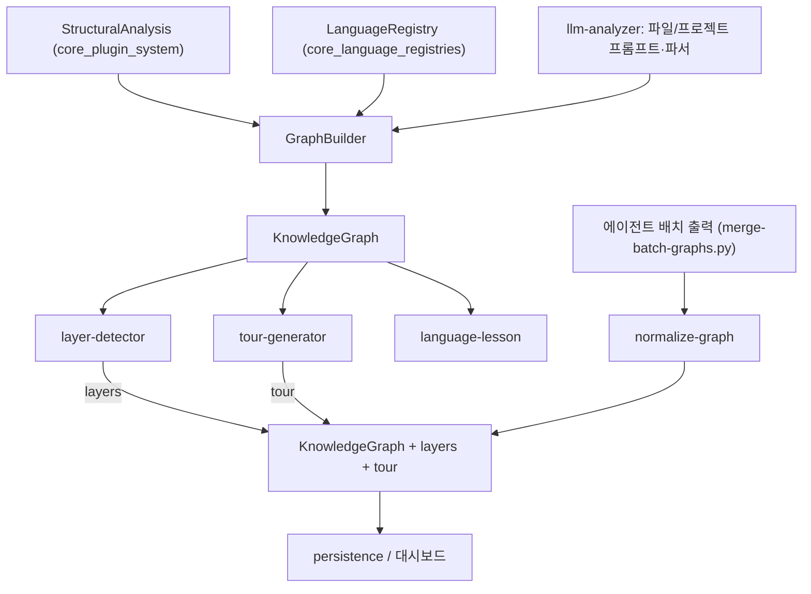
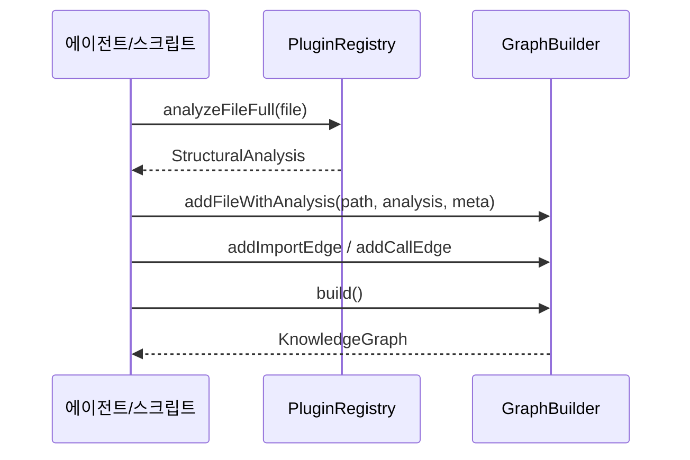
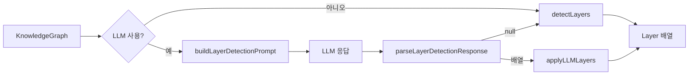

# core_graph_analysis 모듈

`core_graph_analysis`는 `@understand-anything/core`의 `analyzer/` 디렉터리에 있는 모듈입니다. 정적 분석 결과(`StructuralAnalysis`)와 LLM 응답을 받아 `KnowledgeGraph`(노드·엣지·레이어·투어)로 조립합니다. 이 모듈에는 LLM 호출 코드가 없습니다. 프롬프트를 만드는 함수(`build*Prompt`)와 응답을 파싱하는 함수(`parse*Response`)만 있고, 실제 호출은 에이전트 파이프라인이 맡습니다.

상위 모듈은 [knowledge_graph_core_engine](knowledge_graph_core_engine.md)입니다. 관련 모듈은 다음과 같습니다.

- [core_plugin_system](core_plugin_system.md): `StructuralAnalysis`를 생성합니다.
- [core_language_registries](core_language_registries.md): `LanguageRegistry`를 제공합니다.
- [core_search_persistence_staleness](core_search_persistence_staleness.md): 완성된 그래프를 저장하고 검색합니다.

## 구성 요소 개요

| 파일 | 주요 심볼 | 역할 |
|---|---|---|
| `analyzer/graph-builder.ts` | `GraphBuilder` | 파일·함수·클래스·비코드 노드와 엣지를 증분 조립하고 `build()`로 `KnowledgeGraph`를 반환 |
| `analyzer/llm-analyzer.ts` | `buildFileAnalysisPrompt`, `parseFileAnalysisResponse`, `buildProjectSummaryPrompt`, `parseProjectSummaryResponse` | 파일 및 프로젝트 요약용 프롬프트와 파서 |
| `analyzer/layer-detector.ts` | `detectLayers`, `buildLayerDetectionPrompt`, `parseLayerDetectionResponse`, `applyLLMLayers` | 휴리스틱 또는 LLM 기반 레이어 분류 |
| `analyzer/tour-generator.ts` | `generateHeuristicTour`, `buildTourGenerationPrompt`, `parseTourGenerationResponse` | 가이드 투어 생성 |
| `analyzer/language-lesson.ts` | `buildLanguageLessonPrompt`, `parseLanguageLessonResponse` | 노드별 언어 학습 노트 |
| `analyzer/normalize-graph.ts` | `normalizeBatchOutput` | 에이전트 배치 출력의 ID·complexity·엣지 정규화 |
| `__tests__/layer-detector.test.ts` | `makeNode`, `makeGraph` | 레이어 탐지 테스트 헬퍼 |

## 아키텍처

## GraphBuilder

`GraphBuilder(projectName, gitHash, languageRegistry?)`는 노드와 엣지를 메모리에 쌓습니다. 레지스트리를 생략하면 `LanguageRegistry.createDefault()`를 사용합니다.

**노드 ID 규칙**은 다음과 같습니다.
- 파일: `file:<path>`
- 함수: `function:<path>:<name>`
- 클래스: `class:<path>:<name>`
- 비코드 파일: `<nodeType>:<path>`
- 비코드 자식 노드: `<kind>:<path>:<name>` (서비스·엔드포인트·스텝·리소스는 각각 `service:`, `endpoint:`, `step:`, `resource:` 접두사)

**메서드**는 다음과 같습니다.
- `addFile`: 파일 노드만 추가합니다.
- `addFileWithAnalysis`: 파일 노드를 만들고, `analysis.functions`와 `analysis.classes`마다 노드와 `contains` 엣지(weight 1)를 추가합니다. 요약은 `meta.summaries[name]`에서 가져오며 없으면 빈 문자열입니다.
- `addImportEdge`: `imports` 엣지(weight 0.7)를 추가합니다.
- `addCallEdge`: `calls` 엣지(weight 0.8)를 추가합니다.
- `addNonCodeFileWithAnalysis`: 비코드 파일 노드를 만들고, definitions, services, endpoints, steps, resources를 자식 노드로 추가합니다. 자식 노드에는 `contains` 엣지가 붙습니다.
- `build()`: 버전 `1.0.0`의 `KnowledgeGraph`를 반환합니다. 언어 목록은 정렬하고, `frameworks`, `layers`, `tour`는 빈 배열로 두며, 노드와 엣지는 복사본을 넘깁니다.

**중복 처리**는 다음과 같습니다.
- import와 call 엣지는 `edgeKeys` 집합으로 중복을 제거합니다.
- 비코드 자식 노드는 ID가 중복되면 경고를 출력하고 건너뜁니다.
- `addFile`, `addFileWithAnalysis`, `addNonCodeFile`은 노드 ID 중복을 검사하지 않습니다. 같은 경로로 두 번 호출하면 노드가 중복될 수 있습니다.

**kind에서 노드 타입으로의 매핑** (`KIND_TO_NODE_TYPE`)은 다음과 같습니다.

| kind | 노드 타입 |
|---|---|
| table, view, index | `table` |
| message, type, enum | `schema` |
| resource, module | `resource` |
| service, deployment | `service` |
| job, stage, target | `pipeline` |
| route, query, mutation | `endpoint` |
| variable, output | `config` |

알 수 없는 kind는 경고를 출력하고 `concept`로 처리합니다.

## LLM 프롬프트와 파서 (`llm-analyzer`, `language-lesson`)

- **프롬프트 빌더**는 순수 문자열 함수입니다. 모든 프롬프트가 "JSON만 응답"하도록 요구합니다.
- **파서**는 먼저 마크다운 코드 펜스를 찾고, 없으면 `{...}` 객체를 찾고, 그것도 없으면 전체 문자열을 파싱합니다. 실패 시 반환값이 파서마다 다릅니다.
  - `parseFileAnalysisResponse`: `null`을 반환합니다.
  - `parseProjectSummaryResponse`: `null`을 반환합니다.
  - `parseLanguageLessonResponse`: 빈 결과 `{ languageNotes: "", concepts: [] }`를 반환합니다.
- `parseFileAnalysisResponse`는 `complexity`가 `simple`, `moderate`, `complex`가 아니면 `moderate`로 대체합니다.
- `language-lesson`의 `detectLanguageConcepts`는 기본 개념 패턴(`BASE_CONCEPT_PATTERNS`)에 `LanguageConfig.concepts`를 합칩니다. 노드의 tags, summary, languageNotes에 키워드가 있는지 부분 문자열로 검사하므로, `is`나 `di`처럼 짧은 키워드는 오탐이 생길 수 있습니다.

## 레이어 탐지 (`layer-detector`)

- **`detectLayers`(휴리스틱)**: `file` 타입 노드만 대상으로 합니다. 경로 세그먼트가 `LAYER_PATTERNS`의 패턴 또는 그 복수형(`pattern + "s"`)과 정확히 같으면 해당 레이어에 배정합니다. `LAYER_PATTERNS`는 위에서부터 검사하므로 앞선 항목이 우선합니다. 매치가 없거나 `filePath`가 없으면 `Core`로 보냅니다. 레이어 ID는 `layer:<kebab-name>` 형식입니다.
- **`buildLayerDetectionPrompt` / `parseLayerDetectionResponse`**: LLM에게 3~7개 레이어를 요청하고, 배열을 파싱합니다. 유효한 항목이 없으면 `null`을 반환합니다.
- **`applyLLMLayers`**: `filePatterns`를 경로 접두사(`startsWith` 또는 `"/" + pattern` 포함)로 매칭하고, 첫 매치가 우선합니다. 배정되지 않은 파일은 `Other` 레이어로 가며, 비어 있는 레이어는 제외합니다.

`parseLayerDetectionResponse`가 `null`을 반환하면 `detectLayers`로 돌아가는 동작은 이 모듈이 강제하는 것이 아니라 호출자가 구현해야 하는 사용 패턴입니다.

## 투어 생성 (`tour-generator`)

- `buildTourGenerationPrompt`는 프로젝트 메타데이터, 전체 노드 목록, **엣지 최대 50개**, 레이어를 프롬프트에 넣습니다. 노드는 개수 제한이 없어 큰 그래프에서는 프롬프트가 커집니다.
- `parseTourGenerationResponse`는 `order`(숫자), `title`, `description`, `nodeIds`(비어 있지 않음) 중 하나라도 빠진 스텝을 버립니다. 파싱에 실패하면 `[]`를 반환합니다.
- `generateHeuristicTour`는 LLM 없이 그래프 위상으로 투어를 만듭니다. 순서는 다음과 같습니다.
  1. `concept` 노드를 분리합니다.
  2. 코드 노드에 대해 Kahn 알고리즘으로 위상 정렬합니다. 큐는 head 인덱스를 사용해 O(n)에 동작합니다.
  3. 사이클이나 고립 노드는 정렬 뒤에 붙입니다.
  4. 레이어가 있으면 레이어별로 스텝을 만들고, 레이어에 속하지 않은 노드는 `Supporting Components` 스텝으로 묶습니다.
  5. 레이어가 없으면 3개 노드씩 묶어 스텝을 만듭니다.
  6. `concept` 노드는 마지막에 `Key Concepts` 스텝으로 추가합니다.
  7. 마지막으로 `order`를 1부터 순서대로 매깁니다.

## 배치 출력 정규화 (`normalize-graph`)

`normalizeBatchOutput({nodes, edges})`는 에이전트가 쓴 배치 JSON을 정리합니다. 주석에 따르면 이 함수는 상위의 `sanitizeGraph`/`autoFixGraph`/`normalizeGraph` 파이프라인보다 먼저 실행됩니다.

1. **노드 ID 정규화** (`normalizeNodeId`): 이중 접두사(`file:file:...`)나 프로젝트명 접두사를 제거하고, 접두사가 없는 경로에는 타입에 맞는 접두사를 붙입니다. 타입과 접두사의 대응은 `function`→`func`처럼 `TYPE_TO_PREFIX`가 정의합니다.
   - `function`/`class` 노드에 `filePath`와 `name`이 있으면 `func:<filePath>:<name>` 형태로 다시 구성합니다.
   - `step` 노드는 `flow_step` 엣지에서 얻은 flow slug를 포함해 `step:<flowSlug>:<filePath>:<stepSlug>`로 만듭니다. 이렇게 하면 서로 다른 flow에 같은 이름의 스텝이 있어도 충돌하지 않습니다.
2. **complexity 정규화** (`normalizeComplexity`): 문자열 별칭(`low`→`simple`, `high`→`complex` 등)과 숫자(1~3 simple, 4~6 moderate, 7 이상 complex)를 변환합니다. 알 수 없는 값은 `moderate`입니다.
3. **노드 중복 제거**: 같은 ID가 여럿이면 마지막 항목을 유지합니다.
4. **엣지 재작성**: `idMap`으로 source와 target을 바꾸고, 없으면 ID 접두사에서 타입을 추론해 다시 정규화합니다.
5. **dangling 엣지 제거**: 끝점 노드가 없는 엣지를 버리고 `droppedEdges`에 사유(`missing-source`, `missing-target`, `missing-both`)를 기록합니다.
6. **엣지 중복 제거**: `source|target|type`이 같은 엣지는 하나만 남깁니다.

결과의 `stats`(`idsFixed`, `complexityFixed`, `edgesRewritten`, `danglingEdgesDropped`)로 정정 규모를 확인할 수 있습니다.

**ID 접두사 불일치에 유의하세요.** `GraphBuilder`는 함수 노드에 `function:` 접두사를 씁니다. 반면 `normalize-graph`의 유효 접두사 집합(`VALID_PREFIXES`)에는 `func`만 있고 `function`은 없습니다. `normalizeNodeId`는 `function:` 접두사를 유효하지 않은 것으로 보고 벗겨낸 뒤 `func:`를 붙입니다. `GraphBuilder`의 결과를 `normalizeBatchOutput`에 그대로 넣으면 ID가 바뀌므로, 두 경로는 서로 다른 ID 체계를 씁니다. 이 문서에서는 코드로 확인한 사실만 적었고, 어느 쪽이 의도된 것인지는 확인하지 못했습니다.

## 테스트

`__tests__/layer-detector.test.ts`는 `makeNode`와 `makeGraph` 헬퍼로 최소 그래프를 만들어 다음을 검증합니다.
- 경로 패턴에 따른 API 레이어와 Data 레이어 탐지
- 매치되지 않는 파일이 `Core`에 들어가는지
- 레이어 ID의 `layer:` 접두사와 유일성
- `file` 타입 노드만 레이어에 들어가는지
- 프롬프트에 파일 경로와 "JSON"이 포함되는지
- 응답 파서의 정상 응답, 펜스 응답, 오류 응답 처리
- `applyLLMLayers`가 미배정 파일을 `Other`로 보내는지

테스트는 `pnpm --filter @understand-anything/core test`로 실행합니다. 설정은 `understand-anything-plugin/packages/core/vitest.config.ts`에 있습니다.

## 사용 시 주의

- 이 모듈은 Node 전용 모듈이 아니지만, 대시보드는 코어의 서브패스 export(`./search`, `./types`, `./schema`)만 import해야 합니다. 메인 엔트리를 import하면 안 됩니다. 자세한 내용은 [interactive_dashboard_ui](interactive_dashboard_ui.md)를 참고하세요.
- 상세한 그래프 타입과 스키마 검증은 [knowledge_graph_core_engine](knowledge_graph_core_engine.md)를 참고하세요.
- 에이전트 배치 병합 스크립트는 [skill_graph_merge_scripts](skill_graph_merge_scripts.md)에 있습니다.
