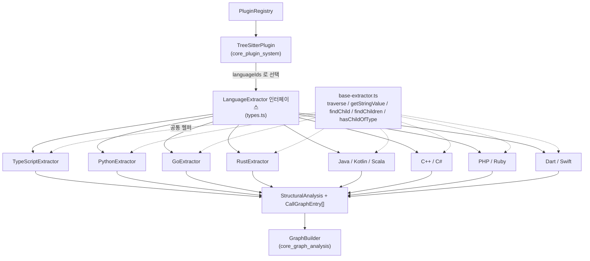
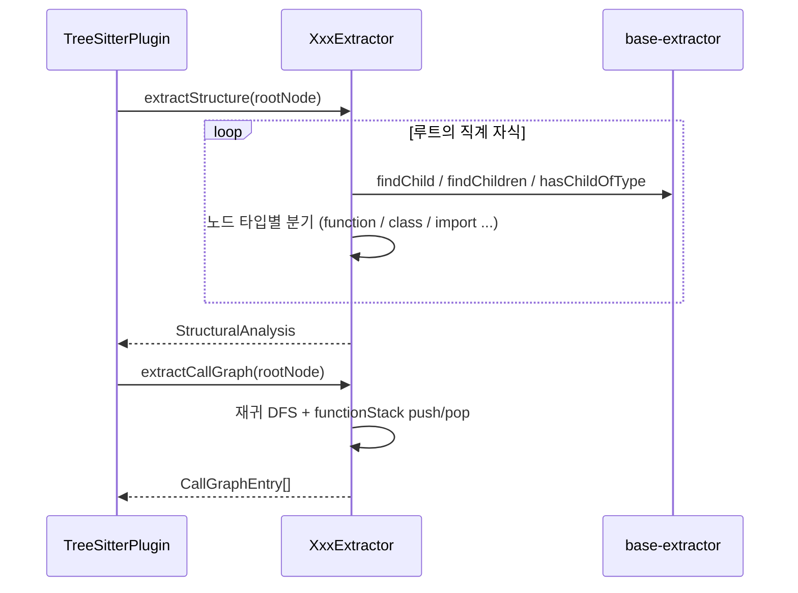

# core_language_extractors 모듈 개요

## 1. 목적

`core_language_extractors`(`understand-anything-plugin/packages/core/src/plugins/extractors`)는 tree-sitter(`web-tree-sitter`, WASM)가 만든 언어별 AST를 **언어 중립적인 분석 결과**로 바꾸는 추출기 모음입니다. 추출기는 파일 I/O나 파싱을 하지 않습니다. 이미 파싱된 `TreeSitterNode` 루트만 받는 순수 함수에 가깝습니다. WASM 문법 로딩과 추출기 선택은 `core_plugin_system`의 `TreeSitterPlugin`이 맡습니다.

모든 추출기는 `LanguageExtractor` 인터페이스(`types.ts`)를 구현하고 다음 세 가지를 제공합니다.

| 멤버 | 설명 |
|---|---|
| `languageIds` | 이 추출기가 담당하는 언어 ID (예: `["cpp", "c"]`) |
| `extractStructure(rootNode)` | `StructuralAnalysis` 반환: `functions`, `classes`, `imports`, `exports` |
| `extractCallGraph(rootNode)` | `CallGraphEntry[]` 반환: `{ caller, callee, lineNumber }` |

결과는 `GraphBuilder`(`core_graph_analysis`)가 지식 그래프의 파일·함수·클래스 노드와 import·call 엣지로 변환합니다. 모든 언어가 같은 스키마를 유지하므로 그래프 분석은 언어와 무관하게 동작합니다.

## 2. 아키텍처

### 공통 처리 흐름

### 공통 설계 규칙

- **구조 추출**: 대부분 루트의 직계 자식(일부는 namespace/package 본문)만 순회합니다. 중첩 선언은 구조에 포함하지 않습니다.
- **호출 그래프**: `functionStack`으로 가장 안쪽 함수를 caller로 삼습니다. 함수 밖(최상위) 호출은 기록하지 않습니다.
- **이름 기반 분석**: callee는 대체로 원문 텍스트이며 심볼 해석은 하지 않습니다. 동명 메서드나 오버로드는 구분하지 못합니다.
- **타입 통합**: class, struct, interface, enum, trait, mixin, extension 등을 모두 `classes`에 넣습니다.
- **메서드 이중 등록**: 클래스 멤버 함수는 `classes[].methods`와 최상위 `functions`에 함께 등록하는 언어가 많습니다.
- **export 판정**: 언어의 가시성 규칙을 그래프 관점으로 옮깁니다. Go는 대문자, Python·PHP·Ruby는 최상위 정의 전체, C++은 비-static, Java·C#은 `public`, Kotlin·Scala은 `private`만 제외, Dart는 `_` 접두사를 제외합니다.
- **줄 번호**: tree-sitter의 0-기반 row를 `row + 1`로 바꿔 1-기반으로 기록합니다.
- **테스트**: 각 추출기는 `__tests__/*-extractor.test.ts`를 갖습니다. `beforeAll`에서 WASM 문법을 한 번 로드하고, 테스트마다 `tree.delete()`와 `parser.delete()`로 메모리를 해제합니다. 실행은 `pnpm --filter @understand-anything/core test`입니다.

## 3. 하위 모듈과 문서

| 모듈 | 대상 언어 | 특징 | 문서 |
|---|---|---|---|
| `extractor_base` | (공통) | AST 탐색 헬퍼 함수 모음. `TreeSitterNode` 구조적 타입에만 의존해 목(mock)이 쉬움 | [extractor_base](extractor_base.md) |
| `typescript_extractor` | TypeScript, JavaScript | `export_statement` 처리와 중복 제거, 추상 클래스, 화살표 함수 | [typescript_extractor](typescript_extractor.md) |
| `python_extractor` | Python | 데코레이터 unwrap, `self`/`cls` 제외, 최상위 정의를 모두 export | [python_extractor](python_extractor.md) |
| `go_extractor` | Go | struct/interface를 `classes`로 매핑, 리시버 기반 메서드 병합, 대문자 export | [go_extractor](go_extractor.md) |
| `rust_extractor` | Rust | struct/enum/trait/impl 매핑, `owner` 규칙, `use` 4가지 형태 | [rust_extractor](rust_extractor.md) |
| `jvm_extractors` | Java, Kotlin, Scala | 언어별 가시성 차이, Scala 2/3 문법과 companion 중첩 타입 | [jvm_extractors](jvm_extractors.md) |
| `c_family_extractors` | C/C++, C# | 한정자·접근 지정자 기반 owner와 export, namespace 재귀 | [c_family_extractors](c_family_extractors.md) |
| `scripting_extractors` | PHP, Ruby | `use`/`require` import, `attr_*` 프로퍼티, 동적 언어의 호출 표기 | [scripting_extractors](scripting_extractors.md) |
| `mobile_extractors` | Dart, Swift | Dart의 시그니처/본문 형제 구조 처리, Swift `extension`·`init` 계약 | [mobile_extractors](mobile_extractors.md) |

## 4. 관련 모듈

- [core_plugin_system](core_plugin_system.md): `TreeSitterPlugin`과 `PluginRegistry`가 추출기를 호출합니다.
- [core_graph_analysis](core_graph_analysis.md): `GraphBuilder`가 추출 결과를 그래프로 변환합니다.
- [core_package_config](core_package_config.md): 테스트와 빌드 설정을 다룹니다.

## 5. 확장 방법

1. `LanguageExtractor`를 구현하는 새 파일을 추가하고, 위의 기존 추출기와 같은 패턴(루트 순회, `functionStack`, `row + 1`)을 따릅니다.
2. `languageIds`를 `TreeSitterPlugin` 설정과 언어 레지스트리에 연결합니다.
3. 실제 파서로 AST를 먼저 확인한 뒤 `__tests__`에 테스트를 추가합니다. 문법 버전을 올리면 노드 이름이 바뀔 수 있으므로 해당 테스트를 먼저 확인합니다.