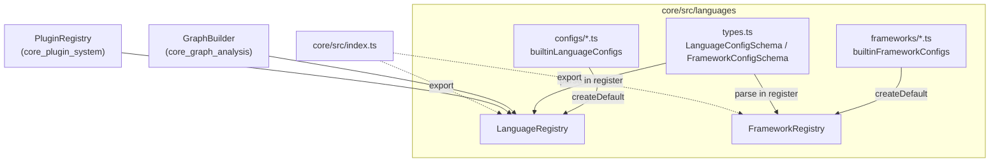
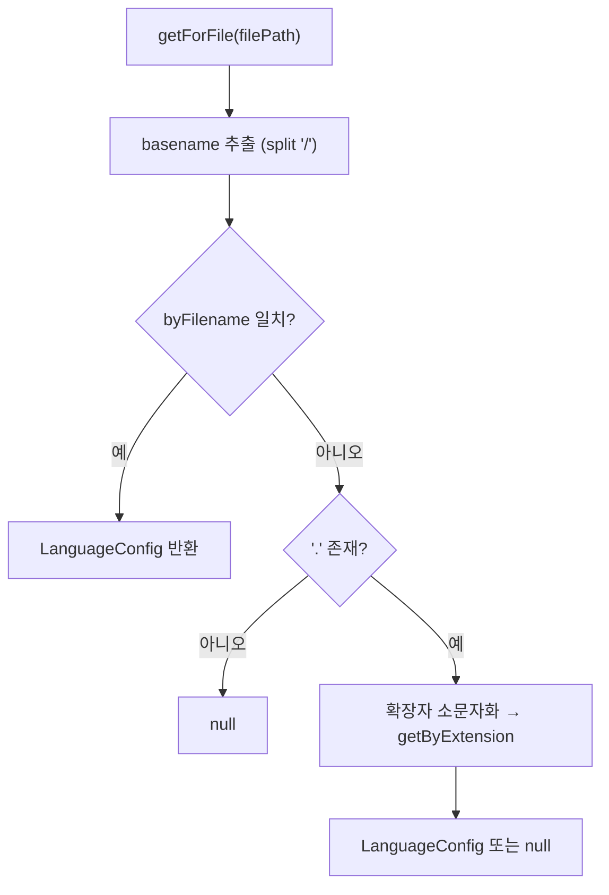
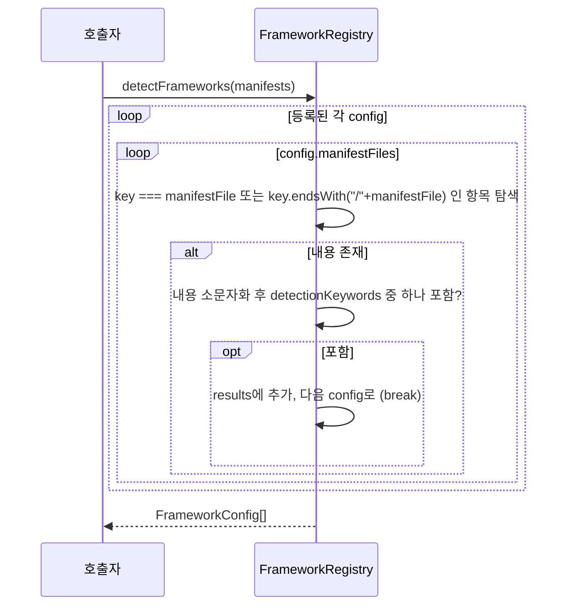

# core_language_registries

`core_language_registries` 모듈은 `@understand-anything/core` 패키지에서 **"이 파일은 어떤 언어인가?"**와 **"이 프로젝트는 어떤 프레임워크를 쓰는가?"**라는 두 질문에 답하는 정적 설정 레지스트리를 제공합니다. 두 레지스트리는 모두 `understand-anything-plugin/packages/core/src/languages/` 아래에 있으며, 내장 설정(`configs/`, `frameworks/`)을 Zod 스키마로 검증한 뒤 `Map` 인덱스에 적재합니다.

| 파일 | 클래스 | 역할 |
|---|---|---|
| `languages/language-registry.ts` | `LanguageRegistry` | 언어 id / 확장자 / 파일명 → `LanguageConfig` 조회 |
| `languages/framework-registry.ts` | `FrameworkRegistry` | 프레임워크 id / 언어 조회, 매니페스트 내용 기반 프레임워크 감지 |
| `languages/types.ts` | (Zod 스키마) | `LanguageConfigSchema`, `FrameworkConfigSchema` 등 설정 형태 정의 |

## 아키텍처



- `GraphBuilder`는 생성자에서 `languageRegistry ?? LanguageRegistry.createDefault()`로 레지스트리를 받아 파일의 언어를 판별합니다. → [core_graph_analysis](core_graph_analysis.md)
- `PluginRegistry`도 같은 방식으로 확장자→언어 매핑에 `LanguageRegistry`를 사용합니다. → [core_plugin_system](core_plugin_system.md)
- `FrameworkRegistry`는 `core/src/index.ts`를 통해 공개되어, 매니페스트를 읽은 호출자(스킬/에이전트 파이프라인)가 프레임워크별 프롬프트 스니펫과 레이어 힌트를 고르는 데 쓰입니다.

## 설정 스키마 (`types.ts`)

**`LanguageConfig`**: `id`, `displayName`, `extensions[]`, 선택적 `filenames[]`, 선택적 `treeSitter`(`wasmPackage`, `wasmFile`), `concepts[]`, `filePatterns`(`entryPoints`, `barrels`, `tests`, `config`).

- `StrictLanguageConfigSchema`는 확장자 또는 파일명이 하나 이상 있어야 한다는 refine을 추가합니다. 사용자 제공 설정 검증용이며, `kubernetes`/`github-actions` 같은 일부 내장 설정은 확장자·파일명이 없어(향후 내용 기반 감지 전제) `register()`가 쓰는 기본 스키마만 통과합니다.

**`FrameworkConfig`**: `id`, `displayName`, `languages[]`(≥1), `detectionKeywords[]`(≥1), `manifestFiles[]`(≥1), `promptSnippetPath`, 선택적 `entryPoints[]`, `layerHints`(디렉터리명 → 레이어 이름 record).

예: `frameworks/django.ts`는 `requirements.txt`, `pyproject.toml` 등을 매니페스트로, `django`, `djangorestframework` 등을 키워드로 지정하고 `views → api`, `models → data`, `templates → ui` 같은 `layerHints`를 제공합니다. 내장 프레임워크는 `django`, `express`, `fastapi`, `flask`, `gin`, `nextjs`, `rails`, `react`, `spring`, `vue`입니다.

## LanguageRegistry

내부 인덱스 세 개를 유지합니다: `byId`, `byExtension`, `byFilename`.

| 메서드 | 동작 |
|---|---|
| `register(config)` | `LanguageConfigSchema.parse`로 검증. id, 확장자(선행 `.` 보정), 파일명(소문자)을 각각 인덱싱. 같은 키는 **나중 등록이 덮어씀** |
| `getById(id)` | 없으면 `null` |
| `getByExtension(ext)` | `.` 유무와 대소문자 무시 |
| `getForFile(filePath)` | ① 파일명(basename, 소문자) 일치 우선(`Makefile`, `docker-compose.yml` 등) → ② 마지막 `.` 이후 확장자로 폴백. 둘 다 없으면 `null` |
| `getAllLanguages()` | `byId` 값의 복사본 배열 |
| `static createDefault()` | `builtinLanguageConfigs`(`configs/index.ts`)로 채운 인스턴스 |



주의: `getForFile`은 `/`만 경로 구분자로 처리하므로 Windows `\` 경로는 정규화 후 전달해야 합니다. 또한 파일명에 점이 없고 파일명 매핑에도 없으면 `null`입니다.

## FrameworkRegistry

내부 인덱스: `byId`, `byLanguage`(언어 id → `FrameworkConfig[]`).

| 메서드 | 동작 |
|---|---|
| `register(config)` | `FrameworkConfigSchema.parse` 검증. **id 중복 시 조용히 무시**(먼저 등록된 것 유지). `languages`마다 `byLanguage`에 추가 |
| `getById(id)` | 없으면 `null` |
| `getForLanguage(langId)` | 방어적 복사 배열 반환 |
| `getAllFrameworks()` | 전체 목록 복사본 |
| `detectFrameworks(manifests)` | 매니페스트 내용에서 프레임워크 감지 |
| `static createDefault()` | `builtinFrameworkConfigs`(`frameworks/index.ts`)로 채운 인스턴스 |

### 감지 흐름

`manifests`는 `{ 파일명: 내용 }` 레코드입니다(예: `{ "requirements.txt": "django==4.2\n..." }`).



동작상 특징:
- 매칭은 **부분 문자열 포함, 대소문자 무시**입니다. 따라서 `"react"`처럼 짧은 키워드는 `react-dom` 등에도 맞고, `"django"`가 다른 패키지명 안에 있어도 오탐할 수 있습니다.
- 파일명은 정확히 일치하거나 `/파일명`으로 끝나야 하므로 모노레포의 `services/api/requirements.txt` 같은 상대 경로도 허용됩니다.
- 내용이 빈 문자열이면 `!content` 검사로 건너뜁니다.
- 결과 순서는 등록 순서입니다.

## 사용 예

```ts
import { LanguageRegistry, FrameworkRegistry } from "@understand-anything/core";

const langs = LanguageRegistry.createDefault();
langs.getForFile("src/app/main.py")?.id;   // "python"
langs.getForFile("Makefile")?.id;          // 파일명 매칭

const fws = FrameworkRegistry.createDefault();
fws.detectFrameworks({ "requirements.txt": "Django==4.2" }).map((f) => f.id); // ["django"]
fws.getForLanguage("python");              // django, fastapi, flask ...
```

## 확장 방법

- **새 언어**: `languages/configs/<name>.ts`에 `LanguageConfig`를 만들고 `configs/index.ts`의 `builtinLanguageConfigs`에 추가합니다. 또는 런타임에 `registry.register(config)`를 호출합니다.
- **새 프레임워크**: `languages/frameworks/<name>.ts`에 `satisfies FrameworkConfig`로 작성하고 `frameworks/index.ts`의 `builtinFrameworkConfigs`에 추가합니다. `promptSnippetPath`가 가리키는 마크다운 스니펫도 함께 제공해야 합니다.
- tree-sitter 문법은 `treeSitter` 필드로 선언하지만, 실제 구조 추출은 언어별 익스트랙터가 담당합니다. → [core_language_extractors](core_language_extractors.md)

## 참고

- 레지스트리는 상태를 인스턴스에 가두므로(전역 싱글턴 없음) 테스트에서는 `new LanguageRegistry()`로 빈 레지스트리를 만들어 사용할 수 있습니다. 관련 테스트: `core/src/__tests__/language-registry.test.ts`, `framework-registry.test.ts`.
- 브라우저 안전 서브패스(`./search`, `./types`, `./schema`)에는 포함되지 않으므로 대시보드는 이 모듈을 직접 import하지 않습니다(프로젝트 `CLAUDE.md`의 Gotchas 참고). 패키지 구성은 [core_package_config](core_package_config.md)를 참고하세요.
